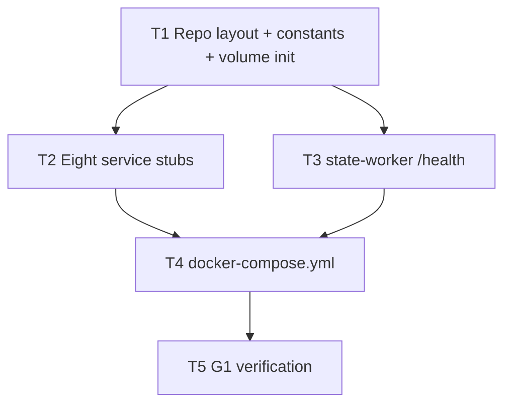

# M0 — Implementation Workshop

**Plan name:** `m0-workshop`  
**Version:** 1.1  
**Status:** Complete  
**Charter slice:** `.dev/bishop_program_charter.md` L87–126  
**Normative spec:** `bishop_spec_0_6.md` v1.5.0 @ `f2352147e44fb03647a102ceda9f48e75475daca`

---

## 0. Context map intake

| Field | Value |
|-------|-------|
| **Path consumed** | `.dev/plans/m0-workshop/context-map.md` |
| **Readiness verdict** | READY |
| **Scope-area labels flagged** | A1 (state-worker host port vs internal health), A2 (repo layout), A3 (host port numbers), A4 (per-service volume subset), A5 (Windows host data root) |
| **Skill version + SHA** | pre-plan 0.2 (greenfield waiver) · `f2352147e44fb03647a102ceda9f48e75475daca` |

**G0 gate:** satisfied — `bishop_spec_0_6.md` tracked at HEAD.

**Prior handoff:** none (first milestone).

**Pre-plan note:** Charter workflow expects pre-plan before orch; pre-plan skill §Role excludes greenfield with no existing code. A minimal context map was authored at plan bootstrap (same directory) to satisfy orch §0 and flag ambiguities A1–A5.

**CONDITIONAL items → §5.2:** A1, A4, A5 each have kill criteria on affected subtasks.

---

## 1. Task statement

Stand up the Docker Compose structural skeleton for Bishop: all nine named services (`scraper`, `state-worker`, `pre-filter-worker`, `content-scraper`, `enrichment-batcher`, `batch-poller`, `vector-writer`, `query-api`, `ui`), host-mounted volumes per spec §8.5, internal Docker network with resolvable service hostnames, `depends_on` health chain anchored on `state-worker`, and a working `GET /health` on `state-worker`. Eight services are process stubs only; `query-api` and `ui` expose minimal HTTP listeners on host-mapped ports so G1 can confirm reachability. No pipeline logic, schema, migrations, or §9.1 REST beyond `/health`.

**Non-goals:**
- Application logic, Alembic migrations, database initialization, source adapters, NL profiles, enrichment, indexing, hybrid retrieval
- REST endpoints on `state-worker` beyond `GET /health`
- All §23 and §24 items in `bishop_spec_0_6.md`
- Architecture folder (`.dev/architecture/`) — post-M0 per charter §7
- Host port mapping for any service other than `query-api` and `ui` (spec §9 L599, §17.3 L1288)

---

## 2. Shared contracts

### Types / interfaces

| Symbol | Owner | Typed surface | Test |
|--------|-------|---------------|------|
| `BISHOP_SERVICES` | T1 | `bishop_shared/constants.py` — `tuple` of 9 service name strings matching §9 table | `tests/test_constants.py::test_service_names_match_spec` |
| `BISHOP_VOLUME_MOUNTS` | T1 | `bishop_shared/constants.py` — `list[VolumeMount(host_suffix, container_path)]` six entries per §8.5 | `tests/test_constants.py::test_volume_mounts_match_spec` |
| `BISHOP_DATA_ROOT` | T1 | `.env.example` + compose `${BISHOP_DATA_ROOT}`; default `~/bishop_data` documented | `tests/test_constants.py::test_data_root_env_default` |
| `STATE_WORKER_INTERNAL_PORT` | T1 | `bishop_shared/constants.py` = `8000` | `tests/test_constants.py::test_internal_ports` |
| `QUERY_API_HOST_PORT` | T1 | `bishop_shared/constants.py` = `8080`; compose `ports:` binding | `tests/test_constants.py::test_host_ports` |
| `UI_HOST_PORT` | T1 | `bishop_shared/constants.py` = `8081`; compose `ports:` binding | same |
| `HealthResponse` | T3 | `services/state-worker/app/models.py` — Pydantic `{"status": Literal["ok"]}` | `tests/test_state_worker_health.py::test_health_response_schema` |
| `GET /health` | T3 | `services/state-worker/app/main.py` — returns `200` + `HealthResponse` | verify-g1 + health unit test |

*Deferred to M1:* all §9.1 endpoints, `ProcessingState`, Pydantic domain models.

### Error envelope

N/A for M0 stubs beyond HTTP semantics:
- `state-worker` `GET /health`: `200` JSON `{"status":"ok"}`; any non-200 fails compose healthcheck
- `query-api` stub: `GET /` returns `200` text `ok`
- `ui` stub: `GET /` returns `200` text `ok`
- Non-HTTP worker stubs: exit code non-zero → container restart (failure visible via `docker compose ps`)

### Naming

| Category | Convention |
|----------|------------|
| Compose service keys | Exact §9 names: `scraper`, `state-worker`, `pre-filter-worker`, `content-scraper`, `enrichment-batcher`, `batch-poller`, `vector-writer`, `query-api`, `ui` |
| Docker network | `bishop-internal` |
| Directory layout | `services/<compose-service-name>/` (hyphenated dir names match service keys) |
| Internal URL env | `STATE_WORKER_URL=http://state-worker:8000` on dependents (set in compose; unused in M0 stubs) |
| Image tags | `bishop/<service-name>:m0` (local build) |

### Logging

Stubs log one INFO line at startup: `service=<name> status=stub_started`. No file sink required at M0; stdout only. Host log volume mounted at `/app/logs` where service has logs mount (see T1 volume matrix).

### Tests

- **Framework:** pytest
- **Location:** `tests/` at repo root
- **Naming:** `test_<surface>.py`
- **Coverage:** unit tests for `bishop_shared/constants.py` and state-worker `/health` handler; no Docker-in-pytest requirement
- **G1 verification:** `scripts/verify-g1.sh` (bash) run manually or in CI; documents compose-up + health assertions

### CLI surface

| Command | Owner | Purpose |
|---------|-------|---------|
| `scripts/init-volumes.sh` | T1 | Create six host dirs under `${BISHOP_DATA_ROOT}` |
| `scripts/init-volumes.ps1` | T1 | Windows equivalent |
| `scripts/verify-g1.sh` | T5 | G1 exit gate: compose up, health, host ports, volume writability |
| `docker compose up --build -d` | T4 | Primary runnable checkpoint |

### Wire / HTTP (binding)

| Surface | Binding value |
|---------|---------------|
| `state-worker` internal listen | `0.0.0.0:8000` |
| `state-worker` `GET /health` | `200`, body `{"status":"ok"}` |
| `query-api` host | `localhost:8080` → container `8000` |
| `ui` host | `localhost:8081` → container `80` |
| Compose healthcheck (state-worker) | `curl -f http://localhost:8000/health` inside container |
| G1 verification of state-worker health | **In-container** curl via `docker compose exec state-worker curl -f http://localhost:8000/health` — **not** host localhost (resolves A1; spec wins over charter L101 localhost wording) |

**Decision log path (architectural subtasks):** `.dev/decision-logs/m0-workshop/T1-repo-layout.md`, `.dev/decision-logs/m0-workshop/T3-state-worker-health.md`, `.dev/decision-logs/m0-workshop/T4-compose-skeleton.md`

**Per-service volume matrix (M0, binding from T1 decision log):**

| Service | Mounts |
|---------|--------|
| `state-worker` | sqlite, logs |
| `batch-poller` | sqlite (read-only intent later; rw mount OK at M0), logs |
| `vector-writer` | lancedb, duckdb, bm25, logs |
| `query-api` | lancedb, duckdb, bm25, sqlite, logs |
| `pre-filter-worker`, `enrichment-batcher` | profiles, logs |
| `scraper`, `content-scraper` | logs only |
| `ui` | none |

All six host directories are created by init scripts regardless of mount subset.

---

## 3. Dependency DAG



**Parallel groups:** `{T2, T3}` after T1 completes.

**Soft dependency:** T2 `query-api` and `ui` stubs must use host/container ports frozen in T1 constants — T2 executors read `bishop_shared/constants.py` from T1 output.

---

## 4. Subtask specs

### T1 — Repo layout, shared constants, volume init

| Field | Content |
|-------|----------|
| **ID** | T1 |
| **Scope** | Establish monorepo directory skeleton, frozen constants module, `.env.example`, `.gitignore`, and cross-platform volume init scripts. Land architectural decision log for layout, ports, and volume matrix. |
| **Files to touch** | `bishop_shared/__init__.py`, `bishop_shared/constants.py`, `.env.example`, `.gitignore`, `pyproject.toml`, `scripts/init-volumes.sh`, `scripts/init-volumes.ps1`, `tests/test_constants.py`, `.dev/decision-logs/m0-workshop/T1-repo-layout.md` |
| **Contract bindings** | All §2 rows owned by T1 |
| **Inputs** | None |
| **Outputs** | Constants module with tests; init scripts; decision log |
| **Kill criteria** | Halt if spec §9 service name count ≠ 9; halt if context-map flag A5 unresolved and `${BISHOP_DATA_ROOT}` cannot be documented for Windows + Linux; halt if any §2 constant lacks a pytest assertion |
| **Log tier** | architectural |
| **Risks & mitigations** | Windows `~` expansion in compose — mitigate with documented `BISHOP_DATA_ROOT` env and `.env.example` |

### T2 — Eight non–state-worker service stubs

| Field | Content |
|-------|----------|
| **ID** | T2 |
| **Scope** | Dockerfile + minimal long-running entry point for `scraper`, `pre-filter-worker`, `content-scraper`, `enrichment-batcher`, `batch-poller`, `vector-writer`, `query-api`, `ui`. Workers sleep-loop; `query-api` and `ui` serve minimal HTTP 200 on `/`. |
| **Files to touch** | `services/scraper/Dockerfile`, `services/scraper/stub_main.py`, `services/pre-filter-worker/…`, `services/content-scraper/…`, `services/enrichment-batcher/…`, `services/batch-poller/…`, `services/vector-writer/…`, `services/query-api/Dockerfile`, `services/query-api/stub_main.py`, `services/ui/Dockerfile`, `services/ui/stub_main.py` (or nginx config) |
| **Contract bindings** | Naming, logging, Types (ports from constants only) |
| **Inputs** | T1 |
| **Outputs** | Eight buildable Docker images with non-crashing entry points |
| **Kill criteria** | Halt if any service directory name diverges from compose key; halt if `query-api`/`ui` do not bind ports from `bishop_shared.constants`; halt if context-map flag A4 volume matrix contradicts T1 decision log |
| **Log tier** | standard |
| **Risks & mitigations** | Heavy Python base images — use `python:3.12-slim` consistently; ui may use `nginx:alpine` if simpler than Python static server |

### T3 — state-worker health endpoint

| Field | Content |
|-------|----------|
| **ID** | T3 |
| **Scope** | FastAPI app exposing only `GET /health` on internal port 8000; Dockerfile; unit tests. |
| **Files to touch** | `services/state-worker/Dockerfile`, `services/state-worker/app/main.py`, `services/state-worker/app/models.py`, `services/state-worker/requirements.txt`, `tests/test_state_worker_health.py`, `.dev/decision-logs/m0-workshop/T3-state-worker-health.md` |
| **Contract bindings** | Types, Error envelope (HTTP 200), Naming, Wire |
| **Inputs** | T1 |
| **Outputs** | Buildable `state-worker` image; `/health` contract tested |
| **Kill criteria** | Halt if response body deviates from `{"status":"ok"}`; halt if app binds port other than `STATE_WORKER_INTERNAL_PORT`; halt if any §9.1 route besides `/health` is implemented |
| **Log tier** | architectural |
| **Risks & mitigations** | uvicorn startup race with healthcheck — set compose `start_period: 10s` in T4 |

### T4 — Docker Compose skeleton

| Field | Content |
|-------|----------|
| **ID** | T4 |
| **Scope** | Single `docker-compose.yml`: all 9 services, `bishop-internal` network, volume binds per matrix, `depends_on` + healthcheck on `state-worker`, host ports for `query-api` and `ui` only. |
| **Files to touch** | `docker-compose.yml`, `.dev/decision-logs/m0-workshop/T4-compose-skeleton.md` |
| **Contract bindings** | All §2 |
| **Inputs** | T2, T3 |
| **Outputs** | Runnable compose stack |
| **Kill criteria** | Halt if any of 9 services missing; halt if dependent service lacks `depends_on: state-worker: condition: service_healthy`; halt if `state-worker` has `ports:` host mapping (A1); halt if service hostnames do not resolve (verified in T5); halt if container restart loop on fresh `docker compose up --build` |
| **Log tier** | architectural |
| **Risks & mitigations** | Healthcheck missing `curl` in slim image — install `curl` in state-worker Dockerfile or use Python-based healthcheck CMD |

### T5 — G1 verification script

| Field | Content |
|-------|----------|
| **ID** | T5 |
| **Scope** | Bash script automating G1: init volumes, compose up, assert 9 running containers, in-container state-worker health 200, host curl query-api/ui, write probe file to each volume dir. |
| **Files to touch** | `scripts/verify-g1.sh`, `README.md` (minimal run instructions only) |
| **Contract bindings** | CLI surface, Tests policy |
| **Inputs** | T4 |
| **Outputs** | Documented verification path for auditor §8.1 |
| **Kill criteria** | Halt if script passes while any container is restarting; halt if verification uses host localhost for state-worker (must use exec/in-network); halt if volume writability check skipped |
| **Log tier** | standard |
| **Risks & mitigations** | CI without Docker — script is manual/local gate; document requirement in README |

---

## 5. Adversarial pass

*Lens: executor receiving only one packet, no parent plan.*

### 5.1 Rejected decompositions

**Per-service subtasks (T2–T10):** Rejected — charter caps at 4–7 subtasks; nine parallel Dockerfile subtasks add coordination overhead on identical stub pattern without reducing coupling. Merged into T2 (eight stubs) + T3 (state-worker special case).

**Compose-first (T4 before Dockerfiles):** Rejected — compose references image build contexts that do not exist; creates orphan compose file and blocks parallel stub authorship.

### 5.2 Load-bearing assumptions

| Tuple |
|-------|
| `(Docker Desktop or Linux Docker available on dev host \| §2 CLI docker compose \| verify-g1 cannot run without Docker \| T5)` |
| `(Spec §9 service names are frozen and hyphenation matches directory names \| §2 Naming \| compose service key typo breaks DNS for dependents \| T1,T2,T4)` |
| `(state-worker health via internal curl satisfies G1 — no host port required \| §2 Wire + charter gate table L584 \| wrong verification method false-passes or false-fails G1 \| T4,T5)` |
| `(python:3.12-slim images include sufficient runtime for FastAPI stub \| T3 Dockerfile \| health endpoint never listens → restart loop \| T3,T4)` |
| `(BISHOP_DATA_ROOT env interpolation works in compose on Windows \| §2 BISHOP_DATA_ROOT \| volume mounts fail silently or to wrong path \| T1,T4,T5)` |

### 5.3 Highest re-plan risk

**T4 (docker-compose.yml)** — integrates all images, volume matrix, healthcheck timing, and platform-specific path behavior. A surprise here (healthcheck flapping, Windows bind mount permissions) forces amendment across T3/T4/T5.

### 5.4 Hidden couplings

| Tuple | Status |
|-------|--------|
| `(T2 query-api/ui port bindings must match T1 constants and T4 ports: mapping \| bishop_shared/constants.py QUERY_API_HOST_PORT, UI_HOST_PORT \| host port drift breaks T5 curl \| T1,T2,T4,T5)` | confirmed |
| `(state-worker Dockerfile must include healthcheck probe binary \| §2 Wire healthcheck curl \| compose health never passes → dependents never start \| T3,T4)` | confirmed |
| `(T2 Dockerfiles COPY bishop_shared for port constants \| bishop_shared/constants.py \| duplicate hardcoded ports in stub if COPY omitted \| T2,T4)` | suspected — disprove by grep for port literals outside constants |
| `(Charter L101 localhost state-worker curl vs spec internal-only \| §2 Wire G1 verification \| executor implements host port and violates spec \| T4,T5)` | confirmed — resolved in §2 Wire row |
| `(Parallel T2 + T3 both add requirements.txt / Python version \| pyproject.toml python version \| dependency version skew across services \| T2,T3)` | suspected — mitigate: T1 pyproject pins python>=3.12; Dockerfiles reference same base tag |

---

## 6. Executor packets

Self-contained packets emitted to:

- `.dev/plans/m0-workshop/packets/T1.md`
- `.dev/plans/m0-workshop/packets/T2.md`
- `.dev/plans/m0-workshop/packets/T3.md`
- `.dev/plans/m0-workshop/packets/T4.md`
- `.dev/plans/m0-workshop/packets/T5.md`

---

## 7. Amendment subtasks

None at plan v1.1.

---

## 8. Auditor handoff

### §8.1 Completion snapshot

**Tree SHA:** `8d339ee2cd5dd2b16549bbe556ea995462a53a20`

**Tracked-tree cleanliness:** No modified tracked files at handoff SHA; only untracked `.dev/plans/` (orchestration artifacts not yet committed).

**Primary automated verification (clean tracked tree):**

```
Command: pytest tests/ -v --tb=short
Environment: win32, Python 3.12.3, pytest 8.4.2
Result: 61 passed in 3.89s, exit code 0
```

**Live Docker gate (manual reproduction; stack running on handoff host):**

```
Command: docker compose ps
Result: 9/9 containers Up; state-worker (healthy); query-api 0.0.0.0:8080->8000; ui 0.0.0.0:8081->80

Command: docker compose exec -T state-worker curl -sf http://localhost:8000/health
Result: {"status":"ok"}

Command: curl.exe -sf http://localhost:8080/ && curl.exe -sf http://localhost:8081/
Result: ok / ok
```

**G1 script (`scripts/verify-g1.sh`):** Not executed end-to-end on handoff host (bash unavailable in PowerShell session). Static contract for the script is covered by `tests/test_verify_g1.py` (6 passed, included in pytest run above). Auditor should run `bash scripts/verify-g1.sh` on a bash-capable host with Docker before merge sign-off.

### §8.2 Artifact chain

Read in order. `git show HEAD:<path>` at §8.1 SHA:

| Path | Resolves at HEAD | Notes |
|------|------------------|-------|
| `.dev/plans/m0-workshop/context-map.md` | **No** | Untracked; on disk; map SHA `f235214` (pre-implementation) — stale vs handoff SHA |
| `.dev/plans/m0-workshop/plan.md` | **No** | Untracked; this file |
| `.dev/plans/m0-workshop/packets/T1.md` | **No** | Untracked; on disk |
| `.dev/plans/m0-workshop/packets/T2.md` | **No** | Untracked; on disk |
| `.dev/plans/m0-workshop/packets/T3.md` | **No** | Untracked; on disk |
| `.dev/plans/m0-workshop/packets/T4.md` | **No** | Untracked; on disk |
| `.dev/plans/m0-workshop/packets/T5.md` | **No** | Untracked; on disk |
| `.dev/decision-logs/m0-workshop/T1-repo-layout.md` | Yes | |
| `.dev/decision-logs/m0-workshop/T3-state-worker-health.md` | Yes | |
| `.dev/decision-logs/m0-workshop/T4-compose-skeleton.md` | Yes | |
| `CHANGELOG.MD` | Yes | Tiered executor changelog |

**Pre-audit action:** Commit `.dev/plans/m0-workshop/` so plan, packets, and context map resolve at HEAD; re-record §8.1 SHA if commit advances tree.

### §8.3 §2 evidence

| §2 row | Landed artifact | Proof |
|--------|-----------------|-------|
| **Types — `BISHOP_SERVICES`** | `bishop_shared/constants.py:BISHOP_SERVICES` | `tests/test_constants.py::test_service_names_match_spec` |
| **Types — `BISHOP_VOLUME_MOUNTS`** | `bishop_shared/constants.py:BISHOP_VOLUME_MOUNTS` | `tests/test_constants.py::test_volume_mounts_match_spec` |
| **Types — `BISHOP_DATA_ROOT`** | `bishop_shared/constants.py:BISHOP_DATA_ROOT_DEFAULT`, `.env.example` | `tests/test_constants.py::test_data_root_env_default` |
| **Types — `STATE_WORKER_INTERNAL_PORT`** | `bishop_shared/constants.py:STATE_WORKER_INTERNAL_PORT` | `tests/test_constants.py::test_internal_ports` |
| **Types — `QUERY_API_HOST_PORT`, `UI_HOST_PORT`** | `bishop_shared/constants.py` | `tests/test_constants.py::test_host_ports` |
| **Types — `HealthResponse`** | `services/state-worker/app/models.py:HealthResponse` | `tests/test_state_worker_health.py::test_health_response_schema` |
| **Types — `GET /health`** | `services/state-worker/app/main.py:health` | `tests/test_state_worker_health.py::test_health_returns_200_ok` + live Docker curl |
| **Error envelope** | `services/state-worker/app/main.py`, `services/query-api/stub_main.py`, `services/ui/stub_main.py` | Health/stub tests + `tests/test_service_stubs.py` HTTP 200 assertions |
| **Naming** | `docker-compose.yml` service keys, `bishop-internal` network, `bishop/<name>:m0` images | `tests/test_compose.py`, `tests/test_constants.py` |
| **Logging** | `services/*/stub_main.py`, `services/state-worker` (uvicorn stdout) | `test_worker_stub_is_long_running` checks `stub_started` log line in worker sources |
| **Tests** | `tests/test_*.py` (5 modules, 61 cases) | §8.1 pytest run |
| **CLI — `init-volumes.{sh,ps1}`** | `scripts/init-volumes.sh`, `scripts/init-volumes.ps1` | Invoked by `verify-g1.sh` step 1; script structure in `tests/test_verify_g1.py` |
| **CLI — `verify-g1.sh`** | `scripts/verify-g1.sh` | `tests/test_verify_g1.py` (6 cases); live run deferred per §8.1 |
| **CLI — `docker compose up --build -d`** | `docker-compose.yml` | Live `docker compose ps` (§8.1) + `tests/test_compose.py` |
| **Wire — internal listen / health** | `services/state-worker/app/main.py:run`, `docker-compose.yml` healthcheck | `test_run_binds_internal_port`, `test_state_worker_has_healthcheck_and_no_host_ports` |
| **Wire — host ports** | `docker-compose.yml` `ports:` for query-api/ui | `test_query_api_and_ui_host_port_bindings`, `test_only_query_api_and_ui_expose_host_ports` |
| **Wire — G1 in-container health** | `scripts/verify-g1.sh` step 4 | `test_state_worker_health_uses_exec_not_host_curl` |
| **Volume matrix** | `docker-compose.yml` per-service `volumes:` | `tests/test_compose.py::test_volume_matrix` (9 parametrized cases) |
| **Decision logs** | `.dev/decision-logs/m0-workshop/T{1,3,4}-*.md` | Present at HEAD; content matches landed compose/constants |

### §8.4 §5 disposition

**§5.2 load-bearing assumptions**

| Tuple | Disposition | Evidence / close condition |
|-------|-------------|----------------------------|
| Docker available on dev host | **closed** | Live stack 9/9 Up at §8.1 |
| §9 service names frozen, dirs match | **closed** | `test_service_names_match_spec`, `test_service_directory_matches_compose_key` |
| state-worker health via internal curl (no host port) | **closed** | `test_state_worker_has_healthcheck_and_no_host_ports`, live exec curl |
| python:3.12-slim sufficient for FastAPI | **closed** | state-worker healthy in Docker; `test_dockerfiles_use_python_slim_base` |
| `BISHOP_DATA_ROOT` on Windows | **treat-as-prediction** | `.env.example` Windows note + init scripts landed; auditor re-verify on Windows bind mounts if merge host is Windows |

**§5.4 hidden couplings**

| Tuple | Disposition | Evidence / close condition |
|-------|-------------|----------------------------|
| T2 query-api/ui ports ↔ T1 constants ↔ T4 mapping | **closed** | `test_host_ports`, `test_query_api_and_ui_host_port_bindings`, live port mapping |
| state-worker Dockerfile includes curl for healthcheck | **closed** | `services/state-worker/Dockerfile` apt install curl; compose health passes |
| T2 COPY `bishop_shared` vs hardcoded ports | **closed** | Disproved: `test_query_api_binds_port_from_constants`, `test_ui_binds_port_from_constants` reject port literals in stubs; Dockerfiles `COPY bishop_shared` |
| Charter L101 localhost vs spec internal-only | **closed** | §2 Wire row + `verify-g1.sh` exec path + `test_state_worker_health_uses_exec_not_host_curl` |
| T2/T3 Python version skew | **closed** | All Dockerfiles `python:3.12-slim`; `pyproject.toml` pins `>=3.12` |

**Open (blocks full §8.2 validity, not implementation correctness):** `.dev/plans/m0-workshop/` untracked at handoff SHA — commit before auditor `git show` chain.

### §8.5 Cold-read seeds

Auditor narrative-blind Phase 0 — read in this order:

1. `docker-compose.yml` — nine services, health chain, volume matrix, host ports
2. `bishop_shared/constants.py` — frozen contract surface
3. `services/state-worker/app/main.py` — only shipped HTTP route beyond stubs
4. `scripts/verify-g1.sh` — G1 gate semantics (exec vs host curl)
5. `.dev/decision-logs/m0-workshop/T4-compose-skeleton.md` — compose integration rationale
6. `tests/test_compose.py` — static compose contract assertions

---

*Plan v1.1 — M0 Implementation Workshop — execution complete, auditor handoff — 2026-06-09*
