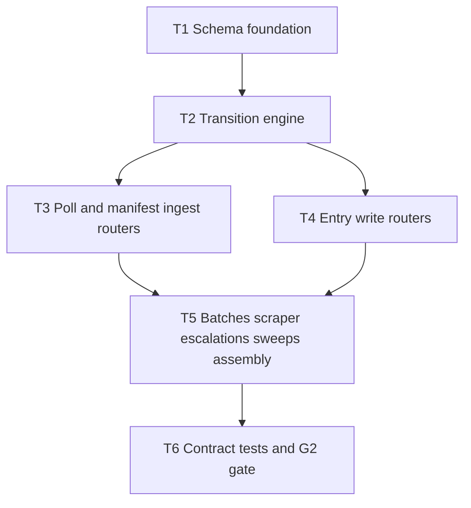

# M1 — State Kernel

**Plan name:** `m1-state-kernel`  
**Version:** 1.0  
**Status:** Complete (planning) — executor packets emitted; pending user confirmation on orch defaults in §Decision log  
**Charter slice:** `.dev/bishop_program_charter.md` L130–180  
**Normative spec:** `bishop_spec_0_6.md` v1.5.0 @ `8d339ee2cd5dd2b16549bbe556ea995462a53a20` (tracked)

---

## 0. Context map intake

| Field | Value |
|-------|-------|
| **Path consumed** | `.dev/plans/m1-state-kernel/context-map.md` |
| **Readiness verdict** | CONDITIONAL |
| **Scope-area labels flagged** | Flag 1 (enum placement), Flag 2 (SQLite filename), Flag 3 (`content_raw` omission), Flag 4 (partial §9.1 wire schemas), Flag 5 (missing standalone handoff / architecture at tracked HEAD), Flag 6 (batch vocabulary), Flag 7 (provenance assertion timing), Flag 8 (`test_only_health_route_exposed`) |
| **Skill version + SHA** | pre-plan-exploration v0.2 · scout SHA `8d339ee2cd5dd2b16549bbe556ea995462a53a20` (= current `git rev-parse HEAD`) |

**G1 gate:** satisfied — M0 implementation present; embedded M0 §8.1 handoff in `.dev/plans/m0-workshop/plan.md` documents healthy compose stack at scout SHA.

**Binding-artifact resolvability:**

| Artifact | Status |
|----------|--------|
| `bishop_spec_0_6.md` | **Binding** — `git ls-files` confirms tracked |
| `.dev/plans/m0-workshop/handoff.md` | **Informational** — absent; M0 §8 embedded in `plan.md` (untracked) used instead |
| `.dev/plans/m0-workshop/plan.md` | **Informational** — untracked at HEAD; §8.1 snapshot cited by SHA |
| `.dev/architecture/bishop/` | **Informational** — on disk, untracked; not required for M1 code scope |

**Orch defaults (context-map flags → resolved in this plan):**

| Flag | Resolution |
|------|------------|
| 1 | `ProcessingState` + all §20 enums in `services/state-worker/app/enums.py` only — not `bishop_shared` |
| 2 | `bishop.db` at `/app/data/sqlite/bishop.db`; frozen `SQLITE_DB_FILENAME` in `bishop_shared/constants.py` |
| 3 | Implement `content_raw` omission on `VECTOR_WRITE_QUEUED` poll in M1 + contract test |
| 4 | Derive minimal Pydantic wire models from §7 + §5 prose for undocumented endpoints; log in T1 decision log |
| 5 | Consume M0 embedded §8 + decision logs; no blocker for M1 execution |
| 6 | Subtask/packet vocabulary: *manifest ingest batch* = `POST /manifest/batch`; *BatchRecord* = Anthropic lifecycle table |
| 7 | Enforce pre-filter provenance non-null assertion on `POST /entries/content` in M1 + unit test |
| 8 | Remove `test_only_health_route_exposed`; replace with `test_route_surface_matches_spec` in contract suite |

**Implicit contracts from context-map handoff notes:** Alembic at repo root; Dockerfile COPY extended; state-worker image tag `:m1`; compose `start_period` bumped to 30s for migration window.

---

## 1. Task statement

Implement the complete `state-worker` service as the program contract anchor: Alembic migrations and full SQLite schema (six tables per §7), all enums and Pydantic models, state transition logic with atomic poll-and-claim semantics, lock-state recovery sweep, retry sweep, H3 multi-step write transactions, N3 ErrorLog normalization, and every §9.1 REST endpoint. After M1, G2 passes — contract tests prove idempotent manifest ingest, atomic double-poll emptiness, enrichment-stage1 transaction atomicity, and sweep recovery observable via logs. M0 `GET /health` remains compatible.

**Non-goals:**
- Any service other than `state-worker` (stubs unchanged except state-worker image tag and compose `start_period`)
- Scraper, pre-filter-worker, content-scraper, enrichment-batcher, batch-poller, vector-writer, query-api, ui business logic
- Spec edits (`bishop_spec_0_6.md` is read-only reference)
- LanceDB, DuckDB, BM25, NL profiles, Anthropic API calls
- All items in §23 and §24 of `bishop_spec_0_6.md` are non-goals for this plan.

---

## 2. Shared contracts

### Types / interfaces

| Symbol | Owner | Typed surface | Test |
|--------|-------|---------------|------|
| `SQLITE_DB_FILENAME` | T1 | `bishop_shared/constants.py` = `"bishop.db"` | `tests/test_constants.py::test_sqlite_db_filename` |
| `SQLITE_DB_PATH` | T1 | `bishop_shared/constants.py` — join mount dir + filename → `/app/data/sqlite/bishop.db` | same |
| `ProcessingState` | T1 | `services/state-worker/app/enums.py` — `str, Enum`; members exactly §6.1 L264–287 | `tests/test_state_worker_enums.py::test_processing_state_members_match_spec` |
| `SourceEnum`, `DomainEnum`, `BatchTypeEnum`, `BatchStatusEnum`, `EntryTypeEnum`, `ReadingStatusEnum`, `OovReviewStatusEnum` | T1 | `services/state-worker/app/enums.py` — §20.1–20.7 | `tests/test_state_worker_enums.py::test_section_20_enum_members` |
| `ManifestEntry`, `Entry`, `BatchRecord`, `ErrorLog`, `OovTagsLog`, `ScraperState` | T1 | `services/state-worker/app/models/domain.py` — Pydantic v2; fields per §7 | `tests/test_state_worker_models.py::test_*_round_trip` |
| HTTP request/response models | T1 | `services/state-worker/app/models/http.py` — poll responses, batch bodies per §9.1 documented JSON; derived models for gaps (see T1 decision log) | contract tests per endpoint |
| `get_db()` async connection pool | T1 | `services/state-worker/app/db.py` — aiosqlite; WAL pragma on init | `tests/test_state_worker_db.py::test_wal_mode_enabled` |
| `run_migrations()` sync hook | T1 | `services/state-worker/app/db.py` — sync SQLAlchemy + Alembic `upgrade head` before asyncio loop | `tests/test_state_worker_db.py::test_migrations_create_six_tables` |
| `RETRY_MAX_ATTEMPTS` | T1 | `services/state-worker/app/config.py` — default `3`, env override `BISHOP_RETRY_MAX_ATTEMPTS` | `tests/test_state_worker_config.py::test_retry_max_attempts_default` |
| `SWEEP_INTERVAL_SEC`, `STUCK_THRESHOLD_SEC` | T1 | `services/state-worker/app/config.py` — defaults `300`, `900` | config round-trip test |
| Transition functions | T2 | `services/state-worker/app/transitions.py` | `tests/test_state_worker_transitions.py` |
| Lock-state + retry sweeps | T5 | `services/state-worker/app/sweeps.py` | contract test + log assertion in T6 |

**JSON list[str] columns:** `concepts`, `tags`, `challenge_hooks`, `references`, `cited_by`, `top_entries` — `json.dumps` on write, `json.loads` on read at state-worker boundary (§7.2 M2 note).

### Error envelope

| Surface | Binding behavior |
|---------|------------------|
| Success poll | `200` + `{"entries": [...], "claimed_count": int, "transitioned_to": str \| null}` |
| `POST /manifest/batch` | `200` + `{"inserted": int, "skipped": int}` (derived wire — T1 decision log) |
| `POST /entries/content` | `200` + `{"entry_id": str, "processing_state": "SCRAPED"}` (derived) |
| `POST /entries/indexed` | `204 No Content` |
| `POST /scraper-state/{source}` | `204 No Content` |
| Provenance violation on content POST | `409` + `{"error": "provenance_incomplete", "source_id": str}` |
| Unknown `source_id` | `404` + `{"error": "not_found", "source_id": str}` |
| Invalid state transition | `409` + `{"error": "invalid_transition", "source_id": str, "from_state": str, "to_state": str}` |
| Terminal state overwrite | `409` + `{"error": "terminal_state", "source_id": str}` |
| Invalid poll state param | `400` + `{"error": "invalid_poll_state", "state": str}` |
| `GET /health` | `200` + `{"status": "ok"}` — unchanged from M0 |

### Naming

| Category | Convention |
|----------|------------|
| Router modules | `services/state-worker/app/routers/{manifest,entries,batches,scraper_state,escalations}.py` |
| Alembic | Repo root `alembic.ini`, `alembic/versions/` |
| Migration revision IDs | `m1_001_initial_schema` style |
| Image tag | `bishop/state-worker:m1` |
| Env vars | `BISHOP_RETRY_MAX_ATTEMPTS`, `BISHOP_SWEEP_INTERVAL_SEC`, `BISHOP_STUCK_THRESHOLD_SEC` |

### Logging

- **Levels:** INFO for startup, migration, sweep actions; WARNING for idempotent no-ops; ERROR for transition failures; CRITICAL for alert_type per §14.3
- **Structured fields:** `source_id`, `from_state`, `to_state`, `batch_id`, `sweep_reset_count`, `retry_requeue_count`
- **Sink:** stdout (Docker logs); optional file under `/app/logs` deferred

### Tests

- **Framework:** pytest
- **Location:** `tests/test_state_worker_*.py`, `tests/test_state_worker_contract.py`
- **G2 gate:** `scripts/verify-g2.sh` — pytest contract suite + optional compose smoke
- **Coverage:** every §2 row has named test; contract suite covers all §9.1 routes; no Docker-in-pytest required for G2 (TestClient + temp SQLite)

### CLI surface

| Command | Owner | Purpose |
|---------|-------|---------|
| `scripts/verify-g2.sh` | T6 | G2 exit gate |
| `pytest tests/test_state_worker_contract.py -v` | T6 | Primary automated G2 verification |

### Wire / HTTP (binding route strings)

Frozen per `bishop_spec_0_6.md` §9.1 L617–633:

```
POST /manifest/batch
POST /manifest/pre-filter-results
POST /entries/content
POST /entries/enrichment-stage1-results
POST /entries/enrichment-stage2-results
POST /entries/indexed
POST /entries/failed
POST /entries/retry
GET  /manifest/poll
GET  /entries/poll
GET  /scraper-state/{source}
POST /scraper-state/{source}
GET  /batches
GET  /batches/{batch_id}
GET  /health
GET  /escalations
```

**Poll query params (binding):** `state` (required), `domain` (optional), `limit` (optional, default 50).

**Atomic claim mapping (binding):** `DISCOVERED→RELEVANCE_QUEUED`, `RELEVANCE_PASSED→SCRAPE_QUEUED`, `SCRAPED→ENRICHMENT_STAGE1_QUEUED`, `ENRICHMENT_STAGE2_QUEUED→ENRICHMENT_STAGE2_CLAIMED`; `VECTOR_WRITE_QUEUED` poll returns without claim (`transitioned_to: null`).

**Decision log paths (architectural):** `.dev/decision-logs/m1-state-kernel/T1-schema-foundation.md`, `.dev/decision-logs/m1-state-kernel/T2-transition-engine.md`

---

## 3. Dependency DAG



**Parallel groups:** `{T3, T4}` may run concurrently after T2 completes (disjoint router files).

**Soft dependency:** T5 owns `main.py` lifespan and router registration — must merge after T3/T4.

---

## 4. Subtask specs

### T1 — Schema foundation

| Field | Content |
|-------|---------|
| **ID** | T1 |
| **Scope** | Alembic initial migration (six tables), enums, domain + HTTP Pydantic models, `db.py` sync migration hook + async pool, `config.py`, extend `bishop_shared/constants.py` with DB filename, update Dockerfile/requirements. |
| **Files to touch** | `alembic.ini`, `alembic/env.py`, `alembic/versions/`, `bishop_shared/constants.py`, `services/state-worker/app/enums.py`, `services/state-worker/app/models/domain.py`, `services/state-worker/app/models/http.py`, `services/state-worker/app/db.py`, `services/state-worker/app/config.py`, `services/state-worker/requirements.txt`, `services/state-worker/Dockerfile`, `tests/test_constants.py`, `tests/test_state_worker_enums.py`, `tests/test_state_worker_models.py`, `tests/test_state_worker_db.py`, `tests/test_state_worker_config.py` |
| **Contract bindings** | All §2 types rows owned by T1 |
| **Inputs** | None |
| **Outputs** | Runnable empty DB via migrations; importable models/enums; decision log T1 |
| **Kill criteria** | Halt if Alembic cannot run against path under `/app/data/sqlite/`; halt if spec §7 column cannot map to SQLite type without decision log entry; halt if context-map flag 1/2 unresolved at execution start |
| **Log tier** | architectural |
| **Risks & mitigations** | Alembic COPY visibility — extend Dockerfile `COPY alembic alembic` + `COPY alembic.ini`; test with docker build |

### T2 — Transition engine

| Field | Content |
|-------|---------|
| **ID** | T2 |
| **Scope** | All state transition logic: idempotency, terminal guards, atomic claims, H3 transactions, N3 normalization, retry mapping, provenance assertion helper for content path. |
| **Files to touch** | `services/state-worker/app/transitions.py`, `tests/test_state_worker_transitions.py`, `.dev/decision-logs/m1-state-kernel/T2-transition-engine.md` |
| **Contract bindings** | Error envelope, ProcessingState, H3 pattern |
| **Inputs** | T1 |
| **Outputs** | Callable transition API used by routers/sweeps |
| **Kill criteria** | Halt if atomic claim cannot be expressed in single SQLite transaction; halt if spec §6.2 mapping contradicts implemented enum names |
| **Log tier** | architectural |
| **Risks & mitigations** | Complex H3 paths — unit-test rollback on mid-sequence failure |

### T3 — Poll and manifest ingest routers

| Field | Content |
|-------|---------|
| **ID** | T3 |
| **Scope** | `POST /manifest/batch`, `GET /manifest/poll`, `GET /entries/poll` including VECTOR_WRITE_QUEUED `content_raw` omission. |
| **Files to touch** | `services/state-worker/app/routers/manifest.py`, `services/state-worker/app/routers/poll.py` |
| **Contract bindings** | Wire routes, poll response shape, claim mapping |
| **Inputs** | T2 |
| **Outputs** | Router modules (no `main.py` edits) |
| **Kill criteria** | Halt if context-map flag 3 unresolved at execution start; halt if double-poll falsifier cannot be tested at unit level |
| **Log tier** | standard |
| **Risks & mitigations** | `content_raw` omission — explicit response serializer branch |

### T4 — Entry write routers

| Field | Content |
|-------|---------|
| **ID** | T4 |
| **Scope** | All `POST /entries/*` and `POST /manifest/pre-filter-results` endpoints. |
| **Files to touch** | `services/state-worker/app/routers/entries.py` |
| **Contract bindings** | Error envelope, H3, N3, provenance assertion |
| **Inputs** | T2 |
| **Outputs** | Router module |
| **Kill criteria** | Halt if context-map flag 4 unresolved at execution start (wire models must be in T1 http.py); halt if context-map flag 7 unresolved |
| **Log tier** | standard |
| **Risks & mitigations** | Partial schemas — document derived shapes in T1 log before implementing |

### T5 — Batches, scraper-state, escalations, sweeps, assembly

| Field | Content |
|-------|---------|
| **ID** | T5 |
| **Scope** | Remaining GET/POST routes, background sweep asyncio task, `main.py` lifespan (migrations → pool → sweeps), router registration. Convert `/health` to async-compatible app shell. |
| **Files to touch** | `services/state-worker/app/routers/batches.py`, `scraper_state.py`, `escalations.py`, `services/state-worker/app/sweeps.py`, `services/state-worker/app/main.py`, `docker-compose.yml` (`start_period: 30s`, image tag) |
| **Contract bindings** | Startup sequence, sweep intervals, all remaining wire routes |
| **Inputs** | T2, T3, T4 |
| **Outputs** | Runnable service with all routes registered |
| **Kill criteria** | Halt if compose healthcheck fails 5 consecutive starts on clean DB; halt if sweeps block event loop (must use async sleep + async DB) |
| **Log tier** | standard |
| **Risks & mitigations** | Surface 2 (health before migrations) — lifespan runs migrations before `yield`; bump `start_period` |

### T6 — Contract tests and G2 gate

| Field | Content |
|-------|---------|
| **ID** | T6 |
| **Scope** | `tests/test_state_worker_contract.py`, `scripts/verify-g2.sh`, amend `tests/test_state_worker_health.py`, update `tests/test_compose.py` for image tag / start_period if needed. |
| **Files to touch** | `tests/test_state_worker_contract.py`, `tests/test_state_worker_health.py`, `scripts/verify-g2.sh`, `tests/test_verify_g2.py`, `pyproject.toml` (dev deps if needed) |
| **Contract bindings** | All §2 tests row, G2 charter exit gate |
| **Inputs** | T5 |
| **Outputs** | Passing G2 verification command |
| **Kill criteria** | Halt if any §9.1 route lacks contract test; halt if M0 health tests regress |
| **Log tier** | standard |
| **Risks & mitigations** | Flag 8 — relocate route surface test here |

---

## 5. Adversarial pass

### 5.1 Rejected decompositions

**Alternative A — One subtask per endpoint family (7+ routers as 7 subtasks):** Rejected because T5's `main.py` assembly and shared lifespan would become a merge bottleneck across 7 parallel executors; orch §3 parallel safety fails on `main.py`.

**Alternative B — Merge T3+T4+T5 into single "REST surface" subtask:** Rejected — exceeds reasonable executor scope (~15 endpoints + sweeps); violates charter 5–7 subtask guidance and prevents parallel poll vs write development.

### 5.2 Load-bearing assumptions

| Tuple |
|-------|
| `(SQLite single-writer via state-worker REST only for claims \| §2 Wire poll routes + §8.1 \| direct SQLite poll by future worker bypasses atomic claim \| T2,T3)` |
| `(bishop.db path frozen in bishop_shared \| SQLITE_DB_PATH constant \| batch-poller/query-api open wrong file \| T1,T6)` |
| `(Derived wire models for undocumented §9.1 bodies match M3/M5 consumer expectations \| T1 http.py + decision log \| contract drift vs future workers \| T1,T4,T6)` |
| `(TestClient + temp file SQLite exercises same transition code as production aiosqlite \| db.py connection factory \| WAL/locking divergence hides bugs \| T2,T6)` |
| `(M0 /health remains sync def or async without blocking DB \| main.py health handler \| compose healthcheck latency spike \| T5)` |

### 5.3 Highest re-plan risk

**T2 (Transition engine)** — highest technical surprise risk. H3 multi-step sequences, N3 normalization, and atomic claim SQL in one module; a spec edge case (e.g., partial batch failure in enrichment POST) could force contract amendment across T3–T6.

Process risk secondary: untracked M0 plan artifacts (Flag 5) may cause auditor §8.2 gaps but should not block executors.

### 5.4 Hidden couplings

| Tuple | Status |
|-------|--------|
| `(T3 and T4 parallel \| both import transitions.py but do not edit it \| safe if interfaces frozen at T2 completion \| T3,T4)` | confirmed |
| `(T5 main.py router include order \| FastAPI route matching \| overlapping path prefixes unlikely given §9.1 \| T5)` | confirmed |
| `(JSON list column encoding \| Entry model serialization \| batch-poller raw SQL reads get JSON text not lists \| T1,T2)` | suspected — disproven for MVP: only state-worker writes; readers documented in T1 log |
| `(compose start_period 10s vs migration duration \| healthcheck \| restart loop on slow disk \| T5,T6)` | confirmed — mitigated by 30s start_period |
| `(processing_state string values in DB \| ProcessingState enum .value \| typo breaks poll filters \| T1,T2)` | suspected — mitigated by enum-backed CHECK or application-only validation with enum test |
| `(test_only_health_route_exposed \| M0 test \| blocks T5 route registration until T6 \| T5,T6)` | confirmed — sequenced T6 amendment |

---

## 6. Executor packets

Self-contained packets:

- `.dev/plans/m1-state-kernel/packets/T1.md`
- `.dev/plans/m1-state-kernel/packets/T2.md`
- `.dev/plans/m1-state-kernel/packets/T3.md`
- `.dev/plans/m1-state-kernel/packets/T4.md`
- `.dev/plans/m1-state-kernel/packets/T5.md`
- `.dev/plans/m1-state-kernel/packets/T6.md`

---

## 7. Amendment subtasks

None at plan v1.0.

---

## 8. Auditor handoff

*Deferred until M1 execution completes. Template below for post-execution fill.*

### §8.1 Completion snapshot

**Tree SHA:** _(pending)_

**Command:** `pytest tests/test_state_worker_contract.py tests/test_state_worker_health.py tests/test_constants.py -v --tb=short`

**Result:** _(pending clean-tree run)_

### §8.2 Artifact chain

| Path | Notes |
|------|-------|
| `.dev/plans/m1-state-kernel/context-map.md` | Pre-plan intake |
| `.dev/plans/m1-state-kernel/plan.md` | This file |
| `.dev/plans/m1-state-kernel/packets/T1.md` … `T6.md` | Executor packets |
| `.dev/decision-logs/m1-state-kernel/T1-schema-foundation.md` | Architectural |
| `.dev/decision-logs/m1-state-kernel/T2-transition-engine.md` | Architectural |
| `bishop_spec_0_6.md` | Normative binding |

### §8.3–§8.6

_To be completed at M1 handoff._

---

## Decision log (orch resolutions — confirm or override before execution)

| Decision | Chosen default | Rationale | Tradeoff |
|----------|----------------|-----------|----------|
| Enum placement | `state-worker/app/enums.py` | Charter §4 lists M1 as owner; downstream services read SQLite strings, not Python enums | Future typed clients must duplicate or add shared package in later milestone |
| DB filename | `bishop.db` in `bishop_shared/constants.py` | Coupling surface 1 — batch-poller/query-api need stable path for direct reads | Filename change requires cross-service amendment |
| `content_raw` omission | Implement in M1 | Endpoint exists in M1; behavior is spec'd; cheap branch + test | Untested at scale until M6 vector-writer |
| Partial wire schemas | Derive from §7 + §5; log as binding | Unblocks G2; spec changelog acknowledges gap | Risk of consumer mismatch — mitigated by contract tests + decision log |
| Provenance assertion | Enforce in M1 | Endpoint lands M1; M4 gate assumes invariant | Slightly ahead of charter "(M2)" prose annotation |
| Health route test | Relocate to contract suite | Preserves M0 health invariants without blocking §9.1 | Two test files to maintain |
| Image tag | `bishop/state-worker:m1` only | Signals state-worker rebuild without churning eight stubs | Mixed `:m0`/`:m1` tags until later milestone |
| Startup sequence | Lifespan migrations before listen; `start_period: 30s` | Resolves surface 2 without 503 health semantics | Slow first start on large migration history |
