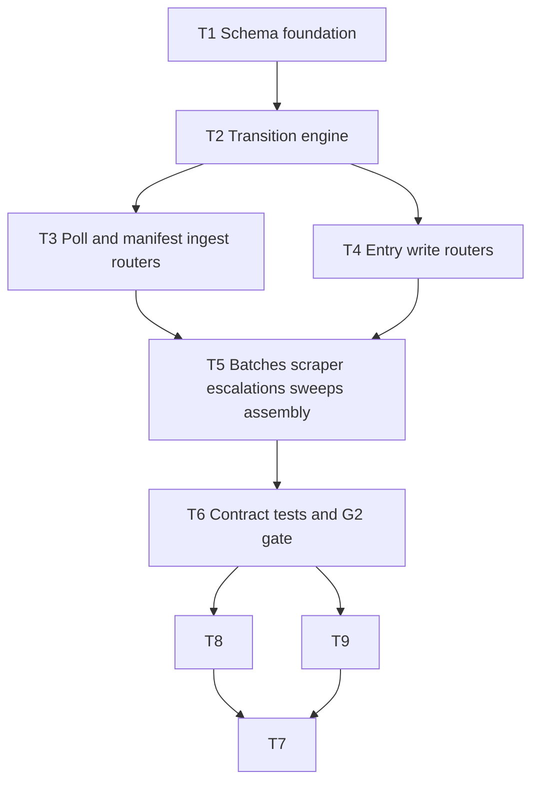

# M1 — State Kernel

**Plan name:** `m1-state-kernel`  
**Version:** 1.2  
**Status:** Complete + amendment landed  
**Prior version:** 1.1 (T1–T6 complete; §8 handoff recorded but uncommitted at audit HEAD — see F-002/F-003)  
**Charter slice:** `.dev/bishop_program_charter.md` L130–180  
**Normative spec:** `bishop_spec_0_6.md` v1.5.0 @ `8d339ee2cd5dd2b16549bbe556ea995462a53a20` (tracked)

---

## 0. Context map intake

| Field | Value |
|-------|-------|
| **Path consumed** | `.dev/plans/m1-state-kernel/context-map.md` |
| **Readiness verdict** | CONDITIONAL |
| **Scope-area labels flagged** | Flag 1 (enum placement), Flag 2 (SQLite filename), Flag 3 (`content_raw` omission), Flag 4 (partial §9.1 wire schemas), Flag 5 (missing standalone handoff / architecture at tracked HEAD), Flag 6 (batch vocabulary), Flag 7 (provenance assertion timing), Flag 8 (`test_only_health_route_exposed`) |
| **Skill version + SHA** | pre-plan-exploration v0.2 · scout SHA `8d339ee2cd5dd2b16549bbe556ea995462a53a20` (= current `git rev-parse HEAD`) |

**G1 gate:** satisfied — M0 implementation present; embedded M0 §8.1 handoff in `.dev/plans/m0-workshop/plan.md` documents healthy compose stack at scout SHA.

**Binding-artifact resolvability:**

| Artifact | Status |
|----------|--------|
| `bishop_spec_0_6.md` | **Binding** — `git ls-files` confirms tracked |
| `.dev/plans/m0-workshop/handoff.md` | **Informational** — absent; M0 §8 embedded in `plan.md` (untracked) used instead |
| `.dev/plans/m0-workshop/plan.md` | **Informational** — untracked at HEAD; §8.1 snapshot cited by SHA |
| `.dev/architecture/bishop/` | **Informational** — on disk, untracked; not required for M1 code scope |

**Orch defaults (context-map flags → resolved in this plan):**

| Flag | Resolution |
|------|------------|
| 1 | `ProcessingState` + all §20 enums in `services/state-worker/app/enums.py` only — not `bishop_shared` |
| 2 | `bishop.db` at `/app/data/sqlite/bishop.db`; frozen `SQLITE_DB_FILENAME` in `bishop_shared/constants.py` |
| 3 | Implement `content_raw` omission on `VECTOR_WRITE_QUEUED` poll in M1 + contract test |
| 4 | Derive minimal Pydantic wire models from §7 + §5 prose for undocumented endpoints; log in T1 decision log |
| 5 | Consume M0 embedded §8 + decision logs; no blocker for M1 execution |
| 6 | Subtask/packet vocabulary: *manifest ingest batch* = `POST /manifest/batch`; *BatchRecord* = Anthropic lifecycle table |
| 7 | Enforce pre-filter provenance non-null assertion on `POST /entries/content` in M1 + unit test |
| 8 | Remove `test_only_health_route_exposed`; replace with `test_route_surface_matches_spec` in contract suite |

**Implicit contracts from context-map handoff notes:** Alembic at repo root; Dockerfile COPY extended; state-worker image tag `:m1`; compose `start_period` bumped to 30s for migration window.

---

## 1. Task statement

Implement the complete `state-worker` service as the program contract anchor: Alembic migrations and full SQLite schema (six tables per §7), all enums and Pydantic models, state transition logic with atomic poll-and-claim semantics, lock-state recovery sweep, retry sweep, H3 multi-step write transactions, N3 ErrorLog normalization, and every §9.1 REST endpoint. After M1, G2 passes — contract tests prove idempotent manifest ingest, atomic double-poll emptiness, enrichment-stage1 transaction atomicity, and sweep recovery observable via logs. M0 `GET /health` remains compatible.

**Non-goals:**
- Any service other than `state-worker` (stubs unchanged except state-worker image tag and compose `start_period`)
- Scraper, pre-filter-worker, content-scraper, enrichment-batcher, batch-poller, vector-writer, query-api, ui business logic
- Spec edits (`bishop_spec_0_6.md` is read-only reference)
- LanceDB, DuckDB, BM25, NL profiles, Anthropic API calls
- All items in §23 and §24 of `bishop_spec_0_6.md` are non-goals for this plan.

---

## 2. Shared contracts

### Types / interfaces

| Symbol | Owner | Typed surface | Test |
|--------|-------|---------------|------|
| `SQLITE_DB_FILENAME` | T1 | `bishop_shared/constants.py` = `"bishop.db"` | `tests/test_constants.py::test_sqlite_db_filename` |
| `SQLITE_DB_PATH` | T1 | `bishop_shared/constants.py` — join mount dir + filename → `/app/data/sqlite/bishop.db` | same |
| `ProcessingState` | T1 | `services/state-worker/app/enums.py` — `str, Enum`; members exactly §6.1 L264–287 | `tests/test_state_worker_enums.py::test_processing_state_members_match_spec` |
| `SourceEnum`, `DomainEnum`, `BatchTypeEnum`, `BatchStatusEnum`, `EntryTypeEnum`, `ReadingStatusEnum`, `OovReviewStatusEnum` | T1 | `services/state-worker/app/enums.py` — §20.1–20.7 | `tests/test_state_worker_enums.py::test_section_20_enum_members` |
| `ManifestEntry`, `Entry`, `BatchRecord`, `ErrorLog`, `OovTagsLog`, `ScraperState` | T1 | `services/state-worker/app/models/domain.py` — Pydantic v2; fields per §7 | `tests/test_state_worker_models.py::test_*_round_trip` |
| HTTP request/response models | T1 | `services/state-worker/app/models/http.py` — poll responses, batch bodies per §9.1 documented JSON; derived models for gaps (see T1 decision log) | contract tests per endpoint |
| `get_db()` async connection pool | T1 | `services/state-worker/app/db.py` — aiosqlite; WAL pragma on init | `tests/test_state_worker_db.py::test_wal_mode_enabled` |
| `run_migrations()` sync hook | T1 | `services/state-worker/app/db.py` — sync SQLAlchemy + Alembic `upgrade head` before asyncio loop | `tests/test_state_worker_db.py::test_migrations_create_six_tables` |
| `RETRY_MAX_ATTEMPTS` | T1 | `services/state-worker/app/config.py` — default `3`, env override `BISHOP_RETRY_MAX_ATTEMPTS` | `tests/test_state_worker_config.py::test_retry_max_attempts_default` |
| `SWEEP_INTERVAL_SEC`, `STUCK_THRESHOLD_SEC` | T1 | `services/state-worker/app/config.py` — defaults `300`, `900` | config round-trip test |
| Transition functions | T2 | `services/state-worker/app/transitions.py` | `tests/test_state_worker_transitions.py` |
| Lock-state + retry sweeps | T5 | `services/state-worker/app/sweeps.py` | contract test + log assertion in T6 |
| `emit_alert()` | T8 | `services/state-worker/app/alerts.py` (or `transitions.py` if single-module) | `tests/test_state_worker_alerts.py::test_record_failure_escalation_emits_critical_alert` |
| Log level contracts | T8 | `transitions.py`, `sweeps.py` — WARNING/ERROR/CRITICAL per §2 Logging | `tests/test_state_worker_alerts.py::test_*_log_level` |
| `content_raw` omission (G2) | T9 | `tests/test_state_worker_contract.py` | `test_entries_poll_vector_write_queued_omits_content_raw` |

**JSON list[str] columns:** `concepts`, `tags`, `challenge_hooks`, `references`, `cited_by`, `top_entries` — `json.dumps` on write, `json.loads` on read at state-worker boundary (§7.2 M2 note).

### Error envelope

| Surface | Binding behavior |
|---------|------------------|
| Success poll | `200` + `{"entries": [...], "claimed_count": int, "transitioned_to": str \| null}` |
| `POST /manifest/batch` | `200` + `{"inserted": int, "skipped": int}` (derived wire — T1 decision log) |
| `POST /entries/content` | `200` + `{"entry_id": str, "processing_state": "SCRAPED"}` (derived) |
| `POST /entries/indexed` | `204 No Content` |
| `POST /scraper-state/{source}` | `204 No Content` |
| Provenance violation on content POST | `409` + `{"error": "provenance_incomplete", "source_id": str}` |
| Unknown `source_id` | `404` + `{"error": "not_found", "source_id": str}` |
| Invalid state transition | `409` + `{"error": "invalid_transition", "source_id": str, "from_state": str, "to_state": str}` |
| Terminal state overwrite | `409` + `{"error": "terminal_state", "source_id": str}` |
| Invalid poll state param | `400` + `{"error": "invalid_poll_state", "state": str}` |
| Invalid batch status filter (`GET /batches?status=`) | `400` + `{"error": "invalid_batch_status", "status": str}` |
| `GET /health` | `200` + `{"status": "ok"}` — unchanged from M0 |

### Naming

| Category | Convention |
|----------|------------|
| Router modules | `services/state-worker/app/routers/{manifest,entries,batches,scraper_state,escalations}.py` |
| Alembic | Repo root `alembic.ini`, `alembic/versions/` |
| Migration revision IDs | `m1_001_initial_schema` style |
| Image tag | `bishop/state-worker:m1` |
| Env vars | `BISHOP_RETRY_MAX_ATTEMPTS`, `BISHOP_SWEEP_INTERVAL_SEC`, `BISHOP_STUCK_THRESHOLD_SEC` |

### Logging

- **Levels:** INFO for startup, migration, sweep actions, successful transitions; WARNING for idempotent no-ops; ERROR for transition failures; CRITICAL for alert emission per §14.3
- **Structured fields:** `source_id`, `from_state`, `to_state`, `batch_id`, `sweep_reset_count`, `retry_requeue_count`, `alert_type` (on CRITICAL alert lines only)
- **Alert emission (binding — T8):** `emit_alert(conn, *, source_id, alert_type, message, ...)` writes (a) `logger.critical(..., extra={"alert_type": ..., "source_id": ...})` and (b) an `error_log` row with `error_class = "ALERT"`. M1 triggers: `retry_budget_exhausted`, `escalation_flagged`, `permanent_failure` inside `record_failure` when target state is `ESCALATION_FLAGGED` or `PERMANENTLY_FAILED`. Spec conditions deferred to later milestones: `profile_hash_mismatch` (M3), `batch_timeout_48h` / `batch_abort` (M5) — documented in T8 decision log; no stub hooks required in M1.
- **Sink:** stdout (Docker logs); optional file under `/app/logs` deferred

### Tests

- **Framework:** pytest
- **Location:** `tests/test_state_worker_*.py`, `tests/test_state_worker_contract.py`
- **G2 gate:** `scripts/verify-g2.sh` — pytest contract suite + optional compose smoke
- **Coverage:** every §2 row has named test; contract suite covers all §9.1 routes; no Docker-in-pytest required for G2 (TestClient + temp SQLite)

### CLI surface

| Command | Owner | Purpose |
|---------|-------|---------|
| `scripts/verify-g2.sh` | T6 | G2 exit gate |
| `pytest tests/test_state_worker_contract.py -v` | T6 | Primary automated G2 verification |

### Wire / HTTP (binding route strings)

Frozen per `bishop_spec_0_6.md` §9.1 L617–633:

```
POST /manifest/batch
POST /manifest/pre-filter-results
POST /entries/content
POST /entries/enrichment-stage1-results
POST /entries/enrichment-stage2-results
POST /entries/indexed
POST /entries/failed
POST /entries/retry
GET  /manifest/poll
GET  /entries/poll
GET  /scraper-state/{source}
POST /scraper-state/{source}
GET  /batches
GET  /batches/{batch_id}
GET  /health
GET  /escalations
```

**Poll query params (binding):** `state` (required), `domain` (optional), `limit` (optional, default 50).

**Atomic claim mapping (binding):** `DISCOVERED→RELEVANCE_QUEUED`, `RELEVANCE_PASSED→SCRAPE_QUEUED`, `SCRAPED→ENRICHMENT_STAGE1_QUEUED`, `ENRICHMENT_STAGE2_QUEUED→ENRICHMENT_STAGE2_CLAIMED`; `VECTOR_WRITE_QUEUED` poll returns without claim (`transitioned_to: null`).

**Decision log paths (architectural):** `.dev/decision-logs/m1-state-kernel/T1-schema-foundation.md`, `.dev/decision-logs/m1-state-kernel/T2-transition-engine.md`, `.dev/decision-logs/m1-state-kernel/T8-alert-logging.md`

---

## 3. Dependency DAG



**Parallel groups:** `{T3, T4}` may run concurrently after T2 completes (disjoint router files). **Amendment parallel group:** `{T8, T9}` after T6; T7 runs last (handoff closure consumes T8/T9 outputs).

**Amendment trigger:** `.dev/audits/2026-06-11-m1-state-kernel.md` verdict **fail** — majors F-002, F-003, F-004.

**Soft dependency:** T5 owns `main.py` lifespan and router registration — must merge after T3/T4.

---

## 4. Subtask specs

### T1 — Schema foundation

| Field | Content |
|-------|---------|
| **ID** | T1 |
| **Scope** | Alembic initial migration (six tables), enums, domain + HTTP Pydantic models, `db.py` sync migration hook + async pool, `config.py`, extend `bishop_shared/constants.py` with DB filename, update Dockerfile/requirements. |
| **Files to touch** | `alembic.ini`, `alembic/env.py`, `alembic/versions/`, `bishop_shared/constants.py`, `services/state-worker/app/enums.py`, `services/state-worker/app/models/domain.py`, `services/state-worker/app/models/http.py`, `services/state-worker/app/db.py`, `services/state-worker/app/config.py`, `services/state-worker/requirements.txt`, `services/state-worker/Dockerfile`, `tests/test_constants.py`, `tests/test_state_worker_enums.py`, `tests/test_state_worker_models.py`, `tests/test_state_worker_db.py`, `tests/test_state_worker_config.py` |
| **Contract bindings** | All §2 types rows owned by T1 |
| **Inputs** | None |
| **Outputs** | Runnable empty DB via migrations; importable models/enums; decision log T1 |
| **Kill criteria** | Halt if Alembic cannot run against path under `/app/data/sqlite/`; halt if spec §7 column cannot map to SQLite type without decision log entry; halt if context-map flag 1/2 unresolved at execution start |
| **Log tier** | architectural |
| **Risks & mitigations** | Alembic COPY visibility — extend Dockerfile `COPY alembic alembic` + `COPY alembic.ini`; test with docker build |

### T2 — Transition engine

| Field | Content |
|-------|---------|
| **ID** | T2 |
| **Scope** | All state transition logic: idempotency, terminal guards, atomic claims, H3 transactions, N3 normalization, retry mapping, provenance assertion helper for content path. |
| **Files to touch** | `services/state-worker/app/transitions.py`, `tests/test_state_worker_transitions.py`, `.dev/decision-logs/m1-state-kernel/T2-transition-engine.md` |
| **Contract bindings** | Error envelope, ProcessingState, H3 pattern |
| **Inputs** | T1 |
| **Outputs** | Callable transition API used by routers/sweeps |
| **Kill criteria** | Halt if atomic claim cannot be expressed in single SQLite transaction; halt if spec §6.2 mapping contradicts implemented enum names |
| **Log tier** | architectural |
| **Risks & mitigations** | Complex H3 paths — unit-test rollback on mid-sequence failure |

### T3 — Poll and manifest ingest routers

| Field | Content |
|-------|---------|
| **ID** | T3 |
| **Scope** | `POST /manifest/batch`, `GET /manifest/poll`, `GET /entries/poll` including VECTOR_WRITE_QUEUED `content_raw` omission. |
| **Files to touch** | `services/state-worker/app/routers/manifest.py`, `services/state-worker/app/routers/poll.py` |
| **Contract bindings** | Wire routes, poll response shape, claim mapping |
| **Inputs** | T2 |
| **Outputs** | Router modules (no `main.py` edits) |
| **Kill criteria** | Halt if context-map flag 3 unresolved at execution start; halt if double-poll falsifier cannot be tested at unit level |
| **Log tier** | standard |
| **Risks & mitigations** | `content_raw` omission — explicit response serializer branch |

### T4 — Entry write routers

| Field | Content |
|-------|---------|
| **ID** | T4 |
| **Scope** | All `POST /entries/*` and `POST /manifest/pre-filter-results` endpoints. |
| **Files to touch** | `services/state-worker/app/routers/entries.py` |
| **Contract bindings** | Error envelope, H3, N3, provenance assertion |
| **Inputs** | T2 |
| **Outputs** | Router module |
| **Kill criteria** | Halt if context-map flag 4 unresolved at execution start (wire models must be in T1 http.py); halt if context-map flag 7 unresolved |
| **Log tier** | standard |
| **Risks & mitigations** | Partial schemas — document derived shapes in T1 log before implementing |

### T5 — Batches, scraper-state, escalations, sweeps, assembly

| Field | Content |
|-------|---------|
| **ID** | T5 |
| **Scope** | Remaining GET/POST routes, background sweep asyncio task, `main.py` lifespan (migrations → pool → sweeps), router registration. Convert `/health` to async-compatible app shell. |
| **Files to touch** | `services/state-worker/app/routers/batches.py`, `scraper_state.py`, `escalations.py`, `services/state-worker/app/sweeps.py`, `services/state-worker/app/main.py`, `docker-compose.yml` (`start_period: 30s`, image tag) |
| **Contract bindings** | Startup sequence, sweep intervals, all remaining wire routes |
| **Inputs** | T2, T3, T4 |
| **Outputs** | Runnable service with all routes registered |
| **Kill criteria** | Halt if compose healthcheck fails 5 consecutive starts on clean DB; halt if sweeps block event loop (must use async sleep + async DB) |
| **Log tier** | standard |
| **Risks & mitigations** | Surface 2 (health before migrations) — lifespan runs migrations before `yield`; bump `start_period` |

### T6 — Contract tests and G2 gate

| Field | Content |
|-------|---------|
| **ID** | T6 |
| **Scope** | `tests/test_state_worker_contract.py`, `scripts/verify-g2.sh`, amend `tests/test_state_worker_health.py`, update `tests/test_compose.py` for image tag / start_period if needed. |
| **Files to touch** | `tests/test_state_worker_contract.py`, `tests/test_state_worker_health.py`, `scripts/verify-g2.sh`, `tests/test_verify_g2.py`, `pyproject.toml` (dev deps if needed) |
| **Contract bindings** | All §2 tests row, G2 charter exit gate |
| **Inputs** | T5 |
| **Outputs** | Passing G2 verification command |
| **Kill criteria** | Halt if any §9.1 route lacks contract test; halt if M0 health tests regress |
| **Log tier** | standard |
| **Risks & mitigations** | Flag 8 — relocate route surface test here |

---

## 5. Adversarial pass

### 5.1 Rejected decompositions

**Alternative A — One subtask per endpoint family (7+ routers as 7 subtasks):** Rejected because T5's `main.py` assembly and shared lifespan would become a merge bottleneck across 7 parallel executors; orch §3 parallel safety fails on `main.py`.

**Alternative B — Merge T3+T4+T5 into single "REST surface" subtask:** Rejected — exceeds reasonable executor scope (~15 endpoints + sweeps); violates charter 5–7 subtask guidance and prevents parallel poll vs write development.

### 5.2 Load-bearing assumptions

| Tuple |
|-------|
| `(SQLite single-writer via state-worker REST only for claims \| §2 Wire poll routes + §8.1 \| direct SQLite poll by future worker bypasses atomic claim \| T2,T3)` |
| `(bishop.db path frozen in bishop_shared \| SQLITE_DB_PATH constant \| batch-poller/query-api open wrong file \| T1,T6)` |
| `(Derived wire models for undocumented §9.1 bodies match M3/M5 consumer expectations \| T1 http.py + decision log \| contract drift vs future workers \| T1,T4,T6)` |
| `(TestClient + temp file SQLite exercises same transition code as production aiosqlite \| db.py connection factory \| WAL/locking divergence hides bugs \| T2,T6)` |
| `(M0 /health remains sync def or async without blocking DB \| main.py health handler \| compose healthcheck latency spike \| T5)` |

### 5.3 Highest re-plan risk

**T2 (Transition engine)** — highest technical surprise risk. H3 multi-step sequences, N3 normalization, and atomic claim SQL in one module; a spec edge case (e.g., partial batch failure in enrichment POST) could force contract amendment across T3–T6.

Process risk secondary: untracked M0 plan artifacts (Flag 5) may cause auditor §8.2 gaps but should not block executors.

### 5.4 Hidden couplings

| Tuple | Status |
|-------|--------|
| `(T3 and T4 parallel \| both import transitions.py but do not edit it \| safe if interfaces frozen at T2 completion \| T3,T4)` | confirmed |
| `(T5 main.py router include order \| FastAPI route matching \| overlapping path prefixes unlikely given §9.1 \| T5)` | confirmed |
| `(JSON list column encoding \| Entry model serialization \| batch-poller raw SQL reads get JSON text not lists \| T1,T2)` | suspected — disproven for MVP: only state-worker writes; readers documented in T1 log |
| `(compose start_period 10s vs migration duration \| healthcheck \| restart loop on slow disk \| T5,T6)` | confirmed — mitigated by 30s start_period |
| `(processing_state string values in DB \| ProcessingState enum .value \| typo breaks poll filters \| T1,T2)` | suspected — mitigated by enum-backed CHECK or application-only validation with enum test |
| `(test_only_health_route_exposed \| M0 test \| blocks T5 route registration until T6 \| T5,T6)` | confirmed — sequenced T6 amendment |

---

## 6. Executor packets

Self-contained packets:

- `.dev/plans/m1-state-kernel/packets/T1.md`
- `.dev/plans/m1-state-kernel/packets/T2.md`
- `.dev/plans/m1-state-kernel/packets/T3.md`
- `.dev/plans/m1-state-kernel/packets/T4.md`
- `.dev/plans/m1-state-kernel/packets/T5.md`
- `.dev/plans/m1-state-kernel/packets/T6.md`
- `.dev/plans/m1-state-kernel/packets/T7.md` (amendment)
- `.dev/plans/m1-state-kernel/packets/T8.md` (amendment)
- `.dev/plans/m1-state-kernel/packets/T9.md` (amendment)

---

## 7. Amendment subtasks

Triggered by audit `.dev/audits/2026-06-11-m1-state-kernel.md` (revision 1, verdict **fail** at `2ac1e3c`).

### T8 — §14.3 alert emission and log-level contract (audit F-004, F-005, F-006)

| Field | Content |
|-------|---------|
| **ID** | T8 |
| **Scope** | Implement `emit_alert()` per spec §14.3 and plan §2 Logging; wire M1-applicable triggers in `record_failure`; correct log levels (WARNING idempotent skips, ERROR transition failures, CRITICAL+`alert_type` on alerts). |
| **Files to touch** | `services/state-worker/app/alerts.py` (preferred) or `transitions.py`, `services/state-worker/app/transitions.py`, `services/state-worker/app/sweeps.py` (if sweep log levels touched), `tests/test_state_worker_alerts.py`, `.dev/decision-logs/m1-state-kernel/T8-alert-logging.md` |
| **Contract bindings** | §2 Logging (amended), ErrorLog `error_class = "ALERT"` |
| **Inputs** | T6 (landed transitions/routers) |
| **Outputs** | Alert helper; CRITICAL structured logs; `error_log` ALERT rows; level-correct logging; decision log T8; tests proving F-004/F-005/F-006 closed |
| **Kill criteria** | Halt if spec §14.3 dual-write (log + `error_log`) cannot be expressed without schema migration; halt if no falsifiable test can assert `logger.critical` + `alert_type` extra field |
| **Log tier** | architectural |
| **Risks & mitigations** | Profile-hash and batch-timeout alerts deferred — document explicit deferral in T8 log to avoid scope creep into M3/M5 |

**Audit findings closed:** F-004 (major), F-005 (minor), F-006 (minor).

### T9 — G2 `content_raw` omission coverage (audit F-007)

| Field | Content |
|-------|---------|
| **ID** | T9 |
| **Scope** | Port `test_entries_poll_vector_write_queued_omits_content_raw` into `tests/test_state_worker_contract.py` so `scripts/verify-g2.sh` exercises Flag 3 / context-map resolution in the G2 gate file. |
| **Files to touch** | `tests/test_state_worker_contract.py` |
| **Contract bindings** | §2 Tests, poll `content_raw` omission binding |
| **Inputs** | T6 (contract harness), T3 (poll router landed) |
| **Outputs** | Named G2 contract test; optional dedup comment in `tests/test_state_worker_routers_poll.py` (keep router unit test or remove duplicate — executor chooses; contract file must own G2 assertion) |
| **Kill criteria** | Halt if contract harness cannot seed `VECTOR_WRITE_QUEUED` entry without importing poll-router-only fixtures unavailable to contract module |
| **Log tier** | standard |
| **Risks & mitigations** | Reuse contract suite DB seed helpers from existing enrichment/H3 tests |

**Audit findings closed:** F-007 (minor).

### T7 — Handoff closure and narrative sync (audit F-002, F-003, F-008, F-009)

| Field | Content |
|-------|---------|
| **ID** | T7 |
| **Scope** | Commit-ready plan v1.2: refresh §8 auditor handoff at amendment SHA on **clean tree**; correct §8.1 cleanliness claim; add CHANGELOG T3 line; confirm §2 `invalid_batch_status` and T8 logging rows landed; update §8.4 audit finding disposition; emit §8.6 cross-link. |
| **Files to touch** | `.dev/plans/m1-state-kernel/plan.md`, `CHANGELOG.MD` |
| **Contract bindings** | §8 auditor handoff schema (orch §8); §2 back-annotation |
| **Inputs** | T8, T9 |
| **Outputs** | Plan status → **Complete + amendment landed**; valid §8.1 snapshot; §8.3 evidence rows for T8/T9; §8.6 pointing to audit + amendment packets |
| **Kill criteria** | Halt if T8 or T9 not complete; halt if §8.1 verification runs on dirty tree; halt if `git show HEAD:plan.md` at recorded SHA still lacks §8 fill-in |
| **Log tier** | standard |
| **Risks & mitigations** | F-001 context-map staleness — record **treat-as-prediction** in §8.4; no context-map rewrite in M1 amendment scope |

**Audit findings closed:** F-002 (major), F-003 (major), F-008 (minor), F-009 (minor narrative).

**Explicit DAG edges into T7:** plan §8 (F-002/F-003), CHANGELOG (F-008), §2 error envelope row (F-009), §8.3 T8 evidence (F-004), §8.3 T9 evidence (F-007).

---

## 7R. Amendment adversarial pass

### 7R.1 Rejected decompositions

**Alternative — Defer all §14.3 alerts to M2 and amend §2 to mark logging non-binding:** Rejected because audit F-004 is **major** and spec §14.3 is labeled G2; deferral would require charter/spec amendment, not plan prose edit alone.

**Alternative — Merge T8+T9+T7 into single doc-only amendment:** Rejected — F-004 requires code; T7 §8.3 evidence depends on landed tests from T8/T9.

### 7R.2 Load-bearing assumptions (amendment)

| Tuple |
|-------|
| `(emit_alert dual-write in same transaction as record_failure state update \| §2 Logging T8 row \| alert row missing when escalation lands \| T8)` |
| `(caplog or mock logger can assert CRITICAL + alert_type extra \| §2 Tests \| F-004 reopens at audit \| T8)` |
| `(contract file seed helpers sufficient for VECTOR_WRITE_QUEUED poll \| §2 content_raw G2 row \| T9 kill criterion fires \| T9)` |
| `(amendment SHA recorded only after T7 commit on clean tree \| §8.1 \| F-003 repeats \| T7)` |

### 7R.3 Highest re-plan risk

**T8** — alert trigger taxonomy may expand if auditor interprets spec §14.3 conditions as requiring batch-timeout sweep in M1. Mitigation: T8 decision log explicitly defers non-state-worker conditions.

### 7R.4 Hidden couplings (amendment)

| Tuple | Status |
|-------|--------|
| `(T8 record_failure transaction \| emit_alert INSERT error_log \| partial commit leaves escalated row without alert \| T8)` | suspected — mitigate with same-transaction insert or post-commit alert with documented tradeoff in T8 log |
| `(T9 contract test duplicates routers_poll fixture \| two tests diverge \| T9)` | suspected — contract test should be self-contained; router test may remain as unit slice |
| `(T7 §8.1 SHA \| uncommitted plan at audit \| executor commits plan in T7 \| T7)` | confirmed — T7 owns single commit bundle |

---

## 8. Auditor handoff

### §8.1 Completion snapshot (T1–T9 + amendment)

**Tree SHA:** `57d95bcdf734564c9b59b4c23c5e6ab73eec8c7f`

**Tracked-tree cleanliness:** **clean** — `git status` shows no modified tracked files at handoff recording.

**M1 commit chain** (`8d339ee`…`57d95bc`, eight executor commits + `7d38c89` plan/docs bundle):

| Commit | Subtask | Summary |
|--------|---------|---------|
| `68e5148` | T1 | Alembic, enums, models, db pool, config, `bishop_shared` SQLite path |
| `9c4d249` | T2 | `transitions.py` — claims, H3, N3, sweeps helpers |
| `cc85f2d` | T3 | Manifest ingest + poll routers, `content_raw` omission |
| `5f891b0` | T4 | Entry write routers (`POST /entries/*`, pre-filter-results) |
| `898245c` | T5 | Remaining routers, sweeps, `main.py` lifespan, compose `:m1` |
| `2ac1e3c` | T6 | G2 contract suite, `verify-g2.sh`, health-test amendment |
| `6581ed7` | T9 | G2 `content_raw` omission contract test in contract suite |
| `b7bd8a1` | T8 | `emit_alert()` dual-write, log-level corrections |
| `57d95bc` | T7 | Plan v1.2 handoff closure, CHANGELOG T3 line, §2/§8 narrative sync |

**Primary automated verification (G2 gate — clean checkout of handoff SHA):**

```
Command: pytest tests/test_state_worker_contract.py tests/test_state_worker_health.py tests/test_constants.py tests/test_state_worker_alerts.py -v --tb=short
Environment: win32, Python 3.12.3, pytest 8.4.2
Result: 39 passed in 11.24s, exit code 0
```

**Full regression slice (recommended auditor sanity check):**

```
Command: pytest tests/ -q
Result: not re-run at T7 handoff; pre-amendment audit recorded 147 passed at `2ac1e3c`
```

**Live Docker gate:** Not executed on handoff host during this recording. G2 scope is TestClient + temp SQLite per plan §2 Tests policy. Auditor may optionally run `docker compose up --build -d` and `docker compose exec -T state-worker curl -sf http://localhost:8000/health` on a bash/Docker host; `scripts/verify-g2.sh` does not require Docker.

**Alembic deprecation warnings:** 39 warnings from `alembic.config` `path_separator` — non-failing; optional hygiene follow-up.

### §8.2 Artifact chain

Read in order. `git show HEAD:<path>` at §8.1 SHA:

| Path | Resolves at HEAD | Notes |
|------|------------------|-------|
| `.dev/plans/m1-state-kernel/context-map.md` | Yes | Scout SHA `8d339ee` — **stale** vs handoff SHA `2ac1e3c` |
| `.dev/plans/m1-state-kernel/plan.md` | Yes | v1.1 — this file |
| `.dev/plans/m1-state-kernel/packets/T1.md` | Yes | |
| `.dev/plans/m1-state-kernel/packets/T2.md` | Yes | |
| `.dev/plans/m1-state-kernel/packets/T3.md` | Yes | |
| `.dev/plans/m1-state-kernel/packets/T4.md` | Yes | |
| `.dev/plans/m1-state-kernel/packets/T5.md` | Yes | |
| `.dev/plans/m1-state-kernel/packets/T6.md` | Yes | |
| `.dev/plans/m1-state-kernel/packets/T7.md` | Yes | Amendment — handoff closure |
| `.dev/plans/m1-state-kernel/packets/T8.md` | Yes | Amendment — alert logging |
| `.dev/plans/m1-state-kernel/packets/T9.md` | Yes | Amendment — G2 `content_raw` |
| `.dev/decision-logs/m1-state-kernel/T1-schema-foundation.md` | Yes | Architectural — derived wire models |
| `.dev/decision-logs/m1-state-kernel/T8-alert-logging.md` | Yes | Architectural — §14.3 alert emission |
| `.dev/audits/2026-06-11-m1-state-kernel.md` | Yes | Initial audit revision 1 (verdict **fail**); re-audit ready post-T7 |
| `.dev/decision-logs/m1-state-kernel/T2-transition-engine.md` | Yes | Architectural — sweep timestamp proxy |
| `CHANGELOG.MD` | Yes | M1 tiered changelog (`m1-state-kernel — 2026-06-11`) |
| `bishop_spec_0_6.md` | Yes | Normative binding |
| `scripts/verify-g2.sh` | Yes | G2 CLI gate |
| `.dev/architecture/bishop/` | Yes | Post-M0 folder present at HEAD (not refreshed post-M1 per charter §7 — auditor hygiene) |
| `.dev/plans/m1-state-kernel/handoff.md` | **No** | Standalone handoff not emitted; §8 embedded in plan per M0 pattern |
| `.dev/changelogs/M1-state-kernel.md` | **No** | Charter §7 path absent; root `CHANGELOG.MD` used instead |

### §8.3 §2 evidence

| §2 row | Landed artifact | Proof test |
|--------|-----------------|------------|
| `SQLITE_DB_FILENAME` / `SQLITE_DB_PATH` | `bishop_shared/constants.py:L45–47` | `tests/test_constants.py::test_sqlite_db_filename` |
| `ProcessingState` + §20 enums | `services/state-worker/app/enums.py` | `tests/test_state_worker_enums.py` |
| Domain models (§7) | `services/state-worker/app/models/domain.py` | `tests/test_state_worker_models.py` |
| HTTP wire models | `services/state-worker/app/models/http.py` | contract tests per route |
| `get_db()` / WAL | `services/state-worker/app/db.py` | `tests/test_state_worker_db.py::test_wal_mode_enabled` |
| `run_migrations()` | `services/state-worker/app/db.py` | `tests/test_state_worker_db.py::test_migrations_create_six_tables`, `test_alembic_migration_clean_from_empty_db` |
| `RETRY_MAX_ATTEMPTS`, sweep config | `services/state-worker/app/config.py` | `tests/test_state_worker_config.py` |
| Transition functions | `services/state-worker/app/transitions.py` | `tests/test_state_worker_transitions.py` (16 tests) |
| Lock-state + retry sweeps | `services/state-worker/app/sweeps.py` + `main.py` lifespan | `test_lock_state_sweep_resets_stuck_relevance_queued`, `tests/test_state_worker_sweeps.py` |
| Error envelope (409/404/400) | `routers/entries.py`, `transitions.py` | `tests/test_state_worker_entries_router.py`, contract tests |
| All §9.1 routes | `app/routers/*.py` + `main.py` includes | `test_route_surface_matches_spec` + per-route contract tests |
| `GET /health` M0 compat | `main.py:L50+` | `tests/test_state_worker_health.py` (5 tests; `test_only_health_route_exposed` removed) |
| Image tag `:m1` | `docker-compose.yml:L6` | `tests/test_compose.py` |
| `start_period: 30s` | `docker-compose.yml:L17` | `tests/test_compose.py` |
| G2 CLI | `scripts/verify-g2.sh` | `tests/test_verify_g2.py` |
| `emit_alert()` | `services/state-worker/app/alerts.py` | `tests/test_state_worker_alerts.py::test_record_failure_escalation_emits_critical_alert` |
| Log level contracts | `transitions.py`, `sweeps.py` | `tests/test_state_worker_alerts.py::test_manifest_ingest_skip_logs_warning`, `test_record_failure_logs_error_not_info` |
| `content_raw` omission (G2) | `routers/poll.py` response serializer | `tests/test_state_worker_contract.py::test_entries_poll_vector_write_queued_omits_content_raw` |
| `invalid_batch_status` | `routers/batches.py:L36–38` | `tests/test_state_worker_routers_batches.py` (invalid status filter) |

**G2 charter exit criteria (charter L154–156):**

| Criterion | Test |
|-----------|------|
| `POST /manifest/batch` idempotency | `test_manifest_batch_idempotent` |
| `GET /manifest/poll` atomic double-poll empty | `test_manifest_poll_atomic_double_poll_empty` |
| `POST /entries/enrichment-stage1-results` H3 atomicity | `test_enrichment_stage1_results_rolls_back_on_mid_sequence_failure` |
| Lock-state sweep resets `RELEVANCE_QUEUED` | `test_lock_state_sweep_resets_stuck_relevance_queued` |
| Alembic clean from empty DB | `test_alembic_migration_clean_from_empty_db` |

### §8.4 §5 disposition

**§5.2 load-bearing assumptions**

| Tuple | Disposition | Evidence |
|-------|-------------|----------|
| SQLite single-writer via REST claims | **closed** | Poll routes delegate to `transitions.claim_*`; no direct SQLite claim path in codebase |
| `bishop.db` frozen in bishop_shared | **closed** | `constants.py` + `test_sqlite_db_filename` |
| Derived wire models match future consumers | **treat-as-prediction** | T1 decision log + contract tests; M3/M5 must conform or amend |
| TestClient + temp SQLite ≡ production aiosqlite | **treat-as-prediction** | Same `db.py`/`transitions.py` code paths; WAL tested; no Docker integration test |
| M0 `/health` non-blocking | **closed** | `health()` sync, no DB access in handler |

**§5.4 hidden couplings**

| Tuple | Disposition | Evidence |
|-------|-------------|----------|
| T3/T4 parallel safe | **closed** | Disjoint router files; merged in T5 `main.py` |
| T5 router include order | **closed** | No path collisions; contract route surface test passes |
| JSON list column encoding | **closed** | `domain.py` `to_db_row`/`from_db_row`; T1 decision log documents reader coupling |
| compose `start_period` vs migration | **closed** | `start_period: 30s`; lifespan runs `run_migrations()` before `yield` |
| `processing_state` string values | **closed** | Enum `.value` used; enum member test matches spec |
| `test_only_health_route_exposed` | **closed** | Removed; `test_route_surface_matches_spec` in contract suite |

**Context-map flags (§0):** all eight orch defaults landed as planned (enum placement, `bishop.db`, `content_raw` omission, derived schemas, provenance assertion, health test relocation, `:m1` tag, lifespan startup).

**Audit finding disposition (`.dev/audits/2026-06-11-m1-state-kernel.md`):**

| Finding | Severity | Disposition | Evidence |
|---------|----------|-------------|----------|
| F-001 | major (stale context map) | **treat-as-prediction** | Scout SHA `8d339ee` predates implementation; M2 pre-plan should re-scout |
| F-002 | major (§8 uncommitted) | **closed** | §8 committed at `57d95bc` |
| F-003 | major (dirty tree claim) | **closed** | §8.1 clean-tree verification at handoff SHA |
| F-004 | major (no `emit_alert`) | **closed** | T8 `alerts.py` + `tests/test_state_worker_alerts.py` |
| F-005 | minor (WARNING level) | **closed** | T8 log-level tests |
| F-006 | minor (ERROR level) | **closed** | T8 `test_record_failure_logs_error_not_info` |
| F-007 | minor (G2 `content_raw`) | **closed** | T9 contract test in `verify-g2.sh` slice |
| F-008 | minor (CHANGELOG T3 gap) | **closed** | T7 CHANGELOG backfill |
| F-009 | minor (`invalid_batch_status` narrative) | **closed** | T7 §2 error envelope row |

**Auditor hygiene notes (non-blocking unless policy requires):**

- No architectural decision logs for T3–T6, T9 (standard tier — expected).
- `.dev/architecture/bishop/` not post-M1 refreshed (charter §7 housekeeping).
- T2 deferred `state_entered_at` for sweep precision — documented in decision log; operational risk accepted.

### §8.5 Cold-read seeds

Recommended narrative-blind Phase 0 read (contract-vs-code drift surfaces):

1. `services/state-worker/app/transitions.py` — claim maps, H3, N3, retry/sweep logic
2. `services/state-worker/app/models/http.py` — derived wire contracts for undocumented endpoints
3. `bishop_shared/constants.py` — `SQLITE_DB_PATH` coupling surface for M2+ direct readers
4. `alembic/versions/m1_001_initial_schema.py` — six-table schema ground truth
5. `tests/test_state_worker_contract.py` — G2 gate and route surface authority
6. `services/state-worker/app/main.py` — lifespan ordering (migrations → pool → sweeps)

### §8.6 Audit remediation cross-link

**Audit:** `.dev/audits/2026-06-11-m1-state-kernel.md` (revision 1, verdict **fail** at `2ac1e3c`).

| Finding | Severity | Amendment | Packet | Status |
|---------|----------|-----------|--------|--------|
| F-002 | major | T7 | `packets/T7.md` | **closed** — §8 at `57d95bc` |
| F-003 | major | T7 | `packets/T7.md` | **closed** — clean-tree §8.1 |
| F-004 | major | T8 | `packets/T8.md` | **closed** — `emit_alert()` landed |
| F-005 | minor | T8 | `packets/T8.md` | **closed** |
| F-006 | minor | T8 | `packets/T8.md` | **closed** |
| F-007 | minor | T9 | `packets/T9.md` | **closed** — G2 contract test |
| F-008 | minor | T7 | `packets/T7.md` | **closed** — CHANGELOG T3 |
| F-009 | minor | T7 | `packets/T7.md` | **closed** — §2 error row |
| F-001 | major (stale map) | — | — | **treat-as-prediction** — M2 pre-plan re-scout |

**Re-audit gate:** **Ready** — run auditor on `57d95bc` with plan v1.2 **Complete + amendment landed**.

### Landed contracts summary (M2 pre-plan seed)

**Symbols extended:** `ProcessingState`, all §20 enums, `ManifestEntry`, `Entry`, `BatchRecord`, `ErrorLog`, `OovTagsLog`, `ScraperState`, `SQLITE_DB_FILENAME`, `SQLITE_DB_PATH`, all §9.1 REST endpoints (16 routes).

**Key paths:** `services/state-worker/app/{enums,db,config,transitions,sweeps,main}.py`, `services/state-worker/app/models/{domain,http}.py`, `services/state-worker/app/routers/{manifest,poll,entries,batches,scraper_state,escalations}.py`, `alembic/`, `bishop_shared/constants.py`, `docker-compose.yml` (state-worker `:m1`, `start_period: 30s`).

**G2 entry gate for M2:** `pytest tests/test_state_worker_contract.py` passes; `scripts/verify-g2.sh` passes on bash host.

---

## Decision log (orch resolutions — confirm or override before execution)

| Decision | Chosen default | Rationale | Tradeoff |
|----------|----------------|-----------|----------|
| Enum placement | `state-worker/app/enums.py` | Charter §4 lists M1 as owner; downstream services read SQLite strings, not Python enums | Future typed clients must duplicate or add shared package in later milestone |
| DB filename | `bishop.db` in `bishop_shared/constants.py` | Coupling surface 1 — batch-poller/query-api need stable path for direct reads | Filename change requires cross-service amendment |
| `content_raw` omission | Implement in M1 | Endpoint exists in M1; behavior is spec'd; cheap branch + test | Untested at scale until M6 vector-writer |
| Partial wire schemas | Derive from §7 + §5; log as binding | Unblocks G2; spec changelog acknowledges gap | Risk of consumer mismatch — mitigated by contract tests + decision log |
| Provenance assertion | Enforce in M1 | Endpoint lands M1; M4 gate assumes invariant | Slightly ahead of charter "(M2)" prose annotation |
| Health route test | Relocate to contract suite | Preserves M0 health invariants without blocking §9.1 | Two test files to maintain |
| Image tag | `bishop/state-worker:m1` only | Signals state-worker rebuild without churning eight stubs | Mixed `:m0`/`:m1` tags until later milestone |
| Startup sequence | Lifespan migrations before listen; `start_period: 30s` | Resolves surface 2 without 503 health semantics | Slow first start on large migration history |
