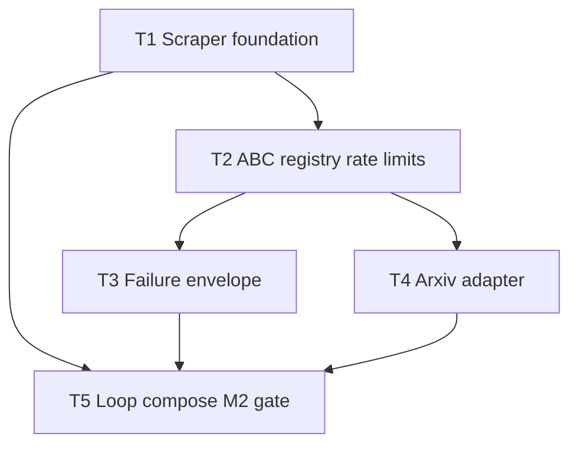

# M2 — Discovery Slice

**Plan name:** `m2-discovery`  
**Version:** 1.1  
**Status:** Complete  
**Charter slice:** `.dev/bishop_program_charter.md` L184–231  
**Normative spec:** `bishop_spec_0_6.md` v1.5.0 @ `0954ea8d4bc9b48b271a500d2b6a5004150365c2` (implementation handoff SHA; tracked)

---

## 0. Context map intake

| Field | Value |
|-------|-------|
| **Path consumed** | `.dev/plans/m2-discovery/context-map.md` |
| **Readiness verdict** | CONDITIONAL |
| **Scope-area labels flagged** | Flag 1 (enum/DTO sharing), Flag 2 (ArXiv wire protocol), Flag 3 (first-run since window), Flag 4 (no scraper tests yet), Flag 5 (stub deprecation), Flag 6 (handoff.md absent) |
| **Skill version + SHA** | pre-plan-exploration v0.2 · scout SHA `7e8be997a7697c09ce46d36dc9f31f497680c577` (= current `git rev-parse HEAD`) |

**G2 entry gate:** satisfied at scout SHA — `pytest tests/test_state_worker_contract.py tests/test_verify_g2.py` → 25 passed.

**Prior handoff:** `.dev/plans/m1-state-kernel/handoff.md` **absent**; consume embedded §8 + §8A in `.dev/plans/m1-state-kernel/plan.md` (landed contracts L601–607). Flag 6 is informational only.

**Architecture folder:** `.dev/architecture/bishop/` at M0-era SHA — **informational**; post-M2 update per charter §7.

**Binding-artifact resolvability:**

| Artifact | Status |
|----------|--------|
| `bishop_spec_0_6.md` | **Binding** — tracked |
| `.dev/plans/m2-discovery/context-map.md` | **Binding** — this plan's scout artifact |
| `.dev/plans/m1-state-kernel/plan.md` | **Binding** — tracked; §8A M2 entry gate |
| `.dev/plans/m1-state-kernel/handoff.md` | **Informational** — absent; plan §8 substitutes |

**Orch resolutions (context-map flags → frozen in this plan):**

| Flag | Resolution |
|------|------------|
| 1 | Add `bishop_shared/enums.py` with `SourceEnum` + `DomainEnum` string enums mirroring state-worker values exactly; scraper imports from `bishop_shared` only. State-worker **does not** refactor to import shared enums in M2 (no state-worker edits). Round-trip test asserts values match `tests/test_state_worker_enums.py` literals. |
| 2 | **Binding:** ArXiv `fetch_manifest` uses Atom export API `http://export.arxiv.org/api/query` with `cat:` filter for `cs.AI`, `cs.CL`, `cs.LG`. RSS deferred to M8 unless export API blocked. |
| 3 | **Binding:** `ARXIV_BACKFILL_WINDOW_DAYS` default `7` for M2 (smoke-friendly); env override allowed. Production 60-day value from §18.2 documented in T1 decision log as deferred constant — not M2 default. When `last_successful_run_at` is non-null, `since=last_run` (incremental). |
| 4 | Addressed by T1–T5 test files named in §2. |
| 5 | Delete `stub_main.py` usage; Dockerfile CMD → `python -m app.main`; remove or repurpose stub test in T5. |
| 6 | No blocker — G2 green at HEAD. |

---

## 1. Task statement

Implement the `scraper` service as the pipeline discovery stage: `SourceAdapter` ABC, `ADAPTER_REGISTRY` with ArXiv only, per-source rate limiting, failure envelope with §6.3/Appendix C classification, HTTP client to state-worker (`GET/POST /scraper-state/{source}`, `POST /manifest/batch`), and a scheduled scrape loop per §10.3. After M2, running the scraper produces ArXiv manifest rows at `processing_state = DISCOVERED`, updates `scraper_state.last_successful_run_at`, survives simulated HTTP 429 via retry, and skips duplicate `source_id` on re-run (state-worker idempotency).

**Non-goals:**
- HuggingFace, PapersWithCode, SemanticScholar, GitHub, OpenReview, LessWrong adapters
- `fetch_content` implementation (stub `NotImplementedError` on ABC default or explicit override)
- Domain routing §19.2–19.3; personal domain §3.2
- `pre-filter-worker`, `batch-poller`, `content-scraper`, enrichment, indexing, query-api, ui logic
- Changes to `state-worker` REST surface or schema
- Full §18 backfill chunking orchestration (M8)
- All items in §23 and §24 of `bishop_spec_0_6.md` are non-goals for this plan.

---

## 2. Shared contracts

### Types / interfaces

| Symbol | Owner | Typed surface | Test |
|--------|-------|---------------|------|
| `SourceEnum`, `DomainEnum` | T1 | `bishop_shared/enums.py` — `str, Enum`; members match state-worker `app/enums.py` §20 values | `tests/test_shared_enums.py::test_shared_enums_match_state_worker` |
| `ManifestIngestEntry` | T1 | `services/scraper/app/models.py` — Pydantic: `source_id, source, url, title, abstract?, published_at?, domain` | `tests/test_scraper_models.py::test_manifest_ingest_entry_round_trip` |
| `ManifestBatchResult` | T1 | `services/scraper/app/models.py` — `inserted: int, skipped: int` | `tests/test_scraper_client.py::test_post_manifest_batch_parses_response` |
| `ScraperStateSnapshot` | T1 | `services/scraper/app/models.py` — `source, last_successful_run_at?, updated_at` | `tests/test_scraper_client.py::test_get_scraper_state_parses_null_last_run` |
| `STATE_WORKER_BASE_URL` | T1 | `services/scraper/app/config.py` — from env `STATE_WORKER_URL`, default `http://state-worker:8000` | `tests/test_scraper_config.py::test_state_worker_url_default` |
| `ARXIV_CATEGORIES` | T1 | `services/scraper/app/config.py` — `tuple` default `("cs.AI", "cs.CL", "cs.LG")` | `tests/test_scraper_config.py::test_arxiv_categories_default` |
| `ARXIV_BACKFILL_WINDOW_DAYS` | T1 | `services/scraper/app/config.py` — `int`, default `7`, env `BISHOP_ARXIV_BACKFILL_WINDOW_DAYS` | `tests/test_scraper_config.py::test_arxiv_backfill_window_default` |
| `SCRAPER_SCHEDULE_INTERVAL_SEC` | T1 | `services/scraper/app/config.py` — default `21600` (6h per Appendix B) | `tests/test_scraper_config.py::test_schedule_interval_default` |
| `StateWorkerClient` | T1 | `services/scraper/app/state_worker_client.py` — async httpx methods | `tests/test_scraper_client.py` (mock transport) |
| `RateLimit` | T2 | `services/scraper/app/rate_limit.py` — dataclass per §15.1 | `tests/test_scraper_rate_limit.py::test_rate_limit_dataclass_fields` |
| `SOURCE_RATE_LIMITS` | T2 | `services/scraper/app/rate_limit.py` — dict keyed by `SourceEnum` value; **arxiv entry required**; other sources optional stubs for M8 | `tests/test_scraper_rate_limit.py::test_arxiv_rate_limit_matches_spec` |
| `TokenBucketRateLimiter` | T2 | `services/scraper/app/rate_limit.py` — enforces `calls/period_seconds` | `tests/test_scraper_rate_limit.py::test_token_bucket_throttles` |
| `SourceAdapter` | T2 | `services/scraper/app/adapters/base.py` — ABC per §10.1 | `tests/test_scraper_adapters.py::test_source_adapter_contract` |
| `ADAPTER_REGISTRY` | T2 | `services/scraper/app/adapters/registry.py` — `[ArxivAdapter]` only at M2 | `tests/test_scraper_adapters.py::test_registry_contains_only_arxiv` |
| `failure_envelope` | T3 | `services/scraper/app/failure_envelope.py` | `tests/test_scraper_failure_envelope.py` |
| Exception types | T3 | `services/scraper/app/exceptions.py` — `PermanentFailureError`, `EscalatableError`, `RetryExhaustedError` | `tests/test_scraper_failure_envelope.py` |
| `RETRIABLE_HTTP` | T3 | `frozenset({429, 500, 502, 503, 504})` per §6.3 | `tests/test_scraper_failure_envelope.py::test_429_retried` |
| `ESCALATABLE_HTTP` | T3 | `frozenset({401, 403, 404, 422})` | `tests/test_scraper_failure_envelope.py::test_403_escalatable` |
| `ArxivAdapter` | T4 | `services/scraper/app/adapters/arxiv.py` — `fetch_manifest(since)` via Atom API | `tests/test_scraper_arxiv_adapter.py` |
| `make_source_id` | T2/T4 | `f"{source.value}:{raw_id}"` on ABC | `tests/test_scraper_arxiv_adapter.py::test_make_source_id` |
| `scrape_cycle` | T5 | `services/scraper/app/loop.py` — §10.3 pseudocode | `tests/test_scraper_loop.py` |
| `run_scheduler` | T5 | `services/scraper/app/main.py` — asyncio periodic invoke of `scrape_cycle` | `tests/test_scraper_loop.py::test_scheduler_invokes_cycle` |

**`fetch_content` (M2 stub):** `SourceAdapter.fetch_content` raises `NotImplementedError` with message `"M4"` — default implementation on ABC; not user-configurable.

### Error envelope

**Adapter layer (scraper-internal):**

| Condition | Behavior |
|-----------|----------|
| Retriable HTTP / network | Retry inside `failure_envelope` up to `SOURCE_RATE_LIMITS[source].max_retries`; then `RetryExhaustedError` → log ERROR, skip adapter this cycle |
| HTTP 401, 403, 404, 422 | `EscalatableError` → log ERROR with `http_status`, skip adapter |
| HTTP 400, 410 | `PermanentFailureError` → `log_permanent_failure` (structured ERROR log), skip adapter |
| Success path | `POST /manifest/batch` → expect `200` + `ManifestBatchResult`; non-2xx → log ERROR, do not update scraper_state |

**State-worker wire (consumer — no changes):**

| Surface | Binding |
|---------|---------|
| `POST /manifest/batch` | `200` + `{"inserted": int, "skipped": int}` |
| `GET /scraper-state/{source}` | `200` + `ScraperStateSnapshot` JSON |
| `POST /scraper-state/{source}` | `204 No Content`; body `{"timestamp": "<ISO8601>"}` |

### Naming

| Category | Convention |
|----------|------------|
| Package root | `services/scraper/app/` |
| Adapters | `services/scraper/app/adapters/{base,registry,arxiv}.py` |
| Image tag | `bishop/scraper:m2` |
| Env vars | `STATE_WORKER_URL`, `BISHOP_ARXIV_BACKFILL_WINDOW_DAYS`, `BISHOP_SCRAPER_SCHEDULE_INTERVAL_SEC`, `LOG_LEVEL` |
| Atom API base | `ARXIV_EXPORT_API_URL = "http://export.arxiv.org/api/query"` (constant in `arxiv.py`) |

### Logging

- **Levels:** INFO — cycle start/end, batch inserted/skipped counts, scraper_state update; WARNING — empty manifest fetch; ERROR — envelope exhaustion, escalatable/permanent failures, state-worker HTTP errors
- **Structured fields:** `source`, `source_id` (when relevant), `http_status`, `attempt`, `inserted`, `skipped`, `event` (e.g. `scrape_cycle_complete`, `permanent_failure`)
- **Sink:** stdout; `/app/logs` volume mounted (compose unchanged)

### Tests

- **Framework:** pytest + `httpx` mock transport / `respx` if added to dev deps
- **Location:** `tests/test_scraper_*.py`, `tests/test_shared_enums.py`
- **M2 gate:** `scripts/verify-m2.sh` — G2 slice + scraper unit tests (no live ArXiv in CI)
- **Coverage:** every §2 row has named test; 429 simulation in `test_scraper_failure_envelope.py`; idempotency via loop test with mocked client returning `skipped > 0` on second batch

### CLI surface

| Command | Owner | Purpose |
|---------|-------|---------|
| `scripts/verify-m2.sh` | T5 | M2 exit gate |
| `pytest tests/test_scraper_*.py tests/test_shared_enums.py -v` | T5 | Primary automated M2 verification |
| `docker compose up scraper state-worker` | T5 | Runnable checkpoint (manual / optional compose smoke) |

### Wire / HTTP (binding route strings — scraper as client)

Frozen per M1 plan §2 (unchanged):

```
POST /manifest/batch
GET  /scraper-state/{source}
POST /scraper-state/{source}
```

**Manifest ingest entry wire (binding fields):** `source_id`, `source` (`"arxiv"`), `url`, `title`, `abstract` (optional), `published_at` (optional ISO8601), `domain` (`"professional"` for ArxivAdapter).

**ArXiv Atom API (binding for T4):** GET `http://export.arxiv.org/api/query` with query params `search_query=cat:{category} AND submittedDate:[YYYYMMDD000000 TO YYYYMMDD235959]` per category union; `max_results` capped (default 100 per cycle for M2 smoke — env `BISHOP_ARXIV_MAX_RESULTS`, default 100).

**Decision log paths (architectural):** `.dev/decision-logs/m2-discovery/T1-scraper-foundation.md`, `.dev/decision-logs/m2-discovery/T2-adapter-registry.md`, `.dev/decision-logs/m2-discovery/T4-arxiv-atom-api.md`

---

## 3. Dependency DAG



**Parallel groups:** `{T3, T4}` may run concurrently after T2 completes (disjoint files).

**Soft dependency:** T5 owns Dockerfile, compose image tag, `main.py` — merges last.

---

## 4. Subtask specs

### T1 — Scraper foundation

| Field | Content |
|-------|---------|
| **ID** | T1 |
| **Scope** | `bishop_shared/enums.py`, scraper package layout, config, wire DTOs, `StateWorkerClient` (httpx async), requirements.txt, Dockerfile skeleton (no loop yet). |
| **Files to touch** | `bishop_shared/enums.py`, `bishop_shared/__init__.py`, `services/scraper/app/{__init__.py,config.py,models.py,state_worker_client.py}`, `services/scraper/requirements.txt`, `services/scraper/Dockerfile`, `tests/test_shared_enums.py`, `tests/test_scraper_config.py`, `tests/test_scraper_models.py`, `tests/test_scraper_client.py`, `.dev/decision-logs/m2-discovery/T1-scraper-foundation.md` |
| **Contract bindings** | All §2 T1 rows |
| **Inputs** | None (G2 must pass before execution) |
| **Outputs** | Importable client + config; docker build succeeds; enums in bishop_shared |
| **Kill criteria** | Halt if context-map flag 1 unresolved at execution start; halt if `STATE_WORKER_URL` cannot be read from environment; halt if shared enum values diverge from state-worker literals |
| **Log tier** | architectural |
| **Risks & mitigations** | Cross-service enum drift — `test_shared_enums_match_state_worker` compares to hardcoded spec literals, not import from state-worker |

### T2 — ABC, registry, rate limits

| Field | Content |
|-------|---------|
| **ID** | T2 |
| **Scope** | `SourceAdapter` ABC with default `fetch_content` → `NotImplementedError("M4")`, `make_source_id`, `ADAPTER_REGISTRY` (Arxiv only), `RateLimit`, `SOURCE_RATE_LIMITS`, token-bucket limiter. |
| **Files to touch** | `services/scraper/app/adapters/{__init__.py,base.py,registry.py}`, `services/scraper/app/rate_limit.py`, `tests/test_scraper_adapters.py`, `tests/test_scraper_rate_limit.py`, `.dev/decision-logs/m2-discovery/T2-adapter-registry.md` |
| **Contract bindings** | ABC signatures, arxiv rate limit per §15.1 |
| **Inputs** | T1 |
| **Outputs** | Registry importable; arxiv `RateLimit(calls=3, period_seconds=1, backoff="exponential", max_retries=4, jitter=True)` |
| **Kill criteria** | Halt if registry contains more than one adapter class; halt if arxiv rate limit values differ from spec §15.1 / Appendix B |
| **Log tier** | architectural |
| **Risks & mitigations** | Spec §10.2 lists 7 adapters — M2 charter overrides to Arxiv-only; document in T2 decision log |

### T3 — Failure envelope

| Field | Content |
|-------|---------|
| **ID** | T3 |
| **Scope** | Exception types, `failure_envelope` async wrapper, `compute_backoff` per §15.2, `log_permanent_failure` helper, RETRIABLE/ESCALATABLE sets per §6.3. |
| **Files to touch** | `services/scraper/app/{exceptions.py,failure_envelope.py}`, `tests/test_scraper_failure_envelope.py` |
| **Contract bindings** | Error envelope adapter layer, RETRIABLE_HTTP |
| **Inputs** | T2 |
| **Outputs** | Callable envelope used by loop |
| **Kill criteria** | Halt if simulated 429 does not retry without raising to caller before max_retries; halt if 400 raises `PermanentFailureError` immediately (no retry) |
| **Log tier** | standard |
| **Risks & mitigations** | httpx exception mapping — map `httpx.HTTPStatusError` explicitly |

### T4 — Arxiv adapter

| Field | Content |
|-------|---------|
| **ID** | T4 |
| **Scope** | `ArxivAdapter.fetch_manifest`: Atom export API, category filter, `since` / backfill window resolution, map entries to `ManifestIngestEntry` with `domain=professional`. |
| **Files to touch** | `services/scraper/app/adapters/arxiv.py`, `tests/test_scraper_arxiv_adapter.py`, `.dev/decision-logs/m2-discovery/T4-arxiv-atom-api.md` |
| **Contract bindings** | ArXiv Atom API wire, `make_source_id`, categories, backfill window |
| **Inputs** | T2 |
| **Outputs** | Adapter returning manifest DTOs from fixture Atom XML in tests |
| **Kill criteria** | Halt if context-map flag 2 unresolved at execution start (must use Atom export API per §0 resolution); halt if emitted `source_id` does not start with `arxiv:` |
| **Log tier** | architectural |
| **Risks & mitigations** | Live API flakiness — tests use recorded Atom XML fixtures only; optional `pytest -m integration` for live smoke deferred |

### T5 — Loop, compose, M2 gate

| Field | Content |
|-------|---------|
| **ID** | T5 |
| **Scope** | `scrape_cycle` + asyncio scheduler in `main.py`, wire loop to client/envelope/registry, update compose image `bishop/scraper:m2`, delete stub CMD path, `scripts/verify-m2.sh`, loop/idempotency/429 integration tests, update `test_compose.py` image tag matrix. |
| **Files to touch** | `services/scraper/app/{loop.py,main.py}`, `services/scraper/Dockerfile`, `docker-compose.yml`, `scripts/verify-m2.sh`, `tests/test_scraper_loop.py`, `tests/test_verify_m2.py`, `tests/test_compose.py`, `tests/test_service_stubs.py` (scraper stub test update), `pyproject.toml` (dev deps if needed) |
| **Contract bindings** | All §2, CLI surface, image tag |
| **Inputs** | T1, T3, T4 |
| **Outputs** | Runnable scraper container; passing `verify-m2.sh` |
| **Kill criteria** | Halt if context-map flag 3 unresolved at execution start; halt if re-run cycle test does not show `skipped >= 1` on duplicate `source_id`; halt if 429 test crashes process (unhandled exception); halt if compose test fails on image tag |
| **Log tier** | standard |
| **Risks & mitigations** | Flag 5 — ensure `stub_main.py` removed from Dockerfile CMD; keep file deleted or redirect test |

---

## 5. Adversarial pass

**Lens:** packet-only executor.

### 5.1 Rejected decompositions

**Alternative — Merge T3+T4 (envelope inside ArxivAdapter):** Rejected because failure envelope is shared by M8 adapters; keeping T3 separate prevents re-plan when second adapter lands.

**Alternative — Put enums in scraper only (no bishop_shared):** Rejected because M4 `content-scraper` will also need `SourceEnum` strings; bishop_shared extension pays forward.

**Alternative — Live ArXiv integration as G2-style gate in CI:** Rejected — network flakiness; M2 gate uses fixtures + optional manual compose smoke.

### 5.2 Load-bearing assumptions

```
(G2 state-worker contract tests pass at execution start | contract surface: scripts/verify-g2.sh / tests/test_state_worker_contract.py | M2 scraper cannot persist DISCOVERED rows if manifest/scraper-state endpoints regress | T1,T5)

(ArXiv Atom export API remains available at export.arxiv.org with documented query syntax | contract surface: §2 ARXIV_EXPORT_API_URL + T4 decision log | T4 cannot complete fetch_manifest; exit gate fails | T4,T5)

(Scraper must not import services/state-worker/app — separate container PYTHONPATH | contract surface: services/scraper/Dockerfile COPY list | import side effects or broken image if violated | T1,T2,T4)

(M2 ADAPTER_REGISTRY contains exactly ArxivAdapter — not spec §10.2 full list | contract surface: services/scraper/app/adapters/registry.py | parallel M8 work adds adapters via amendment not silent scope creep | T2,T5)

(First-run since uses ARXIV_BACKFILL_WINDOW_DAYS default 7 not 60 | contract surface: services/scraper/app/config.py:BISHOP_ARXIV_BACKFILL_WINDOW_DAYS | integration test timeout or manifest flood | T4,T5)
```

### 5.3 Highest re-plan risk

**T4 — Arxiv adapter.** Atom feed parsing edge cases (namespace prefixes, missing abstract, id URL formats) and date-range query construction are underspecified in spec prose. Surprise malformed entries could break batch POST validation.

### 5.4 Hidden couplings

**C1** · confirmed
```
(Manifest batch domain field must be DomainEnum string value "professional" | contract surface: services/state-worker/app/models/http.py:ManifestBatchEntryWire.domain + transitions.py:DomainEnum(wire.domain) | ValidationError 422 on batch POST if scraper sends wrong domain string | T1,T4,T5)
```

**C2** · confirmed
```
(Docker image tag test matrix m0 vs m1 vs m2 | contract surface: tests/test_compose.py::test_image_tags_use_milestone_convention | compose CI fails if only scraper tag updated without test logic | T5)
```

**C3** · confirmed
```
(source_id idempotency relies on state-worker skip not scraper dedup | contract surface: POST /manifest/batch + transitions.ingest_manifest_batch | scraper re-posts duplicates if it pre-filters differently than state-worker | T5)
```

**C4** · suspected
```
(Rate limiter must wrap HTTP inside adapter not outside failure_envelope | contract surface: §15.3 separate concerns | 429 storms if limiter omitted inside fetch | T3,T4)
```
Disproven by: T4 test asserting limiter acquire called before httpx request.

**C5** · suspected
```
(pyproject dev deps may lack httpx/respx for tests | contract surface: pyproject.toml [project.optional-dependencies] dev | T1/T3 tests fail on import | T1,T3,T5)
```
Disproven by: T5 adds `httpx`, `respx` (or `pytest-httpx`) to dev optional-deps.

---

## 6. Executor packets

| Packet | Path |
|--------|------|
| T1 | `.dev/plans/m2-discovery/packets/T1.md` |
| T2 | `.dev/plans/m2-discovery/packets/T2.md` |
| T3 | `.dev/plans/m2-discovery/packets/T3.md` |
| T4 | `.dev/plans/m2-discovery/packets/T4.md` |
| T5 | `.dev/plans/m2-discovery/packets/T5.md` |

---

## 7. Amendment subtasks

None — initial plan v1.0.

---

## 8. Auditor handoff

**Handoff artifact:** `.dev/plans/m2-discovery/handoff.md` (full §8.1–§8.6 — canonical for auditor)  
**Implementation SHA:** `0954ea8d4bc9b48b271a500d2b6a5004150365c2`  
**Verification:** `scripts/verify-m2.sh` slice → **78 passed**, exit 0 (recorded 2026-06-12, win32/py3.12)  
**Full suite:** 197 passed, 1 failed — inherited M1 escalations `error_log` length test (not M2 scope; see handoff §8.1)

### §8.1 Completion snapshot

See `handoff.md` §8.1 for commit chain `febf62c`…`0954ea8`, environment, and deferred live Docker gate.

### §8.2 Artifact chain

Plan directory was **untracked at `0954ea8`**; commit plan + handoff before audit if `git show HEAD:<path>` resolvability is required. All implementation paths resolve at `0954ea8`.

### §8.3 §2 evidence

All §2 rows landed — evidence table in `handoff.md` §8.3.

### §8.4 §5 disposition

All §5.2 / §5.4 items **closed** or **treat-as-prediction** (live ArXiv API, context-map staleness). Inherited M1 escalations test failure **open** for program hygiene, not M2 blocking.

### §8.5 Cold-read seeds

`loop.py`, `adapters/arxiv.py`, `failure_envelope.py`, `state_worker_client.py`, `bishop_shared/enums.py`, `tests/test_scraper_loop.py` — see handoff §8.5.

### §8.6 Audit remediation

Absent — no §7 amendments.

### Landed contracts summary (M3 pre-plan seed)

See `handoff.md` landed contracts block.

---

## Decision log (orch resolutions — confirmed 2026-06-12)

| Decision | Chosen default | Rationale | Tradeoff | Status |
|----------|----------------|-----------|----------|--------|
| Enum sharing | `bishop_shared/enums.py` | M1 kept enums in state-worker; scraper cannot import across service boundary | Duplicate enum definitions until optional refactor | **Landed T1** |
| ArXiv protocol | Atom export API | Stable query-by-date; RSS per-category is secondary in §3.1 | RSS path deferred to M8 | **Landed T4** |
| First-run window | 7 days default | M2 smoke/CI friendly; §18.2 60-day documented as production override | Fewer papers on first docker run | **Landed T1/T4** |
| Scheduler | `asyncio` sleep loop | Single adapter; avoids APScheduler dependency | Less cron flexibility until M8 | **Landed T5** |
| `fetch_content` | `NotImplementedError("M4")` on ABC default | Charter non-goal | M4 must override | **Landed T2** |
