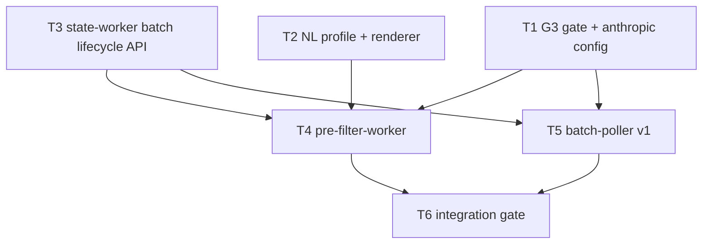

# M3 — Pre-filter Slice

**Plan name:** `m3-prefilter`  
**Version:** 1.0  
**Status:** Complete (planning)  
**Charter slice:** `.dev/bishop_program_charter.md` L235–282  
**Normative spec:** `bishop_spec_0_6.md` v1.5.0 @ `6d36e7355044a76158dea1bf5f641f780c490c60` (tracked)

---

## 0. Context map intake

| Field | Value |
|-------|-------|
| **Path consumed** | `.dev/plans/m3-prefilter/context-map.md` |
| **Readiness verdict** | CONDITIONAL |
| **Scope-area labels flagged** | Flag 1 (batch registration API), Flag 2 (pre-filter timeout state), Flag 3 (source_ids on restart), Flag 4 (profile volume overlay), Flag 6 (hash algorithm), Flag 7 (active profile pointer) |
| **Skill version + SHA** | pre-plan-exploration v0.3 · scout SHA `6d36e7355044a76158dea1bf5f641f780c490c60` |

**G2 entry gate:** satisfied at scout SHA — `pytest tests/test_state_worker_contract.py tests/test_verify_g2.py` → 25 passed.

**Prior handoff:** `.dev/plans/m2-discovery/handoff.md` (implementation SHA `0954ea8`; scout at `6d36e73` includes M2 plan artifacts).

**Architecture folder:** `.dev/architecture/bishop/` — informational; post-M3 refresh per charter §7.

**Binding-artifact resolvability:**

| Artifact | Status |
|----------|--------|
| `bishop_spec_0_6.md` | **Binding** — tracked |
| `.dev/plans/m3-prefilter/context-map.md` | **Binding** — this plan's scout artifact |
| `.dev/plans/m2-discovery/handoff.md` | **Binding** — tracked (M3 entry gate) |
| `.dev/bishop_program_charter.md` | **Binding** — tracked |

**Orch resolutions (context-map flags → frozen in this plan):**

| Flag | Resolution |
|------|------------|
| 1 | Add state-worker **`POST /batches`** (batch registration at Anthropic submit time) and **`PATCH /batches/{batch_id}`** (status lifecycle updates). Owned by **T3**. Derived wire per M1 T1 decision-log pattern. |
| 2 | Pre-filter **batch timeout** (48h): `BatchRecord.status → batch_timed_out`; manifest entries in `RELEVANCE_QUEUED` whose `source_id` is in the batch's stored `source_ids` → **`DISCOVERED`** (retry-eligible; no `RELEVANCE_FAILED` in §6.1). Owned by **T3** (`apply_batch_timeout`) + **T5** caller. |
| 3 | `POST /batches` body includes **`source_ids: list[str]`**; persisted as JSON text column `source_ids` on `batches` table (Alembic `m3_001`). `GET /batches/{batch_id}` returns `source_ids` in wire `BatchRecord` extension. |
| 4 | Authoritative repo path **`config/profiles/professional_v1.0.0.yaml`**; Dockerfiles **COPY** into `/app/config/profiles/`. **`scripts/seed-profiles.sh`** / **`seed-profiles.ps1`** copy repo profiles into `${BISHOP_DATA_ROOT}/profiles` when host dir empty (volume overlay safe). |
| 6 | **Hash algorithm (binding):** `sha256(json.dumps(yaml_loaded_dict, sort_keys=True, ensure_ascii=True).encode("utf-8"))` per §11.3. **LLM system prompt** is a separate `render_profile_prompt()` output — not hashed. `canonical_hash` in YAML must match `compute_profile_hash()`. |
| 7 | **M3 profile selection:** `DomainEnum.PROFESSIONAL` → `professional_v1.0.0.yaml` hardcoded in `bishop_shared/profile_renderer.py::resolve_profile_path(domain)`. No pointer file in M3. |

---

## 1. Task statement

**(a) Active milestone ID:** M3 — Pre-filter Slice

**(b) Charter version:** `.dev/bishop_program_charter.md` v0.1.0

**(c) Charter non-goals (verbatim):** Enrichment batch types in batch-poller deferred to M5. `batch-poller` startup scan for enrichment batches deferred to M5. Content scraping, enrichment, vector indexing. All §23 deferrals.

Implement the NL profile system (v1.0.0), profile renderer, `pre-filter-worker`, and `batch-poller` v1 (pre-filter batch types only). Entries move from `DISCOVERED` through `RELEVANCE_QUEUED` to `RELEVANCE_PASSED` or `RELEVANCE_REJECTED`. The Anthropic model string `claude-haiku-4-5-20251001` is verified (G3) before any LLM call. `BatchRecord` rows are created at batch submission with `batch_type = pre_filter` and `profile_render_hash` populated. `batch-poller` performs startup scan, polls Anthropic, posts to `POST /manifest/pre-filter-results`, and enforces 48-hour timeout.

**Non-goals:**
- Enrichment batch types in batch-poller deferred to M5.
- `batch-poller` startup scan for enrichment batches deferred to M5.
- Content scraping, enrichment, vector indexing.
- Personal domain NL profile (§3.2).
- Changes to scraper, content-scraper, enrichment-batcher, vector-writer, query-api, ui.
- All items in §23 and §24 of `bishop_spec_0_6.md` are non-goals for this plan.

---

## 2. Shared contracts

### Types / interfaces

| Symbol | Owner | Typed surface | Test |
|--------|-------|---------------|------|
| `ANTHROPIC_MODEL_PREFILTER` | T1 | `bishop_shared/anthropic_config.py` — literal `"claude-haiku-4-5-20251001"` | `tests/test_anthropic_config.py::test_prefilter_model_string_pinned` |
| `ANTHROPIC_API_KEY` | T1 | read from env in services; no default | `tests/test_anthropic_config.py::test_api_key_from_env` |
| `verify_model_string()` | T1 | `bishop_shared/anthropic_config.py` — one Messages API call; returns bool | `tests/test_verify_g3.py` (mocked); live gated on env |
| `compute_profile_hash()` | T2 | `bishop_shared/profile_renderer.py` — §11.3 JSON canonical SHA-256 | `tests/test_profile_renderer.py::test_hash_matches_canonical_in_yaml` |
| `render_profile_prompt()` | T2 | `bishop_shared/profile_renderer.py` — deterministic system prompt string | `tests/test_profile_renderer.py::test_prompt_deterministic` |
| `load_profile()` | T2 | loads YAML → `ProfileDocument` pydantic model | `tests/test_profile_renderer.py::test_load_professional_profile` |
| `resolve_profile_path(domain)` | T2 | `DomainEnum` → `/app/config/profiles/professional_v1.0.0.yaml` | `tests/test_profile_renderer.py::test_resolve_profile_path_professional` |
| `ProfileDocument` | T2 | pydantic: `version`, `domain`, `canonical_hash`, `context`, `principles`, `anchors`, `exclusions`, `output` | round-trip test |
| `BatchRegisterRequest` | T3 | `services/state-worker/app/models/http.py` — `batch_id`, `batch_type`, `domain`, `profile_version`, `profile_render_hash`, `source_ids`, `external_batch_id`, `entry_count` | `tests/test_state_worker_batches_register.py` |
| `BatchRegisterResponse` | T3 | `{batch_id, status}` | same |
| `BatchPatchRequest` | T3 | `status`, `passed_count?`, `failed_count?`, `completed_at?`, `external_batch_id?` | same |
| `BatchRecord.source_ids` | T3 | domain model + DB column JSON list | model round-trip |
| `PREFILTER_BATCH_SIZE` | T4 | `services/pre-filter-worker/app/config.py` — default `50`, env `BISHOP_PREFILTER_BATCH_SIZE` | `tests/test_prefilter_config.py` |
| `PREFILTER_POLL_INTERVAL_SEC` | T4 | default `60` | config test |
| `StateWorkerClient` (pre-filter) | T4 | poll manifest + post batches | `tests/test_prefilter_client.py` |
| `AnthropicBatchClient` | T4 | submit pre-filter batch; `custom_id=source_id` | `tests/test_prefilter_anthropic_client.py` |
| `prefilter_cycle()` | T4 | poll → hash verify → anthropic submit → POST /batches | `tests/test_prefilter_loop.py` |
| `BATCH_POLL_INTERVAL_SEC` | T5 | `services/batch-poller/app/config.py` — default `120` | config test |
| `BATCH_TIMEOUT_HOURS` | T5 | default `48` | config test |
| `startup_scan()` | T5 | `GET /batches?status=submitted,processing` | `tests/test_batch_poller_startup.py` |
| `poll_loop()` | T5 | Anthropic poll → parse JSON decision → POST pre-filter-results → PATCH batch complete | `tests/test_batch_poller_loop.py` |

**Decision log paths (architectural):**
- T2: `.dev/decision-logs/m3-prefilter/T2-profile-renderer.md`
- T3: `.dev/decision-logs/m3-prefilter/T3-batch-lifecycle-api.md`

### Error envelope

**Pre-filter-worker:**

| Condition | Behavior |
|-----------|----------|
| `canonical_hash` mismatch at batch time | Abort batch; log ERROR + structured `event=profile_hash_mismatch`; emit alert; do not call Anthropic |
| Anthropic submit HTTP 400 | Log ERROR `event=model_string_fatal`; do not register batch |
| State-worker non-2xx on poll/register | Log ERROR; skip cycle |
| Empty poll | INFO; sleep interval |

**Batch-poller:**

| Condition | Behavior |
|-----------|----------|
| Anthropic batch `failed` | PATCH batch `failed`; log ERROR |
| 48h elapsed since `submitted_at` | call `POST /batches/{batch_id}/timeout` (T3) → `batch_timed_out` + entries → `DISCOVERED` |
| Malformed JSON in result | Count as entry failure; include in `failed_count`; decision 0 with rationale |
| `POST /manifest/pre-filter-results` non-2xx | Retry next cycle; do not PATCH complete |

**State-worker wire (T3 additions):**

| Surface | Binding |
|---------|---------|
| `POST /batches` | `201` + `{"batch_id": str, "status": "submitted"}` |
| `PATCH /batches/{batch_id}` | `200` + `BatchDetailResponse` |
| `POST /batches/{batch_id}/timeout` | `200` + `{"batch_id", "status": "batch_timed_out", "entries_reset": int}` |
| `POST /manifest/pre-filter-results` | unchanged M1: `200` + `{updated, passed, rejected}` |
| `GET /manifest/poll?state=DISCOVERED` | unchanged M1 |

### Naming

| Category | Convention |
|----------|------------|
| Plan slug | `m3-prefilter` |
| Image tags | `bishop/pre-filter-worker:m3`, `bishop/batch-poller:m3` |
| Package roots | `services/pre-filter-worker/app/`, `services/batch-poller/app/` |
| Shared profile module | `bishop_shared/profile_renderer.py` |
| Repo profile | `config/profiles/professional_v1.0.0.yaml` |
| Env vars | `STATE_WORKER_URL`, `ANTHROPIC_API_KEY`, `BISHOP_PREFILTER_BATCH_SIZE`, `BISHOP_PREFILTER_POLL_INTERVAL_SEC`, `BISHOP_BATCH_POLL_INTERVAL_SEC`, `BISHOP_BATCH_TIMEOUT_HOURS`, `LOG_LEVEL` |

### Logging

- **Levels:** INFO — cycle start/end, batch registered, poll counts; WARNING — hash mismatch, empty results; ERROR — API failures, timeout
- **Structured fields:** `batch_id`, `external_batch_id`, `source_id`, `event`, `passed`, `rejected`, `entries_reset`
- **Sink:** stdout; `/app/logs` volume

### Tests

- **Framework:** pytest + httpx mock / respx; Anthropic SDK mocked in unit tests
- **Location:** `tests/test_profile_renderer.py`, `tests/test_prefilter_*.py`, `tests/test_batch_poller_*.py`, `tests/test_state_worker_batches_register.py`, `tests/test_verify_g3.py`, `tests/test_verify_m3.py`
- **M3 gate:** `scripts/verify-m3.sh` — G2 slice + G3 (mocked if no key) + M3 unit tests
- **Live G3:** `scripts/verify-g3.sh` — requires `ANTHROPIC_API_KEY`; blocks T4/T5 manual/live runs
- **Coverage:** every §2 row has named test; 20-entry sample via fixture loop test; startup scan restart via mocked GET /batches

### CLI surface

| Command | Owner | Purpose |
|---------|-------|---------|
| `scripts/verify-g3.sh` | T1 | G3 model string gate |
| `scripts/verify-m3.sh` | T6 | M3 exit gate |
| `pytest tests/test_verify_m3.py -v` | T6 | CI parity |
| `scripts/seed-profiles.sh` | T2 | Seed host profiles volume |

### Wire / HTTP (frozen route strings)

```
GET  /manifest/poll?state=DISCOVERED&limit=50
POST /batches
PATCH /batches/{batch_id}
POST /batches/{batch_id}/timeout
GET  /batches?status=submitted,processing
GET  /batches/{batch_id}
POST /manifest/pre-filter-results
```

Anthropic Batch API: model `claude-haiku-4-5-20251001`; `custom_id` = manifest `source_id`; system = `render_profile_prompt()`; user = `title + "\n" + abstract`.

---

## 3. Dependency DAG



**Parallel groups:** `{T1, T2, T3}` may run concurrently. `{T4, T5}` may run concurrently after `{T1, T2, T3}` complete (T5 does not require T2).

**Soft dependency:** T5 integration tests are simpler if T4's Anthropic client mocks exist — share fixture module in T6, not a hard DAG edge.

---

## 4. Subtask specs

### T1

| Field | Content |
|--------|---------|
| **ID** | T1 |
| **Scope** | Implement G3 model-string verification gate and frozen Anthropic constants before any pipeline LLM work. |
| **Files to touch** | `bishop_shared/anthropic_config.py`, `scripts/verify-g3.sh`, `scripts/verify-g3.ps1`, `tests/test_anthropic_config.py`, `tests/test_verify_g3.py`, `pyproject.toml` (dev dep `anthropic` if not in service reqs yet) |
| **Contract bindings** | All §2 anthropic rows |
| **Inputs** | none |
| **Outputs** | G3 gate script; `verify_model_string()`; config constants |
| **Kill criteria** | Halt if live G3 call returns HTTP 400 when `ANTHROPIC_API_KEY` is set (model string invalid — charter blocks all M3 LLM work). Halt if `ANTHROPIC_MODEL_PREFILTER` ≠ `claude-haiku-4-5-20251001`. |
| **Log tier** | standard |
| **Risks & mitigations** | Live API cost negligible; gate skipped in CI without key — document in verify-g3.sh exit 0 with `SKIP` message when key absent. |

### T2

| Field | Content |
|--------|---------|
| **ID** | T2 |
| **Scope** | Author `professional_v1.0.0.yaml` per §11.2, compute and commit `canonical_hash`, implement profile renderer (hash + prompt), seed scripts. |
| **Files to touch** | `config/profiles/professional_v1.0.0.yaml`, `bishop_shared/profile_renderer.py`, `scripts/seed-profiles.sh`, `scripts/seed-profiles.ps1`, `tests/test_profile_renderer.py`, `.dev/decision-logs/m3-prefilter/T2-profile-renderer.md` |
| **Contract bindings** | Profile types, hash algorithm, resolve_profile_path |
| **Inputs** | none |
| **Outputs** | Committed profile with real `canonical_hash`; renderer module; seed scripts |
| **Kill criteria** | Halt if `canonical_hash` remains `placeholder_compute_on_first_render`. Halt if context-map Flag 6 unresolved: hash must use JSON canonical dict per §11.3, not raw YAML bytes. |
| **Log tier** | architectural |
| **Risks & mitigations** | Prompt template choices affect LLM quality — document in decision log; quality gate G6 is M8 not M3. |

### T3

| Field | Content |
|--------|---------|
| **ID** | T3 |
| **Scope** | Extend state-worker with batch registration, status PATCH, and timeout endpoint; Alembic migration for `source_ids`; contract tests. |
| **Files to touch** | `alembic/versions/m3_001_batch_source_ids.py`, `services/state-worker/app/models/domain.py`, `services/state-worker/app/models/http.py`, `services/state-worker/app/transitions.py`, `services/state-worker/app/routers/batches.py`, `tests/test_state_worker_batches_register.py`, `tests/test_state_worker_contract.py` (extend route list), `.dev/decision-logs/m3-prefilter/T3-batch-lifecycle-api.md` |
| **Contract bindings** | BatchRegisterRequest, BatchPatchRequest, timeout wire, source_ids column |
| **Inputs** | none (parallel with T1/T2) |
| **Outputs** | Three new routes; migration; transition helpers |
| **Kill criteria** | Halt if hub-drift: any worker writes SQLite directly. Halt if `POST /batches` idempotency on same `batch_id` not defined (return 409). Halt if timeout transitions to a state not in `ProcessingState` enum. |
| **Log tier** | architectural |
| **Risks & mitigations** | state-worker REST extension — document in decision log; M5 reuses same POST/PATCH for enrichment types. |

### T4

| Field | Content |
|--------|---------|
| **ID** | T4 |
| **Scope** | Implement `pre-filter-worker`: poll DISCOVERED entries, assemble batch, verify profile hash, submit Anthropic Batch API, register batch via state-worker. |
| **Files to touch** | `services/pre-filter-worker/app/` (main, config, loop, clients, models), `services/pre-filter-worker/Dockerfile`, `services/pre-filter-worker/requirements.txt`, `tests/test_prefilter_*.py` |
| **Contract bindings** | All pre-filter-worker §2 rows; wire poll + POST /batches |
| **Inputs** | T1, T2, T3 |
| **Outputs** | Runnable pre-filter-worker; Dockerfile CMD `python -m app.main` |
| **Kill criteria** | Halt if G3 not verified before first live Anthropic call (check `verify_model_string` or env `BISHOP_G3_VERIFIED=1` in dev only). Halt if hash verification skipped. Halt if `custom_id` ≠ `source_id` in batch payload. |
| **Log tier** | standard |
| **Risks & mitigations** | Anthropic Batch API shape drift — mock tests from official SDK types; pin SDK version in requirements.txt. |

### T5

| Field | Content |
|--------|---------|
| **ID** | T5 |
| **Scope** | Implement `batch-poller` v1: startup scan, Anthropic polling for `pre_filter` batches only, parse decisions, POST pre-filter-results, PATCH batch status, 48h timeout. |
| **Files to touch** | `services/batch-poller/app/` (main, config, startup, loop, clients), `services/batch-poller/Dockerfile`, `services/batch-poller/requirements.txt`, `tests/test_batch_poller_*.py` |
| **Contract bindings** | Poller §2 rows; enrichment batch types explicitly rejected in code guard |
| **Inputs** | T1, T3 |
| **Outputs** | Runnable batch-poller v1 |
| **Kill criteria** | Halt if poller processes `batch_type != pre_filter` (M5 scope). Halt if startup scan not invoked before main poll loop. Halt if timeout does not call `POST /batches/{batch_id}/timeout`. |
| **Log tier** | standard |
| **Risks & mitigations** | Restart recovery depends on T3 `source_ids` — integration test in T6. |

### T6

| Field | Content |
|--------|---------|
| **ID** | T6 |
| **Scope** | Integration gate: compose image tags `:m3`, stub removal tests, `verify-m3.sh`, 20-entry mocked e2e, startup-scan restart test, update `tests/test_compose.py` and `tests/test_service_stubs.py`. |
| **Files to touch** | `docker-compose.yml`, `scripts/verify-m3.sh`, `tests/test_verify_m3.py`, `tests/test_compose.py`, `tests/test_service_stubs.py`, `tests/test_m3_integration.py`, `CHANGELOG.MD` |
| **Contract bindings** | CLI surface, image tags, full §2 integration |
| **Inputs** | T4, T5 |
| **Outputs** | M3 exit gate script; integration tests |
| **Kill criteria** | Halt if `verify-m3.sh` G2 slice fails. Halt if integration test cannot demonstrate both `RELEVANCE_PASSED` and `RELEVANCE_REJECTED` in same batch. Halt if startup scan test does not register a pre-seeded in-flight batch. |
| **Log tier** | standard |
| **Risks & mitigations** | Live docker e2e optional manual; CI uses mocks per M2 pattern. |

---

## 5. Adversarial pass

### 5.1 Rejected decompositions

**Rejected: merge T4+T5 into single "Anthropic pipeline" subtask.** Charter names two services with distinct compose containers and restart semantics (S3 startup scan is batch-poller-only). A merged subtask would produce one Dockerfile or ambiguous ownership of batch registration vs polling.

**Rejected: defer T3 state-worker batch API to M5.** Without `POST /batches`, pre-filter-worker cannot persist `BatchRecord` without violating single-writer principle. M1 only landed GET batch routes; §5.7 creation-at-submission is unreachable.

**Rejected: 7 subtasks by splitting T2 into YAML authoring vs renderer.** YAML without renderer cannot compute `canonical_hash` with the same code path as batch time (§22 L1471); keeping one subtask avoids hash drift.

### 5.2 Load-bearing assumptions

```
(M1 apply_pre_filter_results accepts entries in RELEVANCE_QUEUED | contract surface: transitions.py:apply_pre_filter_results + §5.2 step 8 | batch results no-op or 409 if entries swept back to DISCOVERED before results arrive | T5)
```

```
(Anthropic Batch API accepts custom_id per request matching source_id | contract surface: T4 AnthropicBatchClient custom_id field | poller cannot map results to manifest rows | T4,T5)
```

```
(G3 model string claude-haiku-4-5-20251001 remains valid at execution time | contract surface: bishop_shared/anthropic_config.py:ANTHROPIC_MODEL_PREFILTER | 100% pre-filter failure on HTTP 400 | T1,T4,T5)
```

```
(batches.source_ids migration applied before workers start | contract surface: alembic m3_001 + BatchRecord.source_ids | timeout and restart recovery cannot target entries | T3,T5)
```

```
(Profile hash uses JSON canonical dict not prompt text | contract surface: §2 compute_profile_hash + YAML canonical_hash | spurious hash mismatch aborts every batch | T2,T4)
```

### 5.3 Highest re-plan risk

**T3** — state-worker batch lifecycle API is the largest spec gap closure. Wrong `POST /batches` shape forces T4/T5 client rewrites and contract test churn. Timeout entry transition (`RELEVANCE_QUEUED → DISCOVERED`) is inferred from enum absence, not explicit spec prose — auditor may challenge.

### 5.4 Hidden couplings

**C1** · confirmed
```
(compose profiles volume shadows image COPY | contract surface: docker-compose.yml pre-filter-worker volumes + config/profiles/ path | empty host profiles dir → profile file not found at runtime | T2,T4,T6)
```

**C2** · confirmed
```
(batch_id UUID generated by pre-filter-worker must match pre-filter-results POST and BatchRecord row | contract surface: POST /batches batch_id + POST /manifest/pre-filter-results batch_id | manifest provenance orphan if IDs diverge | T4,T5)
```

**C3** · confirmed
```
(image tag matrix m0→m3 for two services | contract surface: docker-compose.yml + tests/test_compose.py | CI compose tests fail if only one service bumped | T6)
```

**C4** · suspected
```
(batch-poller sqlite volume mount tempts direct DB read | contract surface: docker-compose.yml batch-poller volumes sqlite | single-writer violation if implemented | T5)
```
Disproven by: code review — poller uses HTTP only.

**C5** · confirmed
```
(lock-state sweep RELEVANCE_QUEUED→DISCOVERED may race in-flight Anthropic batch | contract surface: transitions.py sweep + §6.2 G4 caveat | duplicate Anthropic submission accepted risk per spec | T4,T5)
```

---

## 6. Executor packets

Packets emitted to `.dev/plans/m3-prefilter/packets/`:

| Packet | Path |
|--------|------|
| T1 | `.dev/plans/m3-prefilter/packets/T1.md` |
| T2 | `.dev/plans/m3-prefilter/packets/T2.md` |
| T3 | `.dev/plans/m3-prefilter/packets/T3.md` |
| T4 | `.dev/plans/m3-prefilter/packets/T4.md` |
| T5 | `.dev/plans/m3-prefilter/packets/T5.md` |
| T6 | `.dev/plans/m3-prefilter/packets/T6.md` |

---

## 7. Amendment subtasks

None at plan v1.0.

---

## 8. Auditor handoff

**Deferred** until execution completes and tree is clean. §8.1 requires verification on clean checkout at landed SHA — not emitted at planning time.

**Planned §8.2 artifact chain (post-execution):** this plan, context-map, packets T1–T6, decision logs T2/T3, `bishop_spec_0_6.md`, `CHANGELOG.MD`, `scripts/verify-m3.sh`, `scripts/verify-g3.sh`.

**Planned verification command:** `scripts/verify-m3.sh` / `pytest tests/test_verify_m3.py tests/test_profile_renderer.py tests/test_prefilter_*.py tests/test_batch_poller_*.py tests/test_state_worker_batches_register.py -v`

---

*Plan v1.0 — 2026-06-12 — charter-governed M3 pre-filter slice*
