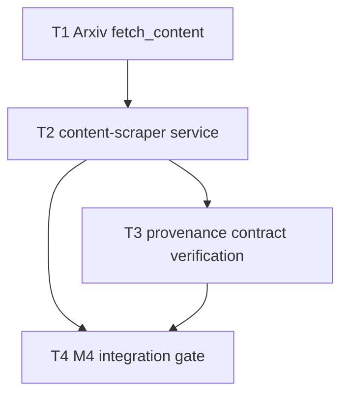

# M4 — Content Slice

**Plan name:** `m4-content`  
**Version:** 1.0  
**Status:** Complete — ready for executor dispatch  
**Charter slice:** `.dev/bishop_program_charter.md` L286–328  
**Normative spec:** `bishop_spec_0_6.md` v1.5.0 @ `a07278743c2ed679bbb935e243fb442ac2ad9083` (tracked)  
**merge-candidate:** advisory — 4 subtasks at budget floor; charter stub expects 4

---

## 0. Context map intake

| Field | Value |
|-------|-------|
| **Path consumed** | `.dev/plans/m4-content/context-map.md` |
| **Readiness verdict** | CONDITIONAL |
| **Scope-area labels flagged** | Flag 1 (ArXiv full-content strategy), Flag 2 (adapter vendoring layout), Flag 3 (missing content-scraper tests), Flag 4 (poll DTO vs ingest DTO) |
| **Skill version + SHA** | pre-plan-exploration v0.3 · scout SHA `a07278743c2ed679bbb935e243fb442ac2ad9083` |

**M3 entry gate:** M3 handoff at implementation SHA `1d2a89d` — pre-filter path landed; `RELEVANCE_PASSED` rows producible via `tests/test_m3_integration.py` harness (mocked Anthropic).

**Prior handoff:** `.dev/plans/m3-prefilter/handoff.md`

**Architecture folder:** `.dev/architecture/bishop/` @ scout SHA — **stale** (post-M2); treat module-map content-scraper row as prediction.

**Binding-artifact resolvability:**

| Artifact | Status |
|----------|--------|
| `bishop_spec_0_6.md` | **Binding** — tracked |
| `.dev/plans/m4-content/context-map.md` | **Binding** — this plan's scout artifact |
| `.dev/plans/m3-prefilter/handoff.md` | **Binding** — tracked (M4 entry gate) |
| `.dev/bishop_program_charter.md` | **Binding** — tracked |

**Orch resolutions (context-map flags → frozen in this plan):**

| Flag | Resolution |
|------|------------|
| 1 | **ArXiv fetch_content strategy (binding):** Parse `raw_id` from `entry.source_id`. Attempt `GET https://arxiv.org/html/{raw_id}`; on 2xx, strip HTML to plain text (stdlib `html.parser` or regex — no new deps). On non-2xx or empty body, compose `{title}\n\n{abstract or ""}` from the poll entry fields. Prepend nothing else. Rate-limit via existing `TokenBucketRateLimiter` + wrap at loop with `failure_envelope`. Owned by **T1**; alternatives rejected in decision log. |
| 2 | **Adapter vendoring (binding):** Content-scraper Docker image vendors scraper adapter code as package `scraper_app/` at `/app/scraper_app/` (adapters, failure_envelope, exceptions, rate_limit, models, config). Worker code stays in `/app/app/`. `PYTHONPATH=/app`. Imports: `from scraper_app.adapters.registry import ADAPTER_REGISTRY`. Owned by **T2** decision log. |
| 3 | Addressed by **T3** (unit) + **T4** (integration + verify-m4). |
| 4 | Content-scraper converts `ManifestPollEntry` → `ManifestIngestEntry` for `fetch_content` (provenance not required on DTO; state-worker manifest row retains provenance for `POST /entries/content`). |

---

## 1. Task statement

**(a) Active milestone ID:** M4 — Content Slice

**(b) Charter version:** `.dev/bishop_program_charter.md` v0.1.0

**(c) Charter non-goals (verbatim):** `fetch_content` for non-ArXiv adapters deferred to M8. Enrichment. Vector indexing.

Implement the `content-scraper` service and the `ArxivAdapter.fetch_content` method. Entries move from `RELEVANCE_PASSED` through `SCRAPE_QUEUED` to `SCRAPED`, with `content_raw` populated. The `Entry` record is created at state-worker with pre-filter provenance null assertion enforced.

**Non-goals:**
- `fetch_content` for non-ArXiv adapters deferred to M8.
- Enrichment.
- Vector indexing.
- Changes to `batch-poller`, `pre-filter-worker`, `enrichment-batcher`, `vector-writer`, `query-api`, `ui`.
- New state-worker REST endpoints (hub contract frozen unless audit gap forces §7 amendment).
- All items in §23 and §24 of `bishop_spec_0_6.md` are non-goals for this plan.

---

## 2. Shared contracts

### Types / interfaces

| Symbol | Owner | Typed surface | Test |
|--------|-------|---------------|------|
| `ArxivAdapter.fetch_content` | T1 | `services/scraper/app/adapters/arxiv.py` — `async (entry: ManifestIngestEntry) -> str` | `tests/test_arxiv_fetch_content.py` |
| `parse_raw_id_from_source_id` | T1 | helper in `arxiv.py` — `arxiv:2301.00001` → `2301.00001` | same |
| `fetch_arxiv_html_text` | T1 | `arxiv.py` — HTTP GET html endpoint, returns stripped text | mocked httpx |
| `compose_fallback_content` | T1 | `title + "\n\n" + (abstract or "")` | unit test |
| `ManifestPollEntry` | T2 | `services/content-scraper/app/models.py` | model round-trip |
| `ContentPostRequest` wire | T2 | client posts `{source_id, content_raw}` | client test |
| `FailedPostRequest` wire | T2 | client posts §9.1 failed body | client test |
| `CONTENT_SCRAPE_BATCH_SIZE` | T2 | `services/content-scraper/app/config.py` — default `10`, env `BISHOP_CONTENT_SCRAPE_BATCH_SIZE` | config test |
| `CONTENT_SCRAPE_POLL_INTERVAL_SEC` | T2 | default `120`, env `BISHOP_CONTENT_SCRAPE_POLL_INTERVAL_SEC` | config test |
| `STATE_WORKER_BASE_URL` | T2 | env `STATE_WORKER_URL`, default `http://state-worker:8000` | config test |
| `StateWorkerClient.poll_relevance_passed` | T2 | `GET /manifest/poll?state=RELEVANCE_PASSED&limit=` | client test |
| `StateWorkerClient.post_content` | T2 | `POST /entries/content` | client test |
| `StateWorkerClient.post_failed` | T2 | `POST /entries/failed` | client test |
| `resolve_adapter(source)` | T2 | maps `SourceEnum` → `ADAPTER_REGISTRY` instance; unknown → log + skip | loop test |
| `map_adapter_exception_to_failed` | T2 | maps `PermanentFailureError` / `EscalatableError` / `RetryExhaustedError` / generic → `FailedPostRequest` fields + `is_retriable` per §6.3 | `tests/test_content_scraper_failure_mapping.py` |
| `content_scrape_cycle` | T2 | poll → per-entry fetch_content in failure_envelope → post content or failed | `tests/test_content_scraper_loop.py` |
| `assert_pre_filter_provenance` | T3 | **landed M1** — verify only, no change unless gap | `tests/test_state_worker_entries_router.py::test_post_content_provenance_incomplete_returns_409` |
| `create_entry_from_content` | T3 | **landed M1** — enrichment fields null at creation | transitions test |
| M4 compose image tag | T4 | `bishop/content-scraper:m4` in `docker-compose.yml` | `tests/test_compose.py` |

**Decision log paths (architectural):**
- T1: `.dev/decision-logs/m4-content/T1-arxiv-fetch-content.md`
- T2: `.dev/decision-logs/m4-content/T2-content-scraper-vendor-layout.md`

### Error envelope

| Case | HTTP / behavior |
|------|-----------------|
| `POST /entries/content` success | `200` + `{"entry_id": str, "processing_state": "SCRAPED"}` |
| Provenance incomplete on manifest | `409` + `{"error": "provenance_incomplete", "source_id": str}` |
| Invalid transition (wrong manifest state) | `409` + `{"error": "invalid_transition", ...}` |
| `POST /entries/failed` success | `204` no body |
| Retriable adapter failure posted | `state_at_failure: "SCRAPE_QUEUED"`, `is_retriable: true` → manifest `SCRAPE_FAILED` (when retry budget allows) |
| Escalatable adapter failure (404) | `is_retriable: false`, `http_status: 404` → `ESCALATION_FLAGGED` |
| Content-scraper state-worker non-2xx on content POST | Log ERROR; do not silently swallow — no local state |

**Adapter-layer → worker-layer mapping (binding for T2):**

| Exception | `error_class` | `http_status` | `is_retriable` |
|-----------|---------------|---------------|----------------|
| `RetryExhaustedError` | `RetryExhaustedError` | from cause if HTTP else `null` | `true` |
| `PermanentFailureError` | `PermanentFailureError` | from exception | `false` |
| `EscalatableError` | `EscalatableError` | from exception | `false` |
| Other `Exception` | `type(exc).__name__` | `null` | `false` |

Always `state_at_failure: ProcessingState.SCRAPE_QUEUED`.

### Naming

| Item | Value |
|------|-------|
| Service directory | `services/content-scraper/app/` |
| Vendored adapter package | `scraper_app/` (image-only layout under `/app/scraper_app/`) |
| Main entry | `python -m app.main` |
| Verify script | `scripts/verify-m4.sh` |
| Integration test module | `tests/test_m4_integration.py` |

### Logging

- Level from env `LOG_LEVEL` (default `INFO`).
- Structured `extra` fields: `event` (`content_scrape_cycle_start`, `content_fetched`, `content_posted`, `content_scrape_failed`, `adapter_not_found`), `source_id`, `source`.

### Tests

- Framework: pytest (existing repo convention).
- Location: `tests/test_arxiv_fetch_content.py`, `tests/test_content_scraper_*.py`, `tests/test_m4_integration.py`, `tests/test_verify_m4.py`.
- Policy: no live ArXiv in default CI — httpx mocked; optional `-m integration` deferred.
- Coverage: T1 unit, T2 loop + failure mapping, T3 provenance regression, T4 integration SCRAPED + SCRAPE_FAILED paths.

### CLI surface

N/A — no new CLI flags. `scripts/verify-m4.sh` is CI gate only (not Typer CLI).

---

## 3. Dependency DAG



**Parallel groups:** `{T1}` first. After T1 completes, `{T2}` alone. `{T3, T4}` sequential — T3 before T4 (integration assumes contract tests green).

**Soft dependency:** T3 can be drafted in parallel with T2 tail work but must not execute until T2 loop lands.

---

## 4. Subtask specs

### T1

| Field | Content |
|-------|---------|
| **ID** | T1 |
| **Scope** | Implement `ArxivAdapter.fetch_content` per §0 Flag 1 resolution; update adapter contract test to expect real implementation instead of `NotImplementedError`. |
| **Files to touch** | `services/scraper/app/adapters/arxiv.py`, `tests/test_arxiv_fetch_content.py`, `tests/test_scraper_adapters.py` |
| **Contract bindings** | All §2 rows owned by T1 |
| **Inputs** | None |
| **Outputs** | `fetch_content` implementation, unit tests, `.dev/decision-logs/m4-content/T1-arxiv-fetch-content.md` |
| **Kill criteria** | Halt if HTML fetch requires a dependency not already in `services/scraper/requirements.txt` (currently `httpx`). Halt if context-map Flag 1 resolution is insufficient for a testable implementation — escalate to plan amendment, do not guess LaTeX/PDF parsing. Halt if `test_scraper_adapters.py::test_source_adapter_contract` still expects `NotImplementedError` after implementation without updating test. |
| **Log tier** | architectural |
| **Risks & mitigations** | Risk: HTML endpoint absent for older papers → fallback composition tested. Risk: large HTML payload → no truncation in M4 (M5 owns truncation). |

### T2

| Field | Content |
|-------|---------|
| **ID** | T2 |
| **Scope** | Build full `content-scraper` service: config, models, state-worker client, adapter resolution, `content_scrape_cycle` with `failure_envelope`, failure POST mapping, `main` scheduler, Dockerfile + requirements, remove stub entrypoint from image CMD. |
| **Files to touch** | `services/content-scraper/app/` (new package), `services/content-scraper/Dockerfile`, `services/content-scraper/requirements.txt`, `services/content-scraper/stub_main.py` (delete or retain unused — image must not CMD stub), `tests/test_content_scraper_config.py`, `tests/test_content_scraper_client.py`, `tests/test_content_scraper_failure_mapping.py`, `tests/test_content_scraper_loop.py` |
| **Contract bindings** | All §2 rows owned by T2; Error envelope adapter mapping table |
| **Inputs** | T1 (`fetch_content` implemented) |
| **Outputs** | Runnable content-scraper package, vendored `scraper_app/` per §0 Flag 2, tests, `.dev/decision-logs/m4-content/T2-content-scraper-vendor-layout.md` |
| **Kill criteria** | Halt if T1 `fetch_content` not importable from vendored `scraper_app` in Docker layout dry-run (local PYTHONPATH smoke). Halt if poll uses wrong state string (must be `RELEVANCE_PASSED`). Halt if success path skips `failure_envelope` around `fetch_content`. Halt if adapter exception does not produce `POST /entries/failed` with `state_at_failure=SCRAPE_QUEUED`. Halt if context-map Flag 2 unresolved at execution start. |
| **Log tier** | architectural |
| **Risks & mitigations** | Risk: PYTHONPATH collision → decision log + explicit `scraper_app` package. Risk: non-ArXiv source in poll batch → skip with ERROR log (M4 ArXiv-only). |

### T3

| Field | Content |
|-------|---------|
| **ID** | T3 |
| **Scope** | Verify M1 provenance assertion and Entry creation contract for M4 exit gate without extending state-worker REST surface. Add regression tests only if gaps found; otherwise document verification in changelog. |
| **Files to touch** | `tests/test_m4_provenance_contract.py` (new — wraps/extends existing cases), optionally `tests/test_state_worker_entries_router.py` if gap found |
| **Contract bindings** | Provenance error envelope, `create_entry_from_content` |
| **Inputs** | T2 (content-scraper loop exists for cross-reference) |
| **Outputs** | Provenance + SCRAPED creation regression tests proving enrichment fields null and provenance 409 |
| **Kill criteria** | Halt if `assert_pre_filter_provenance` not invoked from `create_entry_from_content` (code read). Halt if provenance 409 test missing and cannot be added without state-worker change — escalate Tier 3 spec defect, do not patch assertion in content-scraper. Halt if `POST /entries/content` accepts `RELEVANCE_PASSED` without prior `SCRAPE_QUEUED` claim in a way that violates §5.3 — file charter escalation. |
| **Log tier** | standard |
| **Risks & mitigations** | Risk: duplicate of M1 tests → keep file focused on M4 charter wording ("exit gate: provenance assertion fires cleanly"). |

### T4

| Field | Content |
|-------|---------|
| **ID** | T4 |
| **Scope** | M4 milestone gate: `scripts/verify-m4.sh`, compose `bishop/content-scraper:m4`, stub removal assertion, integration test for SCRAPED happy path + simulated `fetch_content` failure → `SCRAPE_FAILED` + `ErrorLog` with correct `is_retriable`. |
| **Files to touch** | `scripts/verify-m4.sh`, `docker-compose.yml`, `tests/test_compose.py`, `tests/test_m4_integration.py`, `tests/test_verify_m4.py`, `tests/test_service_stubs.py` (update if stub removed) |
| **Contract bindings** | CLI-as-contract: `verify-m4.sh`; compose tag; integration contracts |
| **Inputs** | T2, T3 |
| **Outputs** | M4 verification gate, integration tests, CHANGELOG entry |
| **Kill criteria** | Halt if `verify-m4.sh` G2 slice fails. Halt if integration cannot show `entries.content_raw` non-null at `SCRAPED`. Halt if simulated retriable failure does not produce manifest `SCRAPE_FAILED` and `error_log.is_retriable=1`. Halt if `test_compose.py` image tag matrix missing `content-scraper:m4`. Halt if content-scraper still uses `stub_main.py` as CMD target. |
| **Log tier** | standard |
| **Risks & mitigations** | Risk: live Docker not in CI → same deferral pattern as M3 handoff. Integration uses mocked httpx + in-process state-worker TestClient. |

---

## 5. Adversarial pass

### 5.1 Rejected decompositions

**Alternative A — Merge T1+T2:** Single subtask "content slice implementation." Rejected because `fetch_content` lives in `services/scraper/` while the worker is greenfield; parallel review and T1 decision log (HTML vs fallback) would be buried, and adapter unit tests would ship coupled to Docker layout.

**Alternative B — Six subtasks** (separate failure-mapping, client, loop, integration, compose, provenance). Rejected — charter stub expects 4; failure mapping is inseparable from loop (charter exit gate couples them); would trigger merge-candidate noise without clearer parallelization.

**Alternative C — State-worker amendment subtask** for provenance. Rejected — M1 already landed assertion + tests; charter "final confirmation" is verification (T3), not new surface. Hub restriction avoids concurrent state-worker edits.

### 5.2 Load-bearing assumptions

```
(ArxivAdapter.fetch_content can return a useful string without PDF/LaTeX parsers | contract surface: §0 Flag 1 HTML+fallback resolution | empty or title-only content_raw passes tests but fails M5 enrichment quality | T1,T4)

(M1 create_entry_from_content + provenance assertion is correct and complete for M4 | contract surface: services/state-worker/app/transitions.py:create_entry_from_content | M4 reimplements Entry creation in worker or bypasses assertion | T3)

(content-scraper is the only writer of POST /entries/content in M4 | contract surface: POST /entries/content | double Entry creation if scraper also posts content | T2)

(state_at_failure SCRAPE_QUEUED + is_retriable true routes to SCRAPE_FAILED for retriable errors | contract surface: FAILURE_TARGET_MAP + record_failure | exit gate SCRAPE_FAILED test fails | T2,T4)

(vendored scraper_app in content-scraper image matches scraper package behavior at T1 commit | contract surface: scraper_app/adapters/arxiv.py | drift if Docker COPY omits rate_limit or config | T2)
```

### 5.3 Highest re-plan risk

**T1** — ArXiv full-content strategy. If HTML endpoint coverage is too sparse at integration scale, fallback-heavy `content_raw` may force a charter-authorized strategy change (LaTeX source fetch) mid-milestone, rewiring T1 tests and T4 quality expectations.

### 5.4 Hidden couplings

**C1** · confirmed
```
(T1 code in services/scraper vs T2 Docker COPY of scraper_app | contract surface: services/scraper/app/adapters/arxiv.py must be copied into image | image runs stale fetch_content if COPY list incomplete | T2,T4)

(C2 | manifest poll returns SCRAPE_QUEUED entries; content POST must use same source_id | contract surface: GET /manifest/poll?state=RELEVANCE_PASSED transitioned_to SCRAPE_QUEUED | invalid_transition 409 if poll skipped | T2)

(C3 | M3 provenance fields on manifest required before content POST | contract surface: profile_version, pre_filter_batch_id, pre_filter_rationale on manifest row | 409 provenance_incomplete in integration | T3,T4)

(C4 | test_compose.py milestone tag matrix | contract surface: bishop/content-scraper:m4 | verify-m4 fails on tag drift | T4)

(C5 | sys.modules app collision in tests loading content-scraper + state-worker | contract surface: tests/test_m4_integration.py import pattern | import shadowing causes false green or false red | T4) · suspected — follow test_m3_integration.py isolation pattern; disproven if first run passes with documented loader.
```

---

## 6. Executor packets

Packets emitted to `.dev/plans/m4-content/packets/`:

| Packet | Path |
|--------|------|
| T1 | `.dev/plans/m4-content/packets/T1.md` |
| T2 | `.dev/plans/m4-content/packets/T2.md` |
| T3 | `.dev/plans/m4-content/packets/T3.md` |
| T4 | `.dev/plans/m4-content/packets/T4.md` |

---

## 7. Amendment subtasks

None — plan v1.0 initial emission.

---

## 8. Auditor handoff

*Deferred until executors complete T1–T4 and plan marked **Complete** after clean-tree verification.*

Placeholder: auditor reads this plan, four packets, decision logs `T1`/`T2`, `CHANGELOG.MD`, and runs `scripts/verify-m4.sh` on implementation SHA.

---

*Plan version 1.0 — 2026-06-13 — orchestrator-planning v0.8*
