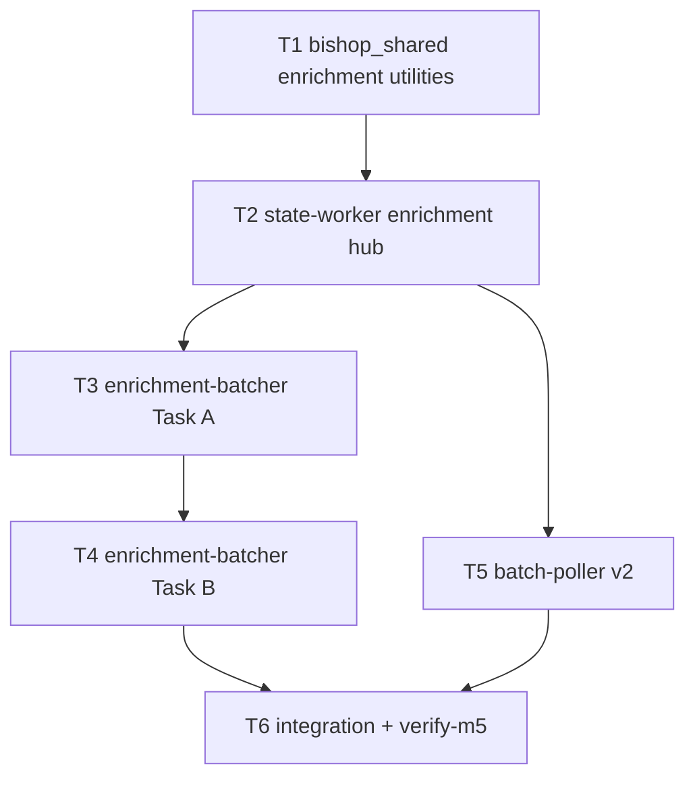

# M5 — Enrichment Slice

**Plan name:** `m5-enrichment`  
**Version:** 1.0  
**Status:** Ready for executor dispatch  
**Charter slice:** `.dev/bishop_program_charter.md` L332–382  
**Normative spec:** `bishop_spec_0_6.md` v1.5.0 (tracked @ HEAD)  
**Subtask budget:** 6 (within 4–10)

---

## 0. Context map intake

| Field | Value |
|-------|-------|
| **Path consumed** | `.dev/plans/m5-enrichment/context-map.md` |
| **Readiness verdict** | CONDITIONAL |
| **Scope-area labels flagged** | Flag 1 (submit transition wiring), Flag 2 (OOV persistence), Flag 3 (truncation without entry_type), Flag 4 (no enrichment-batcher tests), Flag 5 (batch-poller v2 filter), Flag 6 (T3/T4 file collision) |
| **Skill version + SHA** | pre-plan-exploration v0.3 · scout SHA `406ff61be94ede050257d582fdd8f7f521dab1c2` |

**M4 entry gate:** `.dev/plans/m4-content/handoff.md` — SCRAPED entries with `content_raw`; implementation anchor `117d62f`.

**G3 entry gate:** M3 landed `verify_model_string()` + `BISHOP_G3_VERIFIED` bypass; enrichment-batcher reuses same gate before first Anthropic submit.

**Prior handoff:** `.dev/plans/m4-content/handoff.md`

**Architecture folder:** `.dev/architecture/bishop/` @ scout SHA — post-M4 refresh may be stale vs `406ff61`; re-explore at execution if touched files diverge.

**Binding-artifact resolvability:**

| Artifact | Status |
|----------|--------|
| `bishop_spec_0_6.md` | **Binding** — tracked |
| `.dev/plans/m5-enrichment/context-map.md` | **Binding** — this plan's scout artifact |
| `.dev/plans/m4-content/handoff.md` | **Binding** — tracked (M5 entry gate) |
| `.dev/bishop_program_charter.md` | **Binding** — tracked |

**Orch resolutions (context-map flags → frozen in this plan):**

| Flag | Resolution |
|------|------------|
| 1 | **Submit transitions (binding):** Extend `register_batch` in state-worker: when `batch_type=enrichment_stage1`, after BatchRecord insert call `mark_enrichment_stage1_submitted(conn, source_ids, batch_id)` in the same transaction; when `batch_type=enrichment_stage2`, call `mark_enrichment_stage2_submitted`. No new REST routes. Owned by **T2**. |
| 2 | **OOV persistence (binding):** Add optional `oov_tags_stripped: list[str] \| None` to `EnrichmentStage1EntryWire`. `bishop_shared.validate_tags()` returns `(validated, stripped)`. Batch-poller sends validated tags in `tags` and stripped in `oov_tags_stripped`. `apply_enrichment_stage1_results` inserts `oov_tags_log` rows (review_status=`pending`). Owned by **T1** (parser) + **T2** (persistence). |
| 3 | **Truncation without entry_type (binding):** Call 1 truncation uses `entry.source` only. Implement all §13.1 strategies in **T1**; M5 e2e exercises **paper** strategy (`arxiv`, `openreview`, `semantic_scholar`: abstract + first 2,000 body tokens). HuggingFace model-card branch runs when `source=huggingface` **and** caller passes optional `entry_type_hint` — enrichment-batcher omits hint at Call 1 (defaults to beginning+end). |
| 4 | Addressed by **T3–T6** tests. |
| 5 | **batch-poller v2 (binding):** Replace pre_filter-only filter with allowlist `{pre_filter, enrichment_stage1, enrichment_stage2}`. Dispatch in `poll_once` by `batch_type`. Owned by **T5**. |
| 6 | **enrichment-batcher sequencing (binding):** **T3** owns service scaffold + Task A; **T4** adds Task B to same package. **Not parallel** — DAG edge T3 → T4. |

---

## 1. Task statement

**(a) Active milestone ID:** M5 — Enrichment Slice

**(b) Charter version:** `.dev/bishop_program_charter.md` v0.1.0

**(c) Charter non-goals (verbatim):** Vector writing, LanceDB, DuckDB, BM25 indexing. Query path. UI. Backfill. All §23 deferrals. Cross-domain enrichment (personal domain deferred per §3.2).

Implement `enrichment-batcher` (dual asyncio tasks for Stage 4a and Stage 4b), enrichment prompt templates, content truncation helper, OOV tag parser, and `batch-poller` v2 (all batch types + startup scan for enrichment types). Entries move from `SCRAPED` through both enrichment stages to `VECTOR_WRITE_QUEUED`. Observable checkpoint: entries at `VECTOR_WRITE_QUEUED` with all enrichment fields populated; OOV tags in `oov_tags_log`; `BatchRecord` rows for `enrichment_stage1` and `enrichment_stage2`; `ENRICHMENT_STAGE2_CLAIMED` double-poll empty; startup scan re-registers enrichment in-flight batches on poller restart.

**Non-goals:**
- Vector writing, LanceDB, DuckDB, BM25 indexing.
- Query path.
- UI.
- Backfill.
- Cross-domain enrichment (personal domain deferred per §3.2).
- Changes to `scraper`, `content-scraper`, `pre-filter-worker`, `vector-writer`, `query-api`, `ui`.
- All items in §23 and §24 of `bishop_spec_0_6.md` are non-goals for this plan.

---

## 2. Shared contracts

### Types / interfaces

| Symbol | Owner | Typed surface | Test |
|--------|-------|---------------|------|
| `ANTHROPIC_MODEL_ENRICHMENT` | T1 | `bishop_shared/anthropic_config.py` — alias of pinned `"claude-haiku-4-5-20251001"` | `tests/test_anthropic_config.py::test_enrichment_model_alias_matches_prefilter` |
| `ENRICHMENT_TRUNCATION_MAX_TOKENS` | T1 | `bishop_shared/enrichment_config.py` — literal `4000` | `tests/test_enrichment_truncation.py::test_max_tokens_constant` |
| `TAG_TAXONOMY` | T1 | `bishop_shared/tag_taxonomy.py` — frozenset matching spec §20.8 literals | `tests/test_tag_taxonomy.py::test_taxonomy_matches_spec_literals` |
| `validate_tags(tags) -> (validated, stripped)` | T1 | `bishop_shared/tag_taxonomy.py` | `tests/test_tag_taxonomy.py::test_validate_tags_strips_oov` |
| `truncate_content_for_call1(...)` | T1 | `bishop_shared/content_truncation.py` — `(source, title, content_raw, *, entry_type_hint=None) -> str` tiktoken-clamped | `tests/test_enrichment_truncation.py` (paper + default strategies) |
| `build_call1_system_prompt()` | T1 | `bishop_shared/enrichment_prompts.py` — Appendix A schema + taxonomy injection | `tests/test_enrichment_prompts.py::test_call1_includes_taxonomy` |
| `build_call1_user_message(title, truncated_content)` | T1 | `bishop_shared/enrichment_prompts.py` | `tests/test_enrichment_prompts.py::test_call1_user_message_shape` |
| `build_call2_system_prompt(profile_prompt)` | T1 | `bishop_shared/enrichment_prompts.py` — returns list content block with `cache_control: {type: ephemeral}` | `tests/test_enrichment_prompts.py::test_call2_system_has_cache_control` |
| `build_call2_user_message(title, summary)` | T1 | `bishop_shared/enrichment_prompts.py` | `tests/test_enrichment_prompts.py::test_call2_user_message_shape` |
| `parse_call1_response(source_id, text)` | T1 | `bishop_shared/enrichment_parsers.py` — JSON + validate_tags | `tests/test_enrichment_parsers.py` |
| `parse_call2_response(source_id, text)` | T1 | `bishop_shared/enrichment_parsers.py` | `tests/test_enrichment_parsers.py` |
| `EnrichmentStage1EntryWire.oov_tags_stripped` | T2 | `services/state-worker/app/models/http.py` optional `list[str]` | `tests/test_state_worker_enrichment_hub.py` |
| `register_batch` enrichment submit hook | T2 | `transitions.py` — calls mark_enrichment_stage*_submitted per batch_type | `tests/test_state_worker_enrichment_hub.py` |
| `apply_batch_timeout` enrichment paths | T2 | `transitions.py` — stage1: SUBMITTED→FAILED; stage2: SUBMITTED→FAILED | `tests/test_state_worker_enrichment_hub.py` |
| `_insert_oov_tags_log` | T2 | `transitions.py` — called from apply_enrichment_stage1_results | same |
| `ENRICHMENT_STAGE1_BATCH_TYPE` | T5 | `services/batch-poller/app/models.py` — `"enrichment_stage1"` | `tests/test_batch_poller_enrichment.py` |
| `ENRICHMENT_STAGE2_BATCH_TYPE` | T5 | `services/batch-poller/app/models.py` — `"enrichment_stage2"` | same |
| `TRACKED_BATCH_TYPES` | T5 | frozenset of three batch type strings | `tests/test_batch_poller_startup.py` (updated) |
| `ENRICHMENT_STAGE1_BATCH_SIZE` | T3 | `services/enrichment-batcher/app/config.py` — default `10`, env `BISHOP_ENRICHMENT_STAGE1_BATCH_SIZE` | `tests/test_enrichment_batcher_config.py` |
| `ENRICHMENT_STAGE2_BATCH_SIZE` | T4 | default `10`, env `BISHOP_ENRICHMENT_STAGE2_BATCH_SIZE` | same |
| `ENRICHMENT_POLL_INTERVAL_SEC` | T3 | default `120`, env `BISHOP_ENRICHMENT_POLL_INTERVAL_SEC` | same |
| `stage1_cycle()` | T3 | poll SCRAPED → truncate → Anthropic submit → POST /batches | `tests/test_enrichment_batcher_stage1_loop.py` |
| `stage2_cycle()` | T4 | poll ENRICHMENT_STAGE2_QUEUED → profile hash verify → Anthropic submit → POST /batches | `tests/test_enrichment_batcher_stage2_loop.py` |
| `startup_scan()` v2 | T5 | all three batch types | `tests/test_batch_poller_startup.py` |
| `poll_once()` enrichment dispatch | T5 | routes to stage1/stage2/pre_filter handlers | `tests/test_batch_poller_enrichment.py` |

**Decision log paths (architectural):**
- T1: `.dev/decision-logs/m5-enrichment/T1-enrichment-shared-utilities.md`
- T2: `.dev/decision-logs/m5-enrichment/T2-state-worker-enrichment-hub.md`
- T4: `.dev/decision-logs/m5-enrichment/T4-call2-cache-control.md`

### Error envelope

**enrichment-batcher:**

| Condition | Behavior |
|-----------|----------|
| G3 / model string not verified | Skip cycle; log ERROR `event=model_string_fatal` |
| Profile hash mismatch (Call 2) | Abort batch; log ERROR `event=profile_hash_mismatch` |
| State-worker poll/register non-2xx | Log ERROR; skip cycle |
| Empty poll | INFO; sleep interval |
| Anthropic submit HTTP 400 | Log ERROR `event=model_string_fatal`; do not register batch |

**batch-poller (enrichment):**

| Condition | Behavior |
|-----------|----------|
| Malformed Call 1/2 JSON | Entry `success=false`; include in batch `failed_count` |
| OOV tags in model output | Strip via validate_tags; log via `oov_tags_stripped` wire field |
| `POST /entries/enrichment-stage*-results` non-2xx | Retry next cycle; do not PATCH complete |
| 48h timeout | `POST /batches/{batch_id}/timeout` → entries → `_FAILED` per batch_type (T2) |

**State-worker wire (T2):**

| Route | Success | Failure |
|-------|---------|---------|
| `POST /batches` (enrichment types) | `201` + batch registered + entries `_SUBMITTED` | `409 batch_conflict`; `409 invalid_transition` if wrong entry state |
| `POST /entries/enrichment-stage1-results` | `204` | `404 not_found`; `409 invalid_transition` |
| `POST /entries/enrichment-stage2-results` | `204` | same |
| `POST /batches/{batch_id}/timeout` (enrichment) | `200` + `entries_reset` count | `404`; enrichment entries in `_SUBMITTED` → `_FAILED` |

### Naming

| Item | Value |
|------|-------|
| Shared module files | `bishop_shared/enrichment_config.py`, `tag_taxonomy.py`, `content_truncation.py`, `enrichment_prompts.py`, `enrichment_parsers.py` |
| Service package | `services/enrichment-batcher/app/` |
| Batch type strings | `enrichment_stage1`, `enrichment_stage2` (match `BatchTypeEnum`) |
| Compose tags | `bishop/enrichment-batcher:m5`, `bishop/batch-poller:m5` |
| Verify script | `scripts/verify-m5.sh` |

### Logging

Structured `extra` fields: `event` ∈ `{stage1_cycle_start, stage1_cycle_complete, stage2_cycle_start, stage2_cycle_complete, batch_registered, enrichment_batch_complete, enrichment_batch_rejected, profile_hash_mismatch, model_string_fatal, batch_timeout}`. Include `batch_id`, `external_batch_id`, `source_id` where applicable.

### Tests

- Framework: pytest; `pythonpath = ["."]` in `pyproject.toml`
- Location: `tests/test_enrichment_*.py`, `tests/test_batch_poller_enrichment.py`, `tests/test_state_worker_enrichment_hub.py`, `tests/test_m5_integration.py`, `tests/test_verify_m5.py`
- Coverage: unit tests for all §2 typed surfaces; integration harness seeds 5 SCRAPED entries → mocked Anthropic → VECTOR_WRITE_QUEUED; double-poll ENRICHMENT_STAGE2_QUEUED falsifier; startup scan with enrichment batch; OOV row insert assertion
- Gate: `scripts/verify-m5.sh` mirrors pytest module list (G2 slice + M5 slice)

### CLI surface

| Command | Owner |
|---------|-------|
| `scripts/verify-m5.sh` | T6 |
| `pytest tests/test_m5_integration.py -v` | T6 (documented in verify script) |

---

## 3. Dependency DAG



**Parallel groups:** `{T3, T5}` may run concurrently after **T2** completes.

**Soft dependency:** T4 prompt builders land in T1; T4 only wires Call 2 submit — could start after T1+T2 if T3 not finished, but file collision on `enrichment-batcher/app/` forbids parallel T3/T4.

---

## 4. Subtask specs

### T1

| Field | Content |
|--------|---------|
| **ID** | T1 |
| **Scope** | Add bishop_shared enrichment utilities: tiktoken truncation (§13.1), tag taxonomy + OOV validation, Call 1/2 prompt builders (Appendix A), JSON parsers for batch-poller. |
| **Files to touch** | `bishop_shared/anthropic_config.py`, `bishop_shared/enrichment_config.py` (new), `bishop_shared/tag_taxonomy.py` (new), `bishop_shared/content_truncation.py` (new), `bishop_shared/enrichment_prompts.py` (new), `bishop_shared/enrichment_parsers.py` (new), `pyproject.toml`, `tests/test_enrichment_truncation.py`, `tests/test_tag_taxonomy.py`, `tests/test_enrichment_prompts.py`, `tests/test_enrichment_parsers.py`, `tests/test_anthropic_config.py` |
| **Contract bindings** | All T1 §2 rows |
| **Inputs** | None |
| **Outputs** | Shared library + unit tests; decision log T1 |
| **Kill criteria** | Halt if tiktoken cannot clamp to exactly 4000 tokens on fixture corpus. Halt if taxonomy set does not match spec §20.8 literal list (grep bishop_spec). Halt if Call 2 system prompt builder does not emit `cache_control` key. |
| **Log tier** | architectural |
| **Risks & mitigations** | Risk: tiktoken new dep — add to `[project.optional-dependencies] dev` and service requirements in T3/T4 Dockerfiles. Risk: HF model-card truncation untested live — unit fixtures only; M8 owns adapter-specific e2e. |

### T2

| Field | Content |
|--------|---------|
| **ID** | T2 |
| **Scope** | State-worker hub amendment: wire enrichment submit transitions in `register_batch`, extend `apply_batch_timeout` for enrichment batch types, persist OOV tags on stage1 results, extend wire model. |
| **Files to touch** | `services/state-worker/app/transitions.py`, `services/state-worker/app/models/http.py`, `tests/test_state_worker_enrichment_hub.py`, `.dev/decision-logs/m5-enrichment/T2-state-worker-enrichment-hub.md` |
| **Contract bindings** | T2 §2 rows; error envelope state-worker rows |
| **Inputs** | T1 (`validate_tags`, wire field semantics) |
| **Outputs** | Hub transitions + contract tests |
| **Kill criteria** | Halt if hub-drift: any worker writes SQLite directly. Halt if `register_batch` for `enrichment_stage1` leaves entries in `ENRICHMENT_STAGE1_QUEUED` after success. Halt if timeout for enrichment_stage1 leaves entries in `ENRICHMENT_STAGE1_SUBMITTED` (must be `_FAILED`). Halt if context-map Flag 1 unresolved at execution start. |
| **Log tier** | architectural |
| **Risks & mitigations** | Risk: pre_filter timeout regression — existing `test_post_batch_timeout_resets_relevance_queued` must stay green. Mitigation: batch_type dispatch in `apply_batch_timeout`. |

### T3

| Field | Content |
|--------|---------|
| **ID** | T3 |
| **Scope** | Implement enrichment-batcher service scaffold and Task A loop: poll `SCRAPED`, truncate content, submit Call 1 Anthropic batch, POST /batches with `enrichment_stage1`, G3 gate, asyncio scheduler. |
| **Files to touch** | `services/enrichment-batcher/app/` (new package: `main.py`, `config.py`, `models.py`, `state_worker_client.py`, `anthropic_batch_client.py`, `stage1_loop.py`), `services/enrichment-batcher/requirements.txt` (new), `services/enrichment-batcher/Dockerfile`, `tests/test_enrichment_batcher_config.py`, `tests/test_enrichment_batcher_stage1_loop.py` |
| **Contract bindings** | T3 §2 rows; reuse G3 from bishop_shared |
| **Inputs** | T1, T2 |
| **Outputs** | Task A worker + Dockerfile CMD `python -m app.main` |
| **Kill criteria** | Halt if poll state string != `SCRAPED`. Halt if POST /batches body `batch_type` != `enrichment_stage1`. Halt if Anthropic `custom_id` != `source_id`. Halt if T2 submit hook not landed (entries remain QUEUED after register). |
| **Log tier** | standard |
| **Risks & mitigations** | Risk: orphaned Anthropic batch if POST /batches fails after submit (M3 CR-1 pattern) — log ERROR with external_batch_id; document in changelog; no compensating cancel in M5. |

### T4

| Field | Content |
|--------|---------|
| **ID** | T4 |
| **Scope** | Add Task B to enrichment-batcher: poll `ENRICHMENT_STAGE2_QUEUED`, profile hash verify, submit Call 2 with cache_control system prompt, POST /batches `enrichment_stage2`. Dual-task main loop. |
| **Files to touch** | `services/enrichment-batcher/app/stage2_loop.py`, `services/enrichment-batcher/app/main.py`, `services/enrichment-batcher/app/anthropic_batch_client.py`, `tests/test_enrichment_batcher_stage2_loop.py`, `.dev/decision-logs/m5-enrichment/T4-call2-cache-control.md` |
| **Contract bindings** | T4 §2 rows; profile_renderer hash verify pattern from pre-filter-worker |
| **Inputs** | T1, T2, T3 |
| **Outputs** | Dual-task enrichment-batcher |
| **Kill criteria** | Halt if Call 2 uses full `content_raw` in user message (must be title+summary only). Halt if profile hash mismatch does not abort batch. Halt if poll state != `ENRICHMENT_STAGE2_QUEUED`. Halt if context-map Flag 6 causes parallel edit conflict — T4 starts only after T3 lands. |
| **Log tier** | architectural |
| **Risks & mitigations** | Risk: profile below Anthropic caching threshold — cache_control still emitted per spec; caching may be no-op until profile grows (document in T4 decision log). |

### T5

| Field | Content |
|--------|---------|
| **ID** | T5 |
| **Scope** | Extend batch-poller to v2: startup scan all batch types, dispatch poll handlers for enrichment stages, parse Call 1/2 JSON, POST enrichment result routes, preserve pre_filter behavior. |
| **Files to touch** | `services/batch-poller/app/models.py`, `services/batch-poller/app/startup.py`, `services/batch-poller/app/loop.py`, `services/batch-poller/app/clients/state_worker.py`, `services/batch-poller/requirements.txt`, `services/batch-poller/Dockerfile`, `tests/test_batch_poller_startup.py`, `tests/test_batch_poller_enrichment.py`, `tests/test_batch_poller_loop.py` (regression) |
| **Contract bindings** | T5 §2 rows; ENRICHMENT_* batch type constants |
| **Inputs** | T1 (parsers), T2 (result wire + timeout behavior) |
| **Outputs** | batch-poller v2 |
| **Kill criteria** | Halt if pre_filter batches regressed (existing loop tests fail). Halt if enrichment batches still log `enrichment_batch_rejected` during normal dispatch. Halt if startup scan drops `enrichment_stage1` in-flight batch. Halt if timeout path does not call `POST /batches/{batch_id}/timeout`. |
| **Log tier** | standard |
| **Risks & mitigations** | Risk: monolithic loop.py growth — acceptable; split handlers by batch_type functions. |

### T6

| Field | Content |
|--------|---------|
| **ID** | T6 |
| **Scope** | M5 exit gate: integration test (5 entries SCRAPED → VECTOR_WRITE_QUEUED), double-poll ENRICHMENT_STAGE2_CLAIMED, OOV log assertion, startup-scan restart test, `scripts/verify-m5.sh`, compose tag `m5`, `tests/test_verify_m5.py`. |
| **Files to touch** | `tests/test_m5_integration.py`, `tests/test_verify_m5.py`, `scripts/verify-m5.sh`, `docker-compose.yml`, `tests/test_compose.py`, `CHANGELOG.MD` |
| **Contract bindings** | All §2 rows (falsifiers); CLI verify-m5 |
| **Inputs** | T3, T4, T5 |
| **Outputs** | Runnable M5 checkpoint evidence |
| **Kill criteria** | Halt if integration cannot produce 5 entries at VECTOR_WRITE_QUEUED with all enrichment fields non-null. Halt if second concurrent poll for ENRICHMENT_STAGE2_QUEUED returns claimed_count=0 while first holds CLAIMED. Halt if oov_tags_log empty when parser strips ≥1 tag in fixture. Halt if verify-m5.sh module list omits any new contract test file. |
| **Log tier** | standard |
| **Risks & mitigations** | Risk: live Anthropic not in CI — integration mocks Anthropic like M3 T6. Live docker compose deferred to manual (M3/M4 pattern). |

---

## 5. Adversarial pass

### 5.1 Rejected decompositions

**Rejected: merge T2 into T5 (batch-poller owns all state transitions).** Violates single-writer hub rule — batch-poller must not write SQLite or call internal transition helpers directly; submit and timeout semantics belong on state-worker REST surface.

**Rejected: parallel T3 + T4 executors on enrichment-batcher.** Both touch `app/main.py` and shared clients; Flag 6 confirmed file collision. Sequential T3 → T4 chosen.

**Rejected: OOV logging only in batch-poller via direct SQLite insert.** Violates state-worker sole-writer discipline (§8.1); OOV rows must route through state-worker on enrichment-stage1-results.

### 5.2 Load-bearing assumptions

```
(M1 enrichment result POST + H3 transitions are correct for M5 | contract surface: §2 EnrichmentStage1EntryWire + transitions.py:apply_enrichment_stage*_results | batch-poller POST succeeds but fields not persisted or wrong terminal state | T2,T5,T6)

(register_batch extension is sufficient for submit transitions without new REST routes | contract surface: POST /batches + mark_enrichment_stage*_submitted | entries stuck QUEUED/CLAIMED after submit; results 409 | T2,T3,T4)

(tiktoken cl100k_base acceptable tokenizer for §13.1 4000-token ceiling | contract surface: bishop_shared/content_truncation.py | systematic over-truncation degrades challenge_hooks | T1,T6)

(M4 content_raw for ArXiv sufficient for Call 1 paper truncation strategy | contract surface: content-scraper loop + arxiv fetch_content | empty/truncated-to-nothing content yields failed enrichment entries | T3,T6)

(G3 model string still valid at execution time | contract surface: ANTHROPIC_MODEL_ENRICHMENT | all Anthropic submits fail HTTP 400 | T3,T4)
```

### 5.3 Highest re-plan risk

**T2 (state-worker enrichment hub).** Wrong submit or timeout mapping forces T3/T4/T5 client rework and invalidates integration falsifiers. Second risk: **T1 truncation** if paper strategy produces empty body for M4 HTML-only content — mitigated by abstract inclusion in paper strategy.

### 5.4 Hidden couplings

```
(POST /batches must atomically register + mark submitted for enrichment types | contract surface: transitions.py:register_batch + BatchTypeEnum | batch-poller results POST invalid_transition | T2,T3,T4) · confirmed

(apply_batch_timeout batch_type dispatch | contract surface: transitions.py:apply_batch_timeout + BatchTypeEnum | enrichment timeouts leave entries in SUBMITTED forever | T2,T5) · confirmed

(batch-poller custom_id join | contract surface: anthropic batch custom_id + batches.source_ids | missing per-entry results | T3,T4,T5) · confirmed

(profile_render_hash on stage2 BatchRegisterRequest | contract surface: BatchRegisterRequest.profile_render_hash | undetected profile drift on Call 2 | T4) · confirmed

(T3/T4 file collision on enrichment-batcher/app | contract surface: services/enrichment-batcher/app/main.py | merge conflict if parallel | T3,T4) · confirmed

(Compose image tag bishop/batch-poller:m3 → m5 | contract surface: docker-compose.yml + tests/test_compose.py | CI compose gate failure | T6) · confirmed

(pre_filter loop regression when extending poll_once | contract surface: batch-poller/app/loop.py:_handle_batch_complete pre_filter path | M3 e2e breaks | T5) · suspected — disproven by: existing test_batch_poller_loop.py green after T5
```

---

## 6. Executor packets

Self-contained packets emitted at:

- `.dev/plans/m5-enrichment/packets/T1.md`
- `.dev/plans/m5-enrichment/packets/T2.md`
- `.dev/plans/m5-enrichment/packets/T3.md`
- `.dev/plans/m5-enrichment/packets/T4.md`
- `.dev/plans/m5-enrichment/packets/T5.md`
- `.dev/plans/m5-enrichment/packets/T6.md`

**Retired-string sweep:** N/A at plan emission (no mid-plan contract changes).

---

## 7. Amendment subtasks

None at plan v1.0 emission.

---

## 8. Auditor handoff

**Pending execution.** §8.1–§8.6 will be populated when the plan reaches *Complete* after T1–T6 land and `scripts/verify-m5.sh` passes on a clean tree.

**Planned §8.1 verification command (executor recording target):**

```
scripts/verify-m5.sh
```

Equivalent pytest:

```
pytest tests/test_state_worker_contract.py tests/test_state_worker_health.py tests/test_constants.py tests/test_enrichment_truncation.py tests/test_tag_taxonomy.py tests/test_enrichment_prompts.py tests/test_enrichment_parsers.py tests/test_state_worker_enrichment_hub.py tests/test_enrichment_batcher_config.py tests/test_enrichment_batcher_stage1_loop.py tests/test_enrichment_batcher_stage2_loop.py tests/test_batch_poller_startup.py tests/test_batch_poller_enrichment.py tests/test_batch_poller_loop.py tests/test_m5_integration.py tests/test_verify_m5.py -v --tb=short
```

---

*Plan v1.0 — m5-enrichment — 2026-06-13*
