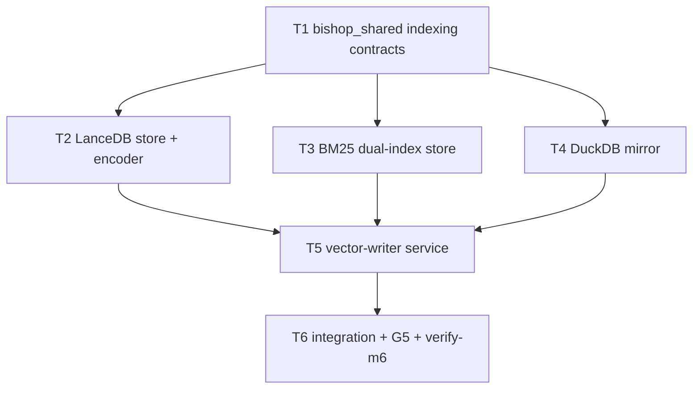

# M6 — Indexing Slice

**Plan name:** `m6-indexing`  
**Version:** 1.0  
**Status:** Ready for executor dispatch  
**Charter slice:** `.dev/bishop_program_charter.md` L386–436  
**Normative spec:** `bishop_spec_0_6.md` v1.5.0 (tracked @ HEAD)  
**Subtask budget:** 6 (within 4–10)

---

## 0. Context map intake

| Field | Value |
|-------|-------|
| **Path consumed** | `.dev/plans/m6-indexing/context-map.md` |
| **Readiness verdict** | CONDITIONAL |
| **Scope-area labels flagged** | Flag 1 (BM25 library), Flag 2 (DuckDB DDL), Flag 3 (LanceDB schema), Flag 4 (G5 automation), Flag 5 (state-worker ownership), Flag 6 (restart overlap) |
| **Skill version + SHA** | pre-plan-exploration v0.3 · scout SHA `ac991e986d8db3a6f1192a8895f1205ef36e7787` |

**M5 entry gate:** `.dev/plans/m5-enrichment/handoff.md` — entries at `VECTOR_WRITE_QUEUED` with enrichment fields populated; implementation anchor `0331dd5`.

**Prior handoff:** `.dev/plans/m5-enrichment/handoff.md`

**Architecture folder:** `.dev/architecture/bishop/` @ scout SHA — **stale** (post-M5 refresh not committed per M5 handoff); vector-writer row is M0 stub prediction.

**Binding-artifact resolvability:**

| Artifact | Status |
|----------|--------|
| `bishop_spec_0_6.md` | **Binding** — tracked |
| `.dev/plans/m6-indexing/context-map.md` | **Binding** — this plan's scout artifact |
| `.dev/plans/m5-enrichment/handoff.md` | **Binding** — tracked (M6 entry gate) |
| `.dev/bishop_program_charter.md` | **Binding** — tracked |

**Orch resolutions (context-map flags → frozen in this plan):**

| Flag | Resolution |
|------|------------|
| 1 | **BM25 library (binding):** `rank-bm25` + in-memory index + pickle serialization via custom `atomic_persist()` wrapper (spec §8.4 S4). Reject `tantivy-py` for M6 — higher startup complexity, no executor packet yet. Owned by **T1** (wrapper) + **T3** (dual-index store). Decision log in T3. |
| 2 | **DuckDB DDL (binding):** Single table `entries_mirror` with columns: `source_id` (VARCHAR PK), `source`, `url`, `title`, `published_at`, `ingested_at`, `domain`, `entry_type`, `relevance_score`, `reading_status`, `summary`, `tags` (JSON), `concepts` (JSON), `challenge_hooks` (JSON). `INSERT OR REPLACE` on `source_id`. Matches §16.1 metadata filter fields. Owned by **T4**. |
| 3 | **LanceDB schema (binding):** Table name `entries`; idempotency key `source_id` (string). Columns: `source_id`, `vector` (float32[384]), `title`, `summary`, `domain`, `tags` (list[string]), `challenge_hooks` (list[string]), `relevance_score` (float nullable). Check-before-write: `table.search().where("source_id = '{id}'").limit(1)` or equivalent filter API. Owned by **T2**. |
| 4 | **G5 gate (binding):** CI runs `test_g5_quality_gate_fixture` with deterministic mocked embedding vectors and frozen query→expected-top-source_id map (3 queries). Optional live gate: `test_g5_quality_gate_live` marked `@pytest.mark.heavy`, skips unless `BISHOP_G5_LIVE=1`, loads real `SentenceTransformer(EMBEDDING_MODEL)`. Charter subjective "intuitively correct" satisfied by fixture map authored from spec examples (L1437, L576). Upgrade to `nomic-embed-text` is **out of M6 scope** unless live gate fails in manual run — then §7 amendment, not silent executor choice. Owned by **T6**. |
| 5 | **State-worker (binding):** **No M6 hub amendment.** `mark_indexed`, `POST /entries/indexed`, `POST /entries/failed`, and VECTOR_WRITE_QUEUED poll exemption landed M1. Kill criterion on any Tn that edits `services/state-worker/` except import-only test fixtures. |
| 6 | **Restart overlap (binding):** Add `stop_grace_period: 30s` to `vector-writer` service in `docker-compose.yml` (spec §6.2 G1). Owned by **T6**. |

---

## 1. Task statement

**(a) Active milestone ID:** M6 — Indexing Slice

**(b) Charter version:** `.dev/bishop_program_charter.md` v0.1.0

**(c) Charter non-goals (verbatim):** Query API. UI. Backfill. BM25 reload in query-api. §23 deferred.

Implement `vector-writer`: embedding generation, LanceDB write with idempotency check, BM25 index (main + challenge_hooks) with file lock and atomic persistence, DuckDB mirror upsert, and `POST /entries/indexed` signaling. Entries reach `INDEXED` (terminal success). Embedding quality gate (G5) must pass before M7 proceeds.

**Non-goals:**
- Query API.
- UI.
- Backfill.
- BM25 reload in `query-api` (deferred to M7).
- DuckDB analytics queries (deferred to M7).
- LanceDB cosine anchor migration (§12.3 Phase 2+ deferred per §23).
- Reranker (§23 deferred).
- Changes to `scraper`, `pre-filter-worker`, `content-scraper`, `enrichment-batcher`, `batch-poller`, `state-worker` REST surface, `query-api`, `ui`.
- Embedding model upgrade to `nomic-embed-text` unless G5 live gate fails and charter owner authorizes §7 amendment.
- All items in §23 and §24 of `bishop_spec_0_6.md` are non-goals for this plan.

---

## 2. Shared contracts

### Types / interfaces

| Symbol | Owner | Typed surface | Test |
|--------|-------|---------------|------|
| `EMBEDDING_MODEL` | T1 | `bishop_shared/indexing_config.py` — literal `"sentence-transformers/all-MiniLM-L6-v2"` | `tests/test_indexing_config.py::test_embedding_model_pinned` |
| `EMBEDDING_DIM` | T1 | `bishop_shared/indexing_config.py` — literal `384` | `tests/test_indexing_config.py::test_embedding_dim` |
| `build_embed_text(title, summary, challenge_hooks)` | T1 | `bishop_shared/indexing_config.py` — N1: `f"{title}\n{summary}\n{' '.join(challenge_hooks or [])}"` | `tests/test_indexing_config.py::test_build_embed_text_n1` |
| `LANCEDB_DIR` | T1 | `bishop_shared/indexing_config.py` — `"/app/data/lancedb"` from volume mount | `tests/test_indexing_config.py::test_store_paths_match_constants` |
| `LANCEDB_TABLE_NAME` | T1 | literal `"entries"` | same |
| `DUCKDB_PATH` | T1 | `"/app/data/duckdb/bishop.duckdb"` | same |
| `bm25_domain_root(domain)` | T1 | returns `Path("/app/data/bm25/{domain}")` | same |
| `BM25_MAIN_SUBDIR` | T1 | `"main"` | same |
| `BM25_CHALLENGE_HOOKS_SUBDIR` | T1 | `"challenge_hooks"` | same |
| `BM25_LOCK_NAME` | T1 | `".bm25_write.lock"` | same |
| `atomic_persist(path, serialize_fn)` | T1 | `bishop_shared/atomic_persist.py` — temp → fsync → `os.replace` | `tests/test_atomic_persist.py` |
| `EmbeddingEncoder` | T2 | `services/vector-writer/app/embedding.py` — `encode(texts: list[str]) -> list[list[float]]`; wraps `SentenceTransformer` | `tests/test_vector_writer_embedding.py` |
| `LanceDbStore` | T2 | `services/vector-writer/app/stores/lancedb_store.py` — `exists(source_id)`, `write(row: LanceRow)` | `tests/test_lancedb_store.py` |
| `Bm25DualIndex` | T3 | `services/vector-writer/app/stores/bm25_store.py` — `has_document`, `add_main`, `add_challenge_hooks`, `persist()` under domain lock | `tests/test_bm25_store.py` |
| `DuckDbMirror` | T4 | `services/vector-writer/app/stores/duckdb_mirror.py` — `upsert(entry: EntryMirrorRow)` | `tests/test_duckdb_mirror.py` |
| `EntryPollRow` | T5 | `services/vector-writer/app/models.py` — pydantic parse of poll JSON entry dict | `tests/test_vector_writer_models.py` |
| `VECTOR_WRITE_POLL_STATE` | T5 | `"VECTOR_WRITE_QUEUED"` | `tests/test_vector_writer_config.py` |
| `VECTOR_WRITE_BATCH_SIZE` | T5 | `services/vector-writer/app/config.py` — default `10`, env `BISHOP_VECTOR_WRITE_BATCH_SIZE` | same |
| `VECTOR_WRITE_POLL_INTERVAL_SEC` | T5 | default `120`, env `BISHOP_VECTOR_WRITE_POLL_INTERVAL_SEC` | same |
| `index_entry(entry, stores...)` | T5 | orchestrates check-before-write all stores → POST indexed | `tests/test_vector_writer_index_entry.py` |
| `index_cycle()` | T5 | poll → per-entry index → sleep | `tests/test_vector_writer_loop.py` |
| `G5_FIXTURE_QUERIES` | T6 | `tests/fixtures/g5_quality_gate.py` — tuple of `(query, expected_source_id)` | `tests/test_g5_quality_gate.py` |

**Decision log paths (architectural):**
- T1: `.dev/decision-logs/m6-indexing/T1-indexing-shared-contracts.md`
- T3: `.dev/decision-logs/m6-indexing/T3-bm25-rank-bm25-choice.md`

### Error envelope

**vector-writer:**

| Condition | Behavior |
|-----------|----------|
| State-worker poll non-2xx | Log ERROR `event=state_worker_error`; skip cycle |
| Empty poll | INFO `event=empty_poll`; sleep interval |
| LanceDB/BM25/DuckDB write failure | Log ERROR `event=index_write_failed`; POST `/entries/failed` with `state_at_failure=VECTOR_WRITE_QUEUED`, `is_retriable=true`, `target` → `VECTOR_WRITE_FAILED` via state-worker mapping |
| Partial store success before failure | Prior stores remain idempotent on retry (check-before-write); do not POST indexed until all three succeed |
| BM25 lock timeout | Log ERROR `event=bm25_lock_timeout`; skip entry; POST failed retriable |
| `POST /entries/indexed` non-2xx after stores written | Log CRITICAL `event=indexed_signal_failed`; entry may re-index idempotently on next cycle |
| Already INDEXED idempotent POST | state-worker returns 204; vector-writer treats as success |

**State-worker wire (read-only for M6 — no changes):**

| Route | Success | Failure |
|-------|---------|---------|
| `GET /entries/poll?state=VECTOR_WRITE_QUEUED` | `200` + entries without `content_raw` | `400 invalid_poll_state` |
| `POST /entries/indexed` | `204` | `404 not_found`; `409 invalid_transition` |
| `POST /entries/failed` | `204` | `404`; `409` |

### Naming

| Item | Value |
|------|-------|
| Shared modules | `bishop_shared/indexing_config.py`, `bishop_shared/atomic_persist.py` |
| Service package | `services/vector-writer/app/` |
| Store modules | `app/stores/lancedb_store.py`, `bm25_store.py`, `duckdb_mirror.py` |
| Compose tag | `bishop/vector-writer:m6` |
| Verify script | `scripts/verify-m6.sh` |
| DuckDB table | `entries_mirror` |
| LanceDB table | `entries` |

### Logging

Structured `extra` fields: `event` ∈ `{index_cycle_start, index_cycle_complete, empty_poll, entry_indexed, index_write_failed, bm25_lock_acquired, bm25_lock_timeout, indexed_signal_failed, state_worker_error, lancedb_skip_duplicate, bm25_skip_duplicate}`. Include `source_id`, `domain` where applicable.

### Tests

- Framework: pytest; `pythonpath = ["."]` in `pyproject.toml`
- Location: `tests/test_indexing_*.py`, `tests/test_atomic_persist.py`, `tests/test_lancedb_store.py`, `tests/test_bm25_store.py`, `tests/test_duckdb_mirror.py`, `tests/test_vector_writer_*.py`, `tests/test_m6_integration.py`, `tests/test_g5_quality_gate.py`, `tests/test_verify_m6.py`
- Coverage: unit tests for all §2 typed surfaces; integration harness seeds VECTOR_WRITE_QUEUED entries → mocked encoder → INDEXED in SQLite + artifacts on tmp volume paths; BM25 lock contention test (simulated concurrent acquire); DuckDB `read_only=True` open from separate connection while mirror holds write (no exception)
- Gate: `scripts/verify-m6.sh` mirrors pytest module list (G2 slice + M6 slice)
- Heavy: `test_g5_quality_gate_live` deselected by default in verify script

### CLI surface

| Command | Owner |
|---------|-------|
| `scripts/verify-m6.sh` | T6 |
| `pytest tests/test_m6_integration.py -v` | T6 (documented in verify script) |
| `BISHOP_G5_LIVE=1 pytest tests/test_g5_quality_gate.py -m heavy` | T6 (manual G5 live probe) |

---

## 3. Dependency DAG



**Parallel groups:** `{T2, T3, T4}` may run concurrently after **T1** completes.

**Soft dependency:** T5 imports all stores; store APIs must be frozen at T1 path constants before parallel store work diverges.

---

## 4. Subtask specs

### T1

| Field | Content |
|--------|---------|
| **ID** | T1 |
| **Scope** | Freeze indexing contract anchors in bishop_shared: embedding model pin, N1 embed text builder, store path constants, atomic persistence utility (spec S4). |
| **Files to touch** | `bishop_shared/indexing_config.py` (new), `bishop_shared/atomic_persist.py` (new), `tests/test_indexing_config.py`, `tests/test_atomic_persist.py`, `.dev/decision-logs/m6-indexing/T1-indexing-shared-contracts.md` |
| **Contract bindings** | All T1 §2 rows |
| **Inputs** | None |
| **Outputs** | Shared contracts + unit tests |
| **Kill criteria** | Halt if `build_embed_text` does not match spec L222–225 literal join semantics. Halt if store paths diverge from `BISHOP_VOLUME_MOUNTS` container paths in `bishop_shared/constants.py`. Halt if `atomic_persist` does not use temp file + fsync + `os.replace` (grep for in-place target overwrite). |
| **Log tier** | architectural |
| **Risks & mitigations** | Risk: path constants duplicate SQLITE_DB_PATH pattern — acceptable; mirror existing `constants.py` derivation style. |

### T2

| Field | Content |
|--------|---------|
| **ID** | T2 |
| **Scope** | Implement `EmbeddingEncoder` (sentence-transformers) and `LanceDbStore` with source_id check-before-write and 384-dim vector schema. |
| **Files to touch** | `services/vector-writer/app/embedding.py`, `services/vector-writer/app/stores/lancedb_store.py`, `services/vector-writer/app/stores/__init__.py`, `services/vector-writer/requirements.txt` (new), `tests/test_vector_writer_embedding.py`, `tests/test_lancedb_store.py` |
| **Contract bindings** | T2 §2 rows; T1 path/table constants |
| **Inputs** | T1 |
| **Outputs** | LanceDB store module + encoder tests (tmp dir fixtures; mock SentenceTransformer in unit tests) |
| **Kill criteria** | Halt if idempotency check queries wrong key (not `source_id`). Halt if vector dimension ≠ `EMBEDDING_DIM`. Halt if context-map Flag 3 unresolved at execution start. |
| **Log tier** | architectural |
| **Risks & mitigations** | Risk: lancedb API drift — pin minimum version in requirements.txt. Risk: model download in tests — mock encoder in unit tests; real model only in heavy/live tests (T6). |

### T3

| Field | Content |
|--------|---------|
| **ID** | T3 |
| **Scope** | Implement per-domain `Bm25DualIndex`: main corpus (title, summary, concepts, tags, challenge_hooks) and challenge_hooks-only index; single `filelock` per domain; atomic persist via T1 wrapper. |
| **Files to touch** | `services/vector-writer/app/stores/bm25_store.py`, `services/vector-writer/requirements.txt`, `tests/test_bm25_store.py`, `.dev/decision-logs/m6-indexing/T3-bm25-rank-bm25-choice.md` |
| **Contract bindings** | T3 §2 rows; T1 paths and atomic_persist |
| **Inputs** | T1 |
| **Outputs** | BM25 dual-index store + lock/persistence tests |
| **Kill criteria** | Halt if main and challenge_hooks use separate lock files (must be one lock per domain root). Halt if duplicate `source_id` added to corpus (check-before-write required). Halt if persist does not call `atomic_persist`. Halt if context-map Flag 1 unresolved at execution start. |
| **Log tier** | architectural |
| **Risks & mitigations** | Risk: rank-bm25 not thread-safe — document single-writer discipline; lock test in T6. |

### T4

| Field | Content |
|--------|---------|
| **ID** | T4 |
| **Scope** | Implement `DuckDbMirror` with `entries_mirror` DDL and `INSERT OR REPLACE` upsert from entry metadata. |
| **Files to touch** | `services/vector-writer/app/stores/duckdb_mirror.py`, `services/vector-writer/requirements.txt`, `tests/test_duckdb_mirror.py` |
| **Contract bindings** | T4 §2 rows; T1 `DUCKDB_PATH` |
| **Inputs** | T1 |
| **Outputs** | DuckDB mirror module + upsert tests |
| **Kill criteria** | Halt if table name ≠ `entries_mirror`. Halt if upsert is plain INSERT without OR REPLACE semantics. Halt if context-map Flag 2 unresolved at execution start. |
| **Log tier** | standard |
| **Risks & mitigations** | Risk: JSON column types — use DuckDB JSON or VARCHAR JSON strings consistently; test round-trip. |

### T5

| Field | Content |
|--------|---------|
| **ID** | T5 |
| **Scope** | Implement vector-writer service: config, state-worker client (poll VECTOR_WRITE_QUEUED, POST indexed/failed), `index_entry` orchestration, asyncio scheduler, Dockerfile with `python -m app.main`. |
| **Files to touch** | `services/vector-writer/app/main.py`, `config.py`, `models.py`, `state_worker_client.py`, `index_entry.py`, `loop.py`, `Dockerfile`, `requirements.txt`, `tests/test_vector_writer_config.py`, `tests/test_vector_writer_models.py`, `tests/test_vector_writer_index_entry.py`, `tests/test_vector_writer_loop.py` |
| **Contract bindings** | All T5 §2 rows; error envelope vector-writer table |
| **Inputs** | T2, T3, T4 |
| **Outputs** | Runnable vector-writer service package |
| **Kill criteria** | Halt if poll uses wrong state string. Halt if `index_entry` POSTs indexed before all three stores succeed. Halt if poll client expects `content_raw` on wire payload. Halt if hub-drift: any edit to `services/state-worker/`. Halt if Dockerfile still CMD stub_main. |
| **Log tier** | standard |
| **Risks & mitigations** | Risk: crash between store writes — idempotent retry per spec §5.6 step 3. Risk: large Docker image — use slim base + pip cache; document HF model download on first start. |

### T6

| Field | Content |
|--------|---------|
| **ID** | T6 |
| **Scope** | M6 exit gate: integration test (VECTOR_WRITE_QUEUED → INDEXED + three stores), BM25 lock contention test, DuckDB concurrent read_only test, G5 fixture gate, optional live G5 marker, `scripts/verify-m6.sh`, compose tag `m6`, `stop_grace_period`, graduate vector-writer in `test_service_stubs.py`, `CHANGELOG.MD`. |
| **Files to touch** | `tests/test_m6_integration.py`, `tests/test_g5_quality_gate.py`, `tests/fixtures/g5_quality_gate.py`, `tests/test_verify_m6.py`, `tests/test_bm25_lock_contention.py`, `tests/test_duckdb_concurrent_read.py`, `scripts/verify-m6.sh`, `docker-compose.yml`, `tests/test_compose.py`, `tests/test_service_stubs.py`, `CHANGELOG.MD` |
| **Contract bindings** | All §2 rows (falsifiers); CLI verify-m6; G5_FIXTURE_QUERIES |
| **Inputs** | T5 |
| **Outputs** | Runnable M6 checkpoint evidence |
| **Kill criteria** | Halt if integration cannot produce INDEXED entries with LanceDB row + BM25 files + DuckDB row for same source_id. Halt if idempotent re-index of same source_id creates duplicate LanceDB vector (must skip). Halt if verify-m6.sh omits any new contract test module. Halt if compose still shows `bishop/vector-writer:m0`. Halt if G5 fixture queries < 3. |
| **Log tier** | standard |
| **Risks & mitigations** | Risk: live G5 flaky in CI — excluded from verify-m6.sh default; fixture gate is merge gate. Live gate documented for manual pre-M7 sign-off. |

---

## 5. Adversarial pass

### 5.1 Rejected decompositions

**Rejected: merge T2+T3+T4 into single "stores" subtask.** Would exceed executor focus and prevent parallel store development after T1; charter expects separable LanceDB/BM25/DuckDB functions (charter L411 parallelism note).

**Rejected: implement BM25 reload in vector-writer for query-api.** Charter non-goal — reload is M7 query-api responsibility (§8.4 in-memory reload).

**Rejected: state-worker amendment to add INDEXING_CLAIMED lock state.** Spec §6.2 explicitly exempts VECTOR_WRITE_QUEUED from atomic claim; adding lock state is spec violation (Tier 3), not M6 scope.

**Rejected: tantivy-py for BM25.** Spec lists as alternative with higher startup complexity; rank-bm25 matches spec prose worked example and S4 atomic wrapper path already chosen for M6.

### 5.2 Load-bearing assumptions

```
(M1 mark_indexed + VECTOR_WRITE_QUEUED poll exemption are correct for M6 | contract surface: transitions.py:mark_indexed + claim_entries_poll VECTOR_WRITE_QUEUED branch | indexed POST 409 or poll omits required fields | T5,T6)

(check-before-write idempotency sufficient without claim lock for single-instance vector-writer | contract surface: bishop_spec_0_6.md §5.6 step 3 + §6.2 G1 | duplicate vectors on restart overlap until INDEXED | T5,T6)

(sentence-transformers all-MiniLM-L6-v2 produces 384-dim vectors matching LanceDB schema | contract surface: bishop_shared/indexing_config.py EMBEDDING_DIM | schema mismatch on write | T2,T5,T6)

(M5 VECTOR_WRITE_QUEUED entries have non-null summary and challenge_hooks for embed text | contract surface: tests/test_m5_integration.py e2e assertions | empty embed text degrades G5 and retrieval | T5,T6)

(rank-bm25 incremental add + pickle reload is stable across persist cycles | contract surface: services/vector-writer/app/stores/bm25_store.py | corrupted BM25 on reload | T3,T6)
```

### 5.3 Highest re-plan risk

**T5 (vector-writer orchestration).** Wrong ordering (indexed POST before all stores), missing failure POST, or ignoring content_raw omission breaks the charter runnable checkpoint. Second risk: **T3 BM25 lock + dual persist** — incorrect lock scope corrupts indices or deadlocks.

### 5.4 Hidden couplings

```
(VECTOR_WRITE_QUEUED poll omits content_raw | contract surface: poll.py omit_content_raw + Entry model | vector-writer assumes content_raw present | T5) · confirmed

(single domain BM25 lock must cover main and challenge_hooks writes | contract surface: bishop_spec_0_6.md L563 + bm25_store.py | deadlock or torn index | T3,T5) · confirmed

(DuckDB write lock vs future query-api read_only | contract surface: DUCKDB_PATH + §8.3 read_only=True | M7 query-api cannot open DB | T4,T6) · confirmed

(Compose image tag m0 → m6 | contract surface: docker-compose.yml + test_compose.py milestone_tags | CI failure | T6) · confirmed

(test_service_stubs vector-writer stub classification | contract surface: tests/test_service_stubs.py T2_WORKER_STUB_SERVICES | false pass on stub CMD after real service lands | T6) · confirmed

(T2/T3/T4 parallel edits to requirements.txt | contract surface: services/vector-writer/requirements.txt | merge conflict on pinned versions | T2,T3,T4) · suspected — disproven by: T1 owns no requirements; first editor creates file, others append in sequence or T5 consolidates versions

(sentence-transformers model download at container start | contract surface: embedding.py SentenceTransformer init | first index_cycle slow/fails offline | T2,T5) · suspected — mitigated by documenting HF_HOME volume optional and mock in CI
```

---

## 6. Executor packets

Self-contained packets emitted at:

- `.dev/plans/m6-indexing/packets/T1.md`
- `.dev/plans/m6-indexing/packets/T2.md`
- `.dev/plans/m6-indexing/packets/T3.md`
- `.dev/plans/m6-indexing/packets/T4.md`
- `.dev/plans/m6-indexing/packets/T5.md`
- `.dev/plans/m6-indexing/packets/T6.md`

**Retired-string sweep:** N/A at plan emission.

---

## 7. Amendment subtasks

None at plan v1.0 emission.

**Pre-declared amendment trigger:** If `BISHOP_G5_LIVE=1` live gate fails with pinned MiniLM, freeze §7 amendment to upgrade embedding model per charter §8.4 L576 — do not proceed to M7 without charter owner sign-off on model change and dimension/schema updates.

---

## 8. Auditor handoff

**Pending execution.** §8.1–§8.6 populated when plan reaches *Complete* after T1–T6 land and `scripts/verify-m6.sh` passes on a clean tree.

**Planned §8.1 verification command (executor recording target):**

```
scripts/verify-m6.sh
```

Equivalent pytest:

```
pytest tests/test_state_worker_contract.py tests/test_state_worker_health.py tests/test_constants.py tests/test_indexing_config.py tests/test_atomic_persist.py tests/test_vector_writer_embedding.py tests/test_lancedb_store.py tests/test_bm25_store.py tests/test_duckdb_mirror.py tests/test_vector_writer_config.py tests/test_vector_writer_models.py tests/test_vector_writer_index_entry.py tests/test_vector_writer_loop.py tests/test_bm25_lock_contention.py tests/test_duckdb_concurrent_read.py tests/test_m6_integration.py tests/test_g5_quality_gate.py tests/test_verify_m6.py -v --tb=short
```

---

*Plan v1.0 — m6-indexing — 2026-06-13*
