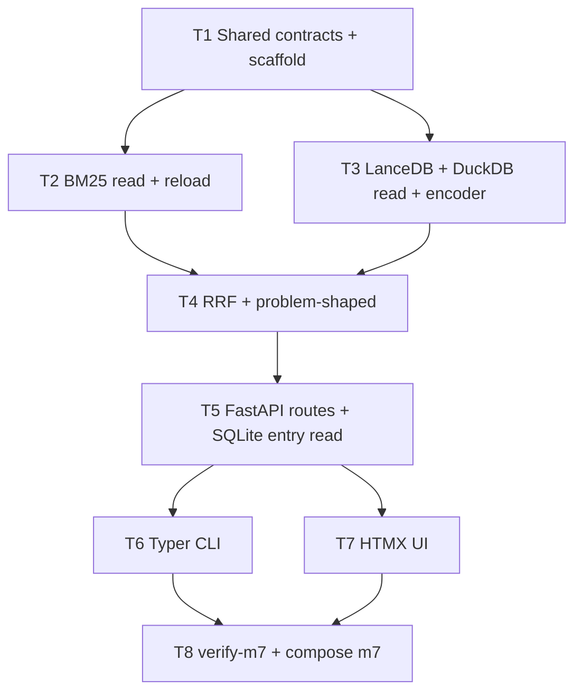

# M7 — Read Path

**Plan name:** `m7-read-path`  
**Version:** 1.0  
**Status:** Complete — auditor handoff at `.dev/plans/m7-read-path/handoff.md`  
**Charter slice:** `.dev/bishop_program_charter.md` L440–488  
**Normative spec:** `bishop_spec_0_6.md` v1.5.0 (tracked @ HEAD)  
**Subtask budget:** 8 (within 4–10)

---

## 0. Context map intake

| Field | Value |
|-------|-------|
| **Path consumed** | `.dev/plans/m7-read-path/context-map.md` |
| **Readiness verdict** | CONDITIONAL |
| **Scope-area labels flagged** | Flag 1 (store read placement), Flag 2 (entry detail source), Flag 3 (CLI name), Flag 4 (metadata filter mode), Flag 5 (entry gates), Flag 6 (requirements pin) |
| **Skill version + SHA** | pre-plan-exploration v0.3 (orchestrator synthesis) · scout SHA `e207960e12cb581deaa68c06ee35c08f18bc70fa` |

**M6 entry gate:** `.dev/plans/m6-indexing/handoff.md` — G5 fixture gate passed; `INDEXED` entries producible via M6 integration harness; implementation anchor `01d58c2`; BM25/LanceDB/DuckDB contracts in `bishop_shared/indexing_config.py` and `vector-writer` stores.

**Prior handoff:** `.dev/plans/m6-indexing/handoff.md`

**Architecture folder:** `.dev/architecture/bishop/` @ scout SHA — **stale** (post-M6 refresh not committed); query-api/ui rows still M0 stub prediction.

**Binding-artifact resolvability:**

| Artifact | Status |
|----------|--------|
| `bishop_spec_0_6.md` | **Binding** — tracked |
| `.dev/plans/m7-read-path/context-map.md` | **Binding** — this plan's scout artifact |
| `.dev/plans/m6-indexing/handoff.md` | **Binding** — tracked (M7 entry gate) |
| `.dev/bishop_program_charter.md` | **Binding** — tracked |

**Orch resolutions (context-map flags → frozen in this plan):**

| Flag | Resolution |
|------|------------|
| 1 | **Store read placement (binding):** Read/search modules live under `services/query-api/app/stores/` and `services/query-api/app/retrieval/`. Do **not** import `services.vector-writer` from query-api. Share path constants and pickle payload schema via `bishop_shared/indexing_config.py` + `bishop_shared/bm25_tokenize.py`. Owned by **T1** (tokenize) + **T2** (BM25 reader) + **T3** (LanceDB/DuckDB readers). |
| 2 | **Entry detail source (binding):** `GET /entries/{source_id}` on **query-api** reads SQLite at `SQLITE_DB_PATH` with **read-only** `aiosqlite` connection (no writes, no state transitions). **No state-worker hub amendment.** Owned by **T5**. |
| 3 | **CLI name (binding):** Console script `bishop` (`pyproject.toml` `[project.scripts] bishop = "bishop_cli.main:app"`). Spec §16.4 `kb` examples are **illustrative**; binding CLI string is `bishop`. Owned by **T6**. |
| 4 | **Metadata filter mode (binding):** `GET /search` applies DuckDB metadata predicates as **pre-filter** (candidate `source_id` set) before retrieval channels run. `GET /recent` uses DuckDB only (no RRF). Post-filter reserved for future exploratory mode — not in M7. Owned by **T4** + **T5**. |
| 5 | **Entry gates (binding):** M7 **execution** may proceed when M6 pytest gate is green and M6 integration produces `INDEXED` entries. Charter G5 live / G6 sampling / G4 full e2e are **owner sign-off** items documented in T8 kill criteria as `runtime-armed only` — not automated blockers unless `BISHOP_M7_REQUIRE_GATES=1` set in CI. |
| 6 | **Requirements pin (binding):** Single `services/query-api/requirements.txt` owned incrementally by T2–T5; pin `lancedb`, `duckdb`, `rank-bm25`, `sentence-transformers`, `fastapi`, `uvicorn`, `httpx`, `typer` with lower bounds matching `services/vector-writer/requirements.txt` for shared store libraries. T8 verifies no version conflict via import smoke test. |

---

## 1. Task statement

**(a) Active milestone ID:** M7 — Read Path

**(b) Charter version:** `.dev/bishop_program_charter.md` v0.1.0

**(c) Charter non-goals (verbatim):** Full UI (escalation panel manual retry/permanent-fail, reading status updates — deferred to M8). Reranker (§23). Query expansion (§23). Cross-domain query (§23). Daily digest (§23). All non-ArXiv adapters.

Implement `query-api` (RRF fusion, challenge_hooks channel, graceful cold-start G7), Typer CLI wrapper, and minimal UI (batch summary list and search). The read path is queryable from the CLI and browser against `INDEXED` entries.

**Non-goals:**
- Full UI escalation panel with manual retry/permanent-fail and reading status updates (deferred to M8).
- Reranker (`ms-marco-MiniLM-L-6-v2`, §16.6).
- Query expansion (§16.5).
- Cross-domain query (§19.3, §23).
- Daily digest (§17.2).
- DB explorer page (spec §17.3 page 5) — deferred to M8 unless time remains after MVP; not in M7 exit gate.
- Remaining source adapters (M8).
- Backfill enable (M8 / G7 program gate).
- Changes to `state-worker` REST surface, `ProcessingState` enum, or hub write paths.
- Changes to `vector-writer` write path (read compatibility only via shared constants/pickle format).
- Embedding model upgrade to `nomic-embed-text` unless G5 live fails and charter owner authorizes §7 amendment.
- All items in §23 and §24 of `bishop_spec_0_6.md` are non-goals for this plan.

---

## 2. Shared contracts

### Types / interfaces

| Symbol | Owner | Typed surface | Test |
|--------|-------|---------------|------|
| `RRF_K` | T1 | `bishop_shared/query_config.py` — literal `60` | `tests/test_query_config.py::test_rrf_k_pinned` |
| `BM25_RELOAD_INTERVAL_SEC` | T1 | `bishop_shared/query_config.py` — default `300`, env `BISHOP_BM25_RELOAD_INTERVAL_SEC` | `tests/test_query_config.py::test_bm25_reload_interval_default` |
| `DEFAULT_SEARCH_DOMAIN` | T1 | `bishop_shared/query_config.py` — literal `"professional"` (`DomainEnum.PROFESSIONAL` wire) | `tests/test_query_config.py::test_default_search_domain` |
| `tokenize_bm25(text)` | T1 | `bishop_shared/bm25_tokenize.py` — `text.lower().split()` | `tests/test_bm25_tokenize.py::test_tokenize_matches_writer_semantics` |
| `Bm25QueryIndex` | T2 | `services/query-api/app/stores/bm25_reader.py` — `load()`, `search(query, k)`, `reload_cow()` for main + hooks per domain | `tests/test_query_api_bm25_reader.py` |
| `LanceDbSearcher` | T3 | `services/query-api/app/stores/lancedb_reader.py` — `search(vector, k, domain?)`, empty if no table | `tests/test_query_api_lancedb_reader.py` |
| `DuckDbReader` | T3 | `services/query-api/app/stores/duckdb_reader.py` — `connect(read_only=True)`, `filter_source_ids(...)`, `recent(...)`, empty if no table | `tests/test_query_api_duckdb_reader.py` |
| `QueryEmbeddingEncoder` | T3 | `services/query-api/app/embedding.py` — `encode_query(text) -> list[float]`; raw query string (not N1 concat) | `tests/test_query_api_embedding.py` |
| `is_problem_shaped(query)` | T4 | `services/query-api/app/retrieval/problem_shaped.py` — §16.3 prefix + content heuristics | `tests/test_problem_shaped.py` |
| `rrf_fuse(rank_lists, k=RRF_K)` | T4 | `services/query-api/app/retrieval/rrf.py` — returns `list[tuple[source_id, score]]` sorted desc | `tests/test_rrf.py` |
| `SearchRequest` / `SearchHit` | T5 | `services/query-api/app/models.py` — pydantic query params + response DTO | `tests/test_query_api_models.py` |
| `GET /search` | T5 | FastAPI route — `q` required; optional `domain`, `source`, `tags`, `min_relevance`, `days`, `type`, `reading_status` | `tests/test_query_api_routes_search.py` |
| `GET /recent` | T5 | `source?`, `days?` (default 7), `domain?` | `tests/test_query_api_routes_recent.py` |
| `GET /entries/{source_id}` | T5 | SQLite read — full `Entry` fields incl. `content_raw` | `tests/test_query_api_routes_entry.py` |
| `GET /batches` | T5 | Proxy to `STATE_WORKER_URL/batches` | `tests/test_query_api_routes_batches.py` |
| `GET /batches/{batch_id}` | T5 | Proxy + join top 20 entries from DuckDB/SQLite by `relevance_score` | same |
| `GET /escalations` | T5 | Proxy to state-worker | `tests/test_query_api_routes_escalations.py` |
| `G7 cold-start init` | T1 | `services/query-api/app/lifespan.py` — missing BM25 dir → empty index WARN; missing LanceDB table → skip WARN; missing DuckDB table → empty WARN; never crash | `tests/test_query_api_cold_start.py` |
| `bishop` Typer app | T6 | `bishop_cli/main.py` — subcommands `search`, `recent`, `batch`, `escalations` | `tests/test_bishop_cli.py` |
| `QUERY_API_BASE_URL` | T6 | env default `http://localhost:8080` (host); in compose `http://query-api:8000` | `tests/test_bishop_cli_config.py` |
| UI `QUERY_API_URL` | T7 | `services/ui/app/config.py` — env `QUERY_API_URL` | `tests/test_ui_config.py` |
| Compose `bishop/query-api:m7` | T8 | `docker-compose.yml` | `tests/test_compose.py` |
| Compose `bishop/ui:m7` | T8 | same | same |
| `scripts/verify-m7.sh` | T8 | pytest module list frozen in test | `tests/test_verify_m7.py` |

**Decision log paths (architectural):**
- T1: `.dev/decision-logs/m7-read-path/T1-query-shared-contracts.md`
- T4: `.dev/decision-logs/m7-read-path/T4-rrf-problem-shaped.md`

**M6 contracts consumed (read-only — do not redefine):**
- `EMBEDDING_MODEL`, `EMBEDDING_DIM`, `LANCEDB_DIR`, `LANCEDB_TABLE_NAME`, `DUCKDB_PATH`, `bm25_domain_root`, BM25 subdirs from `bishop_shared/indexing_config.py`
- BM25 pickle payload: `{"corpus": list[list[str]], "source_ids": list[str]}` per `Bm25DualIndex` writer

### Error envelope

**query-api:**

| Condition | Behavior |
|-----------|----------|
| Missing store at startup (G7) | WARN log `event=store_cold_start_empty`; serve empty results for that channel |
| BM25 reload failure | WARN `event=bm25_reload_failed`; keep previous in-memory index |
| LanceDB search on missing table | Return empty dense channel (score 0 contribution) |
| DuckDB missing table | Metadata filter returns empty set → empty search results |
| Invalid query params | HTTP 400 `{"error": "<code>", "detail": "..."}` |
| Entry not found | HTTP 404 `{"error": "not_found", "source_id": "..."}` |
| State-worker proxy non-2xx | Pass through status; body `{"error": "upstream_error", "status": N}` |
| SQLite read error | HTTP 500 `{"error": "sqlite_read_failed"}`; log ERROR |

**Search response shape (binding):**

```json
{
  "query": "...",
  "problem_shaped": false,
  "channels_active": ["bm25_main", "dense"],
  "hits": [
    {
      "source_id": "arxiv:...",
      "rrf_score": 0.032,
      "title": "...",
      "summary": "...",
      "relevance_score": 0.85,
      "entry_type": "paper",
      "tags": ["RAG"]
    }
  ],
  "total": 1
}
```

Default `k` per channel: `20`. Final hits capped at `20`.

### Naming

| Kind | Name |
|------|------|
| Service package | `services/query-api/app/`, `services/ui/app/` |
| CLI package | `bishop_cli/` at repo root |
| Console script | `bishop` |
| FastAPI app module | `services/query-api/app/main.py` |
| UI app module | `services/ui/app/main.py` |
| Test prefix | `test_query_api_*`, `test_ui_*`, `test_bishop_cli_*`, `test_m7_*` |

### Logging

Structured `extra` fields: `event`, `source_id`, `domain`, `channel`, `query` (truncated 200 chars). Levels: INFO for search dispatch; WARN for G7 cold-start and reload failures; ERROR for upstream/sqlite failures.

### Tests

- Framework: pytest (repo root `tests/`, `pythonpath = ["."]`)
- Unit tests mock LanceDB/DuckDB/BM25/state-worker where heavy
- Integration: `tests/test_m7_integration.py` seeds M6-style indexed stores + SQLite row, exercises `/search` and cold-start
- Gate: `scripts/verify-m7.sh` runs M7 pytest slice + G2 regression subset
- Coverage expectation: every §2 row has named test; RRF and problem-shaped have pure unit tests with frozen fixtures

### CLI surface

| Subcommand | HTTP mapping | Frozen in |
|------------|--------------|-----------|
| `bishop search <query>` | `GET /search?q=` + Typer options `--type`, `--days`, `--tags`, `--min-relevance`, `--domain`, `--source`, `--reading-status` | T6 |
| `bishop recent` | `GET /recent` + `--source`, `--days`, `--domain` | T6 |
| `bishop batch <batch_id>` | `GET /batches/{batch_id}` | T6 |
| `bishop escalations` | `GET /escalations` | T6 |

---

## 3. Dependency DAG



**Parallel groups:** `{T2, T3}` after T1 completes; `{T6, T7}` after T5 completes.

**Soft dependency:** T7 batch detail page benefits from T5 batch enrichment but can ship read-only proxy first.

---

## 4. Subtask specs

### T1

| Field | Content |
|--------|---------|
| **ID** | T1 |
| **Scope** | Add `bishop_shared/query_config.py`, `bishop_shared/bm25_tokenize.py`; query-api FastAPI scaffold (`main.py`, `config.py`, `lifespan.py` with G7 cold-start stubs); `requirements.txt` skeleton; health route `GET /health`. Optionally refactor `vector-writer` `bm25_store._tokenize` to import `tokenize_bm25` (one-line import change only). |
| **Files to touch** | `bishop_shared/query_config.py`, `bishop_shared/bm25_tokenize.py`, `services/query-api/app/main.py`, `config.py`, `lifespan.py`, `requirements.txt`, `services/query-api/Dockerfile`, `tests/test_query_config.py`, `tests/test_bm25_tokenize.py`, `tests/test_query_api_cold_start.py`, optionally `services/vector-writer/app/stores/bm25_store.py` |
| **Contract bindings** | All T1 §2 rows; G7 cold-start |
| **Inputs** | None |
| **Outputs** | Shared query constants, tokenize contract, query-api process entry with cold-start WARN paths |
| **Kill criteria** | Halt if cold-start raises on missing BM25/LanceDB/DuckDB paths. Halt if `RRF_K != 60`. Halt if context-map Flag 3 unresolved at execution start (CLI name must be `bishop` in plan, not decided here). Halt if query-api Dockerfile still CMD `stub_main.py`. |
| **Log tier** | architectural |
| **Risks & mitigations** | Risk: touching vector-writer for tokenize — keep to import-only swap; run `test_bm25_store.py` if changed. |

### T2

| Field | Content |
|--------|---------|
| **ID** | T2 |
| **Scope** | Implement `Bm25QueryIndex`: load main + challenge_hooks pickles from `bm25_domain_root(domain)`, `search(query, k)` using `tokenize_bm25`, periodic background reload with copy-on-write swap (§8.4 G5 reload atomicity). |
| **Files to touch** | `services/query-api/app/stores/bm25_reader.py`, `services/query-api/app/stores/__init__.py`, `services/query-api/requirements.txt`, `tests/test_query_api_bm25_reader.py` |
| **Contract bindings** | T2 §2 rows; T1 tokenize + paths |
| **Inputs** | T1 |
| **Outputs** | BM25 reader with load/search/reload_cow + tests using tmp pickle fixtures from writer format |
| **Kill criteria** | Halt if reload mutates in-place index object visible to concurrent readers (must COW). Halt if hooks and main indices loaded from wrong subdirs. Halt if pickle schema ≠ writer `{"corpus", "source_ids"}`. Halt if context-map Flag 1 unresolved at execution start. |
| **Log tier** | architectural |
| **Risks & mitigations** | Risk: reload during vector-writer persist — reader catches pickle/EOF errors, keeps old index, logs WARN. |

### T3

| Field | Content |
|--------|---------|
| **ID** | T3 |
| **Scope** | Implement `LanceDbSearcher` (cosine top-k on `entries` table), `DuckDbReader` (`read_only=True`), `QueryEmbeddingEncoder` wrapping same `EMBEDDING_MODEL` as vector-writer. |
| **Files to touch** | `services/query-api/app/stores/lancedb_reader.py`, `duckdb_reader.py`, `services/query-api/app/embedding.py`, `requirements.txt`, `tests/test_query_api_lancedb_reader.py`, `tests/test_query_api_duckdb_reader.py`, `tests/test_query_api_embedding.py` |
| **Contract bindings** | T3 §2 rows; indexing_config constants |
| **Inputs** | T1 |
| **Outputs** | Dense + metadata read modules |
| **Kill criteria** | Halt if DuckDB opened without `read_only=True`. Halt if vector dimension ≠ `EMBEDDING_DIM`. Halt if LanceDB search runs when table missing without returning empty list. Halt if context-map Flag 6 unresolved at execution start. |
| **Log tier** | architectural |
| **Risks & mitigations** | Risk: model download — mock in unit tests; document HF cache for Docker. |

### T4

| Field | Content |
|--------|---------|
| **ID** | T4 |
| **Scope** | Implement `is_problem_shaped()` per §16.3 and `rrf_fuse()` per §16.2; retrieval orchestrator `run_search()` wiring channels 1–3 with inactive channel contributing 0. |
| **Files to touch** | `services/query-api/app/retrieval/problem_shaped.py`, `rrf.py`, `search.py`, `tests/test_problem_shaped.py`, `tests/test_rrf.py`, `tests/test_query_api_search_orchestrator.py`, `.dev/decision-logs/m7-read-path/T4-rrf-problem-shaped.md` |
| **Contract bindings** | T4 §2 rows; `RRF_K` |
| **Inputs** | T2, T3 |
| **Outputs** | Pure retrieval fusion module + unit tests with frozen rank lists |
| **Kill criteria** | Halt if `RRF_K` not read from `bishop_shared/query_config.py`. Halt if problem-shaped query does not activate channel 3 in orchestrator. Halt if inactive channel 3 penalizes scores on standard query (must be 0 contribution). Halt if context-map Flag 4 unresolved at execution start. |
| **Log tier** | architectural |
| **Risks & mitigations** | Risk: over-broad problem-shaped heuristic — acceptable per spec; document in decision log. |

### T5

| Field | Content |
|--------|---------|
| **ID** | T5 |
| **Scope** | Wire FastAPI routes: `/search`, `/recent`, `/entries/{source_id}`, proxy `/batches`, `/batches/{batch_id}` (enriched), `/escalations`; SQLite entry reader; pydantic models; integrate T4 orchestrator with G7 store holders from lifespan. |
| **Files to touch** | `services/query-api/app/routers/search.py`, `recent.py`, `entries.py`, `batches.py`, `escalations.py`, `models.py`, `sqlite_reader.py`, `main.py`, `tests/test_query_api_routes_*.py`, `tests/test_query_api_models.py` |
| **Contract bindings** | All T5 §2 rows; error envelope |
| **Inputs** | T4 |
| **Outputs** | Complete query-api HTTP surface |
| **Kill criteria** | Halt if hub-drift: any edit to `services/state-worker/` beyond test fixtures. Halt if `GET /entries/{source_id}` performs SQLite writes. Halt if `/search` skips metadata pre-filter when `min_relevance` or `days` provided. Halt if state-worker proxy hardcodes wrong base URL (must use config `STATE_WORKER_URL`). |
| **Log tier** | standard |
| **Risks & mitigations** | Risk: JSON list columns in SQLite — parse consistently with state-worker serialization. |

### T6

| Field | Content |
|--------|---------|
| **ID** | T6 |
| **Scope** | Typer CLI `bishop` with subcommands calling query-api via httpx; add `bishop_cli/` package and `pyproject.toml` `[project.scripts]` + optional `typer` dependency in dev extras or root dependencies. |
| **Files to touch** | `bishop_cli/main.py`, `bishop_cli/config.py`, `pyproject.toml`, `tests/test_bishop_cli.py`, `tests/test_bishop_cli_config.py` |
| **Contract bindings** | CLI surface table; `QUERY_API_BASE_URL` |
| **Inputs** | T5 (frozen route paths) |
| **Outputs** | Runnable `bishop search|recent|batch|escalations` |
| **Kill criteria** | Halt if console script name ≠ `bishop`. Halt if CLI constructs URLs not matching T5 routes (e.g. `/search` not `/api/search`). Halt if context-map Flag 3 unresolved at execution start. |
| **Log tier** | standard |
| **Risks & mitigations** | Risk: Windows console encoding — use UTF-8 stdout for query strings. |

### T7

| Field | Content |
|--------|---------|
| **ID** | T7 |
| **Scope** | HTMX UI: batch summary list (`/batches?status=complete`), search page, batch detail with top entries, entry detail page; FastAPI templates; `QUERY_API_URL` client; no direct store access. |
| **Files to touch** | `services/ui/app/main.py`, `config.py`, `templates/*.html`, `static/` (minimal), `services/ui/Dockerfile`, `requirements.txt`, `tests/test_ui_config.py`, `tests/test_ui_routes.py` |
| **Contract bindings** | UI `QUERY_API_URL`; charter MVP pages |
| **Inputs** | T5 |
| **Outputs** | Runnable ui service with HTMX pages |
| **Kill criteria** | Halt if ui reads LanceDB/BM25/SQLite directly (must use query-api only). Halt if ui calls state-worker for `/search`. Halt if Dockerfile still CMD `stub_main.py`. Halt if batch summary does not filter `status=complete`. |
| **Log tier** | standard |
| **Risks & mitigations** | Risk: template path in Docker — use package-relative templates. |

### T8

| Field | Content |
|--------|---------|
| **ID** | T8 |
| **Scope** | M7 exit gate: `tests/test_m7_integration.py` (search + problem-shaped channel + cold-start), `scripts/verify-m7.sh`, compose tags `m7`, ui `QUERY_API_URL` env, graduate query-api/ui in `test_service_stubs.py`, `CHANGELOG.MD`. |
| **Files to touch** | `tests/test_m7_integration.py`, `tests/test_verify_m7.py`, `scripts/verify-m7.sh`, `docker-compose.yml`, `tests/test_compose.py`, `tests/test_service_stubs.py`, `CHANGELOG.MD` |
| **Contract bindings** | All §2 rows; CLI verify-m7 |
| **Inputs** | T6, T7 |
| **Outputs** | Runnable M7 checkpoint evidence |
| **Kill criteria** | Halt if integration cannot return search hits from seeded BM25+LanceDB+DuckDB fixtures. Halt if problem-shaped query fixture does not include `channels_active` containing `bm25_hooks`. Halt if cold-start test crashes on empty stores. Halt if compose still `bishop/query-api:m0` or `bishop/ui:m0`. Halt if verify-m7.sh omits any new contract test module. |
| **Log tier** | standard |
| **Risks & mitigations** | Risk: charter G4/G5/G6 gates — document manual sign-off in CHANGELOG; optional `BISHOP_M7_REQUIRE_GATES=1` for strict CI. Live docker e2e deferred per M3–M6 pattern. |

---

## 5. Adversarial pass

### 5.1 Rejected decompositions

**Rejected: single "query-api" monolith subtask.** Would forbid charter-parallel development of BM25, dense, and DuckDB retrieval functions and exceed executor focus.

**Rejected: extend `vector-writer` stores with search methods.** Couples query-api Docker image to vector-writer package layout; violates service boundary; M6 handoff explicitly deferred reload to M7 query-api.

**Rejected: add `GET /entries/{source_id}` to state-worker.** Hub restriction — sole writer service; non-claiming reads belong on query-api per spec §8.1 L517.

**Rejected: implement DB explorer and escalation actions in M7.** Charter non-goals defer full escalation panel and DB explorer to M8; MVP is batch summary + search + entry detail.

**Rejected: CLI name `kb`.** Charter runnable checkpoint explicitly says `bishop search`; spec `kb` examples labeled illustrative in §2 CLI rule.

### 5.2 Load-bearing assumptions

```
(M6 BM25 pickle format stable for query-api reader | contract surface: bm25_store.py _IndexState.to_payload keys corpus+source_ids | search returns wrong ranks or load crash | T2,T8)

(M6 LanceDB table schema matches LanceDbSearcher expectations | contract surface: lancedb_store.py LanceRow fields + EMBEDDING_DIM | dense channel empty or dimension error | T3,T8)

(DuckDB read_only=True sufficient while vector-writer not holding write connection | contract surface: duckdb_reader.py read_only=True + test_duckdb_concurrent_read.py pattern | query-api startup crash on lock | T3,T5,T8)

(INDEXED entries exist in all three stores for integration gate | contract surface: test_m6_integration.py harness | M7 integration falsifiers pass vacuously | T8)

(tokenize_bm25 matches writer tokenization | contract surface: bishop_shared/bm25_tokenize.py | BM25 channel rank drift vs index time | T1,T2)

(state-worker GET /batches and /escalations wire stable from M1 | contract surface: batches.py routers | proxy routes break UI batch list | T5,T7,T8)
```

### 5.3 Highest re-plan risk

**T5** — SQLite entry reader + batch detail enrichment joins three data sources (state-worker proxy, DuckDB scores, SQLite `content_raw`). Schema/column surprises or JSON list parsing mismatches most likely force route-shape amendments.

### 5.4 Hidden couplings

```
(BM25 reload interval vs vector-writer persist frequency | contract surface: BM25_RELOAD_INTERVAL_SEC default 300 | new entries visible in dense but not BM25 up to 5min | T2,T8) — confirmed

(query-api requirements.txt vs vector-writer dependency versions | contract surface: lancedb/duckdb pins in both requirements.txt | import/runtime incompatibility on shared data files | T3,T8) — confirmed

(ui QUERY_API_URL missing in compose today | contract surface: docker-compose.yml ui environment | ui cannot reach search API in docker | T7,T8) — confirmed

(pyproject.toml bishop CLI vs Docker-only deploy | contract surface: [project.scripts] bishop | CLI works locally but not in query-api container — intentional; CLI is host tool | T6) — confirmed

(problem-shaped false positive activates channel 3 | contract surface: problem_shaped.py heuristics §16.3 | wider result set not crash | T4,T8) — suspected; disproven as blocker by spec accepting broader retrieval

(SQLite WAL concurrent read during state-worker write | contract surface: SQLITE_DB_PATH aiosqlite read | intermittent read errors on entry detail | T5) — suspected; mitigated by read-only short connections
```

---

## 6. Executor packets

Packets emitted to `.dev/plans/m7-read-path/packets/`:

| Packet | Path |
|--------|------|
| T1 | `.dev/plans/m7-read-path/packets/T1.md` |
| T2 | `.dev/plans/m7-read-path/packets/T2.md` |
| T3 | `.dev/plans/m7-read-path/packets/T3.md` |
| T4 | `.dev/plans/m7-read-path/packets/T4.md` |
| T5 | `.dev/plans/m7-read-path/packets/T5.md` |
| T6 | `.dev/plans/m7-read-path/packets/T6.md` |
| T7 | `.dev/plans/m7-read-path/packets/T7.md` |
| T8 | `.dev/plans/m7-read-path/packets/T8.md` |

---

## 7. Amendment subtasks

None — initial plan v1.0.

**Pre-declared triggers:**
- G5 live `BISHOP_G5_LIVE=1` fails → §7 amendment for `nomic-embed-text` upgrade (charter §8.4) before M8 backfill; may affect `indexing_config` + both encoder modules.
- Auditor finds state-worker GET required for entry detail → escalate Tier 2 charter (hub extension), not silent M7 amendment.

---

## 8. Auditor handoff

**Status:** Complete — see [handoff.md](handoff.md) (tree SHA `1be89cbf480fc7d7c3da450933fca17efc8dac71`).

§8.1–§8.6 populated in handoff artifact. Primary gate: `scripts/verify-m7.sh` — 136 passed across G2 + M7 slices (models/integration in isolated subprocesses).
