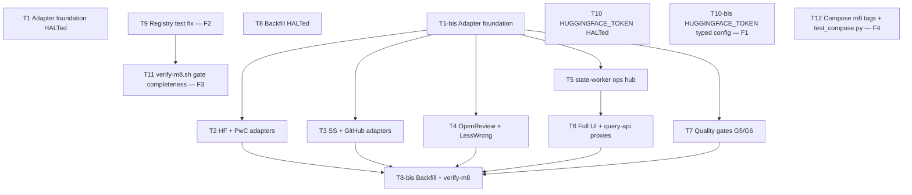

# M8 — Hardening and Scale

**Plan name:** `m8-hardening-scale`  
**Version:** 1.5  
**run_status:** amended  
**Status:** Amendment-complete, audit-pending (2026-09-11). Amendment-3/4 remediations landed: T9 F2 `be024148e02ffbb77d37632e6760b2b0e758ec4d`; T12 F4 `ba2ad79ca2390b010811563786be8485e86b0164`; T11 F3 `f4a793b183c2f636e47e7ebc52c46c2b55beec97`; T10-bis F1 `9f183675d6a713d76c3f822dcabb813f012d5c4d`. T1 / T8 / T10 remain halted (packets unmodified; do not re-dispatch). §8.1–§8.6 populated for re-audit revision 2. `run_status` stays `amended`. Re-audit slot: `audit_status: not_run`.  
**Charter path:** `.dev/bishop_program_charter.md`  
**Charter version:** `0.1.0`  
**Milestone ID:** `M8`  
**Charter slice:** `.dev/bishop_program_charter.md` L492–540  
**Normative spec:** `bishop_spec_0_6.md` v1.5.0 (tracked @ HEAD)  
**Subtask budget:** 15 (was 14). **Budget-amendment (crosses ceiling, disclosed per §Budget):** prior authorized 14 (amendment-3, T9–T12), new count 15 (amendment-4). One continuation added — `T10-bis` closed the T10 HALT and audit F1 (`9f18367`). Packet `T10.md` stays unmodified. This exceeds §Budget's 4–10 range; disclosed rather than compressed. No charter escalation: in-milestone residual of F1.  
**Orch skill:** orchestrator-planning v1.2  
**Supersedes:** plan v1.4 (`run_status: amended`; T9/T12 complete; T10 halted; T11 pending)  
**Amendment round:** `amendment-4` (node `T10-bis`)  
**Audit consumed:** `.dev/audits/2026-09-10-m8-hardening-scale.md`, revision 1, verdict `fail`, `audit_status: blocked` (historical — F1–F4). Landed closers: F2 T9 `be02414`; F4 T12 `ba2ad79`; F3 T11 `f4a793b`; F1 T10-bis `9f18367`. F5–F8 remain deferred (rev-1 minor/observation). Re-audit revision 2 is `audit_status: not_run`.

---

## 0. Context map intake

| Field | Value |
|-------|-------|
| **Path consumed** | `.dev/plans/m8-hardening-scale/context-map.md` |
| **Readiness verdict** | CONDITIONAL |
| **Scope-area labels flagged** | Flag 1 (reading_status write path), Flag 2 (permanent-fail operator path), Flag 3 (LessWrong API), Flag 4 (ArXiv backfill window), Flag 5 (DB explorer scope), Flag 6 (Mark Resolved deferred) |
| **Skill version + SHA** | orchestrator-planning v0.8 · scout SHA `48098900eb546cbac9fcb22e7f5180536255007e` |

**M7 entry gate:** `.dev/plans/m7-read-path/handoff.md` — implementation anchor `1be89cbf480fc7d7c3da450933fca17efc8dac71`; query-api/ui/cli landed; G4/G5/G6 manual gates **open** per handoff §8.4.

**Prior handoff:** `.dev/plans/m7-read-path/handoff.md`

**Architecture folder:** `.dev/architecture/bishop/` @ scout SHA — **stale** (post-M7 refresh not committed); scraper/ui rows understate M7/M4 landed state.

**Binding-artifact resolvability:**

| Artifact | Status |
|----------|--------|
| `bishop_spec_0_6.md` | **Binding** — tracked |
| `.dev/plans/m8-hardening-scale/context-map.md` | **Binding** — this plan's scout artifact |
| `.dev/plans/m7-read-path/handoff.md` | **Binding** — tracked |
| `.dev/bishop_program_charter.md` | **Binding** — tracked |

**Orch resolutions (context-map flags → frozen in this plan):**

| Flag | Resolution |
|------|------------|
| 1 | **Reading status (binding):** `PATCH /entries/{source_id}/reading-status` on **state-worker** (hub extension authorized by M8 charter). Body: `{"reading_status": "<ReadingStatusEnum>"}`. Updates `entries.reading_status` only (manifest unchanged). query-api proxies PATCH; UI posts via query-api. **Search filter:** when `reading_status` query param set, query-api `run_search` intersects candidates via **SQLite** `entries` read (`sqlite_reader`) — not DuckDB — to avoid stale mirror. Owned by **T5** (state-worker) + **T6** (query-api + UI). |
| 2 | **Permanent-fail (binding):** `POST /entries/permanent-fail` on state-worker; body `{"source_id": "..."}`; only from `ESCALATION_FLAGGED` → `PERMANENTLY_FAILED`; 409 otherwise. query-api POST proxy `/entries/{source_id}/permanent-fail`. Owned by **T5** + **T6**. |
| 3 | **LessWrong (binding):** T4 runs GraphQL introspection/query probe at start. If unreachable or schema incompatible, **omit** `LessWrongAdapter` from `ADAPTER_REGISTRY` and document in `.dev/decision-logs/m8-hardening-scale/T4-openreview-lesswrong.md` — not a plan halt. |
| 4 | **ArXiv backfill window (binding):** `ARXIV_BACKFILL_WINDOW_DAYS` remains `7` for non-backfill runs. When `BISHOP_BACKFILL_ENABLED=1`, default `60` (§18.2) unless env override. T8 owns env contract + compose docs. |
| 5 | **DB explorer (binding):** HTMX page `/explorer` with filter form (source, domain, tags, date range, entry_type, reading_status) submitting to existing `GET /search` metadata params — no new query-api route family. Owned by **T6**. |
| 6 | **Mark Resolved:** Explicit **non-goal** for M8 (charter contract surfaces list retry + permanent-fail only). |

**Numbered dispositions (v1.1 — operator caveats + map prose):**

| # | Item | Disposition |
|---|------|-------------|
| 1–6 | Context-map flags | `resolved` — frozen in the table above; matching §4 kill criteria remain |
| 7 | v1.0 T7 scoped G6 as "CSV scaffold + 20 pre-filter / 10 enrichment" | `resolved` — operator superseded this session; T7 re-scoped (prefilter gold consume, enrichment 10-entry remains). Charter G6 floor of 20 is met by 129-item `eval/prefilter_v1` (exceeds floor). Not a charter Tier-2: same gate, larger evidence set. |
| 8 | `index_policy` / ArXiv category gate / split profile pins are live-adjacent and already landed | `resolved` — absorb as frozen; M8 packets do not own them. T1 may consume `BACKFILL_CONFIG` on `arxiv.py` without replacing `apply_category_gate`. |
| 9 | Architecture folder stale vs M7/M4 landed state | `checklist row` — T8 Files-to-touch owns `.dev/architecture/bishop/` refresh |
| 10 | M7 handoff: G4/G5/G6 manual gates open | `resolved` (v1.3) — G5 fixture landed; G6 prefilter gold at `5e04833`; G6 enrichment **assessed** 2026-09-10 (10 filled, 7/10 both-true, 3 hook rejects kept). Charter G6 says assessed, not all-true. Owner waiver: all-true pytest is not a T8-bis / G7 blocker. Call 1 hook iteration is follow-up `g6-call1-hooks-iteration`. |
| 11 | G5 fixture harness already exists (M6) | `resolved` — T7 consumes; does not rewrite `tests/test_g5_quality_gate.py`; may add `scripts/run-g5-quality-gate.sh` wrapper only |
| 12 | T8 HALT: G6 enrichment owner checkbox missing | `resolved` — T8-bis; packet `T8.md` unmodified. Checkbox meaning is the v1.3 waiver, not `BISHOP_G6_MANUAL=1` green. |
| 13 | Audit rev1 (2026-09-10) verdict `fail`; blocking F1 (major), F2 (critical), F3 (major), F4 (major, disclosed) | `resolved` (v1.4) — amendment-3 nodes T9 (F2), T10 (F1), T11 (F3), T12 (F4) below. F5–F8 stay `deferred`. |
| 14 | T10 HALT 2026-09-11: existing HF header test breaks under module-level `HUGGINGFACE_TOKEN` import | `resolved` (v1.5) — T10-bis continuation; original `packets/T10.md` unmodified. |

---

## 1. Task statement

**(a) Active milestone ID:** M8 — Hardening and Scale

**(b) Charter version:** `.dev/bishop_program_charter.md` v0.1.0

**(c) Charter non-goals (verbatim):** All §23 deferred items (graph layer, daily digest, cosine anchor migration, personal domain, cross-domain query, reranker, query expansion, local enrichment path, time-decayed weights, reading history analytics, Redis/Postgres upgrades). All §24 rejected items. `DomainEnum.both` (removed).

Implement remaining source adapters (HuggingFace, PapersWithCode, SemanticScholar, GitHub, OpenReview; LessWrong pending API verification), complete UI (escalation panel with manual retry/permanent-fail, reading status updates, DB explorer), run quality validation gates G5/G6, and enable chunked backfill across all registered sources after gates pass (G7).

**Non-goals:**
- Personal domain scrapers, NL profile, and workflow (§3.2, §19.2).
- Cross-domain query (§19.3).
- Reranker (`ms-marco-MiniLM-L-6-v2`, §16.6), query expansion (§16.5), daily digest (§17.2).
- Graph layer (Kuzu), cosine anchor migration, interest-profile re-enrichment, local Ollama enrichment path.
- Time-decayed retrieval weights, reading history analytics.
- Redis/Postgres infrastructure upgrades.
- `Mark Resolved` escalation action (spec §14.2 — deferred; charter exit gate does not require it).
- Changes to `batch-poller` or enrichment prompt templates except NL profile YAML iteration under T7 if **G6 enrichment** sampling fails (prefilter pin `professional_v1.2.0` is already calibrated — do not bump unless gold replay fails the owner bar).
- Embedding model upgrade to `nomic-embed-text` unless G5 live fails and charter owner authorizes §7 amendment (carry M7 handoff trigger).
- All items in §23 and §24 of `bishop_spec_0_6.md` are non-goals for this plan.
- **Already-landed — do not implement or rewrite:** `config/index_policy.yaml` + `bishop_shared/index_policy.py`; ArXiv category gate (`config/sources/arxiv.yaml`, `bishop_shared/source_config.py`, `apply_category_gate`); gate-split profile pins (`profile_renderer.py`: prefilter → `professional_v1.2.0.yaml`, enrichment → `professional_v1.0.0.yaml`).
- **Do not rebuild G6** as CSV scaffold / 20-item sample / `tests/test_g6_quality_sampling.py` / `scripts/run-g6-quality-sampling.sh` / `.dev/quality/g6-sampling-template.md` (v1.0 T7 paths — retired).
- **Do not rewrite** `tests/test_g5_quality_gate.py` or mutate `eval/prefilter_v1/**`.
- **v1.3:** Do not flip G6 enrichment reject flags to pass the all-true pytest. Do not edit `bishop_shared/enrichment_prompts.py` or `config/profiles/professional_v1.0.0.yaml` in this wave (follow-up `g6-call1-hooks-iteration`).

**Charter row dispositions:**

| Charter row | Disposition |
|-------------|-------------|
| `ADAPTER_REGISTRY` expanded (HF, PwC, SS, GitHub, OpenReview, LessWrong if verified) | §2 `ADAPTER_REGISTRY` (T8-bis) + T2–T4 adapter rows |
| `fetch_manifest` + `fetch_content` per new adapter | §2 adapter rows T2–T4 |
| Escalation panel: `GET /escalations`, `POST /entries/retry`, permanent-fail | §2 T5 + T6 rows |
| Reading status update via UI | §2 T5 + T6 rows |
| Backfill config: per-source `backfill_window_days` from §18.2 | §2 `BACKFILL_CONFIG` (T1-bis) + T8-bis env keys |
| Exit: G7 backfill running / all-sources e2e | §2 T8-bis env + `verify-m8.sh`; `cluster-runtime` owner T8-bis (decision log) |
| Exit: pre-filter quality gate | §2 G6 prefilter gold — landed, T7 consumes |
| Exit: enrichment quality gate (10 entries, `challenge_hooks` + `value_rationale`) | §2 G6 enrichment sampling — T7 template + **v1.3 Landed:** assessed 7/10, all-true waived |
| Exit: escalation panel functional | §2 UI `/escalations` (T6) |
| Entry: G4, G5, G6 satisfied | **v1.3:** T8-bis kill. G4 = live INDEXED corpus (97 rows 2026-09-10). G5 = T7 fixture bind. G6 = assessed + owner waiver (not all-true). |

---

## 2. Shared contracts

### Types / interfaces

**Enforcement default:** every row below is `pytest-enforced`; verification owner = **Owner** column, unless the row says otherwise.

| Symbol | Owner | Typed surface | Test |
|--------|-------|---------------|------|
| `BackfillConfig` | T1-bis | `bishop_shared/scraper_config.py` — frozen dataclass: `window_days: int`, `categories: tuple[str, ...] = ()` | `tests/test_scraper_config_shared.py::test_backfill_config_round_trip` |
| `BACKFILL_CONFIG` | T1-bis | `bishop_shared/scraper_config.py` — `dict[str, BackfillConfig]` per §18.2 (all seven source keys). **v1.2:** `arxiv.window_days=60` is the backfill-window datum, not the incremental default. Incremental `resolve_effective_since(since=None)` stays 7 days (`ARXIV_BACKFILL_WINDOW_DAYS`) until T8-bis enables backfill. | `tests/test_scraper_config_shared.py::test_backfill_config_matches_spec_defaults` |
| `SOURCE_RATE_LIMITS` (all sources) | T1-bis | `services/scraper/app/rate_limit.py` — Appendix B values for arxiv, github, semantic_scholar, huggingface, paperswithcode, openreview, lesswrong | `tests/test_scraper_rate_limit.py::test_all_source_rate_limits_match_appendix_b` |
| `SOURCE_SCHEDULE_INTERVAL_SEC` | T1-bis | `bishop_shared/scraper_config.py` — per-source default seconds (Appendix B table) | `tests/test_scraper_config_shared.py::test_schedule_defaults` |
| `BISHOP_BACKFILL_ENABLED` | T8-bis | `services/scraper/app/config.py` — bool env, default `False` | `tests/test_scraper_config.py::test_backfill_enabled_default_false` |
| `BISHOP_BACKFILL_CHUNK_DAYS` | T8-bis | `services/scraper/app/config.py` — int, default `7` | `tests/test_scraper_config.py::test_backfill_chunk_days_default` |
| `BISHOP_BACKFILL_INTER_CHUNK_DELAY_SEC` | T8-bis | `services/scraper/app/config.py` — int, default `300` | `tests/test_scraper_config.py::test_backfill_inter_chunk_delay_default` |
| `GITHUB_TOKEN` | T3 | `services/scraper/app/config.py` — optional `str \| None` from env | `tests/test_scraper_config.py::test_github_token_from_env` |
| `SEMANTIC_SCHOLAR_API_KEY` | T3 | `services/scraper/app/config.py` — optional | `tests/test_scraper_config.py::test_semantic_scholar_key_from_env` |
| `HUGGINGFACE_TOKEN` | **T10-bis** (T10 halted 2026-09-11: Files-to-touch omitted `tests/test_scraper_adapters_huggingface.py`. **v1.5:** continuation owns the typed surface + adapter switch + header-test `setattr`.) | `services/scraper/app/config.py` — optional `str \| None` via `_optional_str_from_env`, same shape as `GITHUB_TOKEN`/`SEMANTIC_SCHOLAR_API_KEY` | `tests/test_scraper_config.py::test_huggingface_token_from_env` + `test_huggingface_token_default_none` + `tests/test_scraper_adapters_huggingface.py::test_fetch_manifest_sends_huggingface_token_header` |
| `HuggingFaceAdapter` | T2 | `services/scraper/app/adapters/huggingface.py` — `fetch_manifest` + `fetch_content` | `tests/test_scraper_adapters_huggingface.py` |
| `PapersWithCodeAdapter` | T2 | `services/scraper/app/adapters/paperswithcode.py` | `tests/test_scraper_adapters_paperswithcode.py` |
| `SemanticScholarAdapter` | T3 | `services/scraper/app/adapters/semantic_scholar.py` | `tests/test_scraper_adapters_semantic_scholar.py` |
| `GitHubAdapter` | T3 | `services/scraper/app/adapters/github.py` | `tests/test_scraper_adapters_github.py` |
| `OpenReviewAdapter` | T4 | `services/scraper/app/adapters/openreview.py` | `tests/test_scraper_adapters_openreview.py` |
| `LessWrongAdapter` | T4 | `services/scraper/app/adapters/lesswrong.py` — conditional registry | `tests/test_scraper_adapters_lesswrong.py` (skip if probe fails) |
| `ADAPTER_REGISTRY` | T8-bis (module landed) / **T9** (test coverage — audit F2) | `services/scraper/app/adapters/registry.py` — ArXiv + landed T2–T4 adapters (LessWrong if verified) | `tests/test_scraper_loop.py::test_registry_lists_all_expected_sources` (declared since v1.0, never written until T9) **and** `tests/test_scraper_adapters.py`'s registry assertion (M2-era `test_registry_contains_only_arxiv` hard-asserted `len==1` — stale against the live 7-adapter registry; T9 rewrites it to assert current membership) |
| `ReadingStatusPatchRequest` | T5 | `services/state-worker/app/models/http.py` | `tests/test_state_worker_reading_status.py` |
| `PATCH /entries/{source_id}/reading-status` | T5 | state-worker entries router | `tests/test_state_worker_reading_status.py` |
| `PermanentFailPostRequest` | T5 | `services/state-worker/app/models/http.py` | `tests/test_state_worker_permanent_fail.py` |
| `POST /entries/permanent-fail` | T5 | state-worker entries router | `tests/test_state_worker_permanent_fail.py` |
| `POST /entries/{source_id}/retry` | T6 | query-api proxy → state-worker `POST /entries/retry` | `tests/test_query_api_routes_entry_actions.py` |
| `POST /entries/{source_id}/permanent-fail` | T6 | query-api proxy | `tests/test_query_api_routes_entry_actions.py` |
| `PATCH /entries/{source_id}/reading-status` | T6 | query-api proxy | `tests/test_query_api_routes_entry_actions.py` |
| UI `/escalations` | T6 | `services/ui/app/main.py` + templates | `tests/test_ui_escalations.py` |
| UI `/explorer` | T6 | DB explorer filter page | `tests/test_ui_explorer.py` |
| `scripts/verify-m8.sh` | T8-bis (script landed) / **T11** (gate-completeness extension — audit F3) | M8 pytest gate script. **v1.3:** invokes G5 fixture + G6 gold bind + G6 enrichment **structural** tests only. Must not set `BISHOP_G6_MANUAL=1` (manual checklist is expected-fail on kept hook rejects). **v1.4 Landed (T11):** extended to also invoke `tests/test_scraper_adapters.py` (post-T9 fix), `tests/test_state_worker_reading_status.py`, `tests/test_state_worker_permanent_fail.py`, `tests/test_query_api_routes_entry_actions.py`, `tests/test_ui_escalations.py`, `tests/test_ui_explorer.py`, and its own `tests/test_verify_m8.py` — the T5/T6 M8 contract surfaces the script previously never gated. Still must not export `BISHOP_G6_MANUAL=1`. | `tests/test_verify_m8.py` (extended by T11 with per-module assertions mirroring the existing `SCRAPER_TEST_MODULES` pattern) |
| G5 quality harness | LANDED (M6) — T7 consumes | `tests/test_g5_quality_gate.py` (frozen). T7 may add wrapper `scripts/run-g5-quality-gate.sh` only | existing `test_g5_quality_gate_fixture` / `test_g5_fixture_queries_count` — do not rewrite |
| G6 prefilter gold | LANDED — T7 consumes | `eval/prefilter_v1/contract.json` + `items.json` + `labels.json` + `scripts/replay_prefilter.py` | T7 `tests/test_g6_prefilter_gold.py` (existence + count ≥ 129 + replay script importable). **operator-verified** replay already accepted at HEAD `5e04833`. Do not rebuild gold |
| G6 enrichment sampling | T7 (template) + T8-bis (waiver consume) | `.dev/quality/g6-enrichment-template.md` + `tests/test_g6_enrichment_sampling.py` + `scripts/run-g6-enrichment-sampling.sh` | **Split:** `pytest-enforced` structural schema (T7). `operator-verified` 10-entry fill+judge (landed 2026-09-10). **Landed:** 7/10 both-true; hooks reject `arxiv:2606.09483`, `arxiv:2608.14509`, `arxiv:2606.27330`; all 10 rationales accepted. `test_g6_enrichment_manual_checklist` remains the all-true falsifier and is **expected-fail**. Owner waiver (Ale, 2026-09-10): charter G6 "assessed" is satisfied; do not flip flags; do not require `BISHOP_G6_MANUAL=1` green for T8-bis / G7. |
| `index_policy` | LANDED — M8 non-goal | `config/index_policy.yaml` + `bishop_shared/index_policy.py` (module-level loader). `enforce: false`, `keep_min: 0.40` | existing `tests/test_index_policy.py` — do not modify |
| `apply_category_gate` / `SourceCategoryConfig` | LANDED — M8 non-goal | `bishop_shared/source_config.py` + `arxiv.py::apply_category_gate` (module-function). Distinct from `BACKFILL_CONFIG.categories` | existing `tests/test_scraper_arxiv_adapter.py` — T1 must not remove or bypass the call from `_gate_by_category` |
| Gate-split profile pins | LANDED — M8 non-goal | `bishop_shared/profile_renderer.py` `_PROFILE_FILENAME`: prefilter → `professional_v1.2.0.yaml`; enrichment → `professional_v1.0.0.yaml` | existing `tests/test_profile_renderer.py` — do not modify |
| Frozen-adjacent paths | T1-bis, T7, T8-bis | Byte-unchanged from baseline SHA `5e048337b9b7262c604dfce04f3e565d33cf0f4a` through M8 closure. Paths: `config/index_policy.yaml`, `bishop_shared/index_policy.py`, `config/sources/arxiv.yaml`, `bishop_shared/source_config.py`, `bishop_shared/profile_renderer.py`, `config/profiles/professional_v1.2.0.yaml`, `config/profiles/professional_v1.0.0.yaml`, `eval/prefilter_v1/contract.json`, `eval/prefilter_v1/items.json`, `eval/prefilter_v1/labels.json`, `scripts/replay_prefilter.py`, `scripts/build_eval_v1.py`, `scripts/apply_adjudication.py`, `tests/test_index_policy.py`, `tests/test_g5_quality_gate.py` | T8-bis kill: `git diff 5e048337b9b7262c604dfce04f3e565d33cf0f4a -- <paths>` empty. `docs-structural` + T8-bis paste; semantic falsifier = existing pytest on those modules |
| Call 1 `challenge_hooks` prompt iteration | deferred | `bishop_shared/enrichment_prompts.py` `build_call1_system_prompt` | Follow-up ID `g6-call1-hooks-iteration` (post-M8). T8-bis must not edit prompts or `professional_v1.0.0.yaml`. First deferral in v1.3 — may not stay `deferred` across two consecutive later plan versions without an amendment line. |

**Decision log paths (architectural):**
- T1: `.dev/decision-logs/m8-hardening-scale/T1-adapter-foundation.md`
- T4: `.dev/decision-logs/m8-hardening-scale/T4-openreview-lesswrong.md`
- T5: `.dev/decision-logs/m8-hardening-scale/T5-state-worker-ops.md`
- T8 / T8-bis: `.dev/decision-logs/m8-hardening-scale/T8-backfill-enable.md` (T8 never wrote it; T8-bis owns the file)

### Error envelope

| Surface | Contract |
|---------|----------|
| Adapter HTTP failures | Reuse scraper `failure_envelope` + §6.3 / Appendix C classification — no changes to exception types |
| `PATCH /entries/{source_id}/reading-status` | 404 `source_id` not in entries; 422 invalid enum; 409 if no `entries` row (manifest-only) |
| `POST /entries/permanent-fail` | 404 not found; 409 if `processing_state != ESCALATION_FLAGGED` |
| `POST /entries/{source_id}/retry` (proxy) | Pass-through state-worker `RetryPostResponse` or 409/404 |
| query-api upstream errors | 502 `{"error":"upstream_error","status":<code>}` (match M7 escalations proxy) |
| LessWrong probe failure | Not an error — omit adapter; log `WARN` `lesswrong_adapter_skipped` |

### Naming

- Adapter modules: `services/scraper/app/adapters/<source>.py` (snake_case source slug matching `SourceEnum.value`)
- Test modules: `tests/test_scraper_adapters_<source>.py`
- Compose image tags: `bishop/scraper:m8`, `bishop/ui:m8` (state-worker unchanged — hub edits are backward-compatible additions only). **v1.4 Landed (T12 — audit F4):** T8-bis's own diff touched `docker-compose.yml` (three backfill env keys) but left the tag lines at `m2`/`m7` because `tests/test_compose.py` was outside its Files-to-touch, and bumping the tags alone breaks `test_image_tags_use_milestone_convention`'s `milestone_tags` dict. T12 owns `docker-compose.yml` **and** `tests/test_compose.py` together — the auditor's named landing gate.
- Env prefix: `BISHOP_` for backfill toggles; source tokens `GITHUB_TOKEN`, `SEMANTIC_SCHOLAR_API_KEY`, `HUGGINGFACE_TOKEN`

### Logging

- Structured `extra` fields: `event`, `source`, `source_id` on adapter fetch, backfill chunk boundaries, escalation actions
- Backfill chunk start/complete: `INFO` with `chunk_start`, `chunk_end`, `source`
- Permanent-fail / manual retry from UI: `INFO` `manual_permanent_fail`, `manual_retry` with `source_id`

### Tests

- Framework: pytest (existing repo convention)
- Location: `tests/test_scraper_adapters_*.py`, `tests/test_state_worker_*.py`, `tests/test_query_api_routes_entry_actions.py`, `tests/test_ui_*.py`, `tests/test_g6_prefilter_gold.py`, `tests/test_g6_enrichment_sampling.py`, `tests/test_verify_m8.py`. Do **not** add `tests/test_g6_quality_sampling.py`.
- Adapter tests: HTTP mocked via `respx` or `httpx.MockTransport` — no live network in default CI
- Optional live probes: `BISHOP_LESSWRONG_PROBE_LIVE=1`, `BISHOP_G5_LIVE=1` (heavy), `BISHOP_G6_MANUAL=1` (enrichment all-true checklist — **expected-fail** after 2026-09-10 review; not a verify-m8 input)
- M8 gate: `scripts/verify-m8.sh` — subprocess isolation pattern from `verify-m7.sh` for `app` package collision hygiene. Invokes G5 fixture + T7 G6 gold + G6 enrichment **structural** tests only. Must not export `BISHOP_G6_MANUAL=1`. Not the retired v1.0 G6 CSV script.

### CLI surface

- Existing `bishop escalations` (M7) unchanged
- No new CLI subcommands required for M8 exit gate
- Frozen in T7 before T8: `scripts/run-g5-quality-gate.sh` (wrapper), `scripts/run-g6-prefilter-replay.sh` (wraps landed `replay_prefilter.py`), `scripts/run-g6-enrichment-sampling.sh`
- **Retired (v1.0):** `scripts/run-g6-quality-sampling.sh` — do not create

---

## 3. Dependency DAG



**Parallel groups:**
- `{T2, T3, T4, T5, T7}` may run in parallel after **T1-bis** completes. Benefit: **throughput-only** (no HALT-isolation claim). Already landed.
- **T1** is halted; no outgoing hard edges. Do not re-dispatch T1. **T1-bis** is the live foundation node.
- **T6** requires **T5** (state-worker routes must exist before proxies/UI). Landed.
- **T8** is halted; no outgoing hard edges. Do not re-dispatch T8. **T8-bis** is the live closer. Landed.
- **T8-bis** requires **T2, T3, T4, T6, T7** (already complete). G6 all-true is **not** a start kill. Landed.
- **`{T9, T10, T12}`** ran in parallel (amendment-3). T9/T12 complete; T10 halted.
- **T10** is halted; no outgoing hard edges. Do not re-dispatch T10. **T10-bis** is the live F1 closer.
- **`{T10-bis, T11}`** may run in parallel — T9 is complete so T11's hard predecessor is satisfied; T10-bis has no hard predecessor (T10 produced uncommitted partial work, not a ledger `complete`).
- **T9 → T11**: hard edge (already satisfied). T12 has no successors.

**Soft edges** (coordination only; already hard-sequenced where needed):
- T2/T3/T4 share the export-only adapter convention (T8-bis is sole `ADAPTER_REGISTRY` merger).
- T6 reading_status search behavior lands before T8-bis e2e — sequenced via hard edge T6 → T8-bis.

**Commit-order guard:** `{T2, T3, T4, T5, T7}` all append `CHANGELOG.MD`. Later commit reconciles the shared changelog as part of its DoD. T8-bis is last writer and must not clobber earlier bullets. **v1.4:** `{T9, T10, T11, T12}` all append `CHANGELOG.MD` too. **v1.5:** T10's CHANGELOG bullet was lost to parallel T9/T12 commits; T10-bis re-appends and reconciles against T9/T12 (and T11 if T11 lands first).

**Machine DAG:** `.dev/plans/m8-hardening-scale/dag.json` (`plan_version: "1.5"`). No gate nodes.

---

## 4. Subtask specs

### T1 — Adapter foundation

> **Superseded by T1-bis (v1.2):** T1 HALTed 2026-09-10 — `Implementation needs files outside Files to touch` (`tests/test_scraper_arxiv_adapter.py` / incremental 7 vs §18.2 60). Original packet `packets/T1.md` retained unmodified. Do not re-dispatch T1.

| Field | Content |
|--------|---------|
| **ID** | T1 |
| **Scope** | Land shared backfill config, complete `SOURCE_RATE_LIMITS`, per-source schedule defaults, and scraper helpers used by all new adapters. Update ArXiv adapter to consume shared `BACKFILL_CONFIG` for window resolution. **Consume** the landed category gate — do not replace it. `BACKFILL_CONFIG.categories` is the §18.2 backfill-window list; `config/sources/arxiv.yaml` is the live pre-LLM gate. Do not collapse them. |
| **Files to touch** | `bishop_shared/scraper_config.py`, `services/scraper/app/rate_limit.py`, `services/scraper/app/config.py`, `services/scraper/app/adapters/arxiv.py`, `tests/test_scraper_config_shared.py`, `tests/test_scraper_rate_limit.py`, `tests/test_scraper_config.py`, `CHANGELOG.MD`, `.dev/decision-logs/m8-hardening-scale/T1-adapter-foundation.md` |
| **Contract bindings** | All §2 rows owned by T1; frozen-adjacent paths (do not edit) |
| **Inputs** | None |
| **Outputs** | Shared config module, expanded rate limits, tests, decision log |
| **Kill criteria** | Halt if `bishop_shared/enums.py` `SourceEnum` members do not match state-worker literals. Halt if Appendix B rate limit values cannot be mapped to existing `RateLimit` dataclass without spec ambiguity. **executor-preflight:** halt if `apply_category_gate` or `load_source_config` is missing from `arxiv.py` at start. **runtime-invariant:** after BACKFILL_CONFIG wiring, `_gate_by_category` still calls `apply_category_gate`. Halt if any edit to frozen-adjacent paths (`config/sources/arxiv.yaml`, `bishop_shared/source_config.py`, `config/index_policy.yaml`, `bishop_shared/index_policy.py`, `bishop_shared/profile_renderer.py`). Halt if `arxiv.py` edit removes or bypasses `apply_category_gate`. |
| **Log tier** | architectural |
| **Model class** | architectural — new shared config module + ArXiv seam against a landed gate |
| **Risks & mitigations** | Risk: duplicating backfill constants in scraper vs shared — mitigated by single `bishop_shared/scraper_config.py` owner. Risk: T1 strips the category gate while wiring BACKFILL_CONFIG — kill criteria above. |

### T1-bis — Adapter foundation (amendment-1)

| Field | Content |
|--------|---------|
| **ID** | T1-bis |
| **Scope** | Same foundation as T1: land `BackfillConfig` / `BACKFILL_CONFIG` / `SOURCE_RATE_LIMITS` / schedule defaults. **Flag 4 (binding, now in-packet):** incremental ArXiv `resolve_effective_since(since=None)` stays **7 days** (`ARXIV_BACKFILL_WINDOW_DAYS`). `BACKFILL_CONFIG["arxiv"].window_days=60` is the §18.2 backfill-window datum only — T8 wires it when `BISHOP_BACKFILL_ENABLED=1`. Do **not** steal T8's env keys. ArXiv may import `BACKFILL_CONFIG` without replacing the incremental 7-day path. Consume `apply_category_gate`; do not collapse it into `BACKFILL_CONFIG.categories`. |
| **Files to touch** | `bishop_shared/scraper_config.py`, `services/scraper/app/rate_limit.py`, `services/scraper/app/config.py`, `services/scraper/app/adapters/arxiv.py`, `tests/test_scraper_config_shared.py`, `tests/test_scraper_rate_limit.py`, `tests/test_scraper_config.py`, `tests/test_scraper_arxiv_adapter.py`, `CHANGELOG.MD`, `.dev/decision-logs/m8-hardening-scale/T1-adapter-foundation.md` |
| **Contract bindings** | All §2 rows owned by T1-bis; frozen-adjacent paths; flag 4 |
| **Inputs** | None (T1 produced no artifacts) |
| **Outputs** | Shared config module, expanded rate limits, tests, decision log |
| **Kill criteria** | Halt if `SourceEnum` members do not match state-worker literals. Halt if Appendix B rate limits cannot map to `RateLimit`. **executor-preflight:** halt if `apply_category_gate` or `load_source_config` missing from `arxiv.py` at start. **runtime-invariant:** `_gate_by_category` still calls `apply_category_gate`. Halt if `test_resolve_effective_since_uses_backfill_window` is deleted or its 7-day assertion is changed to 60. Halt if `BISHOP_BACKFILL_ENABLED` / chunk env keys are introduced here (T8-owned). Halt if any edit to frozen-adjacent paths. Halt if `arxiv.py` removes or bypasses `apply_category_gate`. |
| **Log tier** | architectural |
| **Model class** | architectural — same seam as T1, with flag 4 + listed adapter test |
| **Risks & mitigations** | 7-vs-60 collision is closed by flag 4 + keeping the 7-day pin. Category-gate tests in `test_scraper_arxiv_adapter.py` must stay passing; only window-related additions allowed. |

### T2 — HuggingFace + PapersWithCode adapters

| Field | Content |
|--------|---------|
| **ID** | T2 |
| **Scope** | Implement `HuggingFaceAdapter` and `PapersWithCodeAdapter` with `fetch_manifest` and `fetch_content` per §3.1 and §10.1. Register in a staging list consumed by T8 final registry merge (or append to registry if T8 not landed — export adapters from module either way). |
| **Files to touch** | `services/scraper/app/adapters/huggingface.py`, `services/scraper/app/adapters/paperswithcode.py`, `services/scraper/app/adapters/registry.py` (import only), `tests/test_scraper_adapters_huggingface.py`, `tests/test_scraper_adapters_paperswithcode.py`, `CHANGELOG.MD` |
| **Contract bindings** | Adapter ABC, `ManifestIngestEntry`, `SOURCE_RATE_LIMITS`, `BACKFILL_CONFIG`, `HUGGINGFACE_TOKEN` |
| **Inputs** | T1-bis |
| **Outputs** | Two adapter modules + mocked HTTP tests |
| **Kill criteria** | Halt if HuggingFace Hub API base URL undocumented in spec and no stable public endpoint found in spec §3.1 — cite `bishop_spec_0_6.md` L90 before guessing. Halt if context-map flag 1 unresolved at execution start (N/A for T2). |
| **Log tier** | standard |
| **Model class** | standard — two adapters on the ArXiv template |
| **Risks & mitigations** | HF multi-entity types (model/dataset/space) — manifest returns `entry_type` hint in title/url metadata; full typing deferred to enrichment. |

### T3 — Semantic Scholar + GitHub adapters

| Field | Content |
|--------|---------|
| **ID** | T3 |
| **Scope** | Implement `SemanticScholarAdapter` and `GitHubAdapter` with manifest + content fetch. GitHub requires token for production rate limits; tests mock authenticated headers. |
| **Files to touch** | `services/scraper/app/adapters/semantic_scholar.py`, `services/scraper/app/adapters/github.py`, `tests/test_scraper_adapters_semantic_scholar.py`, `tests/test_scraper_adapters_github.py`, `CHANGELOG.MD` |
| **Contract bindings** | Same as T2 + `GITHUB_TOKEN`, `SEMANTIC_SCHOLAR_API_KEY` |
| **Inputs** | T1-bis |
| **Outputs** | Two adapter modules + tests |
| **Kill criteria** | Halt if GitHub Search API pagination cannot be bounded for backfill window without exceeding rate limits at manifest fetch — document expected max pages in decision log and cap with env `BISHOP_GITHUB_MAX_PAGES` (default 10). |
| **Log tier** | standard |
| **Model class** | standard — two adapters + token env wiring |
| **Risks & mitigations** | GitHub without token hits low anonymous limits — `verify-m8.sh` documents token required for backfill. |

### T4 — OpenReview + LessWrong adapters

| Field | Content |
|--------|---------|
| **ID** | T4 |
| **Scope** | Implement `OpenReviewAdapter` (REST). Probe LessWrong GraphQL; implement `LessWrongAdapter` only if probe succeeds; otherwise skip registry with documented waiver. |
| **Files to touch** | `services/scraper/app/adapters/openreview.py`, `services/scraper/app/adapters/lesswrong.py`, `tests/test_scraper_adapters_openreview.py`, `tests/test_scraper_adapters_lesswrong.py`, `.dev/decision-logs/m8-hardening-scale/T4-openreview-lesswrong.md`, `CHANGELOG.MD` |
| **Contract bindings** | T1 contracts + context-map flag 3 resolution |
| **Inputs** | T1-bis |
| **Outputs** | OpenReview adapter; conditional LessWrong adapter; decision log |
| **Kill criteria** | Halt if OpenReview REST base URL from spec is unreachable in mocked tests (implementation bug). **Do not halt** if LessWrong probe fails — omit adapter per §0 flag 3. Halt if context-map flag 3 unresolved at execution start (executor must apply frozen resolution: skip on failure). |
| **Log tier** | architectural |
| **Model class** | architectural — conditional LessWrong registry is a real fork |
| **Risks & mitigations** | LessWrong API instability — conditional registration per §23. |

### T5 — state-worker ops hub extension

| Field | Content |
|--------|---------|
| **ID** | T5 |
| **Scope** | Add `PATCH /entries/{source_id}/reading-status` and `POST /entries/permanent-fail` with transition helpers. Extend G2 contract tests. **No changes** to existing retry/failed semantics. |
| **Files to touch** | `services/state-worker/app/transitions.py`, `services/state-worker/app/routers/entries.py`, `services/state-worker/app/models/http.py`, `tests/test_state_worker_reading_status.py`, `tests/test_state_worker_permanent_fail.py`, `tests/test_state_worker_contract.py` (extend), `CHANGELOG.MD`, `.dev/decision-logs/m8-hardening-scale/T5-state-worker-ops.md` |
| **Contract bindings** | Reading status + permanent-fail §2 rows; `ReadingStatusEnum` |
| **Inputs** | T1-bis |
| **Outputs** | Hub routes, tests, decision log |
| **Kill criteria** | Halt if charter hub policy blocks new routes (should not — M8 charter grants escalation exercise). Halt if `entries` table lacks `reading_status` column — run migrations check against M1 schema. Halt if context-map flag 1 or flag 2 is unresolved at execution start (apply §0 frozen resolutions). |
| **Log tier** | architectural |
| **Model class** | architectural — hub route extensions |
| **Risks & mitigations** | Hub serialization — only M8 plan touches state-worker in this milestone. |

### T6 — Full UI + query-api write proxies

| Field | Content |
|--------|---------|
| **ID** | T6 |
| **Scope** | query-api POST/PATCH proxies for retry, permanent-fail, reading-status. UI escalation panel (`/escalations`) with action buttons; entry detail reading-status control; DB explorer page. Adjust `run_search` reading_status filter to SQLite per §0 flag 1. |
| **Files to touch** | `services/query-api/app/routers/entries.py` (new or extend), `services/query-api/app/retrieval/search.py`, `services/query-api/app/sqlite_reader.py`, `services/ui/app/main.py`, `services/ui/app/templates/*.html`, `tests/test_query_api_routes_entry_actions.py`, `tests/test_ui_escalations.py`, `tests/test_ui_explorer.py`, `tests/test_query_api_search_orchestrator.py` (extend), `CHANGELOG.MD` |
| **Contract bindings** | All T6 §2 rows; M7 proxy error envelope |
| **Inputs** | T5 |
| **Outputs** | UI pages, proxy routes, tests |
| **Kill criteria** | Halt if T5 routes not mergeable at execution start. Halt if context-map flag 1 or flag 5 is unresolved at execution start. Halt if UI must call state-worker directly (violates M7 seam) — must use query-api only. |
| **Log tier** | standard |
| **Model class** | standard — proxies + HTMX pages on M7 seams |
| **Risks & mitigations** | HTMX POST CSRF — same-origin only; no CSRF token in MVP (localhost). |

### T7 — Quality gates G5/G6

> **Supersession (v1.1):** v1.0 scoped T7 as "G6 sampling scaffold: export scripts + CSV templates for 20 pre-filter + 10 enrichment." That shape is retired. Do **not** re-run or recreate it.

| Field | Content |
|--------|---------|
| **ID** | T7 |
| **Scope** | Bind G5 to the **already-landed** fixture (`tests/test_g5_quality_gate.py` — wrapper script only). Bind G6 **prefilter** to landed `eval/prefilter_v1` (129 items) + `scripts/replay_prefilter.py` — do not rebuild gold or a 20-item CSV. Own G6 **enrichment** sampling only: 10-entry template for `challenge_hooks` + `value_rationale`. NL profile YAML bump only if enrichment sampling fails, or if gold replay fails the owner bar (prefilter pin is already v1.2.0). |
| **Files to touch** | `scripts/run-g5-quality-gate.sh`, `tests/test_g6_prefilter_gold.py`, `scripts/run-g6-prefilter-replay.sh`, `tests/test_g6_enrichment_sampling.py`, `scripts/run-g6-enrichment-sampling.sh`, `.dev/quality/g6-enrichment-template.md`, `CHANGELOG.MD` |
| **Contract bindings** | G5 consume; G6 gold consume; G6 enrichment own; frozen-adjacent paths |
| **Inputs** | T1-bis |
| **Outputs** | G5 wrapper; gold-binding tests; enrichment sampling template + structural test |
| **Kill criteria** | Halt if `eval/prefilter_v1/contract.json`, `items.json`, `labels.json`, or `scripts/replay_prefilter.py` is missing. Halt if `tests/test_g5_quality_gate.py` is missing — consume, do not rewrite. Halt if about to create retired v1.0 paths (`tests/test_g6_quality_sampling.py`, `scripts/run-g6-quality-sampling.sh`, `.dev/quality/g6-sampling-template.md`). Halt if any edit to frozen-adjacent paths including `eval/prefilter_v1/**`, `config/profiles/professional_v1.2.0.yaml`, `config/profiles/professional_v1.0.0.yaml`, `bishop_shared/profile_renderer.py`, `config/index_policy.yaml`. G5 fixture failure blocks T8 execution (not T7 landing — record as open gate). |
| **Log tier** | standard |
| **Model class** | standard — bind landed gold + new enrichment scaffold; no new gate design |
| **Risks & mitigations** | Enrichment judgment is not fully automatable. **v1.3:** T8 all-true checkbox waived; assessed 7/10 is the owner signal. Prefilter G6 is already calibrated at `5e04833`; T7 must not "improve" the gold. |

### T8 — Backfill enable + verify-m8

> **Superseded by T8-bis (v1.3):** T8 HALTed 2026-09-10 — G6 enrichment owner checkbox missing (blank template at dispatch). Original packet `packets/T8.md` retained unmodified. Do not re-dispatch T8.

| Field | Content |
|--------|---------|
| **ID** | T8 |
| **Scope** | Finalize `ADAPTER_REGISTRY` with all T2–T4 adapters; implement backfill chunking in scraper loop (§18.4); wire `BISHOP_BACKFILL_*` env; compose `m8` tags; `scripts/verify-m8.sh`; integration test proving multi-source manifest ingest (mocked). Document G7 enablement procedure. Refresh `.dev/architecture/bishop/`. G6 sign-off = prefilter gold (may cite `5e04833`) + enrichment 10-entry checklist — **not** the retired 20-item CSV. **v1.2:** when `BISHOP_BACKFILL_ENABLED=1`, ArXiv window is `BACKFILL_CONFIG["arxiv"].window_days` (60), not the incremental 7-day path T1-bis left in place. |
| **Files to touch** | `services/scraper/app/adapters/registry.py`, `services/scraper/app/loop.py`, `services/scraper/app/config.py`, `docker-compose.yml`, `scripts/verify-m8.sh`, `tests/test_verify_m8.py`, `tests/test_scraper_backfill_chunking.py`, `tests/test_scraper_loop.py`, `CHANGELOG.MD`, `.dev/decision-logs/m8-hardening-scale/T8-backfill-enable.md`, `.dev/architecture/bishop/` |
| **Contract bindings** | All §2 env keys; `ADAPTER_REGISTRY`; verify script; frozen-adjacent paths |
| **Inputs** | T2, T3, T4, T6, T7 |
| **Outputs** | Backfill orchestration, gate script, compose tags, decision log, architecture refresh |
| **Kill criteria** | Halt if context-map flag 4 is unresolved at execution start (apply §0 frozen resolution). Halt at execution start if charter G4/G5/G6 owner sign-off not recorded in executor changelog (explicit checkbox). G6 checkbox meaning: (a) prefilter gold replay accepted — citing HEAD `5e04833` is sufficient for the prefilter leg; (b) T7 enrichment 10-entry owner checklist. Do **not** require v1.0 CSV scaffold. Halt if any T2–T4 adapter missing `fetch_content` when registry merged. Halt if G5 live run requested (`BISHOP_G5_LIVE=1`) fails — escalate §7 amendment for embedding model, do not enable backfill. Halt if `BISHOP_BACKFILL_ENABLED=1` in compose without chunking landed. Halt if `git diff 5e048337b9b7262c604dfce04f3e565d33cf0f4a -- config/index_policy.yaml bishop_shared/index_policy.py config/sources/arxiv.yaml bishop_shared/source_config.py bishop_shared/profile_renderer.py config/profiles/professional_v1.2.0.yaml config/profiles/professional_v1.0.0.yaml eval/prefilter_v1/contract.json eval/prefilter_v1/items.json eval/prefilter_v1/labels.json scripts/replay_prefilter.py scripts/build_eval_v1.py scripts/apply_adjudication.py tests/test_index_policy.py tests/test_g5_quality_gate.py` is non-empty. |
| **Log tier** | architectural |
| **Model class** | architectural — registry merge + backfill enable + G7 |
| **Risks & mitigations** | Volume explosion — chunking + pre-filter as volume gate per §18.3. |

### T8-bis — Backfill enable + verify-m8 (amendment-2)

| Field | Content |
|--------|---------|
| **ID** | T8-bis |
| **Scope** | Same closer as T8: finalize `ADAPTER_REGISTRY` with all T2–T4 adapters; backfill chunking (§18.4); wire `BISHOP_BACKFILL_*`; compose `m8` tags; `scripts/verify-m8.sh`; mocked multi-source ingest; G7 procedure; refresh `.dev/architecture/bishop/`. When `BISHOP_BACKFILL_ENABLED=1`, ArXiv window is `BACKFILL_CONFIG["arxiv"].window_days` (60). **G6:** consume the filled `.dev/quality/g6-enrichment-template.md` (assessed 7/10). Do **not** flip reject flags, do **not** require `BISHOP_G6_MANUAL=1` green, do **not** edit `enrichment_prompts.py` or `professional_v1.0.0.yaml`. `verify-m8.sh` runs G6 structural tests only. |
| **Files to touch** | `services/scraper/app/adapters/registry.py`, `services/scraper/app/loop.py`, `services/scraper/app/config.py`, `docker-compose.yml`, `scripts/verify-m8.sh`, `tests/test_verify_m8.py`, `tests/test_scraper_backfill_chunking.py`, `tests/test_scraper_loop.py`, `CHANGELOG.MD`, `.dev/decision-logs/m8-hardening-scale/T8-backfill-enable.md`, `.dev/architecture/bishop/` |
| **Contract bindings** | All §2 env keys now owned by T8-bis; `ADAPTER_REGISTRY`; verify script; frozen-adjacent paths; G6 waiver row |
| **Inputs** | T2, T3, T4, T6, T7 (landed). T8 produced nothing. |
| **Outputs** | Backfill orchestration, gate script, compose tags, decision log, architecture refresh |
| **Kill criteria** | Halt if context-map flag 4 is unresolved at execution start (apply §0 frozen resolution). **executor-preflight G6:** halt if `.dev/quality/g6-enrichment-template.md` JSON has fewer than 10 non-empty `source_id`s or any `hooks_acceptable` / `rationale_acceptable` is still `null`. Do **not** halt because any flag is `false`. Do **not** halt because `BISHOP_G6_MANUAL=1 pytest …::test_g6_enrichment_manual_checklist` fails. Halt if about to set those three hook rejects to `true` or edit Call 1 prompts. G4/G5/G6 changelog checkbox meaning: G4 = live INDEXED corpus (97 rows 2026-09-10); G5 = T7 fixture bind (`tests/test_g5_quality_gate.py`); G6 = assessed + this waiver. Halt if any T2–T4 adapter missing `fetch_content` when registry merged. Halt if G5 live run requested (`BISHOP_G5_LIVE=1`) fails — escalate §7 for embedding model, do not enable backfill. Halt if `BISHOP_BACKFILL_ENABLED=1` in compose without chunking landed. Halt if `verify-m8.sh` exports `BISHOP_G6_MANUAL=1`. Halt if `git diff 5e048337b9b7262c604dfce04f3e565d33cf0f4a -- config/index_policy.yaml bishop_shared/index_policy.py config/sources/arxiv.yaml bishop_shared/source_config.py bishop_shared/profile_renderer.py config/profiles/professional_v1.2.0.yaml config/profiles/professional_v1.0.0.yaml eval/prefilter_v1/contract.json eval/prefilter_v1/items.json eval/prefilter_v1/labels.json scripts/replay_prefilter.py scripts/build_eval_v1.py scripts/apply_adjudication.py tests/test_index_policy.py tests/test_g5_quality_gate.py` is non-empty. |
| **Log tier** | architectural |
| **Model class** | architectural — registry merge + backfill enable + G7 |
| **Risks & mitigations** | Volume explosion — chunking + pre-filter as volume gate per §18.3. Known Call 1 hook-quality debt — do not paper it over. |

### T9 — Registry test regression fix + missing positive coverage (amendment-3)

| Field | Content |
|--------|---------|
| **ID** | T9 |
| **Scope** | Close audit F2 (critical): `tests/test_scraper_adapters.py::test_registry_contains_only_arxiv` is an M2-era test hard-asserting `len(ADAPTER_REGISTRY) == 1` and `ADAPTER_REGISTRY[0] is ArxivAdapter`; it fails against the live 7-adapter registry T8-bis landed (`assert 7 == 1`, reproduced). Rewrite that assertion to match the current registry shape. Also land the declared-but-never-written `tests/test_scraper_loop.py::test_registry_lists_all_expected_sources` (named in plan §2 `ADAPTER_REGISTRY` row since v1.0). Do not touch `services/scraper/app/adapters/registry.py` itself — the module is correct; only its test coverage is stale/missing. |
| **Files to touch** | `tests/test_scraper_adapters.py`, `tests/test_scraper_loop.py`, `CHANGELOG.MD` |
| **Contract bindings** | `ADAPTER_REGISTRY` §2 row (test-coverage half only) |
| **Inputs** | None (consumes T8-bis's landed `registry.py` at HEAD — not a DAG dependency, T8-bis is already complete) |
| **Outputs** | Fixed regression test; new positive-coverage test; back-annotated §2 row |
| **Kill criteria** | **HALT if `tests/test_scraper_adapters.py::test_registry_contains_only_arxiv` still asserts `len(ADAPTER_REGISTRY) == 1` (or any single-adapter shape) after this subtask's edit** — the finding is not closed by adding a new passing test elsewhere while the stale assertion still fails. HALT if `test_source_adapter_contract` (the other test in the same file, exercising the `SourceAdapter` ABC contract) is deleted or broken while fixing the registry assertion — it is out of scope for this fix. HALT if the new `tests/test_scraper_loop.py::test_registry_lists_all_expected_sources` does not assert membership for all 7 expected `SourceEnum` values (arxiv, github, huggingface, lesswrong, openreview, paperswithcode, semantic_scholar) by comparing against the live `ADAPTER_REGISTRY`, not a hardcoded count. HALT if this subtask edits `services/scraper/app/adapters/registry.py`, `services/scraper/app/adapters/*.py`, or any frozen-adjacent path. |
| **Log tier** | standard |
| **Model class** | standard — mechanical test rewrite + one new parametrized test on a landed module; no design fork |
| **Risks & mitigations** | Risk: fixing the assertion by simply deleting the test (rather than asserting the current shape) would silently re-open the coverage gap the audit is closing — kill criterion above forbids deletion-without-replacement. |

### T10 — HUGGINGFACE_TOKEN typed config surface (amendment-3)

| Field | Content |
|--------|---------|
| **ID** | T10 |
| **Scope** | Close audit F1 (major): `HUGGINGFACE_TOKEN` is declared in plan §2 as a T2-owned typed row on `services/scraper/app/config.py` with test `tests/test_scraper_config.py::test_huggingface_token_from_env`; neither ever landed. `services/scraper/app/adapters/huggingface.py::_auth_headers()` reads `os.environ.get("HUGGINGFACE_TOKEN")` directly at call-site. Land the typed surface following the exact `GITHUB_TOKEN`/`SEMANTIC_SCHOLAR_API_KEY` precedent (`_optional_str_from_env`, optional `str \| None`), and switch the adapter's call-site to import and read the typed constant instead of the raw env var. |
| **Files to touch** | `services/scraper/app/config.py`, `services/scraper/app/adapters/huggingface.py`, `tests/test_scraper_config.py`, `CHANGELOG.MD` |
| **Contract bindings** | `HUGGINGFACE_TOKEN` §2 row (reassigned to T10) |
| **Inputs** | None (consumes T2's/T3's landed `config.py` pattern at HEAD — not a DAG dependency) |
| **Outputs** | Typed `HUGGINGFACE_TOKEN` constant; adapter call-site switched off raw env read; two tests |
| **Kill criteria** | **HALT if `services/scraper/app/adapters/huggingface.py` still reads `os.environ.get("HUGGINGFACE_TOKEN")` (or any raw env access for this token) after this subtask's edit** — the finding is not closed by adding the typed constant in `config.py` while the adapter keeps its own independent env read; the adapter must import and use the new constant. HALT if `HUGGINGFACE_TOKEN` is typed as anything other than optional `str \| None` (e.g. required, or a different default resolution than `GITHUB_TOKEN`'s). HALT if `tests/test_scraper_config.py::test_huggingface_token_from_env` and a `test_huggingface_token_default_none` sibling do not both exist and pass, mirroring `test_github_token_from_env`/`test_github_token_default_none`. HALT if this subtask edits `SEMANTIC_SCHOLAR_API_KEY`, `GITHUB_TOKEN`, or any other already-landed token row. |
| **Log tier** | standard |
| **Model class** | standard — repeats an already-landed pattern twice in this same plan (T3, T8-bis); no design fork |
| **Risks & mitigations** | Risk: adding the typed constant without updating the adapter call-site is exactly the failure mode the audit found once already (declared-but-unwired) — kill criterion above forbids it explicitly. **Historical:** T10 HALTed; do not re-dispatch. |

### T10-bis — HUGGINGFACE_TOKEN typed config (amendment-4)

| Field | Content |
|--------|---------|
| **ID** | T10-bis |
| **Scope** | Continue halted T10. Close audit F1: land typed `HUGGINGFACE_TOKEN` via `_optional_str_from_env`, switch `huggingface.py::_auth_headers()` off raw env read, add the two config tests, **and** update `tests/test_scraper_adapters_huggingface.py::test_fetch_manifest_sends_huggingface_token_header` to `monkeypatch.setattr(hf, "HUGGINGFACE_TOKEN", ...)` after `_load_hf_stack()` — mirror `tests/test_scraper_adapters_github.py::test_fetch_manifest_sends_bearer_token`. Consume the existing uncommitted T10 working-tree diff; do not discard it. Re-append the CHANGELOG bullet (T10's was lost to parallel T9/T12 commits). |
| **Files to touch** | `services/scraper/app/config.py`, `services/scraper/app/adapters/huggingface.py`, `tests/test_scraper_config.py`, `tests/test_scraper_adapters_huggingface.py`, `CHANGELOG.MD` |
| **Contract bindings** | `HUGGINGFACE_TOKEN` §2 row (reassigned T10 → T10-bis) |
| **Inputs** | T10 HALT brief `.dev/plans/m8-hardening-scale/runs/T10-brief.md`; uncommitted working-tree partial on the three source/config/test-config files. T10 produced no commit. |
| **Outputs** | Typed constant + adapter switch + config tests + header-test setattr, one commit |
| **Kill criteria** | **HALT if `huggingface.py` still reads `os.environ.get("HUGGINGFACE_TOKEN")` (or any raw env access for this token).** HALT if `HUGGINGFACE_TOKEN` is typed as anything other than optional `str \| None`. HALT if `test_huggingface_token_from_env` and `test_huggingface_token_default_none` do not both exist and pass. **HALT if `test_fetch_manifest_sends_huggingface_token_header` still uses post-import `monkeypatch.setenv("HUGGINGFACE_TOKEN", ...)`** — that is the T10 failure mode; the test must patch `hf.HUGGINGFACE_TOKEN` after load. HALT if this subtask edits `SEMANTIC_SCHOLAR_API_KEY`, `GITHUB_TOKEN`, or any other already-landed token row. HALT if `git diff` on this subtask's commit touches any file outside this subtask's Files-to-touch. |
| **Log tier** | standard |
| **Model class** | standard — same pattern as T10 plus one-line GitHub-precedent test fix |
| **Risks & mitigations** | Risk: discarding T10's uncommitted typed-surface diff and re-deriving it would fork the same-commit invariant — consume the working tree. Risk: `setenv` left in place while only config tests pass — header-test kill above. |

### T11 — verify-m8.sh gate-completeness extension (amendment-3)

| Field | Content |
|--------|---------|
| **ID** | T11 |
| **Scope** | Close audit F3 (major): `scripts/verify-m8.sh` (the declared M8 gate script) never runs `tests/test_state_worker_reading_status.py`, `tests/test_state_worker_permanent_fail.py`, `tests/test_query_api_routes_entry_actions.py`, `tests/test_ui_escalations.py`, `tests/test_ui_explorer.py`, or its own `tests/test_verify_m8.py` — all §2-declared T5/T6 M8 contract test surfaces. All six pass in isolation (independently verified by the audit); this is a gate-completeness gap, not a hidden regression. Extend the script's pytest invocation(s) to include those six files, plus `tests/test_scraper_adapters.py` (only after T9's fix lands — this closes the exact blind spot that let F2 ship undetected). Extend `tests/test_verify_m8.py` itself with assertions naming each newly-added module string, mirroring its existing `SCRAPER_TEST_MODULES` tuple pattern, so the gate's completeness is itself pytest-enforced going forward. G6 stays structural-only — do not add or reference `BISHOP_G6_MANUAL=1` anywhere in the script. |
| **Files to touch** | `scripts/verify-m8.sh`, `tests/test_verify_m8.py`, `CHANGELOG.MD` |
| **Contract bindings** | `scripts/verify-m8.sh` §2 row (gate-completeness half); G6 structural-only constraint (unchanged) |
| **Inputs** | T9 (registry test fix must land first — hard edge) |
| **Outputs** | Extended gate script; extended gate-completeness test |
| **Kill criteria** | **HALT if `scripts/verify-m8.sh` still omits any of `tests/test_state_worker_reading_status.py`, `tests/test_state_worker_permanent_fail.py`, `tests/test_query_api_routes_entry_actions.py`, `tests/test_ui_escalations.py`, `tests/test_ui_explorer.py`, `tests/test_verify_m8.py`, or `tests/test_scraper_adapters.py` after this subtask's edit.** **HALT if the script exports or references `BISHOP_G6_MANUAL=1` anywhere** (existing falsifier `tests/test_verify_m8.py::test_does_not_export_g6_manual_flag` must keep passing — run it before and after your edit). HALT if `tests/test_verify_m8.py::test_does_not_require_docker` or `test_exits_nonzero_on_failure` regress. HALT if T9 has not landed at execution start (`tests/test_scraper_adapters.py::test_registry_contains_only_arxiv` still asserts `len==1`) — do not add that file to the gate while its assertion is stale; report and wait rather than guessing forward. HALT if this subtask edits G6 enrichment structural test IDs, `enrichment_prompts.py`, or any frozen-adjacent path. |
| **Log tier** | standard |
| **Model class** | standard — mechanical script + self-test extension on an established pattern; no design fork |
| **Risks & mitigations** | Risk (named in §5.3): script text updated but `tests/test_verify_m8.py` assertions not extended to match (or the reverse) — the gate would read green on a stale assertion set exactly like F3 itself. Mitigation: DoD requires both files land in the same commit with each new module string present in both. |

### T12 — Compose m8 tags + test_compose.py (amendment-3)

| Field | Content |
|--------|---------|
| **ID** | T12 |
| **Scope** | Close audit F4 (major, disclosed): `docker-compose.yml` scraper/ui image tags are still `bishop/scraper:m2` / `bishop/ui:m7`; plan §2 Naming contract declares `bishop/scraper:m8` / `bishop/ui:m8`. T8-bis's own decision log named the landing gate: bump both `docker-compose.yml` **and** `tests/test_compose.py`'s `milestone_tags` dict together, since T8-bis's Files-to-touch did not include the test file and bumping the compose tag alone breaks `test_image_tags_use_milestone_convention` (T8-bis verified this live: "25/26 `test_compose.py` cases pass, only the tag-mapping case fails"). Do not touch any other service's tag row or any other `docker-compose.yml` block — T8-bis already landed three `BISHOP_BACKFILL_*` env keys on the scraper service block in this same file; preserve them byte-for-byte. |
| **Files to touch** | `docker-compose.yml`, `tests/test_compose.py`, `CHANGELOG.MD` |
| **Contract bindings** | Naming §2 row (compose image tags, T12 half) |
| **Inputs** | None (consumes T8-bis's landed `docker-compose.yml` at HEAD — not a DAG dependency) |
| **Outputs** | Bumped compose tags; updated `milestone_tags` test fixture |
| **Kill criteria** | **HALT if `docker-compose.yml`'s scraper image tag is changed without `tests/test_compose.py`'s `milestone_tags["scraper"]` being updated to `"m8"` in the same commit, or vice versa for `ui`** — the two must land together per the named landing gate; a tag bump with a stale test (or a test bump with a stale tag) fails `test_image_tags_use_milestone_convention` either way. HALT if any other service's `milestone_tags` entry or `docker-compose.yml` image line is edited. HALT if the scraper service's `BISHOP_BACKFILL_ENABLED`, `BISHOP_BACKFILL_CHUNK_DAYS`, or `BISHOP_BACKFILL_INTER_CHUNK_DELAY_SEC` env keys (landed by T8-bis) are removed or altered while editing the tag line. HALT if `git diff` on this subtask's commit touches any file outside this subtask's Files-to-touch. |
| **Log tier** | standard |
| **Model class** | standard — two-line tag bump + matching fixture update, both files named together per the audit's own remediation path; no design fork |
| **Risks & mitigations** | Risk: this is the exact "bump one, not the other" failure the audit already observed once (T8-bis bumped neither, citing the missing Files-to-touch grant) — kill criterion above makes the pairing a hard failure, not a style preference. |

---

## 5. Adversarial pass

### 5.1 Rejected decompositions

**One adapter per subtask (6 + UI + gates + backfill = 9+).** Rejected: charter invocation stub expects 5–7 workstreams; six parallel adapter executors multiply decision-log and registry-merge conflict risk. Grouping 2+2+2 adapters preserves parallelization `{T2,T3,T4}` with only one registry owner (T8).

**Single "adapters" megasubtask.** Rejected: violates executor packet self-containment — HF+GitHub+OpenReview in one packet is too large for review and test isolation; failure in one source blocks audit of others.

**UI before state-worker hub (T6 before T5).** Rejected: query-api proxies cannot be integration-tested without upstream routes; M7 established UI→query-api→state-worker seam.

**Re-run v1.0 T7 (CSV scaffold + 20-item sample).** Rejected: operator superseded this session; gold is 129-item `eval/prefilter_v1`. Re-running the old packet would rebuild an obsolete harness.

**Swap the three hook-reject slots until all-true, or iterate Call 1 in this wave.** Rejected: operator chose option 2 (2026-09-10) — keep the rejects as the quality signal; proceed T8-bis; defer Call 1 to `g6-call1-hooks-iteration`.

**Merge F1–F4 remediation into a single amendment-3 node.** Rejected (v1.4): the four audit findings touch four unrelated file clusters (a stale test assertion; a typed-config surface + adapter call-site; a gate script + its own self-test; a compose file + its static test) with independently falsifiable kill criteria and different severities (one critical, three major). A single packet's HALT on any one finding would block review/dispatch of the other three, which is exactly the packet self-containment failure §6 exists to catch. The audit itself filed them as four separate findings with four separate remediation paths (three of which — F1, F3, F4 — already cite established precedent from T3/T8-bis); keeping them as four nodes preserves that separability. This is why the budget line above crosses the 4–10 ceiling rather than compressing to fit it.

**Edit `packets/T10.md` in place to add the HF adapter test.** Rejected (v1.5): a continued HALT keeps its own node (`T10` → `T10-bis`); editing the original packet removes the HALT from the audit trail.

### 5.2 Load-bearing assumptions

| Tuple |
|-------|
| `(ArXiv adapter pattern is sufficient template for all professional sources \| §2 SourceAdapter + arxiv.py \| wrong manifest field mapping breaks pre-filter batch assembly \| T2,T3,T4)` invariant |
| `(M1 entries table has reading_status column writable post-INDEXED \| SQLite schema §7.2 + alembic \| PATCH route cannot land \| T5)` invariant |
| `(G4/G5/G6 satisfied before backfill enable \| charter §5 gates + M7 handoff + v1.1 G6 gold absorb \| backfill at scale masks pipeline bugs \| T8)` **superseded v1.3** — all-true enrichment is not the G7 bar |
| `(G4 live INDEXED + G5 fixture + G6 assessed 7/10 with documented hook rejects is sufficient for G7 \| charter G6 "assessed" + owner waiver 2026-09-10 \| T8-bis treats BISHOP_G6_MANUAL=1 fail as a start kill \| T8-bis)` invariant — operator-locked |
| `(Call 1 challenge_hooks quality debt is accepted for G7; three rejects kept \| §2 G6 enrichment Landed \| T8-bis flips flags or edits enrichment_prompts.py \| T8-bis)` invariant — operator-locked |
| `(content-scraper continues importing scraper ADAPTER_REGISTRY \| adapter_resolver.py \| fetch_content missing for new source → SCRAPE_FAILED spike \| T2,T3,T4,T8,T8-bis)` invariant |
| `(LessWrong GraphQL may be unavailable \| §23 defer trigger \| registry incomplete vs charter "if verified" \| T4,T8,T8-bis)` invariant |
| `(G6 prefilter evidence is landed eval/prefilter_v1 (129 items), not a 20-item CSV \| §2 G6 prefilter gold \| T7 rebuilds obsolete scaffold and drifts the gate \| T7,T8,T8-bis)` invariant — operator-locked |
| `(index_policy, ArXiv category gate, and split profile pins are already landed and frozen \| §2 frozen-adjacent paths \| executor reinvents or collapses them into BACKFILL_CONFIG \| T1-bis,T7,T8,T8-bis)` invariant — operator-locked |
| `(incremental ArXiv window is 7 days; BACKFILL_CONFIG arxiv.window_days=60 is backfill-only \| §0 flag 4 + §2 BACKFILL_CONFIG \| T1-bis replaces 7 with 60 and breaks test_resolve_effective_since_uses_backfill_window \| T1-bis,T8,T8-bis)` invariant — operator-locked |
| `(tests/test_scraper_adapters.py's stale len==1 assertion is that file's only registry-shape assertion, so rewriting it in place does not remove the adjacent SourceAdapter ABC contract test \| tests/test_scraper_adapters.py::test_source_adapter_contract \| T9 deletes or breaks that unrelated test while fixing the registry assertion in the same file \| T9)` invariant |
| `(HUGGINGFACE_TOKEN's typed surface must land in the same commit as the adapter call-site switch, not typed-only \| services/scraper/app/config.py + adapters/huggingface.py::_auth_headers \| T10 lands the constant but leaves the adapter reading os.environ.get directly, reproducing F1's exact shape \| T10)` invariant — operator-locked; **v1.5 live owner T10-bis** |
| `(HF adapter header test must patch the imported module constant, not post-import setenv \| tests/test_scraper_adapters_huggingface.py::test_fetch_manifest_sends_huggingface_token_header + tests/test_scraper_adapters_github.py::test_fetch_manifest_sends_bearer_token \| T10-bis leaves setenv in place and the header test fails with empty Authorization \| T10-bis)` invariant — operator-locked |
| `(scripts/verify-m8.sh's own completeness must be provable by tests/test_verify_m8.py, not asserted by the script's prose alone \| tests/test_verify_m8.py SCRAPER_TEST_MODULES-style assertions \| T11 edits the script without extending its self-test, leaving the extension itself unverified \| T11)` invariant — operator-locked |
| `(T12's docker-compose.yml edit is the second edit to that file's scraper block this plan — T8-bis already added three BISHOP_BACKFILL_* env keys there \| docker-compose.yml scraper service block \| T12 reverts or duplicates T8-bis's env-key additions while bumping the tag line \| T12)` invariant — derived from T8-bis's landed diff |

### 5.3 Highest re-plan risk

**T8-bis (v1.3 live closer)** — predicted failure modes: (1) re-imposes T8's all-true G6 start kill; (2) `verify-m8.sh` exports `BISHOP_G6_MANUAL=1` and fails on kept rejects; (3) flips the three hook flags or edits Call 1 prompts to "pass" the gate. Kills above close (1)–(3). **Landed — historical as of v1.4.**

T4 / T1-bis / T5 risks above are historical (those nodes landed or halted).

**v1.4: T11 (verify-m8.sh gate-completeness extension)** is the highest re-plan risk among the amendment-3 nodes — the one node with a hard dependency (T9 must land first) and the one whose own correctness is provable only by a second file (`tests/test_verify_m8.py`) it must edit in lockstep. Predicted failure mode: the script's pytest invocation is extended but the matching assertions in `tests/test_verify_m8.py` are not (or the reverse) — the gate would then read green on an assertion set that does not match what the script actually runs, which is structurally the same failure class as F3 itself (a gate that cannot prove what it claims to gate). T11's kill criteria require both files to name every added module string in the same commit. T9 has since landed; T11's hard predecessor is satisfied.

**v1.5: T10-bis** is the highest remaining F1 risk — uncommitted T10 partial + lost CHANGELOG bullet + header-test `setenv` still live. Predicted failure mode: commit the typed surface without the setattr fix (reproduces the T10 HALT) or discard the working-tree partial and split the same-commit invariant.

### 5.4 Hidden couplings

| Tuple | Status |
|-------|--------|
| `(fetch_content must ship with each manifest adapter \| content-scraper adapter_resolver + scraper registry \| content-scraper poll succeeds but SCRAPE_FAILED for new sources \| T2,T3,T4,T8,T8-bis)` | **confirmed** — `adapter_resolver.py` imports registry |
| `(reading_status search filter vs DuckDB mirror staleness \| query-api run_search + duckdb_reader \| UI updates status but search filter unchanged \| T5,T6)` | **suspected** — mitigated by SQLite filter path in §0 flag 1; disprove if DuckDB-only filter retained |
| `(SOURCE_RATE_LIMITS key must exist before failure_envelope \| rate_limit.py + loop.py \| KeyError on new adapter first scrape \| T1-bis,T8,T8-bis)` | **confirmed** — `failure_envelope` indexes `SOURCE_RATE_LIMITS[source]` |
| `(Parallel T2/T3/T4 registry imports \| registry.py \| merge conflicts if all edit registry list \| T2,T3,T4,T8,T8-bis)` | **confirmed** — T8-bis sole registry merger; T2–T4 export classes only |
| `(state-worker hub extension during M8 \| charter hub registry \| concurrent M-plan on state-worker \| T5)` | **suspected** — program serializes milestones; no concurrent M-plan expected |
| `(GITHUB_TOKEN required for backfill-scale GitHub \| scraper config \| anonymous rate limit during backfill \| T3,T8,T8-bis)` | **confirmed** — Appendix B auth row |
| `(verify-m8 must not invoke BISHOP_G6_MANUAL=1 \| scripts/verify-m8.sh + test_g6_enrichment_manual_checklist \| gate fails on kept rejects \| T8-bis)` | **confirmed** — **Bound:** §2 verify-m8 row + T8-bis kill |
| `(T8-bis must not edit g6-enrichment-template flags or enrichment_prompts.py \| §2 G6 Landed + deferred Call 1 \| quality signal erased \| T8-bis)` | **confirmed** — **Bound:** §2 deferred row + T8-bis kill |
| `(T1-bis arxiv.py BACKFILL_CONFIG wiring vs landed category gate \| arxiv.py apply_category_gate + config/sources/arxiv.yaml \| gate deleted or bypassed \| T1-bis)` | **confirmed** — **Bound:** §2 frozen row + T1-bis kill |
| `(T1-bis incremental window vs §18.2 60 \| test_resolve_effective_since_uses_backfill_window \| 7-day pin inverted \| T1-bis)` | **confirmed** — T1 HALT. **Bound:** flag 4 in T1-bis scope + kill |
| `(T7 gold/profile/index_policy mutation \| eval/prefilter_v1 + profile_renderer pins + index_policy.yaml \| reinvented G6 or pin drift \| T7)` | **confirmed** — operator caveat. **Bound:** §2 frozen row + T7 kill |
| `(T9's fix to tests/test_scraper_adapters.py must land before T11 adds that file to verify-m8.sh's gate list \| scripts/verify-m8.sh + tests/test_scraper_adapters.py \| T11 gates a still-failing assertion, turning the M8 gate itself red on dispatch \| T9,T11)` | **confirmed** — **Bound:** hard edge T9 → T11 + T11 kill |
| `(HUGGINGFACE_TOKEN typed surface and the huggingface.py call-site switch must land in the same commit \| services/scraper/app/config.py + adapters/huggingface.py \| HF requests run unauthenticated mid-migration if split across commits \| T10)` | **confirmed** — **Bound:** T10 kill. **v1.5 live owner T10-bis** (same-commit + header-test setattr) |
| `(HF header test patches hf.HUGGINGFACE_TOKEN after _load_hf_stack, not setenv \| tests/test_scraper_adapters_huggingface.py \| module-level import binds None; setenv is a no-op \| T10-bis)` | **confirmed** — **Bound:** T10-bis kill (T10 HALT 2026-09-11) |
| `(docker-compose.yml tag bump and tests/test_compose.py's milestone_tags update must land together \| tests/test_compose.py::test_image_tags_use_milestone_convention \| bumping one without the other fails the static test either direction \| T12)` | **confirmed** — **Bound:** T12 kill (named landing gate from T8-bis's own decision log) |
| `(scripts/verify-m8.sh text and tests/test_verify_m8.py assertions must name the same added module set \| tests/test_verify_m8.py SCRAPER_TEST_MODULES-style checks \| script extended without matching self-test extension (or reverse) leaves the extension unverified \| T11)` | **confirmed** — **Bound:** T11 kill (§5.3 highest-risk node) |

---

## 6. Executor packets

Self-contained packets emitted at:

- `.dev/plans/m8-hardening-scale/packets/T1.md` (halted — retained unmodified)
- `.dev/plans/m8-hardening-scale/packets/T1-bis.md` (`round: amendment-1`)
- `.dev/plans/m8-hardening-scale/packets/T2.md` … `T8.md` (T8 halted — retained unmodified)
- `.dev/plans/m8-hardening-scale/packets/T8-bis.md` (`round: amendment-2`)
- `.dev/plans/m8-hardening-scale/packets/T9.md` (`round: amendment-3` — closes audit F2)
- `.dev/plans/m8-hardening-scale/packets/T10.md` (`round: amendment-3` — HALTed; retained unmodified)
- `.dev/plans/m8-hardening-scale/packets/T10-bis.md` (`round: amendment-4` — closes audit F1)
- `.dev/plans/m8-hardening-scale/packets/T11.md` (`round: amendment-3` — closes audit F3)
- `.dev/plans/m8-hardening-scale/packets/T12.md` (`round: amendment-3` — closes audit F4)
- Machine DAG: `.dev/plans/m8-hardening-scale/dag.json` (`plan_version: "1.5"`)

Each packet opens with YAML frontmatter (`subtask_id`, `tier`, `model_class`, `skills`, and `decision_log_path` when architectural) and contains: §1 verbatim, §2 verbatim, subtask §4 block verbatim, filtered §5.2/§5.4 tuples listing that subtask ID, resolved inputs.

---

## 7. Amendment subtasks

### A0 — Pre-dispatch v1.1 revision (historical — **not a DAG node**)

Orch-applied before first dispatch. Closed: machine surfaces, T7 gold re-scope, already-landed absorb. Not a node.

### T1-bis — T1 HALT continuation (`round: amendment-1`)

**Blast radius:** within M8. Files-to-touch extension + flag 4 in-packet. No hub extension. Not a charter Tier-2.

**Closes:** T1 HALT `Implementation needs files outside Files to touch` (7-vs-60 vs unlisted `tests/test_scraper_arxiv_adapter.py`).

**DAG:** T1-bis has no hard predecessor (T1 produced nothing). T1 keeps its packet and loses outgoing hard edges. T1-bis takes T1's outgoing edges to T2, T3, T4, T5, T7.

**DoD:** land T1 foundation work under flag 4; keep the 7-day incremental pin; add `tests/test_scraper_arxiv_adapter.py` so the pin is in-scope; do not introduce T8 env keys; back-annotate §2 `BACKFILL_CONFIG` (done in this revision).

**Runner reconcile (gate 8):** ledger exists; T1 is `halted`; T2–T8 are `blocked_by=T1`. This orch revision does **not** write ledger events. Next plan-runner invocation **must** use explicit scope `T1-bis` (do not re-dispatch T1). After T1-bis is `complete`, the runner may dispatch T2–T5,T7 (a new `dispatched` event supersedes each `blocked` row). Full-scope would also try T1 at rank 0 — refuse that.

**Original packet:** `packets/T1.md` unmodified.

### T8-bis — T8 HALT continuation (`round: amendment-2`)

**Blast radius:** within M8. Owner waiver of T8's all-true G6 start kill. Charter G6 is "assessed" — this is not a charter Tier-2. No hub extension. No Call 1 prompt work.

**Closes:** T8 HALT `Charter G4/G5/G6 owner sign-off not recorded` caused by blank enrichment template + all-true checkbox. Operator review 2026-09-10 filled the template (7/10 both-true; three hook rejects kept).

**DAG:** T8-bis has no hard predecessor on T8 (T8 produced nothing). T8 keeps its packet and loses outgoing hard edges. T8-bis takes T8's incoming edges from T2, T3, T4, T6, T7.

**DoD:** land T8 closer work; consume assessed G6 without flipping flags; `verify-m8.sh` structural G6 only; back-annotate §2 G6 row (done in this revision); write T8 decision log.

**Runner reconcile:** ledger has T8 `halted`. This orch revision does **not** write ledger events. Next plan-runner invocation **must** use explicit scope `T8-bis` (do not re-dispatch T8 or T1). Full-scope would retry halted T1 and T8 — refuse that.

**Original packet:** `packets/T8.md` unmodified.

**Runner-bypass note:** N/A if T8-bis is dispatched by plan-runner. Orch did not implement T8-bis.

**Pre-declared §7 triggers (unchanged plus):**
- G5 live failure → embedding model upgrade amendment (inherited from M7 handoff).
- LessWrong lands after waiver → registry-only amendment if API becomes available mid-milestone.
- DuckDB reading_status sync required → narrow T5/T6 amendment if SQLite-only filter proves insufficient in audit.
- Call 1 hook iteration → follow-up `g6-call1-hooks-iteration` (not this wave).
- Re-audit required after T9–T12 land, scoped to verifying F1–F4 closure specifically — this amendment does not itself close the audit trail; a plan-runner dispatch of T9–T12 followed by a fresh auditor-review pass is required before `audit_status` can move off the audit file's own recorded `blocked`.

### T9 — Registry test regression + missing positive coverage (`round: amendment-3`)

**Blast radius:** within M8. Test-file-only fix on `tests/test_scraper_adapters.py` + net-new test on `tests/test_scraper_loop.py`. No hub extension, no `ADAPTER_REGISTRY` module edit. Not a charter Tier-2.

**Closes:** Audit F2 (critical) — `tests/test_scraper_adapters.py::test_registry_contains_only_arxiv` fails against the live 7-adapter registry (`assert 7 == 1`, reproduced by the auditor). Scout flagged this file `direct`/"Extend per adapter" at scout time; no T1–T8-bis subtask ever held a Files-to-touch grant for it — a genuine prediction-divergence, not scout error. Also closes the coverage-gap half: `tests/test_scraper_loop.py::test_registry_lists_all_expected_sources`, declared in plan §2 since v1.0, was never written by any subtask.

**DAG:** No hard predecessor (consumes T8-bis's landed `registry.py` at HEAD, not a live dependency — T8-bis is already complete). T9 → T11 (hard edge): T11 adds `tests/test_scraper_adapters.py` to `verify-m8.sh`'s gate list and must not do so while the file still carries the stale assertion.

**DoD:** stale `len==1` assertion removed/rewritten to assert current 7-adapter membership by `SourceEnum`; `tests/test_scraper_loop.py::test_registry_lists_all_expected_sources` exists and passes; back-annotate plan §2 `ADAPTER_REGISTRY` row (done in this revision).

**Runner reconcile:** new node, not a HALT continuation — no prior ledger row to reconcile. Next plan-runner invocation dispatches `T9` directly.

### T10 — HUGGINGFACE_TOKEN typed config surface (`round: amendment-3`)

**Blast radius:** within M8. Files-to-touch grant on `services/scraper/app/config.py` (T2's originally-declared owner, never landed) + `huggingface.py` call-site + `tests/test_scraper_config.py`. No hub extension. Not a charter Tier-2.

**Closes:** Audit F1 (major) — `HUGGINGFACE_TOKEN` never landed as a typed surface; declared test never written; adapter reads `os.environ.get` at call-site. T2's own CHANGELOG entry named the landing gate as "orchestrator amendment" — this is that amendment, following the T3/T8-bis positive-drift precedent already established twice in this plan.

**DAG:** No hard predecessor or successor.

**DoD:** typed `HUGGINGFACE_TOKEN` constant lands via `_optional_str_from_env`; adapter call-site switched off raw env read in the same commit; both declared + a default-None sibling test pass; back-annotate plan §2 `HUGGINGFACE_TOKEN` row owner T2→T10 (done in this revision).

**Runner reconcile:** T10 is now `halted` in the ledger (2026-09-11). Do not re-dispatch T10.

### T10-bis — HUGGINGFACE_TOKEN typed config (`round: amendment-4`)

**Blast radius:** within M8. Files-to-touch extension of T10 plus `tests/test_scraper_adapters_huggingface.py`. No hub extension. Not a charter Tier-2.

**Closes:** T10 HALT `Existing tests break` — `test_fetch_manifest_sends_huggingface_token_header` post-import `setenv` is incompatible with module-level `from app.config import HUGGINGFACE_TOKEN`. GitHub adapter tests already `setattr` the token after load. Also closes audit F1 (still open; T10 produced no commit).

**DAG:** T10-bis has no hard predecessor (T10 produced no commit). T10 keeps its packet and has no outgoing hard edges. T10-bis has no successor. `{T10-bis, T11}` may run in parallel.

**DoD:** typed constant + adapter switch + both config tests + header-test `setattr(hf, "HUGGINGFACE_TOKEN", ...)` in one commit; CHANGELOG bullet re-appended; back-annotate §2 owner T10 → T10-bis (done in this revision). Consume T10's uncommitted working-tree partial.

**Runner reconcile:** ledger has T10 `halted`. This orch revision does **not** write ledger events. Next plan-runner invocation **must** use explicit scope `T10-bis,T11` (do not re-dispatch T10, T1, or T8). T9 is `complete` so T11 is unblocked.

**Original packet:** `packets/T10.md` unmodified.

**Runner-bypass note:** N/A — T10-bis and T11 are dispatched by plan-runner.

### T11 — verify-m8.sh gate-completeness extension (`round: amendment-3`)

**Blast radius:** within M8. Files-to-touch grant on `scripts/verify-m8.sh` + `tests/test_verify_m8.py`. No hub extension. Not a charter Tier-2.

**Closes:** Audit F3 (major) — `scripts/verify-m8.sh` never runs the six T5/T6 M8 contract test files (all pass in isolation, per the audit's own independent reproduction) or itself; also closes the blind spot that let F2 ship ungated by adding `tests/test_scraper_adapters.py` post-T9.

**DAG:** T9 → T11 (hard edge, per T9's row above). T11 has no successor.

**DoD:** script's pytest invocation(s) include all six named T5/T6 files plus `tests/test_scraper_adapters.py` plus itself; `tests/test_verify_m8.py` extended with matching per-module assertions in the same commit; existing `BISHOP_G6_MANUAL=1`-absence falsifier still passes; back-annotate plan §2 `scripts/verify-m8.sh` row (done in this revision).

**Runner reconcile:** new node — no prior ledger row. Next plan-runner invocation dispatches `T11` **after** `T9` per the hard edge (full-scope dispatch honors DAG rank; explicit scope must not dispatch `T11` ahead of `T9`).

### T12 — Compose m8 tags + test_compose.py (`round: amendment-3`)

**Blast radius:** within M8. Files-to-touch grant on `docker-compose.yml` + `tests/test_compose.py` together — the auditor's own named landing gate (T8-bis left this open only because `tests/test_compose.py` was outside its Files-to-touch). No hub extension. Not a charter Tier-2.

**Closes:** Audit F4 (major, disclosed) — compose scraper/ui tags still `m2`/`m7` vs. plan §2 Naming contract's `m8`.

**DAG:** No hard predecessor or successor.

**DoD:** `docker-compose.yml` scraper/ui tags bumped to `m8`; `tests/test_compose.py`'s `milestone_tags` dict updated to match in the same commit; T8-bis's landed `BISHOP_BACKFILL_*` env keys on the scraper block preserved byte-for-byte; back-annotate plan §2 Naming row (done in this revision).

**Runner reconcile:** new node — no prior ledger row. Next plan-runner invocation dispatches `T12` directly.

**Runner-bypass note:** N/A — T9–T12 are dispatched by plan-runner under normal flow; this orchestrator revision did not implement or dispatch any of them.

---

## 8. Auditor handoff

Handoff for **re-audit revision 2**. State is **amendment-complete, audit-pending**. `run_status: amended` (not `complete`). Re-audit slot: `audit_status: not_run`. Revision 1 historically recorded `audit_status: blocked` on F1–F4; that is a citation, not a new verdict. This section is evidence pointers, not a coverage verdict.

### 8.1 Completion snapshot

**Code HEAD at ceremony start:** `9f183675d6a713d76c3f822dcabb813f012d5c4d` (T10-bis). T11 parent `f4a793b183c2f636e47e7ebc52c46c2b55beec97`.

**Closure tree SHA:** `e42207556c10924033aa72dff50ffbf6c2332352` — first ceremony commit that tracks `.dev/plans/m8-hardening-scale/**` plus `.dev/audits/2026-09-10-m8-hardening-scale.md`. The follow-up commit after this subsection patches only these SHA/count bytes (and the matching `runs/execution-summary.md` snapshot line). Do not treat `9f18367` as the plan-artifact closure SHA: that commit is code-only; rev 1 already filed `artifact-not-in-HEAD` (major) against uncommitted packets/dag/runs.

**Handoff scope:** ceremony commits are limited to this plan tree and the consumed rev-1 audit file. Unrelated dirty paths (`.dev/audit-*.diff`, `thoughts.md`, `.dev/quality/g6-enrichment-template.md` working-copy fill) are **not** absorbed.

**Verification command:** `scripts/verify-m8.sh` (T11-extended; same string as §2 Tests / `scripts/verify-m8.sh` row). `BISHOP_G6_MANUAL` unset. Must run on a **detached git worktree** at the closure SHA — a dirty-tree run does not satisfy this subsection.

**Detached-worktree result:** `git worktree add --detach` at `e42207556c10924033aa72dff50ffbf6c2332352` (path `%TEMP%\bishop-m8-verify-e422075`); `bash scripts/verify-m8.sh` via `C:\Program Files\Git\bin\bash.exe`; `BISHOP_G6_MANUAL` unset. Script is multi-session (`set -euo pipefail`).

Raw slice summaries:

```
scraper adapters/loop/config:  collected 96  passed 95  failed 0  skipped 1  errors 0
state-worker T5:               collected  8  passed  8  failed 0  skipped 0  errors 0
query-api + UI T6:             collected 12  passed 12  failed 0  skipped 0  errors 0
G5 fixture:                    collected  2  passed  2  failed 0  skipped 0  errors 0
G6 prefilter gold:             collected  4  passed  4  failed 0  skipped 0  errors 0
G6 enrichment structural:      collected  2  passed  2  failed 0  skipped 0  errors 0
test_verify_m8.py self-test:   collected 12  passed 12  failed 0  skipped 0  errors 0
```

Sum: **passed=135, failed=0, skipped=1, errors=0, exit=0**. The skip is `tests/test_scraper_adapters_lesswrong.py::test_probe_lesswrong_api_live` (`BISHOP_LESSWRONG_PROBE_LIVE` unset). Script ended `[verify-m8] M8 verification passed (structural).`

### 8.2 Artifact chain

**Context-map pin semantics:** scout SHA `48098900eb546cbac9fcb22e7f5180536255007e` is **code HEAD at scouting time** (2026-06-13), not this closure SHA and not the amendment-3/4 baseline. Inventory describes pre-M8 ArXiv-only / no-hub-ops state.

**Context-map staleness — Deferred** (follow-up ID `m8-context-map-refresh`). Not a bare "map is stale." Direct-scope §File map rows that have diverged from scout SHA (expected: they *are* the planned work product):

- `services/scraper/app/adapters/registry.py`
- `services/scraper/app/adapters/*.py` (T2–T4 modules)
- `services/scraper/app/rate_limit.py`
- `services/scraper/app/config.py`
- `bishop_shared/scraper_config.py`
- `services/state-worker/app/routers/entries.py`
- `services/state-worker/app/transitions.py`
- `services/query-api/app/routers/` (entries proxies)
- `services/ui/app/main.py` + templates
- `scripts/verify-m8.sh`
- `docker-compose.yml`
- `tests/test_scraper_adapters.py`
- `.dev/plans/m7-read-path/handoff.md` (G4/G5/G6 now assessed/waived in plan §0 #10; map still says open)

Adjacent (not refresh-blocking): `services/content-scraper/app/adapter_resolver.py`, `tests/test_m7_integration.py`. Architecture folder `.dev/architecture/bishop/` remains partially stale (rev-1 F7; T8-bis INDEX.md landing gate). Refresh owner: follow-up `m8-context-map-refresh` (post re-audit; not this ceremony).

`git show HEAD:<path>` status below is the **post-ceremony** claim. Confirm with `git ls-files` / `git show` at the §8.1 SHA.

| Artifact | Path | HEAD status (post-ceremony) |
|----------|------|-----------------------------|
| Context map | `.dev/plans/m8-hardening-scale/context-map.md` | present-in-HEAD (already tracked; Deferred stale vs scout SHA — see banner) |
| This plan | `.dev/plans/m8-hardening-scale/plan.md` | present-in-HEAD |
| Machine DAG | `.dev/plans/m8-hardening-scale/dag.json` | present-in-HEAD (`plan_version: "1.5"`) |
| Packet T1 (halted) | `.dev/plans/m8-hardening-scale/packets/T1.md` | present-in-HEAD |
| Packet T1-bis | `.dev/plans/m8-hardening-scale/packets/T1-bis.md` | present-in-HEAD |
| Packet T2 | `.dev/plans/m8-hardening-scale/packets/T2.md` | present-in-HEAD |
| Packet T3 | `.dev/plans/m8-hardening-scale/packets/T3.md` | present-in-HEAD |
| Packet T4 | `.dev/plans/m8-hardening-scale/packets/T4.md` | present-in-HEAD |
| Packet T5 | `.dev/plans/m8-hardening-scale/packets/T5.md` | present-in-HEAD |
| Packet T6 | `.dev/plans/m8-hardening-scale/packets/T6.md` | present-in-HEAD |
| Packet T7 | `.dev/plans/m8-hardening-scale/packets/T7.md` | present-in-HEAD |
| Packet T8 (halted) | `.dev/plans/m8-hardening-scale/packets/T8.md` | present-in-HEAD |
| Packet T8-bis | `.dev/plans/m8-hardening-scale/packets/T8-bis.md` | present-in-HEAD |
| Packet T9 | `.dev/plans/m8-hardening-scale/packets/T9.md` | present-in-HEAD |
| Packet T10 (halted) | `.dev/plans/m8-hardening-scale/packets/T10.md` | present-in-HEAD |
| Packet T10-bis | `.dev/plans/m8-hardening-scale/packets/T10-bis.md` | present-in-HEAD |
| Packet T11 | `.dev/plans/m8-hardening-scale/packets/T11.md` | present-in-HEAD |
| Packet T12 | `.dev/plans/m8-hardening-scale/packets/T12.md` | present-in-HEAD |
| Brief T1 | `.dev/plans/m8-hardening-scale/runs/T1-brief.md` | present-in-HEAD |
| Brief T1-bis | `.dev/plans/m8-hardening-scale/runs/T1-bis-brief.md` | present-in-HEAD |
| Brief T2 | `.dev/plans/m8-hardening-scale/runs/T2-brief.md` | present-in-HEAD |
| Brief T3 | `.dev/plans/m8-hardening-scale/runs/T3-brief.md` | present-in-HEAD |
| Brief T4 | `.dev/plans/m8-hardening-scale/runs/T4-brief.md` | present-in-HEAD |
| Brief T5 | `.dev/plans/m8-hardening-scale/runs/T5-brief.md` | present-in-HEAD |
| Brief T6 | `.dev/plans/m8-hardening-scale/runs/T6-brief.md` | present-in-HEAD |
| Brief T7 | `.dev/plans/m8-hardening-scale/runs/T7-brief.md` | present-in-HEAD |
| Brief T8 | `.dev/plans/m8-hardening-scale/runs/T8-brief.md` | present-in-HEAD |
| Brief T8-bis | `.dev/plans/m8-hardening-scale/runs/T8-bis-brief.md` | present-in-HEAD |
| Brief T9 | `.dev/plans/m8-hardening-scale/runs/T9-brief.md` | present-in-HEAD |
| Brief T10 | `.dev/plans/m8-hardening-scale/runs/T10-brief.md` | present-in-HEAD |
| Brief T10-bis | `.dev/plans/m8-hardening-scale/runs/T10-bis-brief.md` | present-in-HEAD |
| Brief T11 | `.dev/plans/m8-hardening-scale/runs/T11-brief.md` | present-in-HEAD |
| Brief T12 | `.dev/plans/m8-hardening-scale/runs/T12-brief.md` | present-in-HEAD |
| Ledger | `.dev/plans/m8-hardening-scale/runs/ledger.md` | present-in-HEAD |
| Execution summary | `.dev/plans/m8-hardening-scale/runs/execution-summary.md` | present-in-HEAD |
| Decision log T1 / T1-bis | `.dev/decision-logs/m8-hardening-scale/T1-adapter-foundation.md` | present-in-HEAD (already tracked) |
| Decision log T4 | `.dev/decision-logs/m8-hardening-scale/T4-openreview-lesswrong.md` | present-in-HEAD (already tracked) |
| Decision log T5 | `.dev/decision-logs/m8-hardening-scale/T5-state-worker-ops.md` | present-in-HEAD (already tracked) |
| Decision log T8 / T8-bis | `.dev/decision-logs/m8-hardening-scale/T8-backfill-enable.md` | present-in-HEAD (already tracked) |
| CHANGELOG | `CHANGELOG.MD` | present-in-HEAD (already tracked; T9/T10-bis/T11/T12 bullets at top) |
| Prior audit (rev 1) | `.dev/audits/2026-09-10-m8-hardening-scale.md` | present-in-HEAD (ceremony-tracked; was untracked at rev 1) |
| G6 enrichment template | `.dev/quality/g6-enrichment-template.md` | present-in-HEAD (already tracked). Working copy has uncommitted fill vs HEAD — **not** in this ceremony add-set. Auditor reads HEAD bytes; dirty-tree fill is the same disclosure rev 1 recorded. |
| Charter | `.dev/bishop_program_charter.md` | present-in-HEAD (already tracked) |
| M7 handoff | `.dev/plans/m7-read-path/handoff.md` | present-in-HEAD (already tracked) |

If any row fails `git show HEAD:<path>` at the §8.1 SHA, this handoff is invalid.

### 8.3 §2 evidence

Per-row pointers only. Not a coverage verdict. F1–F4 landed SHAs listed on those rows.

**Types / interfaces**

| Row | Shipped artifact | Proving test / check |
|-----|------------------|----------------------|
| `BackfillConfig` | `bishop_shared/scraper_config.py:BackfillConfig` | `tests/test_scraper_config_shared.py::test_backfill_config_round_trip` |
| `BACKFILL_CONFIG` | `bishop_shared/scraper_config.py:BACKFILL_CONFIG` | `tests/test_scraper_config_shared.py::test_backfill_config_matches_spec_defaults` |
| `SOURCE_RATE_LIMITS` | `services/scraper/app/rate_limit.py:SOURCE_RATE_LIMITS` | `tests/test_scraper_rate_limit.py::test_all_source_rate_limits_match_appendix_b` |
| `SOURCE_SCHEDULE_INTERVAL_SEC` | `bishop_shared/scraper_config.py:SOURCE_SCHEDULE_INTERVAL_SEC` | `tests/test_scraper_config_shared.py::test_schedule_defaults` |
| `BISHOP_BACKFILL_ENABLED` | `services/scraper/app/config.py` | `tests/test_scraper_config.py::test_backfill_enabled_default_false` |
| `BISHOP_BACKFILL_CHUNK_DAYS` | `services/scraper/app/config.py` | `tests/test_scraper_config.py::test_backfill_chunk_days_default` |
| `BISHOP_BACKFILL_INTER_CHUNK_DELAY_SEC` | `services/scraper/app/config.py` | `tests/test_scraper_config.py::test_backfill_inter_chunk_delay_default` |
| `GITHUB_TOKEN` | `services/scraper/app/config.py:GITHUB_TOKEN` (`_optional_str_from_env`) | `tests/test_scraper_config.py::test_github_token_from_env` |
| `SEMANTIC_SCHOLAR_API_KEY` | `services/scraper/app/config.py:SEMANTIC_SCHOLAR_API_KEY` | `tests/test_scraper_config.py::test_semantic_scholar_key_from_env` |
| `HUGGINGFACE_TOKEN` **F1** `9f183675d6a713d76c3f822dcabb813f012d5c4d` | `services/scraper/app/config.py:HUGGINGFACE_TOKEN`; `services/scraper/app/adapters/huggingface.py:_auth_headers` (`from app.config import HUGGINGFACE_TOKEN`) | `tests/test_scraper_config.py::test_huggingface_token_from_env` + `test_huggingface_token_default_none` + `tests/test_scraper_adapters_huggingface.py::test_fetch_manifest_sends_huggingface_token_header` (`setattr(hf, "HUGGINGFACE_TOKEN", ...)`) |
| `HuggingFaceAdapter` | `services/scraper/app/adapters/huggingface.py` | `tests/test_scraper_adapters_huggingface.py` |
| `PapersWithCodeAdapter` | `services/scraper/app/adapters/paperswithcode.py` | `tests/test_scraper_adapters_paperswithcode.py` |
| `SemanticScholarAdapter` | `services/scraper/app/adapters/semantic_scholar.py` | `tests/test_scraper_adapters_semantic_scholar.py` |
| `GitHubAdapter` | `services/scraper/app/adapters/github.py` | `tests/test_scraper_adapters_github.py` |
| `OpenReviewAdapter` | `services/scraper/app/adapters/openreview.py` | `tests/test_scraper_adapters_openreview.py` |
| `LessWrongAdapter` | `services/scraper/app/adapters/lesswrong.py` | `tests/test_scraper_adapters_lesswrong.py` |
| `ADAPTER_REGISTRY` **F2** `be024148e02ffbb77d37632e6760b2b0e758ec4d` | `services/scraper/app/adapters/registry.py:ADAPTER_REGISTRY` | `tests/test_scraper_loop.py::test_registry_lists_all_expected_sources` **and** `tests/test_scraper_adapters.py::test_registry_contains_all_expected_adapters` (rewrote `test_registry_contains_only_arxiv`) |
| `ReadingStatusPatchRequest` | `services/state-worker/app/models/http.py:ReadingStatusPatchRequest` | `tests/test_state_worker_reading_status.py` |
| `PATCH /entries/{source_id}/reading-status` | `services/state-worker/app/routers/entries.py:patch_reading_status` + `transitions.py:update_reading_status` | `tests/test_state_worker_reading_status.py` |
| `PermanentFailPostRequest` | `services/state-worker/app/models/http.py:PermanentFailPostRequest` | `tests/test_state_worker_permanent_fail.py` |
| `POST /entries/permanent-fail` | `services/state-worker/app/routers/entries.py` + `transitions.py:mark_permanently_failed` | `tests/test_state_worker_permanent_fail.py` |
| query-api retry / permanent-fail / reading-status proxies | `services/query-api/app/routers/entries.py` | `tests/test_query_api_routes_entry_actions.py` |
| UI `/escalations` | `services/ui/app/main.py` + templates | `tests/test_ui_escalations.py` |
| UI `/explorer` | `services/ui/app/main.py` + templates | `tests/test_ui_explorer.py` |
| `scripts/verify-m8.sh` **F3** `f4a793b183c2f636e47e7ebc52c46c2b55beec97` | `scripts/verify-m8.sh` (scraper + T5/T6 + G5 wrapper + G6 gold + G6 structural + `test_verify_m8.py`; no `BISHOP_G6_MANUAL=1`) | `tests/test_verify_m8.py` (`SCRAPER_TEST_MODULES`, `STATE_WORKER_TEST_MODULES`, `QUERY_UI_TEST_MODULES`, `GATE_SELF_TEST_MODULES`, `test_does_not_export_g6_manual_flag`) |
| G5 quality harness | `tests/test_g5_quality_gate.py` (frozen) + `scripts/run-g5-quality-gate.sh` | existing `test_g5_quality_gate_fixture` / `test_g5_fixture_queries_count` |
| G6 prefilter gold | `eval/prefilter_v1/{contract,items,labels}.json` + `scripts/replay_prefilter.py` @ `5e04833` | `tests/test_g6_prefilter_gold.py` |
| G6 enrichment sampling | `.dev/quality/g6-enrichment-template.md` + `tests/test_g6_enrichment_sampling.py` | structural `test_g6_enrichment_template_schema` / `test_g6_enrichment_template_entry_slots`; manual checklist expected-fail (owner waiver 2026-09-10) |
| `index_policy` | `config/index_policy.yaml` + `bishop_shared/index_policy.py` | `tests/test_index_policy.py` (do not modify) |
| `apply_category_gate` | `bishop_shared/source_config.py` + `arxiv.py` | `tests/test_scraper_arxiv_adapter.py` |
| Gate-split profile pins | `bishop_shared/profile_renderer.py:_PROFILE_FILENAME` | `tests/test_profile_renderer.py` |
| Frozen-adjacent paths | baseline `5e048337b9b7262c604dfce04f3e565d33cf0f4a` | T8-bis / rev-1 `git diff` empty; auditor re-runs at closure SHA |
| Call 1 `challenge_hooks` | `bishop_shared/enrichment_prompts.py:build_call1_system_prompt` | deferred — follow-up `g6-call1-hooks-iteration` |

**Error envelope:** adapter `failure_envelope` unchanged. Hub 404/409/422: `tests/test_state_worker_reading_status.py`, `tests/test_state_worker_permanent_fail.py`. query-api 502 `upstream_error`: `tests/test_query_api_routes_entry_actions.py`. LessWrong skip: T4 decision log (adapter registered after successful probe).

**Naming:** adapter / test module slugs as shipped. Compose tags **F4** `ba2ad79ca2390b010811563786be8485e86b0164`: `docker-compose.yml` `bishop/scraper:m8`, `bishop/ui:m8`; `tests/test_compose.py::test_image_tags_use_milestone_convention` `milestone_tags`.

**Logging:** backfill `chunk_start` / `chunk_end` on `services/scraper/app/loop.py:_run_backfill_chunks`. Hub `manual_retry` / permanent-fail path: `services/state-worker/app/transitions.py`. Pointers only — no print-key re-verification here.

**Tests / CLI:** M8 gate string is `scripts/verify-m8.sh` (identical in §2 and this §8.1). Wrappers: `scripts/run-g5-quality-gate.sh`, `scripts/run-g6-prefilter-replay.sh`, `scripts/run-g6-enrichment-sampling.sh`. No new CLI subcommands. Retired v1.0 G6 CSV paths remain absent.

### 8.4 §5 disposition

Every §5.2 and §5.4 tuple marked. Vocabulary: **closed** | **open** | **treat-as-prediction**.

**§5.2**

| Tuple (abbrev) | Disposition | Evidence |
|----------------|-------------|----------|
| ArXiv adapter pattern sufficient for all sources \| T2,T3,T4 | treat-as-prediction | Map-era template claim; six adapters landed. Auditor re-verifies against `SourceAdapter`, not scout inventory. |
| M1 `reading_status` column writable post-INDEXED \| T5 | closed | T5 `97c963b`; `entries.py:patch_reading_status` + `tests/test_state_worker_reading_status.py` |
| G4/G5/G6 satisfied before backfill (pre-v1.3) \| T8 | closed | Superseded v1.3; T8 halted. Replaced by next row. |
| G4 + G5 fixture + G6 assessed 7/10 sufficient for G7 \| T8-bis | closed | T8-bis `43a8bc4`; owner waiver 2026-09-10; `verify-m8.sh` does not set `BISHOP_G6_MANUAL=1` |
| Call 1 hook debt accepted; three rejects kept \| T8-bis | closed | Waiver held; prompts/`professional_v1.0.0.yaml` not edited. Residual work is follow-up `g6-call1-hooks-iteration` (not this assumption failing). |
| content-scraper imports scraper `ADAPTER_REGISTRY` \| T2–T4,T8,T8-bis | treat-as-prediction | Rev-1 C1 confirmed `fetch_content` on all 7; map SHA stale — auditor re-verifies `adapter_resolver.py` at closure SHA. |
| LessWrong GraphQL may be unavailable \| T4,T8,T8-bis | closed | T4 probe succeeded; `LessWrongAdapter` in registry (T4 log + T8-bis). Skip path unused. |
| G6 prefilter evidence is `eval/prefilter_v1` (129), not 20-item CSV \| T7,T8,T8-bis | closed | T7 `b064f72`; `tests/test_g6_prefilter_gold.py`; gold @ `5e04833` |
| frozen-adjacent paths byte-unchanged from `5e04833` \| T1-bis,T7,T8,T8-bis | closed | Rev-1 `git diff 5e04833 -- <paths>` empty through T8-bis. Auditor re-runs range through closure SHA. |
| incremental ArXiv window 7 vs `BACKFILL_CONFIG` 60 \| T1-bis,T8,T8-bis | closed | T1-bis `7fd52b9`; `test_resolve_effective_since_uses_backfill_window` kept at 7 |
| T9 rewrite does not drop `test_source_adapter_contract` \| T9 | closed | T9 `be02414`; `tests/test_scraper_adapters.py::test_source_adapter_contract` still present |
| `HUGGINGFACE_TOKEN` typed surface + adapter switch same commit \| T10 / T10-bis | closed | T10-bis `9f18367` (T10 produced no commit) |
| HF header test patches imported constant, not post-import setenv \| T10-bis | closed | `test_fetch_manifest_sends_huggingface_token_header` uses `setattr(hf, "HUGGINGFACE_TOKEN", ...)` @ `9f18367` |
| `verify-m8.sh` completeness proven by `test_verify_m8.py` \| T11 | closed | T11 `f4a793b`; per-module tuples + `test_does_not_export_g6_manual_flag` |
| T12 does not revert T8-bis `BISHOP_BACKFILL_*` env keys \| T12 | closed | T12 `ba2ad79`; CHANGELOG + T12 brief (procedural scraper-block diff) |

**§5.4**

| Tuple (abbrev) | Disposition | Evidence |
|----------------|-------------|----------|
| `fetch_content` ships with each manifest adapter \| T2–T4,T8,T8-bis | treat-as-prediction | Rev-1 C1 passed; re-verify at new SHA (`registry.py` + `adapter_resolver.py`) |
| `reading_status` filter vs DuckDB mirror \| T5,T6 | closed | `search.py:run_search` → `sqlite_filter_source_ids`; `tests/test_query_api_search_orchestrator.py::test_run_search_reading_status_uses_sqlite_not_duckdb`; rev-1 C3 ruled out |
| `SOURCE_RATE_LIMITS` key before `failure_envelope` \| T1-bis,T8,T8-bis | closed | Seven `SourceEnum` keys in `rate_limit.py`; `tests/test_scraper_rate_limit.py::test_all_source_rate_limits_match_appendix_b`; rev-1 C4 |
| Parallel T2/T3/T4 registry imports \| T2–T4,T8,T8-bis | closed | T8-bis sole merger; T2–T4 export-only. Historical — nodes landed. |
| Concurrent M-plan on state-worker hub \| T5 | closed | No concurrent milestone ran; T5 `97c963b` is the only M8 hub writer. |
| `GITHUB_TOKEN` required for backfill-scale GitHub \| T3,T8,T8-bis | open | Hermetic tests mock auth. Does **not** block re-audit. Closes on operator wet G7 with token present. |
| `verify-m8` must not invoke `BISHOP_G6_MANUAL=1` \| T8-bis | closed | Script comment + `tests/test_verify_m8.py::test_does_not_export_g6_manual_flag`; T11 preserved |
| T8-bis must not edit G6 flags / `enrichment_prompts.py` \| T8-bis | closed | T8-bis Files-to-touch + kill; follow-up `g6-call1-hooks-iteration` still the owner |
| T1-bis `arxiv.py` vs `apply_category_gate` \| T1-bis | closed | T1-bis kill; category-gate tests still in `test_scraper_arxiv_adapter.py` |
| T1-bis incremental 7 vs §18.2 60 \| T1-bis | closed | Same as §5.2 7-vs-60 row |
| T7 gold / profile / index_policy mutation \| T7 | closed | Frozen-adjacent `git diff` empty (rev 1); T7 consumed gold |
| T9 must land before T11 gates `test_scraper_adapters.py` \| T9,T11 | closed | Hard edge T9 → T11; T9 `be02414` then T11 `f4a793b` |
| `HUGGINGFACE_TOKEN` + `huggingface.py` same commit \| T10 / T10-bis | closed | T10-bis `9f18367` |
| HF header test `setattr` after `_load_hf_stack` \| T10-bis | closed | T10-bis `9f18367` |
| compose tag bump + `test_compose.py` `milestone_tags` together \| T12 | closed | T12 `ba2ad79` |
| `verify-m8.sh` text ≡ `test_verify_m8.py` added module set \| T11 | closed | T11 `f4a793b`; matching tuples in `test_verify_m8.py` |

### 8.5 Cold-read seeds

Narrative-blind Phase 0 surfaces (same nine seeds; refreshed owners):

1. `services/scraper/app/adapters/registry.py`
2. `services/scraper/app/loop.py` — backfill chunking
3. `services/state-worker/app/routers/entries.py` — reading-status + permanent-fail
4. `services/query-api/app/retrieval/search.py` — `reading_status` → SQLite filter
5. `services/ui/app/main.py` — escalation / explorer actions
6. `scripts/verify-m8.sh` — gate completeness post-T11 (`f4a793b`)
7. `tests/test_scraper_adapters.py` — F2 closure post-T9 (`be02414`)
8. `services/scraper/app/config.py` + `services/scraper/app/adapters/huggingface.py` + `tests/test_scraper_adapters_huggingface.py` — F1 closure post-T10-bis (`9f18367`)
9. `docker-compose.yml` + `tests/test_compose.py` — F4 closure post-T12 (`ba2ad79`)

### 8.6 Audit remediation cross-link

**Prior audit:** `.dev/audits/2026-09-10-m8-hardening-scale.md` revision 1 (2026-09-10), verdict `fail`, historical `audit_status: blocked` on F1–F4. HEAD at that audit: `43a8bc42d5c7499593849e3aab8b5ec918120cde` (T8-bis).

| Finding | Packet(s) | §2 Landed / SHA |
|---------|-----------|-----------------|
| F2 critical — stale `test_registry_contains_only_arxiv` | `packets/T9.md` | §2 `ADAPTER_REGISTRY` T9 rewrite + `test_registry_lists_all_expected_sources` @ `be024148e02ffbb77d37632e6760b2b0e758ec4d` |
| F1 major — untyped `HUGGINGFACE_TOKEN` | `packets/T10.md` (halted, unmodified) → `packets/T10-bis.md` | §2 `HUGGINGFACE_TOKEN` owner T10-bis @ `9f183675d6a713d76c3f822dcabb813f012d5c4d` |
| F3 major — `verify-m8.sh` omitted T5/T6 surfaces | `packets/T11.md` | §2 `scripts/verify-m8.sh` v1.4 Landed (T11) @ `f4a793b183c2f636e47e7ebc52c46c2b55beec97` |
| F4 major — compose tags not `m8` | `packets/T12.md` | §2 Naming v1.4 Landed (T12) @ `ba2ad79ca2390b010811563786be8485e86b0164` |

F5–F8 stay deferred (rev-1 minor/observation). T1 / T8 / T10 packets retained unmodified. Re-audit revision 2 is `audit_status: not_run`.

---

*Plan v1.5 — M8 Hardening and Scale — orchestrator-planning v1.2 — amendment-4; amendment-complete, audit-pending*
