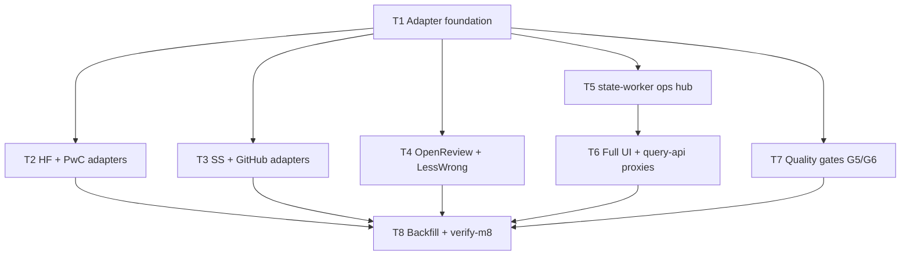

# M8 — Hardening and Scale

**Plan name:** `m8-hardening-scale`  
**Version:** 1.0  
**Status:** Planning complete — ready for executor dispatch  
**Charter slice:** `.dev/bishop_program_charter.md` L492–540  
**Normative spec:** `bishop_spec_0_6.md` v1.5.0 (tracked @ HEAD)  
**Subtask budget:** 8 (within 4–10)

---

## 0. Context map intake

| Field | Value |
|-------|-------|
| **Path consumed** | `.dev/plans/m8-hardening-scale/context-map.md` |
| **Readiness verdict** | CONDITIONAL |
| **Scope-area labels flagged** | Flag 1 (reading_status write path), Flag 2 (permanent-fail operator path), Flag 3 (LessWrong API), Flag 4 (ArXiv backfill window), Flag 5 (DB explorer scope), Flag 6 (Mark Resolved deferred) |
| **Skill version + SHA** | orchestrator-planning v0.8 · scout SHA `48098900eb546cbac9fcb22e7f5180536255007e` |

**M7 entry gate:** `.dev/plans/m7-read-path/handoff.md` — implementation anchor `1be89cbf480fc7d7c3da450933fca17efc8dac71`; query-api/ui/cli landed; G4/G5/G6 manual gates **open** per handoff §8.4.

**Prior handoff:** `.dev/plans/m7-read-path/handoff.md`

**Architecture folder:** `.dev/architecture/bishop/` @ scout SHA — **stale** (post-M7 refresh not committed); scraper/ui rows understate M7/M4 landed state.

**Binding-artifact resolvability:**

| Artifact | Status |
|----------|--------|
| `bishop_spec_0_6.md` | **Binding** — tracked |
| `.dev/plans/m8-hardening-scale/context-map.md` | **Binding** — this plan's scout artifact |
| `.dev/plans/m7-read-path/handoff.md` | **Binding** — tracked |
| `.dev/bishop_program_charter.md` | **Binding** — tracked |

**Orch resolutions (context-map flags → frozen in this plan):**

| Flag | Resolution |
|------|------------|
| 1 | **Reading status (binding):** `PATCH /entries/{source_id}/reading-status` on **state-worker** (hub extension authorized by M8 charter). Body: `{"reading_status": "<ReadingStatusEnum>"}`. Updates `entries.reading_status` only (manifest unchanged). query-api proxies PATCH; UI posts via query-api. **Search filter:** when `reading_status` query param set, query-api `run_search` intersects candidates via **SQLite** `entries` read (`sqlite_reader`) — not DuckDB — to avoid stale mirror. Owned by **T5** (state-worker) + **T6** (query-api + UI). |
| 2 | **Permanent-fail (binding):** `POST /entries/permanent-fail` on state-worker; body `{"source_id": "..."}`; only from `ESCALATION_FLAGGED` → `PERMANENTLY_FAILED`; 409 otherwise. query-api POST proxy `/entries/{source_id}/permanent-fail`. Owned by **T5** + **T6**. |
| 3 | **LessWrong (binding):** T4 runs GraphQL introspection/query probe at start. If unreachable or schema incompatible, **omit** `LessWrongAdapter` from `ADAPTER_REGISTRY` and document in `.dev/decision-logs/m8-hardening-scale/T4-openreview-lesswrong.md` — not a plan halt. |
| 4 | **ArXiv backfill window (binding):** `ARXIV_BACKFILL_WINDOW_DAYS` remains `7` for non-backfill runs. When `BISHOP_BACKFILL_ENABLED=1`, default `60` (§18.2) unless env override. T8 owns env contract + compose docs. |
| 5 | **DB explorer (binding):** HTMX page `/explorer` with filter form (source, domain, tags, date range, entry_type, reading_status) submitting to existing `GET /search` metadata params — no new query-api route family. Owned by **T6**. |
| 6 | **Mark Resolved:** Explicit **non-goal** for M8 (charter contract surfaces list retry + permanent-fail only). |

---

## 1. Task statement

**(a) Active milestone ID:** M8 — Hardening and Scale

**(b) Charter version:** `.dev/bishop_program_charter.md` v0.1.0

**(c) Charter non-goals (verbatim):** All §23 deferred items (graph layer, daily digest, cosine anchor migration, personal domain, cross-domain query, reranker, query expansion, local enrichment path, time-decayed weights, reading history analytics, Redis/Postgres upgrades). All §24 rejected items. `DomainEnum.both` (removed).

Implement remaining source adapters (HuggingFace, PapersWithCode, SemanticScholar, GitHub, OpenReview; LessWrong pending API verification), complete UI (escalation panel with manual retry/permanent-fail, reading status updates, DB explorer), run quality validation gates G5/G6, and enable chunked backfill across all registered sources after gates pass (G7).

**Non-goals:**
- Personal domain scrapers, NL profile, and workflow (§3.2, §19.2).
- Cross-domain query (§19.3).
- Reranker (`ms-marco-MiniLM-L-6-v2`, §16.6), query expansion (§16.5), daily digest (§17.2).
- Graph layer (Kuzu), cosine anchor migration, interest-profile re-enrichment, local Ollama enrichment path.
- Time-decayed retrieval weights, reading history analytics.
- Redis/Postgres infrastructure upgrades.
- `Mark Resolved` escalation action (spec §14.2 — deferred; charter exit gate does not require it).
- Changes to `batch-poller` or enrichment prompt templates except NL profile YAML iteration under T7 if G6 fails.
- Embedding model upgrade to `nomic-embed-text` unless G5 live fails and charter owner authorizes §7 amendment (carry M7 handoff trigger).
- All items in §23 and §24 of `bishop_spec_0_6.md` are non-goals for this plan.

---

## 2. Shared contracts

### Types / interfaces

| Symbol | Owner | Typed surface | Test |
|--------|-------|---------------|------|
| `BackfillConfig` | T1 | `bishop_shared/scraper_config.py` — frozen dataclass: `window_days: int`, `categories: tuple[str, ...] = ()` | `tests/test_scraper_config_shared.py::test_backfill_config_round_trip` |
| `BACKFILL_CONFIG` | T1 | `bishop_shared/scraper_config.py` — `dict[str, BackfillConfig]` per §18.2 (all seven source keys) | `tests/test_scraper_config_shared.py::test_backfill_config_matches_spec_defaults` |
| `SOURCE_RATE_LIMITS` (all sources) | T1 | `services/scraper/app/rate_limit.py` — Appendix B values for arxiv, github, semantic_scholar, huggingface, paperswithcode, openreview, lesswrong | `tests/test_scraper_rate_limit.py::test_all_source_rate_limits_match_appendix_b` |
| `SOURCE_SCHEDULE_INTERVAL_SEC` | T1 | `bishop_shared/scraper_config.py` — per-source default seconds (Appendix B table) | `tests/test_scraper_config_shared.py::test_schedule_defaults` |
| `BISHOP_BACKFILL_ENABLED` | T8 | `services/scraper/app/config.py` — bool env, default `False` | `tests/test_scraper_config.py::test_backfill_enabled_default_false` |
| `BISHOP_BACKFILL_CHUNK_DAYS` | T8 | `services/scraper/app/config.py` — int, default `7` | `tests/test_scraper_config.py::test_backfill_chunk_days_default` |
| `BISHOP_BACKFILL_INTER_CHUNK_DELAY_SEC` | T8 | `services/scraper/app/config.py` — int, default `300` | `tests/test_scraper_config.py::test_backfill_inter_chunk_delay_default` |
| `GITHUB_TOKEN` | T3 | `services/scraper/app/config.py` — optional `str \| None` from env | `tests/test_scraper_config.py::test_github_token_from_env` |
| `SEMANTIC_SCHOLAR_API_KEY` | T3 | `services/scraper/app/config.py` — optional | `tests/test_scraper_config.py::test_semantic_scholar_key_from_env` |
| `HUGGINGFACE_TOKEN` | T2 | `services/scraper/app/config.py` — optional | `tests/test_scraper_config.py::test_huggingface_token_from_env` |
| `HuggingFaceAdapter` | T2 | `services/scraper/app/adapters/huggingface.py` — `fetch_manifest` + `fetch_content` | `tests/test_scraper_adapters_huggingface.py` |
| `PapersWithCodeAdapter` | T2 | `services/scraper/app/adapters/paperswithcode.py` | `tests/test_scraper_adapters_paperswithcode.py` |
| `SemanticScholarAdapter` | T3 | `services/scraper/app/adapters/semantic_scholar.py` | `tests/test_scraper_adapters_semantic_scholar.py` |
| `GitHubAdapter` | T3 | `services/scraper/app/adapters/github.py` | `tests/test_scraper_adapters_github.py` |
| `OpenReviewAdapter` | T4 | `services/scraper/app/adapters/openreview.py` | `tests/test_scraper_adapters_openreview.py` |
| `LessWrongAdapter` | T4 | `services/scraper/app/adapters/lesswrong.py` — conditional registry | `tests/test_scraper_adapters_lesswrong.py` (skip if probe fails) |
| `ADAPTER_REGISTRY` | T8 | `services/scraper/app/adapters/registry.py` — ArXiv + landed T2–T4 adapters (LessWrong if verified) | `tests/test_scraper_loop.py::test_registry_lists_all_expected_sources` |
| `ReadingStatusPatchRequest` | T5 | `services/state-worker/app/models/http.py` | `tests/test_state_worker_reading_status.py` |
| `PATCH /entries/{source_id}/reading-status` | T5 | state-worker entries router | `tests/test_state_worker_reading_status.py` |
| `PermanentFailPostRequest` | T5 | `services/state-worker/app/models/http.py` | `tests/test_state_worker_permanent_fail.py` |
| `POST /entries/permanent-fail` | T5 | state-worker entries router | `tests/test_state_worker_permanent_fail.py` |
| `POST /entries/{source_id}/retry` | T6 | query-api proxy → state-worker `POST /entries/retry` | `tests/test_query_api_routes_entry_actions.py` |
| `POST /entries/{source_id}/permanent-fail` | T6 | query-api proxy | `tests/test_query_api_routes_entry_actions.py` |
| `PATCH /entries/{source_id}/reading-status` | T6 | query-api proxy | `tests/test_query_api_routes_entry_actions.py` |
| UI `/escalations` | T6 | `services/ui/app/main.py` + templates | `tests/test_ui_escalations.py` |
| UI `/explorer` | T6 | DB explorer filter page | `tests/test_ui_explorer.py` |
| `scripts/verify-m8.sh` | T8 | M8 pytest gate script | `tests/test_verify_m8.py` |
| G5 quality harness | T7 | `tests/test_g5_quality_gate.py` + `scripts/run-g5-quality-gate.sh` | `test_g5_fixture_queries_return_expected_neighbors` |
| G6 quality harness | T7 | `tests/test_g6_quality_sampling.py` + `scripts/run-g6-quality-sampling.sh` | structural smoke (fixture CSV schema) |

**Decision log paths (architectural):**
- T1: `.dev/decision-logs/m8-hardening-scale/T1-adapter-foundation.md`
- T4: `.dev/decision-logs/m8-hardening-scale/T4-openreview-lesswrong.md`
- T5: `.dev/decision-logs/m8-hardening-scale/T5-state-worker-ops.md`
- T8: `.dev/decision-logs/m8-hardening-scale/T8-backfill-enable.md`

### Error envelope

| Surface | Contract |
|---------|----------|
| Adapter HTTP failures | Reuse scraper `failure_envelope` + §6.3 / Appendix C classification — no changes to exception types |
| `PATCH /entries/{source_id}/reading-status` | 404 `source_id` not in entries; 422 invalid enum; 409 if no `entries` row (manifest-only) |
| `POST /entries/permanent-fail` | 404 not found; 409 if `processing_state != ESCALATION_FLAGGED` |
| `POST /entries/{source_id}/retry` (proxy) | Pass-through state-worker `RetryPostResponse` or 409/404 |
| query-api upstream errors | 502 `{"error":"upstream_error","status":<code>}` (match M7 escalations proxy) |
| LessWrong probe failure | Not an error — omit adapter; log `WARN` `lesswrong_adapter_skipped` |

### Naming

- Adapter modules: `services/scraper/app/adapters/<source>.py` (snake_case source slug matching `SourceEnum.value`)
- Test modules: `tests/test_scraper_adapters_<source>.py`
- Compose image tags: `bishop/scraper:m8`, `bishop/ui:m8` (state-worker unchanged — hub edits are backward-compatible additions only)
- Env prefix: `BISHOP_` for backfill toggles; source tokens `GITHUB_TOKEN`, `SEMANTIC_SCHOLAR_API_KEY`, `HUGGINGFACE_TOKEN`

### Logging

- Structured `extra` fields: `event`, `source`, `source_id` on adapter fetch, backfill chunk boundaries, escalation actions
- Backfill chunk start/complete: `INFO` with `chunk_start`, `chunk_end`, `source`
- Permanent-fail / manual retry from UI: `INFO` `manual_permanent_fail`, `manual_retry` with `source_id`

### Tests

- Framework: pytest (existing repo convention)
- Location: `tests/test_scraper_adapters_*.py`, `tests/test_state_worker_*.py`, `tests/test_query_api_routes_entry_actions.py`, `tests/test_ui_*.py`, `tests/test_g5_*.py`, `tests/test_g6_*.py`, `tests/test_verify_m8.py`
- Adapter tests: HTTP mocked via `respx` or `httpx.MockTransport` — no live network in default CI
- Optional live probes: `BISHOP_LESSWRONG_PROBE_LIVE=1`, `BISHOP_G5_LIVE=1` (heavy), `BISHOP_G6_MANUAL=1` (owner checklist)
- M8 gate: `scripts/verify-m8.sh` — subprocess isolation pattern from `verify-m7.sh` for `app` package collision hygiene

### CLI surface

- Existing `bishop escalations` (M7) unchanged
- No new CLI subcommands required for M8 exit gate
- `scripts/run-g5-quality-gate.sh`, `scripts/run-g6-quality-sampling.sh` — frozen in T7 before T8 packet emission

---

## 3. Dependency DAG

**Parallel groups:**
- `{T2, T3, T4, T5, T7}` may run in parallel after **T1** completes.
- **T6** requires **T5** (state-worker routes must exist before proxies/UI).
- **T8** requires **T2, T3, T4, T6, T7** and owner G4/G5/G6 sign-off at execution start.

**Soft dependency:** T6 reading_status search behavior should land before T8 e2e validation — sequenced via T6 → T8 edge.

---

## 4. Subtask specs

### T1 — Adapter foundation

| Field | Content |
|--------|---------|
| **ID** | T1 |
| **Scope** | Land shared backfill config, complete `SOURCE_RATE_LIMITS`, per-source schedule defaults, and scraper helpers used by all new adapters. Update ArXiv adapter to consume shared `BACKFILL_CONFIG` for window resolution. |
| **Files to touch** | `bishop_shared/scraper_config.py`, `services/scraper/app/rate_limit.py`, `services/scraper/app/config.py`, `services/scraper/app/adapters/arxiv.py`, `tests/test_scraper_config_shared.py`, `tests/test_scraper_rate_limit.py`, `tests/test_scraper_config.py` |
| **Contract bindings** | All §2 rows owned by T1 |
| **Inputs** | None |
| **Outputs** | Shared config module, expanded rate limits, tests, decision log |
| **Kill criteria** | Halt if `bishop_shared/enums.py` `SourceEnum` members do not match state-worker literals. Halt if Appendix B rate limit values cannot be mapped to existing `RateLimit` dataclass without spec ambiguity. |
| **Log tier** | architectural |
| **Risks & mitigations** | Risk: duplicating backfill constants in scraper vs shared — mitigated by single `bishop_shared/scraper_config.py` owner. |

### T2 — HuggingFace + PapersWithCode adapters

| Field | Content |
|--------|---------|
| **ID** | T2 |
| **Scope** | Implement `HuggingFaceAdapter` and `PapersWithCodeAdapter` with `fetch_manifest` and `fetch_content` per §3.1 and §10.1. Register in a staging list consumed by T8 final registry merge (or append to registry if T8 not landed — export adapters from module either way). |
| **Files to touch** | `services/scraper/app/adapters/huggingface.py`, `services/scraper/app/adapters/paperswithcode.py`, `services/scraper/app/adapters/registry.py` (import only), `tests/test_scraper_adapters_huggingface.py`, `tests/test_scraper_adapters_paperswithcode.py` |
| **Contract bindings** | Adapter ABC, `ManifestIngestEntry`, `SOURCE_RATE_LIMITS`, `BACKFILL_CONFIG`, `HUGGINGFACE_TOKEN` |
| **Inputs** | T1 |
| **Outputs** | Two adapter modules + mocked HTTP tests |
| **Kill criteria** | Halt if HuggingFace Hub API base URL undocumented in spec and no stable public endpoint found in spec §3.1 — cite `bishop_spec_0_6.md` L90 before guessing. Halt if context-map flag 1 unresolved at execution start (N/A for T2). |
| **Log tier** | standard |
| **Risks & mitigations** | HF multi-entity types (model/dataset/space) — manifest returns `entry_type` hint in title/url metadata; full typing deferred to enrichment. |

### T3 — Semantic Scholar + GitHub adapters

| Field | Content |
|--------|---------|
| **ID** | T3 |
| **Scope** | Implement `SemanticScholarAdapter` and `GitHubAdapter` with manifest + content fetch. GitHub requires token for production rate limits; tests mock authenticated headers. |
| **Files to touch** | `services/scraper/app/adapters/semantic_scholar.py`, `services/scraper/app/adapters/github.py`, `tests/test_scraper_adapters_semantic_scholar.py`, `tests/test_scraper_adapters_github.py` |
| **Contract bindings** | Same as T2 + `GITHUB_TOKEN`, `SEMANTIC_SCHOLAR_API_KEY` |
| **Inputs** | T1 |
| **Outputs** | Two adapter modules + tests |
| **Kill criteria** | Halt if GitHub Search API pagination cannot be bounded for backfill window without exceeding rate limits at manifest fetch — document expected max pages in decision log and cap with env `BISHOP_GITHUB_MAX_PAGES` (default 10). |
| **Log tier** | standard |
| **Risks & mitigations** | GitHub without token hits low anonymous limits — `verify-m8.sh` documents token required for backfill. |

### T4 — OpenReview + LessWrong adapters

| Field | Content |
|--------|---------|
| **ID** | T4 |
| **Scope** | Implement `OpenReviewAdapter` (REST). Probe LessWrong GraphQL; implement `LessWrongAdapter` only if probe succeeds; otherwise skip registry with documented waiver. |
| **Files to touch** | `services/scraper/app/adapters/openreview.py`, `services/scraper/app/adapters/lesswrong.py`, `tests/test_scraper_adapters_openreview.py`, `tests/test_scraper_adapters_lesswrong.py`, `.dev/decision-logs/m8-hardening-scale/T4-openreview-lesswrong.md` |
| **Contract bindings** | T1 contracts + context-map flag 3 resolution |
| **Inputs** | T1 |
| **Outputs** | OpenReview adapter; conditional LessWrong adapter; decision log |
| **Kill criteria** | Halt if OpenReview REST base URL from spec is unreachable in mocked tests (implementation bug). **Do not halt** if LessWrong probe fails — omit adapter per §0 flag 3. Halt if context-map flag 3 unresolved at execution start (executor must apply frozen resolution: skip on failure). |
| **Log tier** | architectural |
| **Risks & mitigations** | LessWrong API instability — conditional registration per §23. |

### T5 — state-worker ops hub extension

| Field | Content |
|--------|---------|
| **ID** | T5 |
| **Scope** | Add `PATCH /entries/{source_id}/reading-status` and `POST /entries/permanent-fail` with transition helpers. Extend G2 contract tests. **No changes** to existing retry/failed semantics. |
| **Files to touch** | `services/state-worker/app/transitions.py`, `services/state-worker/app/routers/entries.py`, `services/state-worker/app/models/http.py`, `tests/test_state_worker_reading_status.py`, `tests/test_state_worker_permanent_fail.py`, `tests/test_state_worker_contract.py` (extend) |
| **Contract bindings** | Reading status + permanent-fail §2 rows; `ReadingStatusEnum` |
| **Inputs** | T1 |
| **Outputs** | Hub routes, tests, decision log |
| **Kill criteria** | Halt if charter hub policy blocks new routes (should not — M8 charter grants escalation exercise). Halt if `entries` table lacks `reading_status` column — run migrations check against M1 schema. |
| **Log tier** | architectural |
| **Risks & mitigations** | Hub serialization — only M8 plan touches state-worker in this milestone. |

### T6 — Full UI + query-api write proxies

| Field | Content |
|--------|---------|
| **ID** | T6 |
| **Scope** | query-api POST/PATCH proxies for retry, permanent-fail, reading-status. UI escalation panel (`/escalations`) with action buttons; entry detail reading-status control; DB explorer page. Adjust `run_search` reading_status filter to SQLite per §0 flag 1. |
| **Files to touch** | `services/query-api/app/routers/entries.py` (new or extend), `services/query-api/app/retrieval/search.py`, `services/query-api/app/sqlite_reader.py`, `services/ui/app/main.py`, `services/ui/app/templates/*.html`, `tests/test_query_api_routes_entry_actions.py`, `tests/test_ui_escalations.py`, `tests/test_ui_explorer.py`, `tests/test_query_api_search_orchestrator.py` (extend) |
| **Contract bindings** | All T6 §2 rows; M7 proxy error envelope |
| **Inputs** | T5 |
| **Outputs** | UI pages, proxy routes, tests |
| **Kill criteria** | Halt if T5 routes not mergeable at execution start. Halt if context-map flag 1 unresolved at execution start. Halt if UI must call state-worker directly (violates M7 seam) — must use query-api only. |
| **Log tier** | standard |
| **Risks & mitigations** | HTMX POST CSRF — same-origin only; no CSRF token in MVP (localhost). |

### T7 — Quality gates G5/G6

| Field | Content |
|--------|---------|
| **ID** | T7 |
| **Scope** | Automated G5 fixture harness (3–5 challenge_hooks queries against seeded stores). G6 sampling scaffold: export scripts + CSV templates for 20 pre-filter + 10 enrichment manual judgments; optional NL profile YAML bump workflow documented if precision/recall off. |
| **Files to touch** | `tests/test_g5_quality_gate.py`, `tests/test_g6_quality_sampling.py`, `scripts/run-g5-quality-gate.sh`, `scripts/run-g6-quality-sampling.sh`, `.dev/quality/g6-sampling-template.md` |
| **Contract bindings** | G5/G6 scripts frozen before T8 |
| **Inputs** | T1 |
| **Outputs** | Harness scripts, fixture tests, sampling templates |
| **Kill criteria** | Halt if M6 embedding fixture seed harness missing — reuse `tests/test_m7_integration.py` seed utilities. G5 fixture failure blocks T8 execution (not T7 landing — record as open gate). |
| **Log tier** | standard |
| **Risks & mitigations** | G6 manual judgment not fully automatable — T8 kill criterion includes owner sign-off checklist `runtime-armed only, no executor-time verification` for precision/recall acceptance. |

### T8 — Backfill enable + verify-m8

| Field | Content |
|--------|---------|
| **ID** | T8 |
| **Scope** | Finalize `ADAPTER_REGISTRY` with all T2–T4 adapters; implement backfill chunking in scraper loop (§18.4); wire `BISHOP_BACKFILL_*` env; compose `m8` tags; `scripts/verify-m8.sh`; integration test proving multi-source manifest ingest (mocked). Document G7 enablement procedure. |
| **Files to touch** | `services/scraper/app/adapters/registry.py`, `services/scraper/app/loop.py`, `services/scraper/app/config.py`, `docker-compose.yml`, `scripts/verify-m8.sh`, `tests/test_verify_m8.py`, `tests/test_scraper_backfill_chunking.py`, `tests/test_scraper_loop.py`, `CHANGELOG.MD`, `.dev/decision-logs/m8-hardening-scale/T8-backfill-enable.md` |
| **Contract bindings** | All §2 env keys; `ADAPTER_REGISTRY`; verify script |
| **Inputs** | T2, T3, T4, T6, T7 |
| **Outputs** | Backfill orchestration, gate script, compose tags, decision log |
| **Kill criteria** | Halt at execution start if charter G4/G5/G6 owner sign-off not recorded in executor changelog (explicit checkbox). Halt if any T2–T4 adapter missing `fetch_content` when registry merged. Halt if G5 live run requested (`BISHOP_G5_LIVE=1`) fails — escalate §7 amendment for embedding model, do not enable backfill. Halt if `BISHOP_BACKFILL_ENABLED=1` in compose without chunking landed. |
| **Log tier** | architectural |
| **Risks & mitigations** | Volume explosion — chunking + pre-filter as volume gate per §18.3. |

---

## 5. Adversarial pass

### 5.1 Rejected decompositions

**One adapter per subtask (6 + UI + gates + backfill = 9+).** Rejected: charter invocation stub expects 5–7 workstreams; six parallel adapter executors multiply decision-log and registry-merge conflict risk. Grouping 2+2+2 adapters preserves parallelization `{T2,T3,T4}` with only one registry owner (T8).

**Single "adapters" megasubtask.** Rejected: violates executor packet self-containment — HF+GitHub+OpenReview in one packet is too large for review and test isolation; failure in one source blocks audit of others.

**UI before state-worker hub (T6 before T5).** Rejected: query-api proxies cannot be integration-tested without upstream routes; M7 established UI→query-api→state-worker seam.

### 5.2 Load-bearing assumptions

| Tuple |
|-------|
| `(ArXiv adapter pattern is sufficient template for all professional sources \| §2 SourceAdapter + arxiv.py \| wrong manifest field mapping breaks pre-filter batch assembly \| T2,T3,T4)` |
| `(M1 entries table has reading_status column writable post-INDEXED \| SQLite schema §7.2 + alembic \| PATCH route cannot land \| T5)` |
| `(G4/G5/G6 satisfied before backfill enable \| charter §5 gates + M7 handoff \| backfill at scale masks pipeline bugs \| T8)` |
| `(content-scraper continues importing scraper ADAPTER_REGISTRY \| adapter_resolver.py \| fetch_content missing for new source → SCRAPE_FAILED spike \| T2,T3,T4,T8)` |
| `(LessWrong GraphQL may be unavailable \| §23 defer trigger \| registry incomplete vs charter "if verified" \| T4,T8)` |

### 5.3 Highest re-plan risk

**T4 (OpenReview + LessWrong)** — external API shape drift and LessWrong conditional registration most likely to force registry/contract amendment. Second: **T5** if reading_status requires DuckDB mirror sync (§5.4 C3) beyond SQLite-only plan.

### 5.4 Hidden couplings

| Tuple | Status |
|-------|--------|
| `(fetch_content must ship with each manifest adapter \| content-scraper adapter_resolver + scraper registry \| content-scraper poll succeeds but SCRAPE_FAILED for new sources \| T2,T3,T4,T8)` | **confirmed** — `adapter_resolver.py` imports registry |
| `(reading_status search filter vs DuckDB mirror staleness \| query-api run_search + duckdb_reader \| UI updates status but search filter unchanged \| T5,T6)` | **suspected** — mitigated by SQLite filter path in §0 flag 1; disprove if DuckDB-only filter retained |
| `(SOURCE_RATE_LIMITS key must exist before failure_envelope \| rate_limit.py + loop.py \| KeyError on new adapter first scrape \| T1,T8)` | **confirmed** — `failure_envelope` indexes `SOURCE_RATE_LIMITS[source]` |
| `(Parallel T2/T3/T4 registry imports \| registry.py \| merge conflicts if all edit registry list \| T2,T3,T4,T8)` | **confirmed** — T8 sole registry merger; T2–T4 export classes only, minimal registry touch |
| `(state-worker hub extension during M8 \| charter hub registry \| concurrent M-plan on state-worker \| T5)` | **suspected** — program serializes milestones; no concurrent M-plan expected |
| `(GITHUB_TOKEN required for backfill-scale GitHub \| scraper config \| anonymous rate limit during backfill \| T3,T8)` | **confirmed** — Appendix B auth row |

---

## 6. Executor packets

Self-contained packets emitted at:

- `.dev/plans/m8-hardening-scale/packets/T1.md` … `T8.md`

Each packet contains: §1 verbatim, §2 verbatim, subtask §4 block verbatim, filtered §5.2/§5.4 tuples listing that subtask ID, resolved inputs.

---

## 7. Amendment subtasks

None at plan v1.0.

**Pre-declared §7 triggers:**
- G5 live failure → embedding model upgrade amendment (inherited from M7 handoff).
- LessWrong lands after waiver → registry-only amendment if API becomes available mid-milestone.
- DuckDB reading_status sync required → narrow T5/T6 amendment if SQLite-only filter proves insufficient in audit.

---

## 8. Auditor handoff

**Not produced** — plan status is pre-execution. §8 will be recorded in `.dev/plans/m8-hardening-scale/handoff.md` after all subtasks complete and `scripts/verify-m8.sh` passes on a clean tree.

**Planned §8.1 verification command:** `scripts/verify-m8.sh` (pattern: M7 subprocess-isolated pytest slices).

**Planned §8.5 cold-read seeds:**
1. `services/scraper/app/adapters/registry.py`
2. `services/scraper/app/loop.py` — backfill chunking
3. `services/state-worker/app/routers/entries.py` — new ops routes
4. `services/query-api/app/retrieval/search.py` — reading_status filter path
5. `services/ui/app/main.py` — escalation actions
6. `scripts/verify-m8.sh`

---

*Plan v1.0 — M8 Hardening and Scale — orchestrator-planning v0.8*
