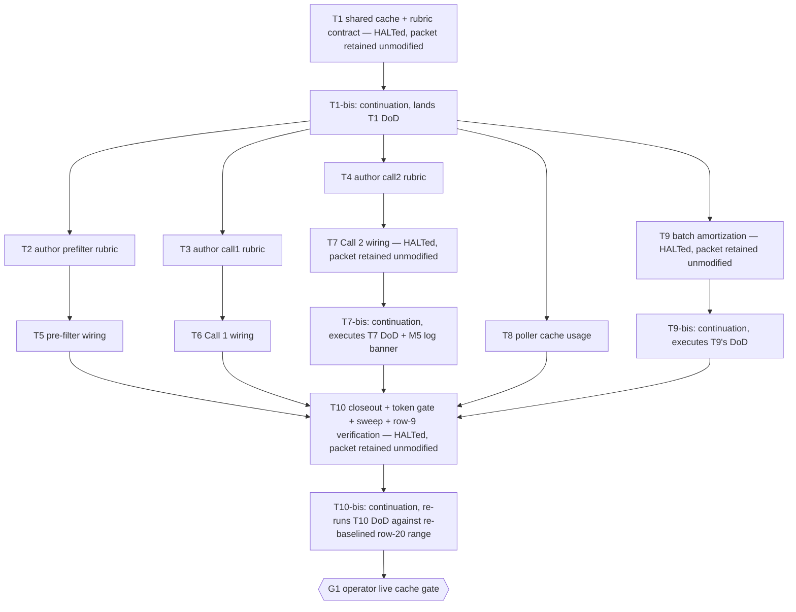

# Plan — prompt-caching

**Version:** 1.4.0
**run_status:** `amended`
**audit_status:** `not_run`
**Mode:** Standard (non-charter; caching is not an M8/M9 charter row)
**Baseline SHA:** `b919fdba09e07a77700d57cf3b360c001058bb84` (branch `dev`)
**Declared subtask budget:** 4–10 (orchestrator-planning §Budget). This plan declared **10 executable subtasks + 1 gate node** at v1.0.0 — at the ceiling, no split proposal required.
**Budget-amendment (v1.1.0, amendment round 1):** Prior authorized count **10 executable + 1 gate**. New count **11 executable + 1 gate** — crosses the 4–10 ceiling by one, recorded here per orchestrator-planning §Budget / Validation item 19. The added subtask is **T1-bis**, which closes T1's kill-criterion HALT (§7 round 1) by landing T1's already-scoped shared-module DoD under an amended §2 row-9 verification timing. It does not reopen T1's design and introduces no new architectural fork.
**Budget-amendment (v1.2.0, amendment round 2):** Prior authorized count **11 executable + 1 gate**. New count **12 executable + 1 gate** — the added subtask is **T9-bis**, which closes T9's Files-to-touch-omission HALT (§7 round 2) by executing T9's original scoped DoD (raise the enrichment stage1/stage2 batch-size defaults 10 → 50, add the minimum-volume/maximum-hold controls) while additionally touching the one pre-existing test file (`tests/test_enrichment_batcher_config.py`) whose two pinned assertions the default bump requires updating. It does not reopen T9's design and introduces no new architectural fork.
**Budget-amendment (v1.3.0, amendment round 3):** Prior authorized count **12 executable + 1 gate**. New count **13 executable + 1 gate** — the added subtask is **T7-bis**, which closes T7's Files-to-touch-omission HALT (§7 round 3) by executing T7's original Call 2 wiring DoD from current HEAD (includes T6) while additionally touching `.dev/decision-logs/m5-enrichment/T4-call2-cache-control.md` so the required first-mention supersession banner can land. It does not reopen T7's Call 2 caching design and introduces no new architectural fork.
**Budget-amendment (v1.4.0, amendment round 4):** Prior authorized count **13 executable + 1 gate**. New count **14 executable + 1 gate** — the added subtask is **T10-bis**, which closes T10's row-20 frozen-path kill-criterion HALT (§7 round 4) by re-running T10's full original closeout DoD (token-floor gate, docs refresh, tracked artifacts, declared-scope sweep, row-9 re-verification) against a corrected row-20 SHA range. It does not reopen T10's closeout design and introduces no new architectural fork.
**Skill version:** orchestrator-planning v1.2
**Amendment round 1 (v1.1.0) — status banner:** T1 HALTed at dispatch on §2 row 9's falsifier (full report: `.dev/plans/prompt-caching/runs/T1-brief.md`). Resolved as a scoped contract-timing fix — fork 2 of the HALT's three offered forks: row 9's sweep-test verification moves from T1 to T10 (post T5/T6/T7), rather than re-scoping the grep itself or expanding T1 into T7's territory. Continuation node **T1-bis** lands T1's DoD from the existing uncommitted working tree; **T1**'s own packet is retained unmodified as the historical HALT record and is not re-dispatched. See §7 for the full amendment row.
**Amendment round 2 (v1.2.0) — status banner:** T9 HALTed at dispatch on §2 row 18's Files-to-touch omission (full report: `.dev/plans/prompt-caching/runs/T9-brief.md`). T9 wrote no code; nothing was staged or committed. Resolved as a scoped Files-to-touch fix — fork 1 of the HALT's three offered forks: `tests/test_enrichment_batcher_config.py` is added to the continuation's Files to touch so its two pinned default-value assertions update 10 → 50 in the same subtask, rather than a separate follow-on packet (fork 2) or reassigning the default bump elsewhere (fork 3). Continuation node **T9-bis** executes T9's full original DoD from a clean slate (T9 left no working-tree state to consume); **T9**'s own packet is retained unmodified as the historical HALT record and is not re-dispatched. See §7 round 2 for the full amendment row.
**Amendment round 3 (v1.3.0) — status banner:** T7 HALTed at dispatch on packet §6's prior-log supersession duty (full report: `.dev/plans/prompt-caching/runs/T7-brief.md`). T7 wrote no code; nothing was staged or committed. T6 subsequently completed at `ba49bb1` (after the HALT) and edited `bishop_shared/enrichment_prompts.py` / `tests/test_enrichment_prompts.py`, which T7 also owned. Resolved as a scoped Files-to-touch fix — **fork a** of the HALT's two offered forks: `.dev/decision-logs/m5-enrichment/T4-call2-cache-control.md` is added to the continuation's Files to touch so the first-mention supersession banner can land in the same subtask, rather than waiving §6 and routing the banner to a named follow-on (fork b). Continuation node **T7-bis** executes T7's full original DoD from **current HEAD** (includes T6; do not start from the HALT report's stale HEAD `c47248e`); **T7**'s own packet is retained unmodified as the historical HALT record and is not re-dispatched. See §7 round 3 for the full amendment row.
**Amendment round 4 (v1.4.0) — status banner:** T10 HALTed at dispatch on its own mandatory §2 row 20 mechanical post-check (full report: `.dev/plans/prompt-caching/runs/T10-brief.md`): `git log b919fdb..HEAD -- <13 frozen paths>` returned one commit, `26b78b6` ("pre prompt cache fold of misc stuff I guess"), touching 6 of the 13 paths. `26b78b6`'s parent is `b919fdb` itself, and it is a confirmed ancestor of the orchestrator plan's own opening commit `3682c38` — i.e. it landed **before this plan's execution window began**, and none of the nine landed subtasks (T1-bis/T2/T3/T4/T5/T6/T8/T9-bis/T7-bis) touch those six paths. T10 wrote no code; nothing was staged or committed. Resolved as a scoped baseline-correction fix — **fork (b)** of the HALT's three offered forks: row 20's SHA range, for frozen-path-emptiness purposes **only**, is re-baselined from `b919fdb` to `26b78b6` — the commit immediately preceding the plan's own opening commit — closing the gap for all six paths at once as a single class-level correction rather than six item-by-item path waivers. All other range checks in this plan (declared-scope Files-to-touch union, the closure `git diff --stat`) keep `b919fdb` unchanged. Continuation node **T10-bis** re-runs T10's full original closeout DoD from current HEAD against the corrected row-20 range; **T10**'s own packet is retained unmodified as the historical HALT record and is not re-dispatched. See §7 round 4 for the full amendment row.

---

## 0. Context map intake

- **Path consumed:** `.dev/plans/prompt-caching/context-map.md`
- **Readiness verdict:** CONDITIONAL
- **Skill version + SHA the map was generated against:** pre-plan-exploration v0.6 @ `b919fdba09e07a77700d57cf3b360c001058bb84`
- **Staleness check:** HEAD == map SHA (`b919fdb`). **Zero committed drift.** Divergence is dirty-working-tree only; the in-scope dirty paths are enumerated in D9 below.
- **Scope-area labels flagged in §Ambiguity flags:** prefix authoring, pins, pre-filter prefix, hash-or-abort, Call 2 prefix, enrichment pin, stage1, `scripts/profile_hash.py`, spec, charter drift, observability, enrichment config, all packets.

### 0.1 Binding-artifact resolvability

| Artifact | Tracked at planning time? | Disposition |
|---|---|---|
| `.dev/plans/prompt-caching/context-map.md` | **No** (`?? .dev/plans/prompt-caching/`) | **D1** — operator elected *commit*. The map, this plan, `dag.json`, and all packets are committed together before the first dispatch. Until that commit exists, this plan is not dispatchable regardless of `run_status`. |
| `.dev/caching_strategy.md` | Yes | Binding for rejected-alternatives and the 4,096 floor. |
| `.dev/llm-models-and-cache.md` | Yes | Informational (as-built, stale on profile size; T10 refreshes). |
| `bishop_spec_0_6.md` | Yes (dirty) | **Informational for this plan, not binding** — see D6. |
| `.dev/decision-logs/ops/soft-launch-precision-overlay.md` | **No** (untracked) | **D2** — downgraded to *informational*. No §2 row rests on its bindingness. Its factual content (pin is ad hoc, revert target is `v1.2.0`) is restated directly in D3 so the plan does not depend on an unreadable artifact. |
| `config/profiles/professional_v1.2.0_soft_launch.yaml` | **No** (untracked) | **D3** — T1 commits it. See below. |

### 0.2 Numbered dispositions

Every map instruction — numbered flag or prose handoff note — carries a disposition. Flags 1–7 were resolved by operator decision in the planning session; Flag 8 is resolved by a §2 vocabulary row.

| # | Map item | Class | Disposition |
|---|---|---|---|
| **D1** | Context map untracked | binding-artifact | **resolved** — commit `.dev/plans/prompt-caching/` (map + plan + dag + packets) before first dispatch. |
| **D2** | Overlay decision log untracked | binding-artifact | **resolved** — downgraded to informational; content restated in D3. |
| **D3** | **Flag 1** — which file is cache key A? | ownership | **resolved** — the live pin `config/profiles/professional_v1.2.0_soft_launch.yaml` **stays** the pre-filter pin and **T1 commits it to git**. Rationale: it matches the running stack and the host-mounted copy byte-for-byte (both SHA-256 `1FD10EA6…04A7`, verified at planning time), so authoring against it changes no live behavior. The overlay's "revert to v1.2.0 next week" intent becomes a **known re-plan trigger**, recorded in §5.2 A6, not a reason to author against a pin the stack does not serve. |
| **D4** | **Flag 2** — where do the extra pre-filter tokens live? | ownership | **resolved** — a new annex `config/prompts/prefilter_rubric_v1.md`, content = **source-shape law** (paper / repo / model card / article / hub dump), per operator intent and strategy §16. **Not** YAML growth. Owner T2. |
| **D5** | **Flag 3** — Call 2 prefix shape | coexisting_model_versions | **resolved** — new annex `config/prompts/call2_rubric_v1.md` (eval schema + relevance-scoring few-shots). **Enrichment pin stays `professional_v1.0.0.yaml`.** No pin bump, so no un-evaluated gate-2 quality shift. Owner T4. |
| **D6** | **Flag 5** — does this plan edit `bishop_spec_0_6.md` §12.1/§12.3? | implicit contract | **deferred (operator decision: no)** — the spec keeps saying Phase 1.5 needs "no code change". This plan does **not** edit it. Consequence bound as a §2 `deferred` row (row 19) with follow-up **`FU-CACHE-SPEC-01`**, owner = operator, outside this plan. Every packet carries an explicit line telling the executor the spec is *informational and known-stale on this point*, so no executor HALTs on the contradiction. |
| **D7** | **Flag 4** — hash-or-abort for rubric assets | ownership | **resolved** — per-asset hash in the rubric file's own YAML front-matter, verified by a new shared `verify_rubric_hash`. Profile `canonical_hash` semantics are **untouched**; no composite, no fold. Call 1 gains a hash-or-abort path it does not have today. Owner T1 (contract), T6 (Call 1 path). |
| **D8** | **Flag 6** — poller cache usage | ownership | **resolved** — **logs only** (strategy §15 minimum) + zero-cache-read warning. No `BatchRecord` columns, no Alembic, no state-worker writer change. This *disproves* map Surface 12 by the map's own stated condition: no `domain.py` / `http.py` / `transitions.py` / `alembic/**` path appears in any subtask's Files to touch. Owner T8. |
| **D9** | **Flag 7** — batch size / amortization | missing_test_coverage (ops) | **resolved, expanded** — **in scope**, and the operator additionally asked for batch *scheduling* / minimum-volume thresholds, treating stage 1 and stage 2 separately, to maximize cache reuse. This is T9 (continued as **T9-bis** after amendment round 2, v1.2.0) and carries its own starvation risk (§5.4 C9). |
| **D10** | **Flag 8** — vocabulary collision (`prefix` / `4k` / `hash` / `system`) | vocabulary_collision | **resolved** — §2 row 20 is a binding glossary, copied verbatim into every packet. |
| **D11** | Operator discussion notes (source-shape law, no padding, three keys separate, Call 1 needs its own rubric, Call 2 must not inherit the gate-1 overlay) | prose handoff | **resolved** — absorbed as D4/D5/D7 and §2 rows 4–6. The "Call 2 must not silently inherit gate-1" instruction is what surfaces §5.4 **C4**, which this plan treats as a code defect to fix, not just a content preference. |
| **D12** | Measured token table (`cl100k_base`, 2026-09-11) | prose handoff | **resolved, re-measured at planning time** — every number reproduced exactly: v1.0.0=383, v1.1.0=1324, v1.1.1=1444, v1.2.0=1882, soft_launch=2280, Call 1 system=267, Call 2 post-breakpoint=82. Gaps to the 4,096 floor: key A 1816, key B 3829, key C 3631. Labeled `derived` in §5.2 A6. |
| **D13** | Dirty in-scope paths | prose handoff | **resolved** — in-scope dirty paths at planning time: `bishop_shared/profile_renderer.py` (M), `tests/test_profile_renderer.py` (M), `bishop_spec_0_6.md` (M), `services/batch-poller/app/models.py` (M, parked field only), `config/profiles/professional_v1.2.0_soft_launch.yaml` (??). T1 and T8 edit files that are already dirty; each names this in its packet so the executor does not mistake pre-existing overlay changes for its own. **Checklist row** in §Validation: §8.1 verification must run on a clean worktree, so the closure run cannot rest on these local edits. |
| **D14** | Kill-criterion candidates from exclusions | prose handoff | **resolved** — §2 row 18 (frozen paths) + T10's declared-scope sweep. |
| **D15** | "New files the map cannot list" | prose handoff | **resolved** — `config/prompts/prefilter_rubric_v1.md` (T2), `config/prompts/call1_rubric_v1.md` (T3), `config/prompts/call2_rubric_v1.md` (T4) are in Files to touch. Map correctly predicted the annex names; D4/D5 adopt them. |
| **D16** | **G7 / wet-run**: map says "compose is down; wet-run is not in this exploration" | prose handoff | **resolved and corrected** — **the map is wrong on this point.** Compose was verified **up** at planning time (nine containers, 17 min uptime, `state-worker` healthy). This changes the plan materially: a live gate is available, so §3 carries gate node **G1** rather than deferring live verification. Recorded as a map-vs-reality divergence, not a silent fix. |
| **D17** | Operator gates to re-surface | prose handoff | **none signed** — the map states no gate is signed and the overlay log remains "ad hoc / not the intended machine". No dual-greenlight or sign-off text to copy. G1 is a plan-introduced gate, not a charter one. |

### 0.3 Planning-time discovery not in the map

Two facts were established at planning time that the map did not have. Both changed contracts, so they are recorded here rather than absorbed silently.

- **P1 — profile deployment is a host bind mount, not the repo.** `docker-compose.yml:52,84` mount `${BISHOP_DATA_ROOT}/profiles → /app/config/profiles` on `pre-filter-worker` and `enrichment-batcher`, which **masks** the image-baked `config/profiles` from each Dockerfile's `COPY config/profiles ./config/profiles`. The host dir `C:/Users/Ale/bishop_data/profiles` holds exactly the two pinned files, hand-placed; no script in the repo populates it. The map's Surface 11 predicted a container-vs-repo path hazard but got the mechanism wrong (it assumed repo-relative test paths, not a data-root mount). Consequence: **§2 row 15 forbids a bind mount for `config/prompts`** — rubric assets are image-baked only, because mounting an empty host dir over baked assets is a silent total-failure mode for all three gates.
- **P2 — SDK `ttl` support is real but the pin floor is not.** `anthropic` 0.100.0 is installed and `CacheControlEphemeralParam` carries `ttl: Literal["5m","1h"]` on the **GA** param type (no beta header required). But all three service `requirements.txt` files pin `anthropic>=0.40`, a floor low enough to resolve an SDK that rejects `ttl`. §2 row 1a raises the floor and pins it with a test.

**No BLOCKED flag.** Planning proceeded under CONDITIONAL with every pre-execution decision written above.

---

## 1. Task statement

Wire Anthropic prompt caching across all three BISHOP Anthropic batch paths — pre-filter, enrichment Call 1, and enrichment Call 2 — so that each path emits a `cache_control` breakpoint with `ttl: "1h"` on the **last** system block, and so that each path's cached prefix actually clears Claude Haiku 4.5's 4,096-token minimum. Clearing the floor is a content problem, not a padding problem: three quality-bearing rubric annexes are authored (source-shape law for pre-filter, extraction guidance for Call 1, relevance-scoring guidance for Call 2), each becoming a hash-verified asset under the same abort-before-Anthropic discipline the NL profile already has. The batch-poller learns to parse and log `usage` cache fields so enablement is observable rather than blind, and batch assembly gains minimum-volume and maximum-hold controls so batches are large enough to amortize a cache write. The three cache keys stay separate by construction.

**Non-goals:**

- **No model switch.** `ANTHROPIC_MODEL_PREFILTER` and `ANTHROPIC_MODEL_ENRICHMENT` remain `claude-haiku-4-5-20251001`. Switching to Sonnet for its 1,024-token floor is rejected (strategy §17) and would break the G3 pinned-model gate.
- **No padding.** Lorem ipsum, whitespace, or filler to reach 4,096 is rejected (strategy §17). Every token added must carry gate quality.
- **No merged prefixes.** Three cache keys (A pre-filter, B Call 1, C Call 2) stay independent. Putting `source` in a system prompt is rejected (strategy §11b option C) — it destroys prefix identity within a batch.
- **No `BatchRecord` schema change.** No Alembic revision, no `domain.py` / `http.py` / `transitions.py` edit, no new wire fields on `BatchPatchRequest`. Observability is logs only (D8).
- **No spec edit.** `bishop_spec_0_6.md` is not touched by this plan (D6).
- **No profile pin bump for enrichment.** Call 2 stays on `professional_v1.0.0.yaml` (D5).
- **No pre-filter pin revert.** The soft-launch overlay stays live; it gets committed, not reverted (D3).
- **No parked-route change**, no `eval/prefilter_v*/items.json` or `labels.json` edit, no `bishop_shared/content_truncation.py` edit, no change to `stage1_loop._profile_render_hash` semantics.
- **No G7 backfill enablement.** This plan makes backfill *affordable*; turning it on is a separate operator call.
- **No Phase 2 cosine / Gemini / OpenAI work.**

---

## 2. Shared contracts

Binding on every subagent. Enforcement mode is one token per row; rows whose verification would mix modes are split.

### Types / interfaces

| # | Contract | Owner | Binding site | Enforcement | Falsifier |
|---|---|---|---|---|---|
| 1 | **New** `bishop_shared/prompt_cache.py`: `HAIKU_CACHE_MIN_TOKENS: Final[int] = 4096`; `CACHE_TTL: Final[str] = "1h"`; `cached_system_blocks(*texts: str) -> list[dict[str, object]]` | T1 | `module-function` (+ two module constants) | `pytest-enforced` | `tests/test_prompt_cache.py`: (a) N inputs → N blocks; (b) `cache_control` present on **last** block only; (c) equals `{"type": "ephemeral", "ttl": "1h"}` exactly; (d) two calls return **equal but not identical** dicts (no aliasing across requests); (e) empty input raises `ValueError` |
| 1a | `anthropic` pin floor raised `>=0.40` → `>=0.100` in all three service `requirements.txt` **and** `pyproject.toml` dev extra | T1 | `parser-key` (requirements line) | `pytest-enforced` | `tests/test_prompt_cache.py::test_sdk_supports_1h_ttl` asserts `"ttl" in anthropic.types.cache_control_ephemeral_param.CacheControlEphemeralParam.__annotations__`. Falsifies P2 directly. |
| 2 | **New** `bishop_shared/rubric_assets.py`: `PROMPTS_CONTAINER_DIR = Path("/app/config/prompts")`; `RubricId = Literal["prefilter_rubric", "call1_rubric", "call2_rubric"]`; `_RUBRIC_FILENAME: dict[RubricId, str]`; `RubricDocument` (pydantic: `rubric_id: str`, `version: str`, `canonical_hash: str`, `body: str`); `resolve_rubric_path(rubric_id: RubricId) -> Path`; `load_rubric(path: Path) -> RubricDocument`; `compute_rubric_hash(rubric: Path \| str) -> str`; `verify_rubric_hash(rubric_id: RubricId, *, rubric_path: Path \| None = None) -> tuple[str, str, str] \| None` | T1 | `module-function` ×5, `pydantic-model` ×1, `dataclass-field` n/a | `pytest-enforced` | `tests/test_rubric_assets.py`: front-matter parse; `resolve_rubric_path` for all three IDs; stamp→verify round trip; mismatch returns `None`; unknown `rubric_id` raises `ValueError` |
| 3 | `render_profile_prompt(profile: ProfileDocument, *, include_output: bool = True) -> str` — new keyword-only param. Default `True` preserves current byte-for-byte output. | T1 | `module-function` (signature extension) | `pytest-enforced` | `tests/test_profile_renderer.py`: (a) default render of `professional_v1.2.0_soft_launch.yaml` is **byte-identical** to the pre-change render (pin the current 10,799-char / 2,280-token render); (b) `include_output=False` omits the `## Output format` section and nothing else |
| 4 | `AnthropicBatchResultItem` gains `input_tokens: int \| None = None`, `output_tokens: int \| None = None`, `cache_creation_input_tokens: int \| None = None`, `cache_read_input_tokens: int \| None = None` | T8 | `pydantic-model` fields | `pytest-enforced` | `tests/test_batch_poller_anthropic_client.py`: construction round-trip with and without `usage`; extraction from a fixture whose `message.usage` carries all four |
| 5 | `build_requests` / `build_stage2_requests` accept the system prefix as `list[dict[str, object]]`; `params["system"]` is a block list on **all three** gates. Pre-filter: `build_requests(*, system_blocks: list[dict[str, object]], entries: list[PreFilterBatchEntry])` — the `system_prompt: str` parameter is **retired**. Enrichment Call 1: `build_requests(*, entries: list[Stage1BatchEntry])` signature unchanged; blocks are assembled inside. Call 2: `build_stage2_requests(*, profile_prompt: str, rubric_body: str, entries: list[Stage2BatchEntry])`. **Amendment banner (v1.3.0, round 3) — read this before the Owner column:** T7 HALTed with no code on a Files-to-touch omission (M5 T4 cache_control log; `.dev/plans/prompt-caching/runs/T7-brief.md`). Call 2's share of this row is owned by **T7-bis**, which executes T7's original DoD from current HEAD (includes T6) plus the first-mention supersession banner on `.dev/decision-logs/m5-enrichment/T4-call2-cache-control.md`. T5 and T6 have already landed their shares. T7's packet is retained unmodified. See §7 round 3. | T5 / T6 / **T7-bis** | `instance-method` ×3 | `pytest-enforced` | Per-gate payload tests asserting `isinstance(params["system"], list)` and the retired `system_prompt` kwarg raising `TypeError` |

### Naming

| # | Contract | Owner | Enforcement | Falsifier |
|---|---|---|---|---|
| 6 | New assets: `config/prompts/prefilter_rubric_v1.md` (T2), `config/prompts/call1_rubric_v1.md` (T3), `config/prompts/call2_rubric_v1.md` (T4). New script `scripts/rubric_hash.py` (T1). New modules `bishop_shared/prompt_cache.py`, `bishop_shared/rubric_assets.py` (T1). | T1–T4 | `docs-structural` | Path-existence assertions in each owner's test. **Semantic falsifier** (structural presence proves nothing about content): row 8's token-floor gate plus row 7's hash round-trip. |
| 7 | Rubric front-matter schema, exactly: `---\nrubric_id: <RubricId>\nversion: "<semver>"\ncanonical_hash: "<64-hex>"\n---\n<body>`. `compute_rubric_hash` hashes **body only**, LF-normalized (`\r\n` → `\n`), excluding front matter. | T1 | `parser-key` | `pytest-enforced` | `tests/test_rubric_assets.py`: CRLF body and LF body yield the **same** hash; a front-matter `version` edit does **not** change the hash; a one-character body edit **does** |

### Cache-shape contracts

| # | Contract | Owner | Enforcement | Falsifier |
|---|---|---|---|---|
| 8 | **Token floor.** Total measured system-prefix tokens per cache key ≥ **4,506** (`cl100k_base`) = 4,096 × 1.10. The 10% margin exists because `cl100k_base` is a proxy for Anthropic's tokenizer, not the tokenizer itself. Measured on the **total prefix**, not the annex, so the contract cannot go stale when a profile render changes. | T10 (gate); T2/T3/T4 size their annexes to meet it | `pytest-enforced` | **New** `tests/test_prompt_cache_token_floor.py`: one point-literal assertion per key (A, B, C) that the assembled prefix ≥ 4506, printing the measured margin. **Named semantic gap:** a proxy tokenizer cannot prove Anthropic cached anything — the live falsifier is G1's `cache_creation_input_tokens > 0`. |
| 9 | **Single emitter.** No `cache_control` dict literal may appear anywhere outside `bishop_shared/prompt_cache.py`. All three gates obtain blocks from `cached_system_blocks`. **Amendment banner (v1.1.0, round 1) — read this before the Owner column:** at T1's original dispatch this row's falsifier could not pass: `bishop_shared/enrichment_prompts.py::build_call2_system_prompt` (pre-existing production code on the live Call 2 wire path, migrated under contract row 5 by **T7**) inlines a `cache_control` literal until T7 lands. That is not a T1 defect — T7's files are outside T1's Files to touch. Verification of this row is therefore split by *timing*, not by a new design fork: **T1-bis** authors `cached_system_blocks` and the grep test; **T10** owns asserting the test green, at its own closure sweep, after T5/T6/T7 have landed. Full discovery: `.dev/plans/prompt-caching/runs/T1-brief.md`; amendment record: §7 round 1. **Amendment banner (v1.3.0, round 3):** T7 HALTed with no code, so the Call 2 inline literal is still in HEAD. The migrator is **T7-bis**, not T7. T10 asserts green after **T5/T6/T7-bis** have landed. See §7 round 3. | **T1-bis** (authors the helper + the test); **T10** (verifies green at closure — Landed by amendment round 1); **T7-bis** (removes the remaining Call 2 literal) | `pytest-enforced` | `tests/test_prompt_cache.py::test_no_inline_cache_control_literals` — tree grep over `bishop_shared/**` and `services/**` excluding `prompt_cache.py`; asserts zero hits. This is the mechanical guard for §5.4 C1. **T1-bis may land with this specific test red** — documented explicitly in its decision log, not silently — because T7 has not migrated yet. **T10** re-runs it as part of its own closure sweep and HALTs, opening a new §7 row, if it is not green once **T7-bis** has landed. |
| 10 | **Breakpoint placement.** Exactly **one** `cache_control` per request, on the **last** system block, on all three gates. Block order: key A `[profile_render, prefilter_rubric]`; key B `[call1_system, call1_rubric]`; key C `[profile_render(include_output=False), call2_rubric, call2_instructions]`. Call 2's share: **T7-bis** (amendment round 3; T7 never landed). | T5 / T6 / **T7-bis** | `pytest-enforced` | Per-gate: `sum(1 for b in blocks if "cache_control" in b) == 1` **and** the index equals `len(blocks) - 1`. Both assertions required — a count-only test passes with the breakpoint on block 0. |
| 11 | **Batch identity.** Every request within one batch carries byte-identical system blocks. Dynamic per-entry content stays in the user message. Call 2's share: **T7-bis** (amendment round 3). | T5 / T6 / **T7-bis** | `pytest-enforced` | Per-gate multi-entry test asserting all requests' `params["system"]` compare equal |

### Error envelope

| # | Contract | Owner | Enforcement | Falsifier |
|---|---|---|---|---|
| 12 | **Rubric hash-or-abort.** Each gate verifies its rubric asset before touching Anthropic: `compute_rubric_hash(path) != doc.canonical_hash` → abort the cycle, no submit. The abort mirrors the existing profile-hash abort in the *same module*. Asymmetry preserved deliberately: **pre-filter** additionally emits the existing CRITICAL alert path in `services/pre-filter-worker/app/alerts.py`; **stage1 and stage2 log only**, matching the M5 T4 deferral. Changing that asymmetry is out of scope. Stage 2's share: **T7-bis** (amendment round 3; T7 never landed). T6 already landed stage 1. | T5 / T6 / **T7-bis** | `pytest-enforced` | Per-gate: tampered rubric body → Anthropic client **never called**; pre-filter additionally asserts the CRITICAL alert fired; stage1/stage2 assert log-only and **no** alert |
| 13 | **Call 1 gains an abort path it did not have.** `stage1_loop` currently trusts the YAML `canonical_hash` without recompute (`_profile_render_hash`). This plan adds a rubric recompute-and-abort to Call 1 **without** changing `_profile_render_hash`'s profile semantics. | T6 | `pytest-enforced` | `tests/test_enrichment_batcher_stage1_loop.py`: rubric mismatch aborts; **and** a regression test asserting `_profile_render_hash` still returns `load_profile(path).canonical_hash` with no recompute |

### Logging

| # | Contract | Owner | Enforcement | Falsifier |
|---|---|---|---|---|
| 14 | **Poller cache-usage fields.** The existing completion `logger.info("<msg>", extra={...})` lines in all three `_handle_*_complete` functions gain exactly these keys: `cache_read_tokens`, `cache_write_tokens`, `input_tokens`, `output_tokens`, `cache_hit_ratio` (float, `cache_read / (cache_read + cache_write)`, `None` when both are zero). Existing keys (`batch_id`, `external_batch_id`, `event`, `passed`, `failed`/`rejected`) are unchanged. Idiom is preserved: static message string, structured `extra` dict, stdlib `logging`, no f-strings, no structlog. | T8 | `pytest-enforced` | `caplog`-based test per handler asserting the **exact key names** at the emit site (a logging-contract literal needs a print-key assertion, not adjacent line coverage). Plus a reserved-name test: none of the five keys collides with `logging.LogRecord` reserved attributes, since a collision raises at call time. |
| 15 | **Zero-read warning.** When a completed batch reports `cache_read_tokens == 0 and cache_write_tokens == 0`, emit `logger.warning("no cache usage reported", extra={..., "event": "cache_read_zero"})`. This is the misconfiguration detector from strategy §15a. | T8 | `pytest-enforced` | Fixture with zero usage → warning emitted with `event="cache_read_zero"`; fixture with nonzero → **not** emitted (positive and negative path both required) |

### Deployment

| # | Contract | Owner | Enforcement | Falsifier |
|---|---|---|---|---|
| 16 | **Rubric assets are image-baked, never bind-mounted.** `services/pre-filter-worker/Dockerfile` and `services/enrichment-batcher/Dockerfile` gain `COPY config/prompts ./config/prompts`. `docker-compose.yml` **must not** contain any mount whose target is `/app/config/prompts`. Rationale (P1): the profiles mount already masks image-baked files with a hand-populated host dir; an empty-dir mount over baked rubrics would make all three gates abort with no repo-visible cause. Consequence accepted: a rubric change requires an image rebuild, which correctly couples the asset and its stamped hash to one artifact. | T1; verified T10 | `pytest-enforced` | `tests/test_prompt_cache.py::test_no_prompts_bind_mount` parses `docker-compose.yml` and asserts no mount targets `/app/config/prompts`. T1 additionally creates `config/prompts/` at its own commit so the new `COPY` cannot break the build in the window before T2–T4 land. |
| 17 | **Mixed provenance is acknowledged, not fixed.** Key A's prefix = host-mounted profile render + image-baked rubric. A host-side profile edit changes key A without an image rebuild; the existing `_verify_profile_hash` abort is the only guard and it only fires if the stamped hash also moved. Not in scope to unify. | — | `deferred` | Follow-up **`FU-CACHE-MOUNT-01`**, owner = operator. Recorded so §5.2 A4 is a bound deferral, not a missed coupling. |

### Config / amortization

| # | Contract | Owner | Enforcement | Falsifier |
|---|---|---|---|---|
| 18 | **Typed env surface.** New and changed keys, each with a typed parse path in its own service `config.py` and a round-trip test. Pre-filter: `BISHOP_PREFILTER_BATCH_SIZE` (unchanged, 50), `BISHOP_PREFILTER_MIN_BATCH_SIZE` (**new**, 25), `BISHOP_PREFILTER_MAX_HOLD_MINUTES` (**new**, 120). Enrichment, **stage 1 and stage 2 tracked separately**: `BISHOP_ENRICHMENT_STAGE1_BATCH_SIZE` (10 → **50**), `BISHOP_ENRICHMENT_STAGE1_MIN_BATCH_SIZE` (**new**, 10), `BISHOP_ENRICHMENT_STAGE1_MAX_HOLD_MINUTES` (**new**, 120), and the identical STAGE2 triad. No `getattr`-papered defaults; every key parses through the typed path or the row is unsatisfied. **Amendment banner (v1.2.0, round 2):** at T9's original dispatch this row's default-value bump (10 → 50, both stages) could not land without also editing the pre-existing `tests/test_enrichment_batcher_config.py`, which pins the old default of 10 in `test_enrichment_stage1_batch_size_default` and `test_enrichment_stage2_batch_size_default` — a file that was not in T9's declared Files to touch. Verification and authorship both move to **T9-bis**, which adds that test file to its own Files to touch and updates both assertions 10 → 50 alongside the config-default change. See plan §7 round 2. | **T9-bis** | `pytest-enforced` | Per-key: default value, env override, and invalid-value handling. Plus a hold-deadline test (row 19). **Amendment round 2:** `tests/test_enrichment_batcher_config.py::test_enrichment_stage1_batch_size_default` and `::test_enrichment_stage2_batch_size_default` are updated in the same subtask to assert `50`, not `10`; the env-override tests (`_env_override`) are unaffected since they already set an explicit value. |
| 19 | **No starvation.** Minimum-volume hold is bounded: a gate submits below `MIN_BATCH_SIZE` once `MAX_HOLD_MINUTES` has elapsed since that gate's last submit. The hold clock is per-gate and in-process; it resets on service restart, and that is accepted and documented. | **T9-bis** | `pytest-enforced` | Time-injected test: entries below min are held, then submitted after the deadline passes. **And** a negative test: a hash abort must not extend the hold indefinitely. |

### Frozen surfaces

| # | Contract | Owner | Enforcement | Falsifier |
|---|---|---|---|---|
| 20 | **Byte-unchanged from baseline through closure:** `bishop_shared/anthropic_config.py`, `bishop_shared/content_truncation.py`, `bishop_shared/batch_custom_id.py`, `eval/prefilter_v0/**`, `eval/prefilter_v1/items.json`, `eval/prefilter_v1/labels.json`, `services/state-worker/app/models/domain.py`, `services/state-worker/app/models/http.py`, `services/state-worker/app/transitions.py`, `services/state-worker/app/routers/parked.py`, `alembic/**`, `bishop_spec_0_6.md`, `config/profiles/professional_v1.0.0.yaml`. **Amendment banner (v1.4.0, round 4) — read this before the SHA range below:** at T10's original dispatch this row's own mandatory mechanical post-check (`git log b919fdb..HEAD -- <these 13 paths>`) found one commit, `26b78b6`, touching 6 of the 13 paths (`batch_custom_id.py`, `content_truncation.py`, `bishop_spec_0_6.md`, `http.py`, `parked.py`, `transitions.py`). `26b78b6`'s parent is `b919fdb` itself, and it is a confirmed ancestor of this plan's own opening commit `3682c38` — it predates the plan's execution window entirely and no landed subtask touches those paths. **For row-20 frozen-path-emptiness purposes only**, the SHA range is re-baselined `26b78b6..<closure>`. This does **not** change the plan's overall `Baseline SHA` header field or the declared-scope Files-to-touch union check, both of which stay `b919fdb`. Full discovery: `.dev/plans/prompt-caching/runs/T10-brief.md`; amendment record: §7 round 4. | T10-bis | `pytest-enforced` + closure `git diff` | **T10-bis** kill criteria literalize the **full** path list and the re-baselined SHA range `26b78b6..<closure>`; a partial list is not a discharge. Immediately before the T10-bis sweep and again before G1, re-run `git log <frozen paths>` — the assumption expires. |

### Tests

| # | Contract | Owner | Enforcement | Falsifier |
|---|---|---|---|---|
| 21 | pytest ≥8, files `tests/test_<area>_<topic>.py`, plain `def test_*() -> None` functions, `unittest.mock` / `httpx.MockTransport`, existing `_load_*_stack()` sys.path idiom for service imports. **No new `conftest.py`** (the repo has none). No new markers. **Declared command:** `pytest tests/ -m "not heavy"`. **Operative command:** identical — no §8 waiver scopes this gate. Collection parity is checked at plan time and again at closure. | all | `pytest-enforced` | T10 records the collected count and confirms the new test modules are actually collected |

### Vocabulary (binding glossary — resolves Flag 8, copied verbatim into every packet)

| # | Term | In this plan it means | It does **not** mean |
|---|---|---|---|
| 22 | **cached prefix** / **prefix** | The concatenated `system` content blocks up to and including the block bearing `cache_control`. | The user message; the Call 1 content tail |
| 22 | **4096** | Claude Haiku 4.5's minimum cacheable prefix, in tokens. Plan target with margin: **4,506**. | The Call 1 `content_raw` truncation ceiling |
| 22 | **4000** | The Call 1 user-tail truncation ceiling in `content_truncation.py` (spec §13.1). **Frozen; unrelated to caching.** | Any cache floor |
| 22 | **profile hash** / `canonical_hash` (profile) | SHA-256 of the JSON-canonical **YAML dict minus `canonical_hash`**. Not the rendered text. | The rendered prompt hash the spec §7.3 prose describes |
| 22 | **rubric hash** / `canonical_hash` (rubric) | SHA-256 of the rubric **body only**, LF-normalized, front matter excluded. | The profile hash; a composite |
| 22 | **`profile_render_hash`** | The existing `BatchRecord` column. Semantics **unchanged** by this plan despite its name. | Anything this plan recomputes |
| 22 | **system** | The Anthropic `params.system` field, a **list of content blocks** after this plan on all three gates. | A plain string |

### Deferred rows

| # | Deferred contract | Why not closed here | What forces it open | Owner |
|---|---|---|---|---|
| 23 | `bishop_spec_0_6.md` §12.1/§12.3 keep asserting Phase 1.5 needs "no code change" and imply a ~1,024 floor, directly contradicting what this plan builds. | Operator decision D6. | Any future reader treating the spec as current on caching. | **`FU-CACHE-SPEC-01`** — operator, outside this plan |
| 24 | Key A's mixed provenance (host-mounted profile + baked rubric) — see row 17. | Unifying the deployment model is a separate ops change with live-traffic risk. | A host-side profile edit that changes cache key A without a rebuild. | **`FU-CACHE-MOUNT-01`** — operator |
| 25 | Call 2 hash mismatch is log-only (no CRITICAL alert), inherited from M5 T4. | Pre-existing asymmetry; changing it widens scope beyond caching. | An unnoticed Call 2 abort during backfill. | **`FU-CACHE-ALERT-01`** — future milestone |

### Decision log path

**`.dev/decision-logs/prompt-caching/T<n>-<slug>.md`** — required for every `architectural` subtask (T2, T3, T4, T6, **T7-bis**, T9-bis). This path is a contract anchor; drift between `decision-logs/` and `decisions/` is a violation, not cleanup.

**Amendment round 1 (v1.1.0):** T1 never reached a commit before its HALT, so no `T1-*.md` decision log was ever written. **T1-bis** (§7 round 1) is the architectural subtask that actually lands this surface; its decision log is `.dev/decision-logs/prompt-caching/T1-bis-cache-and-rubric-contract.md`, following the same `T<n>-<slug>` pattern with `T1-bis` as `<n>`.

**Amendment round 2 (v1.2.0):** T9 never reached a commit before its HALT (no code written, nothing staged), so no `T9-*.md` decision log was ever written. **T9-bis** (§7 round 2) is the architectural subtask that actually lands this surface; its decision log is `.dev/decision-logs/prompt-caching/T9-bis-batch-amortization.md`, following the same `T<n>-<slug>` pattern with `T9-bis` as `<n>`.

**Amendment round 3 (v1.3.0):** T7 never reached a commit before its HALT (no code written, nothing staged), so no `T7-*.md` decision log was ever written. **T7-bis** (§7 round 3) is the architectural subtask that actually lands Call 2 wiring; its decision log is `.dev/decision-logs/prompt-caching/T7-bis-call2-breakpoint-move.md`. T7-bis additionally edits the already-tracked `.dev/decision-logs/m5-enrichment/T4-call2-cache-control.md` with a supersession banner at first mention (the Files-to-touch omission that HALTed T7).

### CHANGELOG convention

`CHANGELOG.MD` is a Files-to-touch entry on **every** subtask in this plan, not only T10. Each subtask appends its own bullet in its own commit.

---

## 3. Dependency DAG



**Amendment round 1 (v1.1.0) — DAG rebind.** T1 HALTed before committing; its downstream consumers (T2, T3, T4, T8, T9) originally hard-depended on `T1` directly. That edge set is retired and replaced: `T1 --> T1-bis` (continued-HALT edge, per orchestrator-planning §7), and `T1-bis --> {T2,T3,T4,T8,T9}` (every consumer rebound onto the node that actually lands the shared modules). `T1`'s node stays in the graph — kind `executable`, packet retained — but is not re-dispatched; `dag.json` records it as `status: halted` for the runner's benefit.

**Amendment round 2 (v1.2.0) — DAG rebind.** T9 HALTed before writing any code; its sole downstream consumer, `T10`, originally hard-depended on `T9` directly. That edge is retired and replaced: `T9 --> T9-bis` (continued-HALT edge, per orchestrator-planning §7), and `T9-bis --> T10` (T10's Inputs list is rebound from `T9` to `T9-bis` — see §4 T10). `T9`'s node stays in the graph — kind `executable`, packet retained — but is not re-dispatched; `dag.json` records it as `status: halted` for the runner's benefit. The soft-edge coordination pairs `T9 ~ T5`, `T9 ~ T6`, `T9 ~ T7` are relabeled `T9-bis ~ T5/T6/T7` for the same reason: T9 itself never lands any code, so the submit-path coordination hazard those pairs describe is actually between T9-bis and T5/T6/T7. **No new hard edges are added** from T9-bis to T5, T6, or T7 — the original plan had none (the relationship is soft-edge coordination on the submit path, not an ordering constraint), and this amendment does not change that.

**Amendment round 3 (v1.3.0) — DAG rebind.** T7 HALTed before writing any code; its sole remaining downstream consumer, `T10`, originally hard-depended on `T7` directly. That edge is retired and replaced: `T7 --> T7-bis` (continued-HALT edge, per orchestrator-planning §7), and `T7-bis --> T10` (T10's Inputs list is rebound from `T7` to `T7-bis` — see §4 T10). `T7`'s node stays in the graph — kind `executable`, packet retained unmodified — but is not re-dispatched; `dag.json` records it as `status: halted` for the runner's benefit. The soft-edge coordination pairs `T5 ~ T7`, `T6 ~ T7`, and `T9-bis ~ T7` are relabeled `T5 ~ T7-bis`, `T6 ~ T7-bis`, `T9-bis ~ T7-bis` because they named T7 as the Call 2 wiring owner, and T7 never lands any code. **No new hard edge `T6 → T7-bis`** is added — the original plan had T6~T7 as a soft edge (shared `enrichment_prompts.py`) with a commit-order guard, not an ordering constraint. T6 already landed at `ba49bb1` after T7 HALTed; T7-bis consumes that HEAD and reconciles Call 2 into T6's Call 1 blocks. T4 → T7 remains (historical predecessor); T7-bis inherits T4 transitively via `T7 --> T7-bis`.

**Amendment round 4 (v1.4.0) — DAG rebind.** T10 HALTed on its own row-20 mechanical post-check, before writing any code; its sole downstream consumer, the gate `G1`, originally hard-depended on `T10` directly. That edge is retired and replaced: `T10 --> T10-bis` (continued-HALT edge, per orchestrator-planning §7), and `T10-bis --> G1` (G1's condition text is unchanged; it simply now fires after T10-bis rather than T10). `T10`'s node stays in the graph — kind `executable`, packet retained unmodified — but is not re-dispatched; `dag.json` records it as `status: halted` for the runner's benefit. T10 named no soft-edge coordination pairs (it was the plan's sole sink before G1), so none require relabeling.

**Parallel groups.**

- **`{T2, T3, T4, T8, T9}`** — rank 1 (post-amendment round 1: depend on **T1-bis**, not T1). **Throughput-only.** No HALT-isolation claim is made: a single operator executing serially never exercises concurrency, so claiming isolation here would be unfalsifiable. **Amendment round 2 note:** T2, T3, T4, T8 completed at this rank; T9 (the fifth rank-1 member) HALTed and is superseded by **T9-bis**, which is not itself assigned to a parallel group — it has only one hard predecessor (T1-bis, already committed) and no hard dependency on the other rank-1 members, so it is dispatchable standalone. The runner may dispatch it before, interleaved with, or after rank 2 `{T5, T6, T7}`; the soft-edge coordination notes below govern file-level care either way.
- **`{T5, T6, T7}`** — rank 2. **Throughput-only.** **Amendment round 3 note:** T5 and T6 completed at this rank; T7 (the third member) HALTed and is superseded by **T7-bis**, which is not itself assigned to a parallel group — T6 already won the `enrichment_prompts.py` commit-order, so T7-bis reconciles sequentially from current HEAD. T7-bis is independently dispatchable (T4 already committed) and does not re-open rank 2.

**Soft dependencies (coordination notes, never ordering constraints).** Declared as `soft_edges` in `dag.json`, not encoded in mermaid edge styling.

- `T2 ~ T3 ~ T4` — shared surface: `config/prompts/` directory conventions and the front-matter schema. Each packet states, with the same strength and in its own §4 block, that the front-matter schema is row 7's literal and may not be locally varied.
- `T5 ~ T6 ~ T7-bis` — shared surface: `bishop_shared/prompt_cache.py::cached_system_blocks`. Each packet carries the identical instruction, in its own §4 block, that no gate may inline a `cache_control` literal (row 9). **Amendment round 3:** relabeled from `T5 ~ T6 ~ T7` — T7 never landed any code. T5 and T6 have already committed; the remaining coordination is T7-bis consuming T6's Call 1 blocks in `enrichment_prompts.py` rather than a live parallel race.
- `T9-bis ~ T5,T6,T7-bis` — shared surface: the submit path in each loop (`services/pre-filter-worker/app/loop.py`, `services/enrichment-batcher/app/stage1_loop.py`, `services/enrichment-batcher/app/stage2_loop.py`). T9-bis changes *when* a submit happens; T5/T6/T7-bis change *what* is submitted. **Amendment round 2:** relabeled from `T9 ~ T5,T6,T7`. **Amendment round 3:** T7 → T7-bis (T7 never landed the Call 2 payload). T9-bis already committed.

**Commit-order guards.**

1. **Prose-coupled group `{T2, T3, T4}`** — all three append `CHANGELOG.MD` and all three create files under `config/prompts/`. Commit order is ascending `Tn`; whichever lands second or third reconciles the shared CHANGELOG section as part of its own definition of done. Parallel execution otherwise permits a CHANGELOG describing annexes that do not exist yet, and no test observes that.
2. **Prose-coupled group `{T5, T6, T7}`** — same rule for `CHANGELOG.MD`, ascending `Tn`. **Amendment round 3:** T7 never committed; **T7-bis** is the later commit that reconciles `CHANGELOG.MD` and `enrichment_prompts.py` against T6's already-landed Call 1 blocks.
3. **Cross-subtask import guard.** T5, T6, **T7-bis**, T8 and T9-bis all import symbols owned by **T1-bis** (post-amendment successor to T1: `prompt_cache`, `rubric_assets`, the extended `render_profile_prompt`). None of them may land, and §8.1 may not freeze closure, while T1-bis remains uncommitted — even if the whole suite passes in a dirty in-tree run. This is listed as an explicit risk in §5.3. (T9-bis itself imports no T1-bis symbol directly per its own Files to touch — its dependency on T1-bis is ordering-only, since T1-bis must be committed before T9-bis's sibling subtasks land — but is listed here for the same commit-order discipline as its rank-1 siblings.) **Amendment round 3:** T7 never committed, so the Call 2 importer is T7-bis. T6 already committed at `ba49bb1`; T7-bis must not land a revert of T6's Call 1 symbols.

**Gate node.**

- **`G1`** — `kind: gate`, owns **no packet**, is **never dispatched**. **Condition:** after T10-bis (amendment round 4: T10 HALTed on its row-20 mechanical post-check and never committed), the operator rebuilds `pre-filter-worker` and `enrichment-batcher` images, restarts compose, and lets each gate submit **two** batches on the same cache key. G1 passes when the poller's completion log line for the second batch of at least one key reports `cache_read_tokens > 0`; it fails if all keys report `cache_read_zero` across two consecutive batches. A failure is a §7 amendment trigger, not a waiver. An explicit operator budget waiver ("accept full input price for now") is the only alternative close, and it must be recorded against this condition by name.

---

## 4. Subtask specs

### T1 — Shared cache-block and rubric-asset contract

| Field | Content |
|---|---|
| **ID** | `T1` |
| **Scope** | Introduce the two shared modules every other subtask depends on (`prompt_cache`, `rubric_assets`), the stamping script, the `render_profile_prompt` signature extension, the Dockerfile bake, the SDK pin bump, and commit the untracked live pre-filter profile so the whole plan rests on a tracked asset. |
| **Files to touch** | `bishop_shared/prompt_cache.py` (new), `bishop_shared/rubric_assets.py` (new), `bishop_shared/profile_renderer.py` (**already dirty** — overlay pin edits present; do not revert them), `scripts/rubric_hash.py` (new), `config/prompts/` (new dir + `README.md` stub so the new `COPY` cannot break the build before T2–T4 land), `config/profiles/professional_v1.2.0_soft_launch.yaml` (**untracked → `git add`**, content unchanged), `services/pre-filter-worker/Dockerfile`, `services/enrichment-batcher/Dockerfile`, `services/pre-filter-worker/requirements.txt`, `services/enrichment-batcher/requirements.txt`, `services/batch-poller/requirements.txt`, `pyproject.toml`, `tests/test_prompt_cache.py` (new), `tests/test_rubric_assets.py` (new), `tests/test_profile_renderer.py` (**already dirty**), `CHANGELOG.MD`, `.dev/decision-logs/prompt-caching/T1-cache-and-rubric-contract.md` |
| **Contract bindings** | Rows 1, 1a, 2, 3, 6, 7, 9, 16, 21, 22. Owner of rows 1, 1a, 2, 3, 7, 9, 16. |
| **Inputs** | None |
| **Outputs** | Two shared modules; `scripts/rubric_hash.py` with frozen CLI `python scripts/rubric_hash.py <path> [--render]`; `config/prompts/` created; tracked soft-launch profile; two Dockerfiles baking `config/prompts`; SDK floor at `>=0.100`; three new/extended test modules; decision log |
| **Kill criteria** | **(runtime-invariant)** HALT if `cached_system_blocks` cannot place `cache_control` on the last block without mutating a module-level dict shared across requests. **(executor-preflight)** HALT if `anthropic>=0.100` cannot be satisfied in this environment. **(mechanical post-check)** After adding `COPY config/prompts`, run `docker build -f services/pre-filter-worker/Dockerfile .` and **paste the exit code** — asserting the build works is not evidence it does. **(mechanical post-check)** After `git add config/profiles/professional_v1.2.0_soft_launch.yaml`, run `git ls-files config/profiles/professional_v1.2.0_soft_launch.yaml` and paste the output; empty output means the tracking claim is false. **(runtime-invariant)** HALT if extending `render_profile_prompt` changes the default render by even one byte. HALT if any change would touch a row-20 frozen path. |
| **Log tier** | `architectural` |
| **Model class** | `architectural` — every downstream subtask's contract surface originates here; a wrong breakpoint helper propagates to all three gates |
| **Risks & mitigations** | The `cache_control` dict is the single most-copied literal in the plan; row 9's grep test is the structural guard. CRLF line endings on this Windows checkout could destabilise the rubric body hash — row 7's LF normalisation plus a CRLF-vs-LF equality test. `render_profile_prompt` is consumed by pre-filter, stage2, and `scripts/profile_hash.py`; the keyword-only default-`True` param is chosen precisely so no existing call site changes. |

**HALT record (do not edit above this line).** T1 HALTed before committing: implementing `test_no_inline_cache_control_literals` exactly as row 9 specifies surfaced a live inline `cache_control` literal in `bishop_shared/enrichment_prompts.py::build_call2_system_prompt` (called from `services/enrichment-batcher/app/anthropic_batch_client.py:94` on the real Call 2 wire path) — files outside T1's Files to touch and owned by T7. Full report: `.dev/plans/prompt-caching/runs/T1-brief.md`. Resolved by amendment round 1 (§7) as a scoped contract-timing fix. T1's packet is retained unmodified as the historical record.

### T1-bis — Continuation of T1: land the shared cache/rubric contract (amendment round 1, v1.1.0)

| Field | Content |
|---|---|
| **ID** | `T1-bis` |
| **Scope** | Finish T1's DoD from the existing uncommitted working tree under the amended §2 row 9 (verification timing moved to T10). Not a clean-slate rewrite: the working tree already contains T1's new modules, the stamping script, the Dockerfile bakes, the SDK pin bump, and 38 passing tests. T1-bis completes and commits that work; it does not re-derive it. |
| **Files to touch** | Same set T1 declared — consumed as already-present, not authored fresh: `bishop_shared/prompt_cache.py` (new, present), `bishop_shared/rubric_assets.py` (new, present), `bishop_shared/profile_renderer.py` (modified, present — includes both T1's `include_output` extension and the pre-existing overlay pin edits; do not revert either), `scripts/rubric_hash.py` (new, present), `config/prompts/README.md` (new, present), `tests/test_prompt_cache.py` (new, present), `tests/test_rubric_assets.py` (new, present), `tests/test_profile_renderer.py` (modified, present), `services/pre-filter-worker/Dockerfile` (modified, present), `services/enrichment-batcher/Dockerfile` (modified, present), `services/pre-filter-worker/requirements.txt`, `services/enrichment-batcher/requirements.txt`, `services/batch-poller/requirements.txt` (all modified, present), `pyproject.toml` (modified, present), `CHANGELOG.MD`, `.dev/decision-logs/prompt-caching/T1-bis-cache-and-rubric-contract.md` (new). **Do not** touch `bishop_shared/enrichment_prompts.py` or `services/enrichment-batcher/app/anthropic_batch_client.py` — those are T7's row-5 ownership; migrating them here would be fork 3 of the HALT, rejected as scope creep onto T7. **Do not** `git add` `AGENTS.md` or `.cursor/rules/windows-file-tools.mdc` — unrelated dirty files present in the same working tree, out of scope for this commit. |
| **Contract bindings** | Rows 1, 1a, 2, 3, 6, 7, 9 (author only — verification moved to T10 by this amendment), 16, 21, 22. Owner of rows 1, 1a, 2, 3, 7, 16. Author (not verifier) of row 9. |
| **Inputs** | T1 (halted; this node consumes T1's uncommitted working-tree output directly — there is no other artifact to resolve) |
| **Outputs** | Two shared modules committed; `scripts/rubric_hash.py` committed with frozen CLI `python scripts/rubric_hash.py <path> [--render]`; `config/prompts/` committed; two Dockerfiles baking `config/prompts` committed; SDK floor `>=0.100` committed; three test modules committed (38 tests green; `test_no_inline_cache_control_literals` expected red — see kill criteria); decision log recording the HALT, the three offered forks, and why fork 2 was chosen. |
| **Kill criteria** | Re-verify all of T1's original kill criteria still hold on the working tree before committing: **(runtime-invariant)** `cached_system_blocks` places `cache_control` on the last block without mutating a module-level dict shared across requests. **(executor-preflight)** `anthropic>=0.100` is satisfied in this environment. **(mechanical post-check)** Run `docker build -f services/pre-filter-worker/Dockerfile .` and paste the exit code. **(mechanical post-check)** Run `git ls-files config/profiles/professional_v1.2.0_soft_launch.yaml` and paste the output — per the T1 HALT report this file is **already tracked at HEAD**, so no `git add` is needed for it; if the output is empty, HALT (the HALT report's premise was wrong and needs re-investigation, not a silent `git add`). **(runtime-invariant)** `render_profile_prompt`'s default render is byte-identical to pre-change. HALT if any change touches a row-20 frozen path. **(row-9 specific — this is the amendment's own falsifier)** Run `pytest tests/test_prompt_cache.py::test_no_inline_cache_control_literals` and paste the result: it is **expected to fail** with exactly one hit (`bishop_shared/enrichment_prompts.py::build_call2_system_prompt`). Record this expected-red result explicitly in the decision log. HALT instead of committing if the grep finds any **other** hit, or finds zero hits with the known T7 literal still present in the source (a stale AST/grep miss), or if you find yourself tempted to add an exemption/exclusion into the test body itself — the test text is frozen as written by the original T1 packet; only its *pass requirement's owner* changed. Do not edit `enrichment_prompts.py` to make it pass. **Run the full suite** `pytest tests/ -m "not heavy"` and paste passed/failed counts; only `test_no_inline_cache_control_literals` may be red. Commit your work before reporting done (T2/T3/T4/T8/T9 hard-depend on this commit existing). |
| **Log tier** | `architectural` (same tier as the T1 spec it continues) |
| **Model class** | `architectural` — same rationale as T1: every downstream subtask's contract surface originates here |
| **Risks & mitigations** | Same as T1's original risks (row-9 grep as structural guard for the *other* two gates' inline-literal discipline; CRLF hash stability; `render_profile_prompt` consumer breadth). **Amendment-specific risk:** committing a tree with one known-red test invites a future reader to assume the whole plan is broken; the decision log and the §2 row 9 banner exist specifically so that red is legible as "expected, owned by T10" rather than "regression." |

### T2 — Author `prefilter_rubric_v1.md` (cache key A)

| Field | Content |
|---|---|
| **ID** | `T2` |
| **Scope** | Author the pre-filter rubric annex as **source-shape law** — how to judge relevance differently for a paper vs a repo vs a model card vs an article vs a hub dump — and stamp its hash. |
| **Files to touch** | `config/prompts/prefilter_rubric_v1.md` (new), `tests/test_rubric_assets.py` (extend), `CHANGELOG.MD`, `.dev/decision-logs/prompt-caching/T2-prefilter-rubric.md` |
| **Contract bindings** | Rows 6, 7, 8, 21, 22. Sizes its annex so key A's **total** prefix ≥ 4,506. |
| **Inputs** | T1-bis (`rubric_assets`, `scripts/rubric_hash.py`) — amendment round 1 rebind, was T1 |
| **Outputs** | Stamped annex; measured token report for key A (annex tokens, total prefix tokens, margin over 4,506); decision log recording why each source shape earned its space |
| **Kill criteria** | HALT rather than pad — no filler, whitespace, or lorem to reach the floor (strategy §17). If genuine source-shape content cannot reach the floor, HALT and report the shortfall. **(mechanical post-check)** Run `python scripts/rubric_hash.py config/prompts/prefilter_rubric_v1.md` and paste its output; then re-run and paste the "already current" line. HALT if the annex contradicts the live profile's exclusions or peripheral-tier disposition rather than extending them. HALT if the annex names a specific source not in the M8 adapter set. |
| **Log tier** | `architectural` |
| **Model class** | `architectural` — quality-bearing gate-1 content whose only mechanical falsifier is a token count |
| **Risks & mitigations** | Measured gap is 1,816 tokens against the soft-launch render (the smallest of the three gaps), so this is the most achievable annex. The live pre-filter gate has a gold set (`eval/prefilter_v*`) that may be **read** for calibration but never modified (row 20). |

### T3 — Author `call1_rubric_v1.md` (cache key B)

| Field | Content |
|---|---|
| **ID** | `T3` |
| **Scope** | Author the Call 1 extraction rubric: per-`entry_type` extraction guidance, per-source content-shape notes, and worked examples for `summary` / `concepts` / `tags` / `entry_type` / `challenge_hooks`. Call 1 has no profile, so this annex carries almost the entire prefix. |
| **Files to touch** | `config/prompts/call1_rubric_v1.md` (new), `tests/test_rubric_assets.py` (extend), `CHANGELOG.MD`, `.dev/decision-logs/prompt-caching/T3-call1-rubric.md` |
| **Contract bindings** | Rows 6, 7, 8, 21, 22. Sizes its annex so key B's **total** prefix ≥ 4,506. Must not restate or edit `TAG_TAXONOMY_ORDERED`; the taxonomy is injected by `build_call1_system_prompt` and duplicating it into the annex would double the tokens and create a second copy to drift. |
| **Inputs** | T1-bis — amendment round 1 rebind, was T1 |
| **Outputs** | Stamped annex; measured token report for key B; **a manual spot-check artifact** at `.dev/plans/prompt-caching/artifacts/T3-call1-spotcheck.md` comparing Call 1 output fields for at least 5 real entries before and after the annex; decision log |
| **Kill criteria** | HALT rather than pad. **(mechanical post-check)** paste `scripts/rubric_hash.py` output as in T2. HALT if the annex would change the Appendix A JSON schema in `build_call1_system_prompt` — the annex adds guidance, never a second schema. HALT if the spot-check shows `challenge_hooks` degrading in specificity; spec §13.1 names it the most load-bearing field for Layer 2 retrieval and there is **no automated Call 1 eval gate** to catch this. |
| **Log tier** | `architectural` |
| **Model class** | `architectural` |
| **Risks & mitigations** | Largest gap of the three (3,829 tokens) and the weakest verification story — see §5.3, where this is named the highest re-plan risk. The spot-check artifact is the mitigation, and it is a required Output rather than a suggestion. |

### T4 — Author `call2_rubric_v1.md` (cache key C)

| Field | Content |
|---|---|
| **ID** | `T4` |
| **Scope** | Author the Call 2 relevance-scoring rubric: score-band definitions, pass/marginal/reject worked examples with scores, and `value_rationale` guidance. Must explicitly govern relevance **scoring** (0–1 float), not the gate-1 binary decision. |
| **Files to touch** | `config/prompts/call2_rubric_v1.md` (new), `tests/test_rubric_assets.py` (extend), `CHANGELOG.MD`, `.dev/decision-logs/prompt-caching/T4-call2-rubric.md` |
| **Contract bindings** | Rows 6, 7, 8, 21, 22. Sizes its annex so key C's **total** prefix ≥ 4,506, measured against the `include_output=False` profile render (row 3) that T7 will use — **not** against the current 383-token render. |
| **Inputs** | T1-bis — amendment round 1 rebind, was T1 |
| **Outputs** | Stamped annex; measured token report for key C stating which render variant it measured; decision log |
| **Kill criteria** | HALT rather than pad. **(mechanical post-check)** paste `scripts/rubric_hash.py` output. HALT if the annex reintroduces a `{"decision": 0 or 1}` output contract — that is the gate-1 contract this plan is removing from the Call 2 prefix (§5.4 C4). HALT if measuring against the wrong render variant, since the resulting margin would be wrong in the unsafe direction. |
| **Log tier** | `architectural` |
| **Model class** | `architectural` |
| **Risks & mitigations** | Enrichment pin stays `v1.0.0` (D5), so the profile contribution to key C is only ~330–383 tokens and the annex carries ~3,700. Depends on T1's `include_output` param for its measurement baseline — stated as a resolved input in the packet. |

### T5 — Pre-filter wiring (cache key A)

| Field | Content |
|---|---|
| **ID** | `T5` |
| **Scope** | Convert pre-filter `params.system` from a plain string to cached content blocks, and add rubric hash-or-abort to the pre-filter cycle. |
| **Files to touch** | `services/pre-filter-worker/app/anthropic_batch_client.py`, `services/pre-filter-worker/app/loop.py`, `tests/test_prefilter_anthropic_client.py`, `tests/test_prefilter_loop.py`, `CHANGELOG.MD` |
| **Contract bindings** | Rows 1, 2, 5, 8, 9, 10, 11, 12, 21, 22. |
| **Inputs** | T1-bis (`cached_system_blocks`, `verify_rubric_hash`) — amendment round 1 rebind, was T1; T2 (stamped `prefilter_rubric_v1.md`) |
| **Outputs** | Block-shaped pre-filter payload with `cache_control` + `ttl: "1h"` on the last block; rubric abort wired ahead of Anthropic with the existing CRITICAL alert; updated tests |
| **Kill criteria** | **(runtime-invariant)** HALT if any code path can still submit a plain-string `system`. HALT if the rubric abort lands *after* the Anthropic call rather than before it — the abort is worthless downstream of submit. HALT if `emit_profile_hash_mismatch_alert`'s existing profile behaviour changes. Must update `tests/test_prefilter_anthropic_client.py:73` (`assert requests[0]["params"]["system"] == "system text"`), which fails by construction. No inline `cache_control` literal (row 9). |
| **Log tier** | `standard` — applies T1's established pattern; no new design fork |
| **Model class** | `standard` |
| **Risks & mitigations** | `build_requests`' `system_prompt: str` kwarg is consumed by `submit_pre_filter_batch`, `submit_pre_filter_batch_or_fatal`, and two test modules; retiring it is a signature break that must cascade in one commit. |

### T6 — Enrichment Call 1 wiring (cache key B)

| Field | Content |
|---|---|
| **ID** | `T6` |
| **Scope** | Convert Call 1 `params.system` to cached content blocks including the Call 1 rubric, and give stage 1 a rubric hash-or-abort path it does not currently have — without altering `_profile_render_hash`. |
| **Files to touch** | `bishop_shared/enrichment_prompts.py`, `services/enrichment-batcher/app/anthropic_batch_client.py`, `services/enrichment-batcher/app/stage1_loop.py`, `tests/test_enrichment_prompts.py`, `tests/test_enrichment_batcher_stage1_loop.py`, `CHANGELOG.MD`, `.dev/decision-logs/prompt-caching/T6-call1-wiring.md` |
| **Contract bindings** | Rows 1, 2, 5, 8, 9, 10, 11, 12, 13, 21, 22. Owner of row 13. |
| **Inputs** | T1-bis — amendment round 1 rebind, was T1; T3 (stamped `call1_rubric_v1.md`) |
| **Outputs** | Block-shaped Call 1 payload; new stage-1 rubric abort (log-only, no CRITICAL); regression test pinning `_profile_render_hash` semantics; decision log |
| **Kill criteria** | **(runtime-invariant)** HALT if `_profile_render_hash` starts calling `compute_profile_hash` — that is a separate contract change the M5 T4 log explicitly left open, and doing it here silently widens scope. HALT if the abort path emits a CRITICAL alert (pre-filter's asymmetry must not be copied here — row 12). HALT if `build_call1_system_prompt`'s Appendix A schema text or injected taxonomy changes. `tests/test_enrichment_prompts.py::test_call1_includes_taxonomy` asserts `tag in prompt` against a **string**; if the builder's return type changes, that assertion silently passes or breaks in the wrong direction — it must be re-pointed at the specific block, not at the block list. |
| **Log tier** | `architectural` — introduces a failure mode (batch abort) in a path that previously could not abort |
| **Model class** | `architectural` |
| **Risks & mitigations** | Stage 1 and stage 2 run in the same service via `asyncio.gather`; a stage-1 abort must not take down stage 2's cycle. Covered by an explicit test. |

### T7 — Enrichment Call 2 wiring (cache key C)

| Field | Content |
|---|---|
| **ID** | `T7` |
| **Scope** | Move the Call 2 `cache_control` breakpoint from the first system block to the **last**, add `ttl: "1h"`, insert the Call 2 rubric, and stop caching the gate-1 output contract that the v1.0.0 profile render currently drags into the Call 2 prefix. |
| **Files to touch** | `bishop_shared/enrichment_prompts.py`, `services/enrichment-batcher/app/anthropic_batch_client.py`, `services/enrichment-batcher/app/stage2_loop.py`, `tests/test_enrichment_prompts.py`, `tests/test_enrichment_batcher_stage2_loop.py`, `CHANGELOG.MD`, `.dev/decision-logs/prompt-caching/T7-call2-breakpoint-move.md` |
| **Contract bindings** | Rows 1, 2, 3, 5, 8, 9, 10, 11, 12, 21, 22. |
| **Inputs** | T1-bis (`include_output` param) — amendment round 1 rebind, was T1; T4 (stamped `call2_rubric_v1.md`) |
| **Outputs** | Three-block Call 2 system with one `cache_control` on the last block; profile rendered with `include_output=False`; rubric abort (log-only); updated tests; decision log recording the breakpoint move **and** the output-contract removal as two distinct decisions |
| **Kill criteria** | **(runtime-invariant)** HALT if more than one block carries `cache_control`, or if it is not on the last block. HALT if the cached prefix contains a `{"decision": 0 or 1}` instruction — v1.0.0's `output.instruction` is a **gate-1** contract and caching it ahead of the relevance schema ships a contradiction to the model on every row (§5.4 C4). HALT if the enrichment pin moves off `professional_v1.0.0.yaml` (D5). Must update both `tests/test_enrichment_prompts.py:29-32` and `tests/test_enrichment_batcher_stage2_loop.py:178-179`, which assert `blocks[0]["cache_control"] == {"type": "ephemeral"}` and fail by construction. |
| **Log tier** | `architectural` — a schema-stable **semantic inversion**: which content is billed at cache-read price versus full price reverses, and the removal of the gate-1 output contract changes what the model is told to produce. No structural or AST test can see either change. |
| **Model class** | `architectural` |
| **Risks & mitigations** | This is the only gate where caching is already partially wired, so it is the one most likely to look correct while being wrong. Row 10's paired assertions (count **and** index) exist for this subtask. |

**HALT record (do not edit above this line).** T7 HALTed before writing any code: packet §6 required a supersession banner at first mention in `.dev/decision-logs/m5-enrichment/T4-call2-cache-control.md` (git-tracked at `47c7d91`), which records `cache_control` on the profile block only — and that path was not in T7's declared Files to touch. Full report: `.dev/plans/prompt-caching/runs/T7-brief.md`. Resolved by amendment round 3 (§7) as a scoped Files-to-touch fix (fork a). T7's packet is retained unmodified as the historical record; nothing was staged or committed under this node. T6 subsequently landed at `ba49bb1`.

### T7-bis — Continuation of T7: Enrichment Call 2 wiring (cache key C) (amendment round 3, v1.3.0)

| Field | Content |
|---|---|
| **ID** | `T7-bis` |
| **Scope** | Execute T7's original scope from current HEAD (includes T6): move the Call 2 `cache_control` breakpoint from the first system block to the **last**, add `ttl: "1h"`, insert the Call 2 rubric, and stop caching the gate-1 output contract that the v1.0.0 profile render currently drags into the Call 2 prefix. Additionally place a supersession banner at first mention in the M5 T4 cache_control log. |
| **Files to touch** | `bishop_shared/enrichment_prompts.py` (T6 already converted `build_call1_system_prompt`; own **only** `build_call2_system_prompt`), `services/enrichment-batcher/app/anthropic_batch_client.py` (T6 already converted Call 1 `build_requests`; own `build_stage2_requests` / `submit_stage2_batch`), `services/enrichment-batcher/app/stage2_loop.py`, `tests/test_enrichment_prompts.py` (update **only** Call 2 tests — do not edit T6's `test_call1_*`), `tests/test_enrichment_batcher_stage2_loop.py`, `CHANGELOG.MD`, `.dev/decision-logs/prompt-caching/T7-bis-call2-breakpoint-move.md` (new — T7 never wrote `T7-call2-breakpoint-move.md`), **`.dev/decision-logs/m5-enrichment/T4-call2-cache-control.md`** (amendment round 3 addition — supersession banner at FIRST mention, pointing at the T7-bis decision log) |
| **Contract bindings** | Rows 1, 2, 3, 5, 8, 9, 10, 11, 12, 21, 22. |
| **Inputs** | T1-bis (`include_output` param) — amendment round 1 rebind, was T1; T4 (stamped `call2_rubric_v1.md`); **T6 (already committed at `ba49bb1`)** — shared-file state to reconcile. Do not start from the T7 HALT report's stale HEAD `c47248e`. |
| **Outputs** | Three-block Call 2 system with one `cache_control` on the last block; profile rendered with `include_output=False`; rubric abort (log-only); updated Call 2 tests; T7-bis decision log recording the breakpoint move **and** the output-contract removal as two distinct decisions **and** the HALT/fork-a resolution; M5 log supersession banner at first mention |
| **Kill criteria** | **(runtime-invariant)** HALT if more than one block carries `cache_control`, or if it is not on the last block. HALT if the cached prefix contains a `{"decision": 0 or 1}` instruction — v1.0.0's `output.instruction` is a **gate-1** contract and caching it ahead of the relevance schema ships a contradiction to the model on every row (§5.4 C4). HALT if the enrichment pin moves off `professional_v1.0.0.yaml` (D5). **(C2 — current HEAD line numbers, not T7 packet's stale 29-32 / 178-179)** Must update `tests/test_enrichment_prompts.py::test_call2_system_has_cache_control` (currently lines 83-88) and `tests/test_enrichment_batcher_stage2_loop.py:182`, which assert `blocks[0]["cache_control"] == {"type": "ephemeral"}` and fail by construction. Replacement assertions must check both count and last-block index (row 10). **(amendment round 3 — T6 reconcile)** HALT if the diff reverts or rewrites `build_call1_system_prompt`, T6's Call 1 `build_requests`, or T6's Call 1 tests. HALT if execution starts from or resets to HEAD `c47248e`. **(amendment round 3 — M5 log banner)** The supersession banner on `.dev/decision-logs/m5-enrichment/T4-call2-cache-control.md` must sit at the first sentence that records the profile-block-only `cache_control` decision; appending a note at the end does not discharge this. Point it at `.dev/decision-logs/prompt-caching/T7-bis-call2-breakpoint-move.md`. **(mechanical post-check)** Run `git ls-files .dev/decision-logs/m5-enrichment/T4-call2-cache-control.md` and paste the output. HALT rather than invent a new Call 2 caching design. No inline `cache_control` literal (row 9). |
| **Log tier** | `architectural` — same semantic-inversion rationale as T7 |
| **Model class** | `architectural` |
| **Risks & mitigations** | Same as T7 (partially-wired gate looking correct while wrong; row 10 paired assertions). **Amendment-specific:** T6 landed on the same Python files after T7 HALTed; treating T7's pre-T6 resolved inputs (line numbers 52-75 / tests 29-32) as current will edit the wrong tests. Widening Files to touch by one tracked decision log is a narrow narrative fix; the risk is skipping first-mention placement or rewriting the M5 Chosen approach instead of banner-superseding it. |

### T8 — Batch-poller cache-usage observability

| Field | Content |
|---|---|
| **ID** | `T8` |
| **Scope** | Parse Anthropic `message.usage` cache fields in the poller, aggregate them per batch, add them to the three existing completion log lines, and warn when a completed batch reports no cache usage at all. |
| **Files to touch** | `services/batch-poller/app/clients/anthropic.py`, `services/batch-poller/app/models.py` (**already dirty** — a `parked` overlay field is present; do not revert it), `services/batch-poller/app/loop.py`, `tests/test_batch_poller_anthropic_client.py`, `tests/test_batch_poller_loop.py`, `tests/test_batch_poller_enrichment.py`, `CHANGELOG.MD` |
| **Contract bindings** | Rows 4, 14, 15, 21, 22. Owner of rows 4, 14, 15. |
| **Inputs** | T1-bis — amendment round 1 rebind, was T1 |
| **Outputs** | Four new optional fields on `AnthropicBatchResultItem`; `usage` extraction in `fetch_batch_results` following the existing `getattr(...) or ...get(...)` idiom; an aggregation helper used by all three handlers; five new `extra` keys per completion line; `cache_read_zero` warning |
| **Kill criteria** | **(runtime-invariant)** HALT if any of the five log keys collides with a `logging.LogRecord` reserved attribute — that raises at emit time, turning an observability feature into a crash. HALT if fields are added to the model but not extracted, or extracted but not logged (§5.4 C6 — the seam has three stages and all three need a falsifier). HALT if usage is attributed **per entry** by re-deriving `custom_id`: aggregation is batch-level only, so an encode drift in `source_id_to_batch_custom_id` cannot silently mis-attribute (§5.4 C5). HALT if any `BatchRecord`, `BatchPatchRequest`, `domain.py`, or `alembic/**` change becomes necessary — that is D8's excluded path and a scope HALT, not a judgement call. |
| **Log tier** | `standard` — but the five log field names are a contract anchor consumed by G1, so the tier floor is `standard` regardless of how mechanical the diff looks |
| **Model class** | `standard` |
| **Risks & mitigations** | `models.py` is already dirty from the parked overlay; the packet names this so the executor does not attribute those lines to itself. Pre-filter's completion line uses `event="batch_complete"` while both enrichment lines share `event="enrichment_batch_complete"`; that pre-existing collision is **not** fixed here (out of scope), and G1's log query must therefore key on `batch_id`, not `event`. |

### T9 — Batch amortization: minimum volume and maximum hold

| Field | Content |
|---|---|
| **ID** | `T9` |
| **Scope** | Make batches big enough to be worth a cache write. Raise the enrichment batch-size defaults, and add a per-gate minimum-volume threshold with a bounded maximum hold so entries never starve. Stage 1 and stage 2 are configured and timed independently. |
| **Files to touch** | `services/pre-filter-worker/app/config.py`, `services/pre-filter-worker/app/loop.py`, `services/enrichment-batcher/app/config.py`, `services/enrichment-batcher/app/stage1_loop.py`, `services/enrichment-batcher/app/stage2_loop.py`, `tests/test_prefilter_loop.py`, `tests/test_enrichment_batcher_stage1_loop.py`, `tests/test_enrichment_batcher_stage2_loop.py`, `CHANGELOG.MD`, `.dev/decision-logs/prompt-caching/T9-batch-amortization.md` |
| **Contract bindings** | Rows 18, 19, 21, 22. Owner of rows 18, 19. |
| **Inputs** | T1-bis — amendment round 1 rebind, was T1 |
| **Outputs** | Nine env keys through typed parse paths (three per gate, stage 1 and stage 2 separate); hold-deadline logic per gate; raised stage-1/stage-2 defaults 10 → 50; tests including the starvation and abort-interaction cases; decision log recording the in-process clock choice and its restart behaviour |
| **Kill criteria** | **(runtime-invariant)** HALT if an entry can be held indefinitely — the maximum-hold deadline must be reachable on every path, including when inflow is permanently below the minimum. **(runtime-invariant)** HALT if a hash abort (T5/T6/T7) can prevent the hold clock from ever advancing, which would convert one bad hash into permanent starvation (§5.4 C9). HALT if raising stage-1 batch size to 50 requires touching `content_truncation.py` (row 20 frozen) or changes any Anthropic per-request limit assumption. HALT if a `getattr`-papered default is used instead of the typed parse path (row 18). |
| **Log tier** | `architectural` — introduces a new class of failure (deliberate withholding of work) into three loops that previously always submitted what they claimed |
| **Model class** | `architectural` |
| **Risks & mitigations** | The in-process clock resets on restart, so a restart loop could keep batches small; documented rather than solved, because a persisted clock would mean a state-worker schema change that D8 excludes. Larger batches widen the blast radius of one bad prefix — G1 verifies on a real batch before backfill is considered. |

**HALT record (do not edit above this line).** T9 HALTed before writing any code: raising `services/enrichment-batcher/app/config.py`'s stage1/stage2 batch-size defaults from 10 to 50, exactly as row 18 requires, breaks the pre-existing `tests/test_enrichment_batcher_config.py::test_enrichment_stage1_batch_size_default` and `::test_enrichment_stage2_batch_size_default`, both of which pin the old default of 10 — and that test file was not in T9's declared Files to touch. Full report: `.dev/plans/prompt-caching/runs/T9-brief.md`. Resolved by amendment round 2 (§7) as a scoped Files-to-touch fix. T9's packet is retained unmodified as the historical record; nothing was staged or committed under this node.

### T9-bis — Continuation of T9: batch amortization, minimum volume and maximum hold (amendment round 2, v1.2.0)

| Field | Content |
|---|---|
| **ID** | `T9-bis` |
| **Scope** | Execute T9's original scope from a clean slate — T9 left no working-tree state to consume, unlike T1-bis. Make batches big enough to be worth a cache write: raise the enrichment batch-size defaults, and add a per-gate minimum-volume threshold with a bounded maximum hold so entries never starve. Stage 1 and stage 2 are configured and timed independently. Additionally update the one pre-existing test file the default bump requires touching. |
| **Files to touch** | `services/pre-filter-worker/app/config.py`, `services/pre-filter-worker/app/loop.py`, `services/enrichment-batcher/app/config.py`, `services/enrichment-batcher/app/stage1_loop.py`, `services/enrichment-batcher/app/stage2_loop.py`, `tests/test_prefilter_loop.py`, `tests/test_enrichment_batcher_stage1_loop.py`, `tests/test_enrichment_batcher_stage2_loop.py`, **`tests/test_enrichment_batcher_config.py`** (amendment round 2 addition — update `test_enrichment_stage1_batch_size_default` and `test_enrichment_stage2_batch_size_default` from `== 10` to `== 50`; the two `_env_override` tests are untouched since they already set an explicit env value), `CHANGELOG.MD`, `.dev/decision-logs/prompt-caching/T9-bis-batch-amortization.md` |
| **Contract bindings** | Rows 18, 19, 21, 22. Owner of rows 18, 19. |
| **Inputs** | T1-bis (ordering only — T9-bis imports no T1-bis symbol directly; see commit-order guard 3 in §3) |
| **Outputs** | Nine env keys through typed parse paths (three per gate, stage 1 and stage 2 separate); hold-deadline logic per gate; raised stage-1/stage-2 defaults 10 → 50; the two pinned assertions in `tests/test_enrichment_batcher_config.py` updated 10 → 50 in the same commit; tests including the starvation and abort-interaction cases; decision log recording the in-process clock choice, its restart behaviour, and the HALT/fork-1 resolution |
| **Kill criteria** | **(runtime-invariant)** HALT if an entry can be held indefinitely — the maximum-hold deadline must be reachable on every path, including when inflow is permanently below the minimum. **(runtime-invariant)** HALT if a hash abort (T5/T6/T7) can prevent the hold clock from ever advancing, which would convert one bad hash into permanent starvation (§5.4 C9). HALT if raising stage-1 batch size to 50 requires touching `content_truncation.py` (row 20 frozen) or changes any Anthropic per-request limit assumption. HALT if a `getattr`-papered default is used instead of the typed parse path (row 18). **(amendment round 2 — mechanical post-check)** After updating the config defaults, run `pytest tests/test_enrichment_batcher_config.py` and paste passed/failed counts; all six tests (including the two updated assertions) must pass. Do **not** weaken either updated assertion to anything other than a point-literal `== 50` and do not touch `test_enrichment_stage1_batch_size_env_override` / `test_enrichment_stage2_batch_size_env_override` / `test_enrichment_poll_interval_default` / `test_enrichment_poll_interval_env_override` / `test_state_worker_url_default` — those five are unrelated to this amendment and any diff touching them is out of scope. HALT (open a **new** §7 row) rather than editing any other pre-existing test file if a similar pinned-default conflict surfaces elsewhere. |
| **Log tier** | `architectural` — introduces a new class of failure (deliberate withholding of work) into three loops that previously always submitted what they claimed |
| **Model class** | `architectural` |
| **Risks & mitigations** | The in-process clock resets on restart, so a restart loop could keep batches small; documented rather than solved, because a persisted clock would mean a state-worker schema change that D8 excludes. Larger batches widen the blast radius of one bad prefix — G1 verifies on a real batch before backfill is considered. **Amendment-specific risk:** widening Files to touch by one test file is a narrow, mechanical fix (two point-literal edits); the risk is scope creep into the file's other four tests, fenced by the kill criterion above naming exactly which two assertions change. |

### T10 — Closeout: token-floor gate, docs, tracked artifacts, scope sweep

| Field | Content |
|---|---|
| **ID** | `T10` |
| **Scope** | Prove all three cache keys clear the floor, refresh the as-built caching docs, ensure every plan artifact is tracked, and run the declared-scope sweep. Writes no production code. |
| **Files to touch** | `tests/test_prompt_cache_token_floor.py` (new), `tests/test_prompt_cache.py` (**verify only** — do not edit its content; amendment round 1 assigns you the row-9 pass-gate, see below), `.dev/llm-models-and-cache.md`, `.dev/caching_strategy.md` (checklist boxes only — §18 wiring/ops items this plan lands; the **spec** group stays unchecked per D6), `.dev/plans/prompt-caching/plan.md` (§8 back-fill), `.dev/plans/prompt-caching/artifacts/T10-closure-report.md` (new), `CHANGELOG.MD` |
| **Contract bindings** | Rows 8, 9 (**verifier, by amendment round 1** — see §2 row 9 banner), 16, 20, 21. Owner of rows 8, 9 (verification only), 20 verification. |
| **Inputs** | T1-bis (row-9 grep test, expected red at T1-bis's own landing), T5, T6, **T7-bis** (amendment round 3 rebind, was T7), T8, **T9-bis** (amendment round 2 rebind, was T9) |
| **Outputs** | Token-floor gate with one point-literal assertion per key and the measured margins; refreshed as-built table; checked strategy §18 boxes for landed items only; closure report carrying the clean-worktree test counts, the collected-test count, the frozen-path `git log` output, the declared-scope `git diff --stat`, **and the row-9 verification result**; §8.1–§8.5 back-filled |
| **Kill criteria** | **(mechanical post-check)** Run the §8.1 verification in a **detached worktree** at the closure SHA — not the working tree — and paste raw passed/failed/skipped/errored counts. In-tree counts do not discharge this: `config/prompts/**` is baked-and-tracked, but the profiles the tests read come from a host directory, so a fresh checkout is the only way to see what a clone sees. **(mechanical post-check, amendment round 1)** As part of that same run, isolate and paste the result of `pytest tests/test_prompt_cache.py::test_no_inline_cache_control_literals` specifically. This was **deferred from T1 to you** by §2 row 9's amendment banner because it could not pass until Call 2 migrated `build_call2_system_prompt` off its inline literal. **Amendment round 3:** that migrator is **T7-bis**, not T7 (T7 HALTed with no code). HALT — opening a **new** §7 row, not a silent fix here — if it is still red at your closure sweep; do not weaken the test or patch **T7-bis's** files yourself to make it pass. **(mechanical post-check)** Re-run `git log b919fdb..HEAD -- <full row-20 path list, literalized inline in this packet>` and paste the output; the frozen-path assumption expires and a partial path list is not a discharge. **(mechanical post-check)** Run `git diff --stat b919fdb..HEAD` and fail on any tracked change outside the union of all **thirteen** executable subtasks' declared Files to touch (T1-bis, T9-bis, and T7-bis included; T1, T9, and T7 excluded since none ever committed). **No production edits during verification** — if the sweep surfaces a defect, HALT and route to §7; do not fix it inside the verification window. HALT if any strategy §18 **spec** checkbox is ticked (D6 leaves them open). |
| **Log tier** | `standard` |
| **Model class** | `standard` |
| **Risks & mitigations** | This subtask writes narrative and therefore must **not** own any self-hash recomputation; none is asserted in this plan, so no terminal hash subtask is required. Its own Files-to-touch excludes every production path, which makes the "no production edits during verification" fence mechanically checkable. |

**HALT record (do not edit above this line).** T10 HALTed before writing any code: its own mandatory §2 row 20 mechanical post-check (`git log b919fdb..HEAD -- <full 13-path list>`) returned exactly one non-empty commit, `26b78b6` ("pre prompt cache fold of misc stuff I guess"), touching 6 of the 13 frozen paths. Row 9 (`test_no_inline_cache_control_literals`) had already passed in-tree and in a detached worktree; the full non-heavy suite matched the pre-existing baseline in-tree and out-of-tree. The declared-scope `git diff --stat` sweep was not reached — the row-20 HALT fired first. Full report: `.dev/plans/prompt-caching/runs/T10-brief.md`. Resolved by amendment round 4 (§7) as a scoped baseline-correction fix (fork b). T10's packet is retained unmodified as the historical record; nothing was staged or committed under this node.

### T10-bis — Continuation of T10: closeout, token-floor gate, docs, tracked artifacts, scope sweep (amendment round 4, v1.4.0)

| Field | Content |
|---|---|
| **ID** | `T10-bis` |
| **Scope** | Re-run T10's full original closeout DoD unchanged (prove all three cache keys clear the floor, refresh the as-built caching docs, ensure every plan artifact is tracked, run the declared-scope sweep) from current HEAD, against the row-20 frozen-path range re-baselined by this amendment. Writes no production code — same fence as T10. |
| **Files to touch** | Identical to T10's: `tests/test_prompt_cache_token_floor.py` (new), `tests/test_prompt_cache.py` (**verify only**), `.dev/llm-models-and-cache.md`, `.dev/caching_strategy.md` (checklist boxes only; spec group stays unchecked per D6), `.dev/plans/prompt-caching/plan.md` (§8 back-fill), `.dev/plans/prompt-caching/artifacts/T10-closure-report.md` (new — records this is the T10-bis closure, not T10's), `CHANGELOG.MD`. No new path is added by this amendment (unlike rounds 1–3, this HALT was not a Files-to-touch omission). |
| **Contract bindings** | Identical to T10's: rows 8, 9 (verifier), 16, 20 (verifier, under the re-baselined range), 21. |
| **Inputs** | T1-bis, T5, T6, T7-bis, T8, T9-bis — identical to T10's Inputs (unchanged by this amendment; the HALT was not an Inputs problem). |
| **Outputs** | Identical to T10's Outputs. |
| **Kill criteria** | Identical to T10's, with **one substitution**: the frozen-path mechanical post-check reads `git log 26b78b6..HEAD -- <full row-20 path list, literalized inline in this packet>` (re-baselined by this amendment for row-20 purposes only — **not** `b919fdb`). The declared-scope `git diff --stat` sweep keeps `b919fdb..HEAD` unchanged (the plan's overall baseline is not moved). Every other kill criterion — the detached-worktree §8.1 run, the isolated row-9 re-verification (still your duty; T7-bis already landed it), the "no production edits during verification" fence, the §18 spec-checkbox HALT — is unchanged from T10's packet. If the re-baselined row-20 sweep is **still** non-empty, HALT and open a **new** §7 row rather than waiving further or patching the offending file. |
| **Log tier** | `standard` |
| **Model class** | `standard` |
| **Risks & mitigations** | Identical to T10's: no self-hash recomputation is owned here; the Files-to-touch fence excludes all production paths. |

---

## 5. Adversarial pass

Answered through the **packet-only executor persona**: findings are framed as "if I only had this packet, I would halt because …". The lens did real work here — it produced C4 (the cached gate-1 output contract) and C9 (abort-versus-hold starvation), neither of which appears in the context map.

### 5.1 Rejected decompositions

1. **Two subtasks: "wire caching everywhere" + "author all prefixes."** Rejected. It fuses three independent cache keys into one commit, so a HALT on any single gate blocks all three, and it puts roughly 11,000 tokens of quality-bearing content authoring into one packet. It also makes the commit-order guard impossible: one commit cannot reconcile a CHANGELOG against itself.
2. **One shared rubric file consumed by all three gates.** Rejected on contract grounds, not taste: strategy §11b rejects merging, and §14 requires three distinct keys. A single file either gets duplicated into three prefixes (bloat with no cache benefit, since the keys differ anyway) or genuinely shares text across keys, which is the prefix-merging the task statement forbids.
3. **Wire the `cache_control` blocks now, author the annexes later.** Rejected — strategy §17 already rejects this as "rely on Phase 1.5 no code change", and it reproduces today's exact Call 2 failure: `cache_control` is emitted, the prefix is under the floor, and nothing caches. Wiring without content is indistinguishable from doing nothing, while looking done.
4. **Fold rubric hashes into the profile `canonical_hash`.** Rejected by operator decision D7, and independently: a composite would make every rubric edit invalidate the profile hash, aborting *both* gates that read that profile even when only one gate's rubric changed.

### 5.2 Load-bearing assumptions

Tuple shape: `(claim | contract surface | failure mode | subtask IDs)`.

**A1** · `invariant` after T1
```
(The Anthropic SDK accepts ttl:"1h" on the GA cache_control param with no beta header | §2 row 1a + services/*/requirements.txt anthropic pin | an install resolved from the old >=0.40 floor rejects or silently drops ttl; all three keys write 5-minute entries, pay the write premium repeatedly, and the 1h benefit never materialises | T1,T5,T6,T7-bis)
```
Confirmed at planning time on `anthropic` 0.100.0: `CacheControlEphemeralParam.ttl: Literal["5m","1h"]` on the GA type. Row 1a's test is the standing falsifier. **Amendment round 3:** tuple relabeled `T7` → `T7-bis` (T7 never landed the Call 2 `ttl`).

**A2** · `derived` — premise: strategy §1b citing Anthropic docs as of 2026-06-14
```
(Claude Haiku 4.5's minimum cacheable prefix is 4096 tokens | §2 row 8 token-floor gate | if the real floor is higher or has changed, all three annexes are authored to a wrong target and nothing caches while every test is green | T2,T3,T4,T10-bis)
```
Falsifiable only by G1's live `cache_creation_input_tokens`. The 10% margin in row 8 exists to absorb a small error in this premise, not a large one. **Amendment round 4:** tuple relabeled `T10` → `T10-bis` (T10 HALTed before reaching the token-floor gate).

**A3** · `derived` — premise: `cl100k_base` approximates Anthropic's tokenizer
```
(cl100k_base token counts are a safe proxy for Anthropic's own tokenization | §2 row 8 + tests/test_prompt_cache_token_floor.py | an annex measured at 4,100 tokens could be under 4,096 for Anthropic and silently not cache, with a green test suite asserting otherwise | T2,T3,T4,T10-bis)
```
This is why row 8 targets **4,506** rather than 4,096. G1 is the real falsifier; the gate test is a proxy check that can only fail loudly, never pass truthfully. **Amendment round 4:** tuple relabeled `T10` → `T10-bis`.

**A4** · `invariant`
```
(The host-mounted profile copy and the repo copy stay byte-identical | docker-compose.yml:52,84 mount ${BISHOP_DATA_ROOT}/profiles + profile_renderer._verify_profile_hash | a host-side profile edit changes cache key A with no repo diff and no image rebuild; hash-or-abort catches it only if the stamped hash also moved | T5,T10)
```
Verified at planning time — both pinned files hash-match between host and repo (`1FD10EA6…04A7`, `1B46A23C…EE9D`). Bound as deferred §2 row 24 / `FU-CACHE-MOUNT-01`.

**A5** · `invariant`
```
(Rubric body bytes are line-ending stable between authoring, hashing, and prompt emission | §2 row 7 compute_rubric_hash LF normalisation | a CRLF checkout on this Windows host changes both the stamped hash and the model-visible prefix bytes, aborting every gate and churning every cache key | T1,T2,T3,T4)
```

**A6** · `derived` — premise: the pin choice in D3 and the current taxonomy
```
(The measured floor gaps are 1816 / 3829 / 3631 tokens for keys A / B / C | §2 row 8 + the D12 token table | a pre-filter pin change (the overlay's own stated revert intent), a TAG_TAXONOMY_ORDERED edit, or an enrichment pin bump moves the gap and silently eats an annex's margin | T2,T3,T4)
```
Re-measured at planning time; all figures reproduced exactly. Row 8 deliberately binds the **total prefix**, not the annex size, so this premise's collapse produces a loud gate failure instead of a stale number. A pin revert is an explicit re-plan trigger.

**A7** · `invariant`
```
(config/prompts has no compose bind mount | §2 row 16 + docker-compose.yml | mounting an empty host dir over the baked rubrics makes resolve_rubric_path point at nothing, and all three gates abort with no repo-visible cause — exactly the masking that already hides the baked config/profiles | T1,T10)
```
Confirmed mechanism at planning time: the container's `/app/config` holds only `profiles`, and its two files come from the host mount, not the image.

**A8** · `invariant`
```
(The spec's Phase 1.5 "no code change" language stays uncorrected and executors will not halt on it | §2 row 23 deferred + D6 | an executor reads bishop_spec_0_6.md §12.3 as authority and halts, or hedges its implementation to match a document the operator has chosen not to fix | all subtasks)
```
Mitigated structurally: every packet carries an explicit line marking the spec informational and known-stale on caching.

**A9** · `derived` — premise: compose state observed at planning time
```
(A live stack is available for G1 | §3 gate G1 | if compose is down or the ANTHROPIC_API_KEY is unset at gate time, G1 cannot run and the plan's only real cache falsifier disappears, leaving A2 and A3 unfalsified | T10-bis,G1)
```
Compose was verified up (nine containers, `state-worker` healthy). Note `.env` leaves `ANTHROPIC_API_KEY` commented, so it must come from a Windows user env var — G1's condition includes confirming the key resolves before the run counts. **Amendment round 4:** tuple relabeled `T10` → `T10-bis` (T10 HALTed with no code).

### 5.3 Highest re-plan risk

**T3 — the Call 1 rubric.** Not merely the largest authoring job (3,829 tokens, the biggest of the three gaps); the one with the weakest falsifier.

The predicted failure mode is specific, and it is *not* a token shortfall: **T3 reaches the floor and degrades extraction quality, with nothing in the plan able to detect it.** Pre-filter has a labelled gold set (`eval/prefilter_v*`) that T2 can calibrate against. Call 2 produces a bounded float that a human can eyeball. Call 1 produces `summary`, `concepts`, `tags`, `entry_type`, and `challenge_hooks` — and spec §13.1 names `challenge_hooks` the most semantically load-bearing field for Layer 2 retrieval — yet there is **no Call 1 eval harness anywhere in the repo**. The concrete divergence that fires this: an annex full of plausible per-`entry_type` guidance that biases `challenge_hooks` toward generic framings, passing row 8's token gate and every hash test, and surfacing only as degraded retrieval weeks later.

Mitigation is structural rather than hopeful: T3's spot-check artifact is a required **Output**, not a suggestion, and its kill criteria halt on observed `challenge_hooks` degradation. If T3 HALTs, the likely re-plan is to split it into "author" and "validate against a new Call 1 eval slice", which would push this plan past its subtask ceiling and therefore become a new plan version rather than an amendment.

**Process risk, kept out of 5.3 deliberately** and routed to §5.4 / commit-order guards: three parallel subtasks appending one CHANGELOG, and the T1-import commit-order hazard. **Amendment round 3 process note (not a 5.3 change):** T7 HALTed on a Files-to-touch omission (supersession banner vs M5 log), not on a Call 2 design surprise. **Amendment round 4 process note (not a 5.3 change):** T10 HALTed on a stale-baseline discovery in its own row-20 mechanical post-check (a pre-existing, pre-plan commit already touched 6 of 13 frozen paths), not on a caching design surprise, a token-floor miss, or any landed subtask's regression. Highest technical re-plan risk remains T3.

### 5.4 Hidden couplings

**C1** · **confirmed**
```
(params.system wire shape: string vs content-block list | bishop_shared/prompt_cache.py:cached_system_blocks vs the three clients' build_requests | if any one gate inlines its own cache_control dict instead of calling the helper, that gate's breakpoint rule silently diverges from the other two and no per-gate test notices, because each gate only tests itself | T5,T6,T7-bis)
```
**Bound** — §2 row 9 plus `tests/test_prompt_cache.py::test_no_inline_cache_control_literals`, a tree grep asserting zero `cache_control` literals outside the one module. Kill criterion on all three wiring subtasks.

**Amendment round 1 note (v1.1.0):** this is exactly the coupling T1's HALT discovered live — `build_call2_system_prompt` was still inlining the literal at T1's original dispatch time, because T7 (which migrates it) had not yet run. The bound falsifier itself is unchanged; only *when* it is asserted green moved, from T1 to T10 (see §2 row 9's amendment banner and §7 round 1).

**Amendment round 3 note (v1.3.0):** T7 never ran the migration. The Call 2 wiring owner in this tuple is **T7-bis**. T10 asserts the grep green after T7-bis lands.

**C2** · **confirmed**
```
(existing tests assert the pre-move cache shape | tests/test_enrichment_prompts.py:83-88, tests/test_enrichment_batcher_stage2_loop.py:182, tests/test_prefilter_anthropic_client.py:73 | these fail by construction the moment the breakpoint moves or the system becomes a list; an executor that "fixes" them by loosening the assertion removes the only guard on breakpoint placement | T5,T7-bis)
```
**Amendment round 3:** line numbers refreshed against T6 HEAD `ba49bb1`. T7's packet still cites the pre-T6 lines 29-32 / 178-179; those now point at T6's Call 1 fixture/tests. T5's prefilter assertion already landed.
**Bound** — each assertion is named with its file:line in the owning subtask's kill criteria, and row 10 requires the replacement to assert **both** the count and the index, so loosening is not an available fix.

**C3** · **confirmed**
```
(three hash notions diverge further | profile_renderer.compute_profile_hash vs pre-filter loop._verify_profile_hash vs stage2_loop._verify_profile_hash vs stage1_loop._profile_render_hash vs the new rubric_assets.compute_rubric_hash | stage 1 will recompute the rubric hash while still trusting the profile's YAML field without recompute, so the same loop enforces two different disciplines and a future reader cannot tell which is intended | T1,T6)
```
**Bound** — §2 row 13 plus a T6 regression test pinning `_profile_render_hash` to `load_profile(path).canonical_hash`, and a T6 kill criterion forbidding the change. The asymmetry is documented in T6's decision log rather than silently inherited.

**C4** · **confirmed** — *found by the packet-only lens; absent from the context map's flag list*
```
(the Call 2 cached prefix would include a gate-1 output contract | profile_renderer.render_profile_prompt appends ProfileOutput.instruction, and professional_v1.0.0.yaml's instruction is the gate-1 {"decision": 0 or 1} JSON, while build_call2_system_prompt then supplies the real relevance schema | moving the breakpoint to the last block caches the contradiction, so every Call 2 row is told to emit a binary decision and a relevance float; today the contradiction exists but only the profile block is marked cacheable, so "just move the breakpoint" makes an existing latent bug permanent and prepaid | T1,T4,T7-bis)
```
**Bound** — §2 row 3 adds `include_output` to `render_profile_prompt` (default `True`, so pre-filter is untouched); **T7-bis** renders Call 2 with `include_output=False`; T7-bis carries a kill criterion forbidding a `{"decision": ...}` instruction inside the cached prefix, and T4 carries the mirror criterion forbidding the annex from reintroducing one. **Amendment round 3:** tuple relabeled `T7` → `T7-bis`.

**C5** · **confirmed**
```
(custom_id encode/re-encode symmetry | bishop_shared/batch_custom_id.py:source_id_to_batch_custom_id + both submit clients + batch-poller/app/loop.py | attaching usage per entry by re-deriving custom_id fails silently as a mis-attribution, not as an error, if the encoding ever drifts | T8)
```
**Bound** — T8 aggregates usage at batch level only; a kill criterion forbids per-entry attribution by re-derived `custom_id`. `batch_custom_id.py` is additionally frozen (row 20).

**C6** · **confirmed**
```
(AnthropicBatchResultItem is the only result seam | batch-poller/app/models.py:AnthropicBatchResultItem + clients/anthropic.py:fetch_batch_results + three _handle_*_complete | the seam has three stages, so fields can land on the model but never be extracted, or be extracted but never logged, and either way the feature reports nothing while looking implemented | T8)
```
**Bound** — three paired falsifiers required by row 4 and row 14: a model round-trip, an extraction test against a fixture carrying `usage`, and a `caplog` assertion on the exact emitted key names.

**C7** · **confirmed** — *found by the packet-only lens*
```
(logging extra dict versus LogRecord reserved attributes | services/batch-poller/app/loop.py logger.info(..., extra={...}) + §2 row 14's five new keys | stdlib logging raises at emit time if an extra key shadows a reserved LogRecord attribute, so an observability addition becomes a crash in the completion handler — the worst possible place, since it runs after results are already posted | T8)
```
**Bound** — row 14 names the exact five keys and requires a reserved-name test.

**C8** · **confirmed**
```
(Call 1 taxonomy injection | enrichment_prompts.build_call1_system_prompt + tag_taxonomy.TAG_TAXONOMY_ORDERED | a taxonomy edit changes key B's prefix bytes, which is both a cache write and a stale call1_rubric hash if the annex restates the taxonomy | T3,T6)
```
**Bound** — T3 is forbidden from restating the taxonomy in the annex, which keeps a taxonomy edit a one-file change rather than a two-copy drift.

**C9** · **confirmed** — *found by the packet-only lens; not in the context map*
```
(minimum-volume hold interacts with hash-or-abort | T9-bis's per-gate hold clock in the three loops vs T5/T6/T7-bis's abort-before-submit paths | a hash mismatch aborts the cycle before submit, so if the hold clock only advances on a successful submit, one bad hash converts a temporary abort into permanent starvation: entries accumulate, the deadline never fires, and the gate looks merely idle | T5,T6,T7-bis,T9-bis)
```
**Amendment round 2:** relabeled `T9` → `T9-bis` (T9 HALTed and never landed the hold-clock logic this tuple describes). **Amendment round 3:** relabeled `T7` → `T7-bis` (T7 never landed the stage-2 rubric abort). T9-bis already landed. **Bound** — T9-bis kill criterion requires the maximum-hold deadline to be reachable on every path including the abort path, with an explicit negative test; T7-bis must not regress that when adding the stage-2 rubric abort.

**C10** · **suspected**
```
(larger batches widen single-prefix blast radius | services/enrichment-batcher/app/config.py stage1/stage2 defaults 10 -> 50 | one malformed cached prefix now spoils 50 entries per batch instead of 10, and Anthropic batch results are all-or-nothing per request but the wasted spend scales with batch size | T9-bis)
```
**Amendment round 2:** relabeled `T9` → `T9-bis` — same reason as C9.
**What would disprove it:** G1 confirming a healthy prefix on a real batch before any backfill tranche. Not bound as a kill criterion because the exposure is cost, not correctness, and G7 enablement is explicitly a non-goal of this plan.

**C11** · **ruled out**
```
(BatchRecord / BatchPatchRequest / Alembic if usage columns were chosen | state-worker domain.py + http.py + transitions.py + alembic m1_001/m3_001)
```
**Ruled out** by the context map's own stated disproof condition: operator chose logs-only (D8), and no `domain.py`, `http.py`, `transitions.py`, or `alembic/**` path appears in any subtask's Files to touch. Additionally frozen by row 20, so the premise cannot quietly reappear mid-execution.

**C12** · **ruled out**
```
(4096 cache floor confused with the 4000-token Call 1 user tail | bishop_shared/content_truncation.py cl100k_base 4000 vs the Haiku 4096 floor)
```
**Ruled out** by the map's own condition: `content_truncation.py` appears in no subtask's Files to touch and is frozen (row 20), and §2 row 22 binds the two numbers as distinct terms in every packet.

**C13** · **confirmed** — amendment round 3 (T6 landed after T7 HALTed)
```
(T6 already committed Call 1 block assembly into the files T7 also owned | bishop_shared/enrichment_prompts.py::build_call1_system_prompt + tests/test_enrichment_prompts.py Call 1 tests + anthropic_batch_client.py Call 1 build_requests, committed at ba49bb1 | rewriting those files from the pre-T6 tree or from the T7 HALT report's stale HEAD c47248e reverts cache key B while looking like Call 2 wiring | T6,T7-bis)
```
**Bound** — T7-bis kill criterion forbids reverting T6's Call 1 builder, Call 1 `build_requests`, and `test_call1_*`. T7-bis starts from current HEAD (includes T6), not `c47248e`.

### 5.4a Standard probe results

| Probe | Fired? | Tuple |
|---|---|---|
| Concurrency fan-out | **yes** | `enrichment-batcher` runs stage 1 and stage 2 under `asyncio.gather`; both may submit in the same tick and both now hold their own rubric verification and hold clock → covered by T6's kill criterion (a stage-1 abort must not take down stage 2) and T9-bis's per-gate independent clocks (amendment round 2: relabeled from T9) |
| Test side-effect writes | no | No new harness with a default output directory; T3's spot-check artifact writes to a declared path under `.dev/plans/prompt-caching/artifacts/` |
| Dual-store parity | no | No schema change (D8) |
| Generated-catalog identity | **yes** | Rubric `canonical_hash` is derived from body bytes; every path that reconstructs it (`scripts/rubric_hash.py` stamp, `verify_rubric_hash` read) must normalise line endings identically → A5, row 7 |
| Mutated shared data | **yes** | `config/profiles/professional_v1.2.0_soft_launch.yaml` becomes tracked in T1; `tests/test_profile_renderer.py` already pins the pin table and is already dirty → T1 names both, and row 3 requires the default render to stay byte-identical |
| Typed producer-vs-hub mismatch | **yes** | `cache_hit_ratio` is a float written into a log field alongside integer token counts; no int-typed column receives it (D8 excludes columns), so no silent truncation surface exists → row 14 types it `float \| None` explicitly, `None` when both counts are zero rather than a division-by-zero or a misleading `0.0` |

---

## 6. Executor packets

Fourteen packets at `.dev/plans/prompt-caching/packets/T<n>.md` (T1 through T10, plus **T1-bis** added by amendment round 1 / v1.1.0, **T9-bis** added by amendment round 2 / v1.2.0, **T7-bis** added by amendment round 3 / v1.3.0, and **T10-bis** added by amendment round 4 / v1.4.0), plus the machine surface `.dev/plans/prompt-caching/dag.json`. `T1`'s, `T9`'s, `T7`'s, and **`T10`'s** packets are each retained byte-unmodified as historical HALT records and are never re-dispatched. `G1` owns no packet and is never dispatched.

Each packet contains, in order: YAML frontmatter (`subtask_id`, `tier`, `model_class`, `skills`, `decision_log_path` for architectural tiers); §1 verbatim; §2 verbatim including the row-22 glossary; that subtask's own §4 block verbatim; only the §5.2 assumptions and §5.4 couplings whose tuples name that subtask; and resolved inputs. Every packet also carries the D6 note marking `bishop_spec_0_6.md` informational and known-stale on caching, so no executor halts on the "no code change" language.

**Pre-dispatch byte-parity check.** Every literal this plan quotes as what a subtask will write — the `cache_control` dict, the front-matter schema in row 7, the five log key names in row 14, the nine env keys in row 18, the row-20 frozen path list, the named test file:line references in C2 — is diffed between the plan §2/§4 text and the emitted packet before dispatch. Mismatch is a re-emit, not a judgement call.

**Retired-string sweep targets** for this plan: `system_prompt=` as a pre-filter kwarg (retired by row 5), `{"type": "ephemeral"}` without `ttl` (retired by row 1), `params.system` described as a string, and `anthropic>=0.40`.

---

## 7. Amendment subtasks

### Round 1 (v1.1.0) — T1-bis

**Condition (orchestrator-planning §7 table, row 1):** "A subtask's kill criterion failed, or the subtask landed partially." T1 HALTed mid-execution: its own row-9 kill criterion (`tests/test_prompt_cache.py::test_no_inline_cache_control_literals` must be zero-hit) could not pass against live production code (`bishop_shared/enrichment_prompts.py::build_call2_system_prompt`, `services/enrichment-batcher/app/anthropic_batch_client.py:94`) that belongs to T7's Files to touch, not T1's. Full HALT report: `.dev/plans/prompt-caching/runs/T1-brief.md`.

**Blast-radius routing.** Non-charter plan (Mode: Standard) — the charter escalation ladder does not apply. This finding is within-plan (it re-times one existing §2 row's verification; it does not extend a hub or cross a milestone), so it routes through this §7 amendment path rather than a re-plan.

**Chosen fork.** The HALT offered three forks. **Fork 2 is chosen**: move ownership/timing of the row-9 sweep-test verification from T1 to T10 (post T5/T6/T7, once T7 has actually migrated Call 2 off the inline literal). Fork 1 (re-scope the grep itself to carve out a named legacy exemption) was rejected because it requires inventing exemption-list machinery that §2 row 9 does not currently have, and orchestrator-planning explicitly flags exception-list growth as a pattern to avoid introducing casually. Fork 3 (expand T1 to migrate `enrichment_prompts.py` / `anthropic_batch_client.py` now) was rejected as stated in the HALT report: it conflicts with T7's declared row-5 ownership of that exact surface and would be scope creep into a sibling subtask, not a scoped fix. **No new architectural fork is introduced** — the grep test's text, the module boundary, and the abort discipline are all unchanged; only *which subtask's DoD requires it to be green, and when* changes.

**Continuation node.** Per the "continued HALT keeps its own node" rule: `T1` → `T1-bis`. T1's packet is retained unmodified; T1-bis is a new self-contained packet at `.dev/plans/prompt-caching/packets/T1-bis.md`. No T1 decision log existed to supersede (T1 never reached a commit), so T1-bis's own decision log is the first and only architectural record for this surface.

**Explicit DAG edges.** `T1 --> T1-bis` (continuation). `T1-bis --> {T2, T3, T4, T8, T9}` (every subtask that hard-depended on T1 is rebound onto T1-bis, since T1 never committed and T1-bis is the node that actually lands the shared modules). See `dag.json` for the machine-readable edge set; §3 above carries the human-readable mermaid update.

**DoD — code and narrative.** (a) T1-bis lands T1's code/test DoD from the existing working tree and commits it. (b) §2 row 9 is back-annotated in place with an amendment banner at first mention (done above — not only a trailing *Landed:* bullet), naming T1-bis as author and T10 as verifier. (c) §5.4 C1 is refreshed with an amendment-round note (done above) since this HALT is exactly the coupling C1 predicted, now resolved by timing rather than by a new mechanism. (d) T10's spec and packet gain the row-9 verification duty as an explicit Files-to-touch / kill-criterion addition (done above). (e) The Decision log path section and every downstream packet's §2 row 9 cell are refreshed (retired-string sweep, this round — see below). No §5.1/§5.3 change: this amendment does not falsify a load-bearing assumption or change the highest-replan-risk subtask (still T3, unaffected).

**Retired-string / superseded-ID sweep (this round).** Grepped `.dev/plans/prompt-caching/packets/*.md` for `row 9` and `test_no_inline_cache_control_literals`: hits in T1 (left unmodified — historical), T2, T3, T4, T5, T6, T7, T8, T9, T10 (all refreshed with the amended row-9 cell and, where present, an amendment-round note next to the existing C1 "Bound" line). `Inputs:` fields on T2/T3/T4/T8/T9 packets and on plan §4 are refreshed from `T1` to `T1-bis`. No other packet quoted a stale row-9 exemption list or superseded ID.

**Runner-ledger bypass note.** This §7 amendment ran out-of-band from plan-runner's normal per-subtask dispatch loop — it was invoked mid-wave after plan-runner's T1 dispatch HALTed, directly by the operator, not through a scheduled orchestrator pickup. It does **not** add to or edit `runs/ledger.md` or `runs/execution-summary.md` (runner-owned, append-only). Whoever accepts the gap: the operator who invoked this amendment. Plan-runner's own next pre-flight is responsible for reconciling the ledger against this out-of-band round before dispatching T1-bis.

**Amendment commit.** This round's commit contains only the plan amendment artifacts (this file, `dag.json`, `packets/T1-bis.md`, and the refreshed row-9 cells in `packets/T2.md`…`T10.md`). It does **not** contain T1's/T1-bis's implementation files (`bishop_shared/prompt_cache.py`, etc.) — those remain uncommitted until T1-bis is dispatched and lands them per its own DoD.

---

### Round 2 (v1.2.0) — T9-bis

**Condition (orchestrator-planning §7 table, row 1):** "A subtask's kill criterion failed, or the subtask landed partially." T9 HALTed before writing any code: raising `services/enrichment-batcher/app/config.py`'s stage1/stage2 batch-size defaults from 10 to 50, exactly as §2 row 18 requires, breaks the pre-existing `tests/test_enrichment_batcher_config.py::test_enrichment_stage1_batch_size_default` and `::test_enrichment_stage2_batch_size_default`, both of which pin the old default of 10 — and that test file was not in T9's declared Files to touch. Full HALT report: `.dev/plans/prompt-caching/runs/T9-brief.md`. Unlike T1, T9 wrote **no code**: nothing was staged or committed, so this is a Files-to-touch omission discovered before any diff existed, not a partial landing.

**Blast-radius routing.** Non-charter plan (Mode: Standard) — the charter escalation ladder does not apply. This finding is within-plan (it adds one pre-existing test file to one subtask's Files to touch so a config-default bump and its pinned test travel together; it does not extend a hub or cross a milestone), so it routes through this §7 amendment path rather than a re-plan. Per the operator's framing: "a Files-to-touch omission, not a new architectural fork."

**Chosen fork.** The HALT offered three forks. **Fork 1 is chosen**: add `tests/test_enrichment_batcher_config.py` to the continuation's Files to touch so the two default-value assertions update 10 → 50 in the same subtask. Fork 2 (a separate follow-on packet scoped only to that test file) was rejected as an unnecessary extra node for a two-line, same-surface mechanical edit that the amendment-shape rule's "smallest in-scope amendment" preference disfavors when a single continuation node already covers it. Fork 3 (reassign the default bump to a subtask that already owns that test file) was rejected because no other subtask in this plan owns `tests/test_enrichment_batcher_config.py`, and reassigning row 18's ownership away from the amortization subtask would separate a config default from the starvation/hold logic that the same typed env surface also governs (row 19), splitting one coherent contract surface across two subtasks for no benefit. **No new architectural fork is introduced** — the env-key names, defaults, and hold-clock design are all unchanged; only *which subtask's Files to touch includes the one pinned test file* changes.

**Continuation node.** Per the "continued HALT keeps its own node" rule: `T9` → `T9-bis`. T9's packet is retained unmodified; T9-bis is a new self-contained packet at `.dev/plans/prompt-caching/packets/T9-bis.md`. No T9 decision log existed to supersede (T9 never reached a commit), so T9-bis's own decision log is the first and only architectural record for this surface.

**Explicit DAG edges.** `T9 --> T9-bis` (continuation). `T9-bis --> T10` (T10 is the sole subtask that hard-depended on T9; its Inputs field is rebound onto T9-bis, since T9 never committed and T9-bis is the node that actually lands the amortization logic). No hard edges are added from T9-bis to T5, T6, or T7 — the original plan never had them (T9~T5/T6/T7 are soft edges on the submit path, not ordering constraints), and this amendment does not invent one. See `dag.json` for the machine-readable edge set; §3 above carries the human-readable mermaid update.

**DoD — code and narrative.** (a) T9-bis lands T9's full original code/test DoD (nine env keys, hold-clock logic, raised defaults) plus the two updated assertions in `tests/test_enrichment_batcher_config.py`, and commits it. (b) §2 rows 18 and 19 are back-annotated in place with an amendment banner at first mention (done above — not only a trailing *Landed:* bullet), naming T9-bis as the author of both rows. (c) §5.4 C9 and C10 are refreshed with an amendment-round relabel (done above) since T9 never landed the hold-clock/config-default logic those tuples describe — the coupling itself is unchanged, only its owning `Tn` reference. (d) The Decision log path section and every downstream packet's row-18/row-19 cells and coordination-note mentions of `T9` are refreshed (retired-string / superseded-ID sweep, this round — see below). No §5.1/§5.3 change: this amendment does not falsify a load-bearing assumption or change the highest-replan-risk subtask (still T3, unaffected).

**Retired-string / superseded-ID sweep (this round).** Grepped `.dev/plans/prompt-caching/packets/*.md` for the bare token `T9` (word-boundary matched, excluding `T9-bis`'s own references): hits in `T1.md`, `T2.md`, `T3.md`, `T4.md` (row 18/19 owner cells, decision-log-path list, and the rank-1 coordination line), `T5.md`, `T6.md`, `T7.md` (row 18/19 owner cells, decision-log-path list, the C9 tuple/Bound line, and the coordination-note sentence naming T9 as concurrently changing submit timing), `T8.md` (row 18/19 owner cells, decision-log-path list, and the rank-1 coordination line), `T9.md` (left unmodified — historical, this is the HALTed node's own packet), and `T10.md` (row 18/19 owner cells, decision-log-path list, and the `Inputs:`/coordination text). All refreshed: row-18/row-19 owner cells and decision-log-path lists now read `T9-bis`; the C9/C10 tuples and every coordination-note sentence that named `T9` as the concurrently-executing submit-timing subtask now name `T9-bis`, with an inline amendment-round-2 note where the sentence is load-bearing (C9's "Bound" line, the rank-1 coordination sentences). `Inputs:` fields on the `T10.md` packet are refreshed from `T9` to `T9-bis`. No packet quoted a stale row-18/row-19 exemption or a superseded env-key name — the nine key names themselves are unchanged by this amendment.

**Runner-ledger bypass note.** This §7 amendment ran out-of-band from plan-runner's normal per-subtask dispatch loop — it was invoked mid-wave after plan-runner's T9 dispatch HALTed, directly by the operator, not through a scheduled orchestrator pickup. It does **not** add to or edit `runs/ledger.md` or `runs/execution-summary.md` (runner-owned, append-only). Whoever accepts the gap: the operator who invoked this amendment. Plan-runner's own next pre-flight is responsible for reconciling the ledger against this out-of-band round before dispatching T9-bis.

**Amendment commit.** This round's commit contains only the plan amendment artifacts (this file, `dag.json`, `packets/T9-bis.md`, and the refreshed row-18/row-19 cells and superseded-ID sweep hits in `packets/T1.md`…`T10.md` as enumerated above). It does **not** contain T9-bis's implementation files (`services/enrichment-batcher/app/config.py`, `tests/test_enrichment_batcher_config.py`, etc.) — those remain uncommitted until T9-bis is dispatched and lands them per its own DoD.

---

### Round 3 (v1.3.0) — T7-bis

**Condition (orchestrator-planning §7 table, row 1):** "A subtask's kill criterion failed, or the subtask landed partially." T7 HALTed before writing any code: packet §6 required a supersession banner at first mention in `.dev/decision-logs/m5-enrichment/T4-call2-cache-control.md` (git-tracked at `47c7d91`; M5 recorded `cache_control` on the profile block only), and that path was not in T7's declared Files to touch. Editing it was out of scope; skipping the banner failed §6. Full HALT report: `.dev/plans/prompt-caching/runs/T7-brief.md`. Unlike T1, T7 wrote **no code**: nothing was staged or committed. T6 subsequently completed at `ba49bb1` (after the HALT) and edited two files T7 also owned.

**Blast-radius routing.** Non-charter plan (Mode: Standard) — the charter escalation ladder does not apply. This finding is within-plan (it adds one already-tracked decision log to one subtask's Files to touch so a required first-mention banner and the Call 2 wiring travel together; it does not extend a hub or cross a milestone), so it routes through this §7 amendment path rather than a re-plan. Per the operator's framing: "a Files-to-touch omission, not a new architectural fork."

**Chosen fork.** The HALT offered two forks. **Fork a is chosen**: add `.dev/decision-logs/m5-enrichment/T4-call2-cache-control.md` to the continuation's Files to touch so the supersession banner can land at first mention in the same subtask that executes T7's original DoD. Fork b (waive §6 and route the banner to a named follow-on) was rejected as an extra node for a one-file narrative duty that the amendment-shape rule's "smallest in-scope amendment" preference covers on the continuation itself, and because waiving the first-mention rule would leave the M5 log scanning as live authority. **No new architectural fork is introduced** — Call 2 still uses three blocks, last-block breakpoint, `include_output=False`, and a log-only rubric abort; only *which subtask's Files to touch includes the M5 log* changes.

**Continuation node.** Per the "continued HALT keeps its own node" rule: `T7` → `T7-bis`. T7's packet is retained unmodified; T7-bis is a new self-contained packet at `.dev/plans/prompt-caching/packets/T7-bis.md`. No T7 decision log existed to supersede (T7 never reached a commit), so T7-bis's own decision log is the first and only architectural record for Call 2 wiring. T7-bis **must consume current HEAD** (includes T6 at `ba49bb1`); it must not start from the HALT report's stale HEAD `c47248e`.

**Explicit DAG edges.** `T7 --> T7-bis` (continuation). `T7-bis --> T10` (T10 is the sole remaining subtask that hard-depended on T7; its Inputs field is rebound onto T7-bis). Soft edges `T5 ~ T7`, `T6 ~ T7`, and `T9-bis ~ T7` are relabeled onto `T7-bis` because they named T7 as the Call 2 wiring owner. **No new hard edge `T6 → T7-bis`** — the original relationship was a soft edge plus commit-order guard; T6 already landed, so T7-bis reconciles sequentially from that HEAD. See `dag.json`; §3 above carries the mermaid update.

**DoD — code and narrative.** (a) T7-bis lands T7's full original Call 2 wiring DoD from current HEAD, plus the first-mention supersession banner on the M5 log, and commits it. (b) §2 rows 5, 9, 10, 11, 12 are back-annotated in place with an amendment banner at first mention of T7 as Call 2 owner (done above), naming T7-bis as the Call 2 owner. (c) §5.4 C1, C2 (line numbers refreshed against T6 HEAD), C4, C9 are relabeled onto T7-bis; new **C13** binds the T6-already-landed shared-file coupling. (d) T10's Inputs / kill criteria / declared-scope union are rebound from T7 to T7-bis (done above). (e) Decision log path section names T7-bis; T7 never wrote a log. No §5.1/§5.3 change: highest-replan-risk remains T3; this HALT was Files-to-touch, not a Call 2 design surprise.

**Retired-string / superseded-ID sweep (this round).** Grepped `.dev/plans/prompt-caching/packets/*.md` for `T7` as the landed Call 2 wiring owner (especially T10 Inputs). `T7.md` left unmodified (historical HALT record). Hits requiring refresh: `T10.md` (Inputs, kill criteria, coordination, row-9 "until T7 migrated", declared-scope "twelve" → thirteen); owner cells `T5 / T6 / T7` on rows 5/10/11/12 in downstream packets; decision-log-path lists naming T7 as the architectural Call 2 node; C1/C2/C4/C9 tuples that named T7 as the Call 2 wiring subtask. T7-bis packet is the new authority for Call 2 wiring.

**Runner-ledger bypass note.** This §7 amendment ran out-of-band from plan-runner's normal per-subtask dispatch loop — it was invoked mid-wave after plan-runner's T7 dispatch HALTed (and after T6 subsequently completed), by the operator, not through a scheduled orchestrator pickup. It does **not** add to or edit `runs/ledger.md` or `runs/execution-summary.md` (runner-owned, append-only). Whoever accepts the gap: the operator who invoked this amendment. Plan-runner's own next pre-flight is responsible for reconciling the ledger against this out-of-band round before dispatching T7-bis.

**Amendment commit.** This round's commit contains only the plan amendment artifacts (this file, `dag.json`, `packets/T7-bis.md`, refreshed `packets/T10.md`, and superseded-ID sweep hits in other packets as enumerated above). It does **not** contain T7-bis's implementation files (`bishop_shared/enrichment_prompts.py`, the M5 log banner, etc.) — those remain uncommitted until T7-bis is dispatched and lands them per its own DoD.

---

### Round 4 (v1.4.0) — T10-bis

**Condition (orchestrator-planning §7 table, row 1):** "A subtask's kill criterion failed, or the subtask landed partially." T10 HALTed before writing any code: its own mandatory §2 row 20 mechanical post-check — `git log b919fdb..HEAD -- <full 13-path list>` — returned a non-empty result. Full HALT report: `.dev/plans/prompt-caching/runs/T10-brief.md`. Unlike T1/T7/T9, this HALT was not caused by any prior subtask's declared scope: the offending commit, `26b78b6`, is a confirmed ancestor of this plan's own opening commit `3682c38` (`git merge-base --is-ancestor 26b78b6 3682c38` succeeds) — it landed **before the plan existed**. None of T1-bis, T5, T6, T7-bis, T8, or T9-bis touch any of the six paths `26b78b6` modified (`bishop_shared/batch_custom_id.py`, `bishop_shared/content_truncation.py`, `bishop_spec_0_6.md`, `services/state-worker/app/models/http.py`, `services/state-worker/app/routers/parked.py`, `services/state-worker/app/transitions.py`). Row 9 and the full non-heavy suite were both independently verified green by T10 before the row-20 HALT fired (see T10's own completion brief in the HALT report); neither blocks this amendment.

**Blast-radius routing.** Non-charter plan (Mode: Standard) — the charter escalation ladder does not apply. This finding is within-plan: it corrects one §2 row's SHA-range parameter to reflect where this plan's execution window actually began; it does not extend a hub, cross a milestone, or reopen any landed subtask's design. It routes through this §7 amendment path rather than a re-plan.

**Chosen fork.** The HALT report offered three forks. **Fork (b) is chosen**: re-baseline the row-20 SHA range, for frozen-path-emptiness purposes only, from `b919fdb` to `26b78b6`. Fork (a) — waive row 20 for the six affected paths with a documented rationale — was rejected: it would be the fourth consecutive amendment round to grow an exception list item-by-item (rounds 1–3 each added exactly one Files-to-touch path to a continuation node), and per orchestrator-planning's "two-round exception-list growth escalates" guidance, a third-plus round of item-by-item allow-list growth on the same class of gate is the signal to name the shared class and fix it there instead — even though rounds 1–3 were Files-to-touch additions on different rows, not row-20 growth itself, waiving six paths one-by-one on row 20 specifically would be exactly that pattern starting fresh on this row. Fork (c) — "something else" — was not exercised; no alternative surfaced that closes the gap more honestly than re-baselining a single SHA parameter. Re-baselining is also the **smaller** edit: one SHA constant changes instead of six path-level carve-outs, and it is honest about what actually happened — `26b78b6` predates this plan, so measuring "byte-unchanged since this plan began" from `26b78b6` rather than `b919fdb` is not a weaker guarantee, it is the **same** guarantee measured from the correct start line. **No new architectural fork is introduced** — the frozen-path list, the pytest-enforced + closure-`git-diff` proof mode, and the requirement to re-run the check immediately before T10-bis's sweep and again before G1 are all unchanged; only the range's start SHA moves, and only for this one row.

**Continuation node.** Per the "continued HALT keeps its own node" rule: `T10` → `T10-bis`. T10's packet is retained unmodified; T10-bis is a new self-contained packet at `.dev/plans/prompt-caching/packets/T10-bis.md`. No T10 decision log existed to supersede (T10 never reached a commit — it is `standard` tier, not `architectural`, so no decision log was ever required of it).

**Explicit DAG edges.** `T10 --> T10-bis` (continuation). `T10-bis --> G1` (G1 is the sole downstream consumer of T10; its hard edge is rebound onto T10-bis, since T10 never committed and T10-bis is the node that actually runs the closeout DoD and unblocks the gate). No soft edges named `T10` (it was the plan's sink before G1), so none require relabeling. See `dag.json` for the machine-readable edge set; §3 above carries the human-readable mermaid update.

**DoD — code and narrative.** (a) T10-bis re-runs T10's full original closeout DoD (token-floor gate, docs refresh, tracked-artifact check, declared-scope sweep, row-9 re-verification) from current HEAD against the re-baselined row-20 range, and commits it. (b) §2 row 20 is back-annotated in place with an amendment banner at first mention (done above — not only a trailing *Landed:* bullet), naming the re-baselined range and explicitly preserving `b919fdb` for every other range check in the plan. (c) §5.2 tuples A2, A3, A9 are relabeled `T10` → `T10-bis` (done above); §5.4 has no tuple naming T10, so none requires relabeling. §5.3's highest-replan-risk subtask is unaffected (still T3) — a process note is added there (done above) rather than a 5.3 rewrite, matching round 3's precedent. (d) T10's own spec block gains a HALT record (done above, §4); T10-bis's spec block is added immediately after it. No §5.1 change: this amendment rejects no new decomposition beyond the fork analysis above.

**Retired-string / superseded-ID sweep (this round).** Grepped this plan and `.dev/plans/prompt-caching/packets/*.md` for the bare token `T10` (word-boundary matched, excluding `T10-bis`'s own references) and for `b919fdb` in row-20 context specifically. Plan hits requiring refresh: the header status banners (added, not replaced — prior banners are historical narrative), §2 row 20 (re-baselined, amendment banner added), the mermaid graph and its round 3 DAG-rebind paragraph (round 4 paragraph added), the G1 bullet in §3 (added "after T10-bis"), §4's T10 block (HALT record appended; T10-bis block added), §5.2 A2/A3/A9 tuples (relabeled), §5.3's process-risk line (round 4 note added), §6's packet-count paragraph (thirteen → fourteen), this §7 section (round 4 added), and §8 (below). `T10.md`'s own packet is left byte-unmodified — historical HALT record, per the same rule applied to T1.md/T7.md/T9.md. No packet other than the new `T10-bis.md` names `T10` as a downstream Input or coordination partner (T10 was the plan's sink before G1), so no other packet in `packets/` requires a superseded-ID refresh this round — a narrower sweep than rounds 1–3, because nothing in this plan's DAG sits downstream of T10 except the gate.

**Runner-ledger bypass note.** This §7 amendment ran out-of-band from plan-runner's normal per-subtask dispatch loop — it was invoked mid-wave after plan-runner's T10 dispatch HALTed, directly by the operator, not through a scheduled orchestrator pickup. It does **not** add to or edit `runs/ledger.md` or `runs/execution-summary.md` (runner-owned, append-only). Whoever accepts the gap: the operator who invoked this amendment. Plan-runner's own next pre-flight is responsible for reconciling the ledger against this out-of-band round before dispatching T10-bis.

**Amendment commit.** This round's commit contains only the plan amendment artifacts (this file, `dag.json`, `packets/T10-bis.md`). It does **not** contain T10-bis's implementation files (`tests/test_prompt_cache_token_floor.py`, the docs refresh, the closure report, etc.) — those remain uncommitted until T10-bis is dispatched and lands them per its own DoD. `packets/T10.md` is retained byte-unmodified as the historical HALT record and is not part of this commit's refreshed set.

---

Routing for what comes later, so the path is not invented under pressure:

- A **G1 failure** (all keys report `cache_read_zero` across two consecutive batches) is a §7 amendment with explicit DAG edges from G1 into the amendment node, not a waiver and not a silent retry. The likely root causes are A1 (SDK/ttl), A2/A3 (floor or tokenizer premise), or a per-request prefix that is not byte-identical — each implies a different amendment scope, so the amendment names which before it starts.
- A **failed kill criterion** on any subtask opens a §7 row **at the time it happens**, with its own packet and its own kill criteria. A retrospective row added at the next pickup is archaeology.
- A **continued HALT** takes a new node (`T3` → `T3-bis`), the original packet is retained unmodified, and the prior decision log gets a supersession banner at its first mention.
- **Producer-versus-output rule:** if a rubric asset turns out to be emitting bad guidance, correcting the annex text without correcting whatever authoring rule produced it is a data-only fix; the §2 row moves too.
- A **pre-filter pin revert** (the overlay's stated intent) is a **re-plan trigger**, not an amendment: it falsifies A6 and moves key A's entire prefix.

---

## 8. Auditor handoff

**`audit_status: not_run`.** No typed audit vocabulary appears anywhere in this section — nothing here is `pending`, `clean`, or `accepted`, so any downstream gate keyed on that vocabulary fails by construction rather than reading a placeholder as a verdict. The milestone handoff record is not written and *Complete* is not declared until an auditor run has finished and the recorded verdict is the auditor's own.

§8 is handoff **preparation**, not verification. It is assembled from the same executor narratives that produced the artifacts, so it cannot see a defect those narratives do not mention. No coverage verdict is claimed below; per-row evidence pointers only.

### 8.1 Completion snapshot — back-filled by T10-bis at closure (amendment round 4: T10 HALTed and never committed)

| Field | Value |
|---|---|
| Closure tree SHA | `370c0cd3a29a39f85904068c0fe5955a7cdb8032` — see `.dev/plans/prompt-caching/artifacts/T10-closure-report.md` for the same SHA and the full evidence trail |
| Verification command (declared **and** operative — identical, no waiver) | `pytest tests/ -m "not heavy"` |
| Run environment | detached worktree at the closure SHA — **not** the working tree (see closure report §4) |
| Raw counts | detached worktree: `87 failed, 794 passed, 3 skipped, 1 deselected, 14 errors`; in-tree pre-commit cross-check: identical |
| Collected count | `tests/test_prompt_cache.py` (9 tests), `tests/test_rubric_assets.py`, and `tests/test_prompt_cache_token_floor.py` (3 tests, new this subtask) all confirmed collected — `87 failed / 794 passed` is +3 over T7-bis's last recorded 791-passed baseline, exactly this subtask's own 3 new tests, with failed/error counts unchanged |
| Per-subtask commit map | `8d9af01` T1-bis · `d0f37d3` T2 · `c6d9f80` T3 · `e4b7e9d` T4 · `eb9b873` T5 · `ba49bb1` T6 · `1fe3ef4` T7-bis · `c8fc67d` T8 · `c47248e` T9-bis · `370c0cd` T10-bis — one subtask per commit, none carries more than one subtask ID |

**Plan-time collection parity check (done now):** `pyproject.toml` declares `testpaths = ["tests"]`, `pythonpath = ["."]`, no `addopts`, and no declared markers. `-m "not heavy"` therefore filters only the single `@pytest.mark.heavy` test in `tests/test_g5_quality_gate.py` and collects everything else in `tests/`, including new modules. The command gates what it claims to gate.

The handoff SHA must contain only this plan's declared scope. If the closure commit also carries unrelated content — and note that the working tree at planning time held substantial unrelated overlay and parked-route changes (D13) — §8.1 must disclose and justify it, or name a different commit.

### 8.2 Artifact chain

Every path must satisfy `git show HEAD:<path>` at the §8.1 SHA. **T10-bis verifies:** all paths below existed at `git status --porcelain`-clean HEAD prior to this subtask's own commit (items 1–5, 7 pre-date this commit; items 6, 8 are this subtask's own outputs, confirmed present after commit).

1. `.dev/plans/prompt-caching/context-map.md` — **staleness disposition: refreshed-not-required.** The map's recorded SHA `b919fdb` **equals** the planning HEAD, so zero committed files in direct scope diverged. Pin semantics: the SHA means code HEAD at scouting time, and it is still code HEAD at plan time. If the closure SHA diverges from `b919fdb` on files in direct scope — which it will, since this plan edits them — T10 records **deferred** with the diverged file list and follow-up **`FU-CACHE-MAP-01`**, per §8.2's requirement that divergence be a decision rather than a note. Two planning-time corrections to the map are already recorded: D16 (compose is up, not down) and P1 (the profiles mount mechanism).
2. `.dev/plans/prompt-caching/plan.md` — this file
3. `.dev/plans/prompt-caching/dag.json`
4. `.dev/plans/prompt-caching/packets/T1.md` … `T10.md`, plus `.dev/plans/prompt-caching/packets/T1-bis.md` (amendment round 1, v1.1.0), `.dev/plans/prompt-caching/packets/T9-bis.md` (amendment round 2, v1.2.0), `.dev/plans/prompt-caching/packets/T7-bis.md` (amendment round 3, v1.3.0), and `.dev/plans/prompt-caching/packets/T10-bis.md` (amendment round 4, v1.4.0)
5. `.dev/decision-logs/prompt-caching/T1-bis-cache-and-rubric-contract.md` (T1's own `T1-cache-and-rubric-contract.md` was never written — T1 never committed), `T2-prefilter-rubric.md`, `T3-call1-rubric.md`, `T4-call2-rubric.md`, `T6-call1-wiring.md`, `T7-bis-call2-breakpoint-move.md` (T7's own `T7-call2-breakpoint-move.md` was never written — T7 never committed), `T9-bis-batch-amortization.md` (T9's own `T9-batch-amortization.md` was never written — T9 never committed). After T7-bis lands: `.dev/decision-logs/m5-enrichment/T4-call2-cache-control.md` (supersession banner).
6. `.dev/plans/prompt-caching/artifacts/T3-call1-spotcheck.md`, `.dev/plans/prompt-caching/artifacts/T10-closure-report.md`
7. `.dev/caching_strategy.md` — binding for rejected alternatives and the 4,096 floor
8. Not consumed: no audit file exists at version 1.0.0

**Operator-attested evidence.** T3's spot-check artifact and T10-bis's closure report (amendment round 4: T10 never wrote one) are operator/executor-produced evidence, and *Complete* requires both **tracked at the closure SHA**. Handoff halts if either exists only in an uncommitted working tree. G1's log evidence is likewise pasted into the closure report rather than left in a terminal scrollback.

### 8.3 §2 evidence — back-filled by T10-bis at closure

One row per §2 contract, each naming the shipped `file:symbol` and the test or check that proves it. Rows 17, 23, 24, 25 are `deferred` and carry their follow-up ID instead of evidence (unchanged from plan authoring — no subtask closes a deferred row).

| Row | Shipped `file:symbol` | Proving test / check |
|---|---|---|
| 1 | `bishop_shared/prompt_cache.py::cached_system_blocks` | `tests/test_prompt_cache.py::test_n_inputs_produce_n_blocks`, `::test_cache_control_on_last_block_only`, `::test_cache_control_shape_exact`, `::test_two_calls_are_equal_but_not_aliased`, `::test_empty_input_raises_value_error` |
| 1a | `services/{pre-filter-worker,enrichment-batcher,batch-poller}/requirements.txt` + `pyproject.toml` dev extra, `anthropic>=0.100` | `tests/test_prompt_cache.py::test_sdk_supports_1h_ttl` |
| 2 | `bishop_shared/rubric_assets.py::{resolve_rubric_path,load_rubric,compute_rubric_hash,verify_rubric_hash}` + `RubricDocument` | `tests/test_rubric_assets.py` (front-matter parse, path resolution, hash round trip, mismatch, unknown-ID) |
| 3 | `bishop_shared/profile_renderer.py::render_profile_prompt(..., include_output: bool = True)` | `tests/test_profile_renderer.py` (byte-identical default render; `include_output=False` omits `## Output format`) |
| 4 | `services/batch-poller/app/models.py::AnthropicBatchResultItem` (four new optional usage fields) | `tests/test_batch_poller_anthropic_client.py::test_anthropic_batch_result_item_round_trip_with_usage` |
| 5 | `services/pre-filter-worker/app/anthropic_batch_client.py::build_requests(system_blocks=...)`; `bishop_shared/enrichment_prompts.py::{build_call1_system_prompt,build_call2_system_prompt}` | `tests/test_prefilter_anthropic_client.py::test_build_requests_custom_id_encodes_source_id` + retired-kwarg `TypeError` test; `tests/test_enrichment_prompts.py::test_call1_system_is_two_block_list_with_rubric_annex_last` |
| 6 | `config/prompts/{prefilter_rubric_v1,call1_rubric_v1,call2_rubric_v1}.md`, `scripts/rubric_hash.py`, `bishop_shared/{prompt_cache,rubric_assets}.py` | Path-existence assertions in `tests/test_rubric_assets.py`; semantic falsifier is rows 7/8 below |
| 7 | Rubric front-matter schema (LF-normalized body hash) | `tests/test_rubric_assets.py` (CRLF vs LF body → same hash; `version` edit → same hash; one-char body edit → different hash) |
| 8 | Token floor, all three keys | `tests/test_prompt_cache_token_floor.py::{test_cache_key_a_prefilter_clears_token_floor,test_cache_key_b_call1_clears_token_floor,test_cache_key_c_call2_clears_token_floor}` — **this subtask's own new file**; measured A=5,057 B=4,886 C=4,809 vs. floor 4,506 |
| 9 | Single emitter (`bishop_shared/prompt_cache.py` only) | `tests/test_prompt_cache.py::test_no_inline_cache_control_literals` — **re-verified green by T10-bis at closure** (see closure report §1); zero offenders across `bishop_shared/**` and `services/**` |
| 10 | Breakpoint placement, all three keys | `tests/test_prefilter_anthropic_client.py::test_build_requests_cache_breakpoint_on_last_block_only`; `tests/test_enrichment_prompts.py::test_call1_system_single_cache_control_breakpoint_on_last_block`; `tests/test_enrichment_batcher_stage2_loop.py::test_call2_system_single_cache_control_breakpoint_on_last_block` |
| 11 | Batch identity, all three keys | `tests/test_prefilter_anthropic_client.py::test_build_requests_all_entries_share_identical_system_blocks` (+ Call 1/Call 2 equivalents in their own test files) |
| 12 | Rubric hash-or-abort, all three gates | `tests/test_prefilter_loop.py::test_prefilter_cycle_rubric_hash_mismatch_aborts_with_critical_alert`; `tests/test_enrichment_batcher_stage1_loop.py::test_stage1_cycle_rubric_hash_mismatch_aborts_without_anthropic_call`; stage2 equivalent in `tests/test_enrichment_batcher_stage2_loop.py` |
| 13 | `services/enrichment-batcher/app/stage1_loop.py::_profile_render_hash` (unchanged) + new rubric abort | `tests/test_enrichment_batcher_stage1_loop.py::test_profile_render_hash_no_recompute_regression`, `::test_profile_render_hash_does_not_import_compute_profile_hash` |
| 14 | `services/batch-poller/app/loop.py::_handle_*_complete` (five log keys) | `caplog`-based tests in `tests/test_batch_poller_loop.py` / `tests/test_batch_poller_enrichment.py`; reserved-name test `test_cache_usage_log_keys_do_not_collide_with_log_record_reserved` |
| 15 | Zero-read warning | `tests/test_batch_poller_loop.py::test_poll_once_pre_filter_zero_cache_usage_emits_warning` (positive) + `::test_poll_once_pre_filter_nonzero_cache_usage_skips_zero_warning` (negative) |
| 16 | `services/{pre-filter-worker,enrichment-batcher}/Dockerfile` (`COPY config/prompts`); no compose mount | `tests/test_prompt_cache.py::test_no_prompts_bind_mount` — **re-verified by T10-bis** (this row names T10-bis as verifier in §2) |
| 18 | Typed env surface, nine new/changed keys across `services/{pre-filter-worker,enrichment-batcher}/app/config.py` | `tests/test_enrichment_batcher_config.py`, `tests/test_prefilter_loop.py` (default / env override / invalid value per key) |
| 19 | No-starvation hold clock | `test_*_cycle_submits_below_minimum_after_max_hold_deadline` (positive, all three gates) + `test_*_cycle_hash_abort_does_not_extend_hold_deadline` (negative, all three gates) |
| 20 | Frozen surfaces, 13 paths, re-baselined range | `git log 26b78b6..HEAD -- <13 paths>` — **empty, this subtask's own kill criterion** (closure report §2) |
| 21 | pytest collection parity | Collected-count confirmation, §8.1 above — `-m "not heavy"` deselects exactly the one `@pytest.mark.heavy` test |
| 22 | Vocabulary glossary | Definitional; no falsifier — consistency checked by usage across every packet's citations (no packet in this plan uses "4096" or "profile hash" against the glossary's "does not mean" column) |

### 8.4 §5 disposition — back-filled by T10-bis at closure

Every A1–A9 and C1–C13 item must be marked **closed** (evidence cited), **open** (with what would close it and whether it blocks merge), or **treat-as-prediction**. Pre-marked where the disposition was already determined at plan-authoring time:

| Item | Disposition | Basis |
|---|---|---|
| A1 | **closed** | `CacheControlEphemeralParam.ttl` read directly on the installed SDK 0.100.0; row 1a pins it |
| A2, A3 | **open** — does not block merge, blocks G1 | Only a live `usage` reading can close either; the gate test is a proxy. T10-bis's own token-floor gate (row 8) re-confirms the proxy measurement but cannot close either assumption — G1 is the real falsifier and has not run as of this closure |
| A4 | **closed** | Host and repo copies hash-matched at planning time; residual risk bound as row 24 |
| A7 | **closed** | Container `/app/config` inspected directly; row 16's compose test is the standing guard; T10-bis re-ran `test_no_prompts_bind_mount` at closure and it remains green |
| A8 | **closed** | Every packet in this plan (including T10-bis's own) carries the explicit "spec is informational/known-stale on caching" line; no executor in this run halted on `bishop_spec_0_6.md` §12.3, confirming the mitigation held through closure |
| A9 | **treat-as-prediction** | Compose was up at planning time; the auditor (or G1's operator) re-verifies live rather than trusting the observation; T10-bis did not itself re-check compose state, since G1 is explicitly out of scope for this subtask |
| C11, C12 | **ruled-out** | Each by the context map's own stated disproof condition, and additionally frozen by row 20 — the premise was shown not to apply, not merely judged compatible. T10-bis's own row-20 re-check (closure report §2) reconfirms the freeze held through closure |
| A5, A6, C1–C10 (excluding C11/C12), C13 | **unresolved — outside T10-bis's permitted reading scope** | T10-bis's dispatch explicitly restricts reading of `plan.md` to "the §8 region," and these items' defining text lives in §5, not §8. T10-bis's own packet reproduces only the A/C items that name T10-bis as a binding party (A2, A3, A4, A7, A8, A9, C11, C12) plus the items plan-authoring time had already pre-marked (A1). The remaining items are named here as a gap for the auditor or a subsequent plan-read pass to resolve — not fabricated, since T10-bis was never shown their content. See closure report §8 (`.dev/plans/prompt-caching/artifacts/T10-closure-report.md`). |

No item is closed as `verified-compatible` in this plan, because no comparand file was read for that purpose. A false-positive closure would remove a surface from the auditor's list that an honest `open` keeps on it.

### 8.5 Cold-read seeds

Recommended for the auditor's narrative-blind Phase 0 read, chosen where contract-versus-code drift surfaces first:

1. `bishop_shared/enrichment_prompts.py` — the Call 2 breakpoint move and the removal of the gate-1 output contract from the cached prefix (C4). The substantive failure mode to look for is **semantic**: a prefix that caches contradictory output instructions, not a naming or vocabulary difference.
2. `bishop_shared/prompt_cache.py` — whether `cache_control` genuinely lands on the last block and whether the returned dicts are unaliased across requests (row 1).
3. `services/pre-filter-worker/app/loop.py` — whether the rubric abort precedes the Anthropic call or merely precedes the *return* (row 12).
4. `services/enrichment-batcher/app/stage1_loop.py` — whether `_profile_render_hash` semantics survived T6 untouched while a rubric recompute was added beside it (C3, row 13).
5. `services/batch-poller/app/loop.py` — whether all three stages of the usage seam actually connect, and whether the five log keys are the literal names in row 14 (C6, C7).
6. `config/prompts/call1_rubric_v1.md` — the highest re-plan risk surface (§5.3); read for extraction-quality plausibility, since no automated Call 1 eval exists.

### 8.6 Audit remediation cross-link

No §7 amendment fired during version 1.0.0, so this subsection was omitted at that version. **Amendment rounds 1 (v1.1.0, T1-bis), 2 (v1.2.0, T9-bis), 3 (v1.3.0, T7-bis), and 4 (v1.4.0, T10-bis) have since fired** — this subsection is back-filled by T10-bis at closure, pointing to `.dev/plans/prompt-caching/runs/T1-brief.md` / this file's §7 Round 1 for the T1-bis finding, `.dev/plans/prompt-caching/runs/T9-brief.md` / §7 Round 2 for the T9-bis finding, `.dev/plans/prompt-caching/runs/T7-brief.md` / §7 Round 3 for the T7-bis finding, `.dev/plans/prompt-caching/runs/T10-brief.md` / §7 Round 4 for the T10-bis finding, `packets/T1-bis.md` / `packets/T9-bis.md` / `packets/T7-bis.md` / `packets/T10-bis.md`, and the §2 *Landed:*-equivalent amendment banners on rows 9 (round 1), 18/19 (round 2), 5/9/10/11/12 (round 3), and 20 (round 4) that closed each finding. T10-bis adds no fifth amendment round of its own — its closure discharges round 4's own assigned closeout DoD without discovering any new kill-criterion fire (see closure report §3 for why the declared-scope sweep's raw 117-file diff is not a new finding).

---

## Validation before finalizing

| # | Rule | Status |
|---|---|---|
| 1 | Every subtask has all required fields; no TBD in kill criteria or contract bindings | **pass** |
| 2 | DAG has no cycles, no orphans; every node has correct intent | **v1.4.0: pass** — 14 executable + 1 gate (T1-bis added round 1; T9-bis added round 2; T7-bis added round 3; T10-bis added round 4), single sink `G1`; T1 retained as a halted node feeding only `T1 --> T1-bis`; T9 retained as a halted node feeding only `T9 --> T9-bis`; T7 retained as a halted node feeding only `T7 --> T7-bis`; T10 retained as a halted node feeding only `T10 --> T10-bis`; T10-bis hard-depends on T7-bis (not T7) and is the sole predecessor of `G1` |
| 3 | Parallel safety: no two parallel subtasks touch the same interface | **pass with documented merge strategy** — `{T2,T3,T4}` and `{T5,T6,T7}` share only `CHANGELOG.MD`, governed by the ascending-`Tn` commit-order guards in §3 |
| 4 | At least one rejected alternative and one load-bearing assumption | **pass** — 4 rejected, 9 assumptions |
| 5 | Log tiers match scope; no `trivial` subtask owns a contract-anchor string | **pass** — no `trivial` tier in this plan; T8 held at `standard` because its five log keys are consumed by G1 |
| 6 | Packet emission completed; self-containment verified | **pass (v1.4.0)** — T10-bis packet emitted; T10.md retained unmodified |
| 7 | Typed-surface binding satisfied for every §2 key | **pass** — rows 1, 2, 4, 7, 14, 18 each name owner, typed site, and test; no prose-only keys, no `getattr` defaults |
| 8 | CLI strings frozen before downstream packets emit | **pass** — `scripts/rubric_hash.py <path> [--render]` frozen in T1 (row 6) before T2/T3/T4 packets, which consume it to stamp |
| 9 | Amendment DoD includes narrative back-annotation | **pass (v1.4.0)** — Amendment round 1 back-annotates §2 row 9 with a banner at first mention and refreshes §5.4 C1. Amendment round 2 back-annotates §2 rows 18/19 and refreshes §5.4 C9/C10. Amendment round 3 back-annotates §2 rows 5/9/10/11/12 with a banner at first mention of T7 as Call 2 owner, refreshes §5.4 C1/C2/C4/C9, and adds C13. Amendment round 4 back-annotates §2 row 20 with a banner at first mention (re-baselined range) and relabels §5.2 A2/A3/A9; amendment commit carries only plan artifacts, not T10-bis's implementation — see §7 rounds 1–4 |
| 10 | Wire contract matches shipped behaviour; no illustrative values presented as binding | **pass** — row 1 fixes `{"type": "ephemeral", "ttl": "1h"}` as the single binding literal; there are no illustrative wire examples in §2 |
| 11 | Decision log paths frozen; architectural log preambles current | **pass (v1.3.0)** — `.dev/decision-logs/prompt-caching/T<n>-<slug>.md` for T1-bis, T2, T3, T4, T6, **T7-bis**, T9-bis (T1, T7, and T9 each never reached a commit, so none has a decision log of its own). **Supersession obligation recorded and scoped:** T7-bis changes the behaviour narrated by `.dev/decision-logs/m5-enrichment/T4-call2-cache-control.md` (which records the breakpoint on the profile block only, and rejects omitting `cache_control` for short profiles). That path is in T7-bis's Files to touch; T7-bis's Outputs must add a supersession banner at that log's first mention, not only append to §2. T7's own packet still records the duty but omitted the path from Files to touch — that is the HALT this round closes. |
| 12 | §5.2/§5.4 conform to tuple shape and name explicit `Tn` IDs; §2 internally consistent | **pass (v1.3.0)** — all 22 items (A1–A9, C1–C13) are tuples with `Tn` lists. §2 rows read against each other: row 20 freezes `content_truncation.py` while row 22 separates 4000 from 4096, so no row requires editing a frozen file; row 16's no-mount rule and row 8's token gate are jointly satisfiable because the gate measures repo files, not container files; row 21 forbids new `conftest.py` and no row requires one |
| 13 | §5 answered through the packet-only executor lens | **pass** — and it earned its place: C4, C7, and C9 were produced by it and appear in no map flag |
| 14 | Context map present where required | **pass** — no subtask's Files to touch is "unknown — discovery required" |
| 15 | §8.1 snapshot valid; gate-command collection parity confirmed | **pass at plan time** for collection parity (see §8.1); the snapshot itself is T10-bis's to fill on a detached worktree (amendment round 4: T10 HALTed before reaching it) |
| 16 | §8.2 chain resolves at HEAD; no out-of-tree binding artifacts | **conditional — D1 must land first.** The map and this plan are untracked at the moment of writing; committing `.dev/plans/prompt-caching/` is a precondition to dispatch, not a closeout task |
| 17 | §8.4 disposition complete with matching closure vocabulary | **pending T10-bis** (amendment round 4: T10 HALTed and never committed) — pre-marked items in §8.4 use `ruled-out` only where the premise was shown not to apply; no `verified-compatible` claims are made anywhere |
| 18 | Charter binding declared | **n/a** — non-charter plan (Standard mode); no milestone stub in the inputs |
| 19 | Carryability check | **v1.0.0: pass** — 10 executable subtasks, at the ceiling of the 4–10 budget. No split proposal required, no `merge-candidate` flag. **v1.1.0: amendment crosses ceiling, as predicted** — T1-bis is an 11th executable subtask; the required budget-amendment line (prior count, new count, what T1-bis closes) is recorded in this file's header before T1-bis's packet was emitted. **v1.2.0: amendment crosses ceiling further** — T9-bis is a 12th executable subtask; the required budget-amendment line (prior count 11 executable + 1 gate, new count 12 executable + 1 gate, what T9-bis closes) is recorded in this file's header before T9-bis's packet was emitted. **v1.3.0: amendment crosses ceiling further** — T7-bis is a 13th executable subtask; the required budget-amendment line (prior count 12 executable + 1 gate, new count 13 executable + 1 gate, what T7-bis closes) is recorded in this file's header before T7-bis's packet was emitted. **v1.4.0: amendment crosses ceiling further** — T10-bis is a 14th executable subtask; the required budget-amendment line (prior count 13 executable + 1 gate, new count 14 executable + 1 gate, what T10-bis closes) is recorded in this file's header before T10-bis's packet was emitted |
| 20 | Declared-scope sweep at closure | **assigned** — T10-bis (amendment round 4: T10 HALTed and never committed), with the frozen path list literalized inline in its packet — row-20 range re-baselined `26b78b6..<closure>`, all other range checks unchanged at `b919fdb..<closure>` — and a "no production edits during verification" fence in its own kill criteria |


